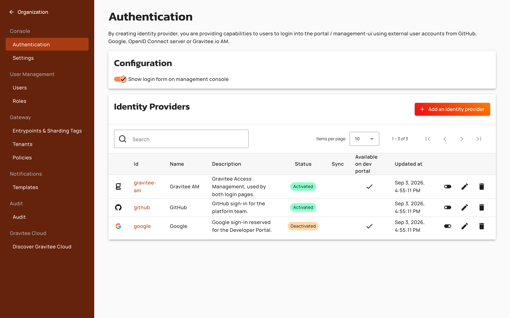
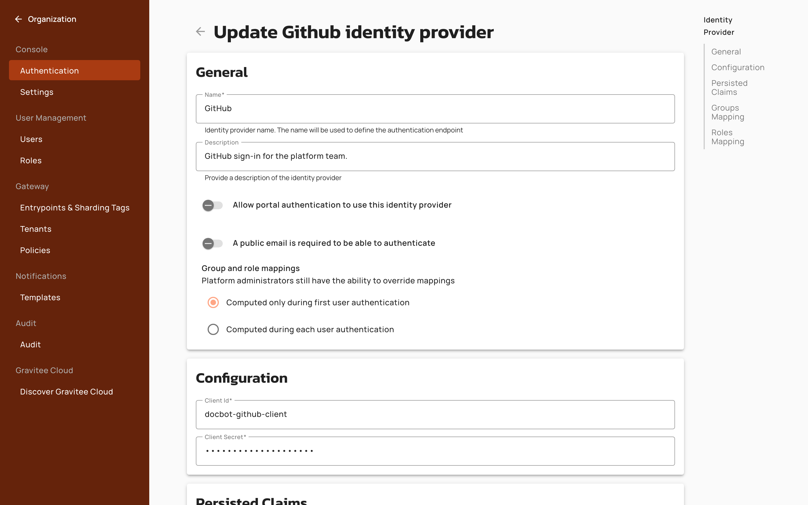

# Authentication

Gravitee API Management (APIM) natively supports several types of authentication:

* Authentication providers: in-memory, LDAP, and the APIM repository
* Social providers: GitHub and Google
* A custom OAuth2 or OpenID Connect authorization server, including Microsoft Entra ID and Gravitee Access Management

You can define as many identity providers as you want. For in-memory, LDAP, and repository users, APIM API registers the providers in the order they're declared in the `providers` section of `gravitee.yml`, and tries them in that order, so the declaration order decides which one wins for a user who exists in more than one.

```yaml
security:
  providers:
    # First authentication source
    - type: ldap
      # ...
    # Second authentication source
    - type: memory
      # ...
    # Third authentication source
    - type: gravitee
      # ...
```

Social and OIDC providers aren't part of that loop. They appear as buttons on the Console or Developer Portal login page once they're activated for that scope.

## How identity providers are scoped

Every identity provider is created once, on the **Authentication** page of the organization settings. Where its button then appears is decided separately for each login page: the organization scope covers the APIM Console, and the environment scope covers the Developer Portal.

Each provider carries three independent controls:

| Control | Where you set it | What it does |
| --- | --- | --- |
| Activation toggle, read in the **Status** column as **Activated** or **Deactivated** | The identity provider list on the organization's **Authentication** page | Organization activation. Puts the provider on the **Console** login page, and is the only control that takes it off. |
| **Allow portal authentication to use this identity provider** | The **General** section of the provider's own page. The list shows it in the **Available on dev portal** column | Developer Portal eligibility on its own. It doesn't show or hide the Console button. Leave it off for Console-only SSO. |
| Activation toggle on the environment's identity provider list | The **Authentication** page of an environment's settings | Environment activation. Required, together with the portal setting above, for the **Developer Portal** login page. |

<figure><figcaption><p>The <strong>Status</strong> column carries the organization activation. <strong>Available on dev portal</strong> reflects the portal setting, and the two are independent.</p></figcaption></figure>

A provider appears on a login page only when the conditions for that page are met:

* **Console login page**: the provider is **Activated** in the organization's identity provider list. The portal setting is ignored.
* **Developer Portal login page**: the provider is activated for that environment, and **Allow portal authentication to use this identity provider** is on.

### Configure Console-only SSO

To offer a provider on the Console login page but not on the Developer Portal, complete the following steps:

1. Open the organization settings.
2. Click **Authentication**.
3. Create the identity provider, leaving **Allow portal authentication to use this identity provider** off.
4. Click the activation toggle on the provider's row in the identity provider list. The **Status** column then reads **Activated**.
5. Leave the provider deactivated on the **Authentication** page of every environment's settings.

The Console shows the SSO button. The Developer Portal doesn't.

<figure><figcaption><p><strong>Allow portal authentication to use this identity provider</strong> sits in the <strong>General</strong> section of the provider's own page.</p></figcaption></figure>


**Known issue in 4.9.33, 4.10.29, 4.11.26, and 4.12.18**

In those four patches, **Allow portal authentication to use this identity provider** also gated the Console login page. An organization using the Console-only setup above lost its Console SSO button when it upgraded. Where local login was turned off as well, no one could sign in through the Console at all.

The fix returns the setting to Developer Portal scope in 4.9.34, 4.10.30, 4.11.27, and 4.12.19. After you upgrade to one of those patches, turn **Allow portal authentication to use this identity provider** back off if you turned it on as a workaround.

If you used that setting to keep a provider off the Console login page while one of the four affected patches was installed, it stops doing that once you upgrade to the fix. Deactivate the provider in the organization's identity provider list instead.


### Example

Three providers are defined: Google, GitHub, and Gravitee AM. GitHub and Gravitee AM are activated on the organization list. Google and Gravitee AM have **Allow portal authentication to use this identity provider** on. On the environment list, only Gravitee AM is activated.

| Provider | Organization status | Allow portal authentication | Environment activation | Console login | Developer Portal login |
| --- | --- | --- | --- | --- | --- |
| GitHub | Activated | Off | Off | Yes | No |
| Google | Deactivated | On | Off | No | No |
| Gravitee AM | Activated | On | On | Yes | Yes |

The Console shows GitHub and Gravitee AM. The Developer Portal shows only Gravitee AM.

## Declare a provider in gravitee.yml

You can declare a social or OIDC provider under `security.providers` in `gravitee.yml`, or through the equivalent Helm values or environment variables. APIM API rewrites that provider on every startup:

* The provider is created if it's missing, and its configuration is overwritten either way. **Allow portal authentication to use this identity provider** is forced on, so it can't stay off across a restart.
* Every organization and environment activation for the provider is removed, and only the targets listed under `activations` are recreated.
* The Console labels the provider `Configuration provided by the system. Every modifications will be overridden at the next startup.`

```yaml
security:
  providers:
    - type: oidc
      id: entra
      # credentials and endpoints
      activations:
        - "DEFAULT"
        - "DEFAULT:DEFAULT"
```

Each entry under `activations` takes one of two forms:

* `"<ORGANIZATION_ID>"` activates the provider for the Console.
* `"<ORGANIZATION_ID>:<ENVIRONMENT_ID>"` activates it for that environment's Developer Portal. A declared provider always has the portal setting forced on, so its button appears on that Portal as soon as the environment activation exists.

The in-memory, LDAP, and `gravitee` providers aren't rewritten this way. Changes you make in the Console to a provider declared in `gravitee.yml` don't survive a restart.

Provider-specific setup:

<table data-view="cards"><thead><tr><th data-type="content-ref"></th><th></th><th data-hidden data-card-target data-type="content-ref"></th></tr></thead><tbody><tr><td><a href="authentication-providers.md">authentication-providers.md</a></td><td></td><td><a href="authentication-providers.md">authentication-providers.md</a></td></tr><tr><td><a href="gravitee-access-management.md">gravitee-access-management.md</a></td><td></td><td><a href="gravitee-access-management.md">gravitee-access-management.md</a></td></tr><tr><td><a href="social-providers.md">social-providers.md</a></td><td></td><td><a href="social-providers.md">social-providers.md</a></td></tr><tr><td><a href="openid-connect.md">openid-connect.md</a></td><td></td><td><a href="openid-connect.md">openid-connect.md</a></td></tr><tr><td><a href="microsoft-entra-id.md">microsoft-entra-id.md</a></td><td></td><td><a href="https://app.gitbook.com/o/8qli0UVuPJ39JJdq9ebZ/s/Fc1ETPs5seXizrv8ozOs/~/changes/74/getting-started/configuration/authentication/page-1">https://app.gitbook.com/o/8qli0UVuPJ39JJdq9ebZ/s/Fc1ETPs5seXizrv8ozOs/~/changes/74/getting-started/configuration/authentication/page-1</a></td></tr></tbody></table>
