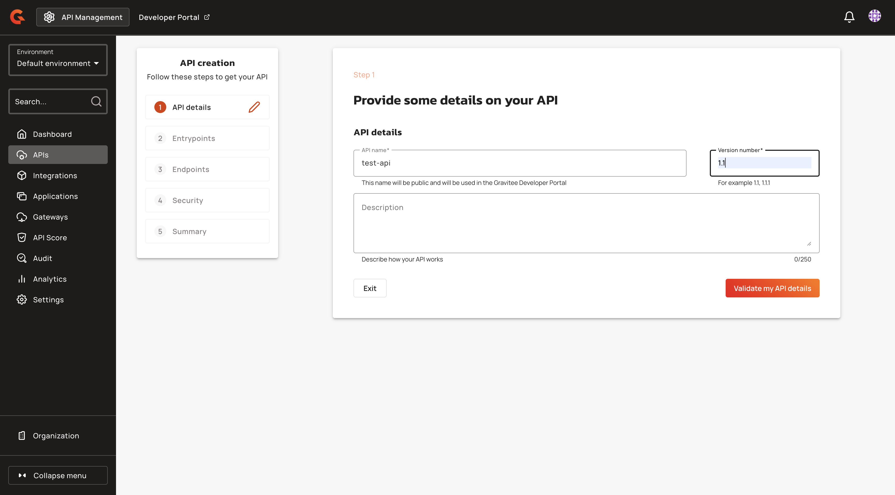

# CORS Configuration

## Overview

Cross-Origin Resource Sharing (CORS) is a mechanism that allows resources on a web page to be requested from another domain.

For more information about CORS, go to [CORS specification](https://www.w3.org/TR/cors).

You can apply CORS at following levels:

* API
* Environment
* Organization

When you apply CORS configurations, the API level overrides the Environment level, and the environment level overrides the Organization level.

You can configure CORS at the organization level using `gravitee.yml`, environment variables, or directly in APIM Console. Here are examples that configures CORS in the `gravitee.yml` file and with environment variables:




```yaml
http:
  api:
    # Configure the listening path for the API. Default to /
#    entrypoint: /
    # Configure Management API.
#    management:
#      enabled: true
#      entrypoint: ${http.api.entrypoint}management
#      cors:
    # Allows to configure the header Access-Control-Allow-Origin (default value: *)
    # '*' is a valid value but is considered as a security risk as it will be opened to cross origin requests from anywhere.
#       allow-origin: http://developer.mycompany.com
    # Allows to define how long the result of the preflight request should be cached for (default value; 1728000 [20 days])
#       max-age: 864000
    # Which methods to allow (default value: OPTIONS; GET; POST; PUT; DELETE)
#      allow-methods: 'OPTIONS; GET; POST; PUT; DELETE'
    # Which headers to allow (default values: Cache-Control; Pragma; Origin; Authorization; Content-Type; X-Requested-With; If-Match; X-Xsrf-Token)
#      allow-headers: 'X-Requested-With'
  # Configure Portal API.
#    portal:
#      enabled: true
#      entrypoint: ${http.api.entrypoint}portal
#      cors:
    # Allows to configure the header Access-Control-Allow-Origin (default value: *)
    # '*' is a valid value but is considered as a security risk as it will be opened to cross origin requests from anywhere.
#       allow-origin: http://developer.mycompany.com
    # Allows to define how long the result of the preflight request should be cached for (default value; 1728000 [20 days])
#       max-age: 864000
    # Which methods to allow (default value: OPTIONS; GET; POST; PUT; DELETE)
#      allow-methods: 'OPTIONS; GET; POST; PUT; DELETE'
    # Which headers to allow (default values: Cache-Control; Pragma; Origin; Authorization; Content-Type; X-Requested-With; If-Match; X-Xsrf-Token)
#      allow-headers: 'X-Requested-With'
```




```
gravitee_http_api_management_allow-origin
gravitee_http_api_management_allow-headers
gravitee_http_api_management_allow-methods
gravitee_http_api_management_exposed-headers
gravitee_http_api_management_max-age


gravitee_http_api_portal_allow-origin
gravitee_http_api_portal_allow-headers
gravitee_http_api_portal_allow-methods
gravitee_http_api_portal_exposed-headers
gravitee_http_api_portal_max-age
```



## Configure CORS in APIM Console


If you change the CORS settings using the `gravitee.yml` or environment variables, the CORS settings are not accessible in the APIM console.


### Configure CORS at the organization level

1.  From the **Dashboard**, click **Organization**. 

    <figure><figcaption></figcaption></figure>
2.  In the **Settings screen**, navigate to the **CORS** section.

    <figure><figcaption></figcaption></figure>

### Configure CORS at the environment level

1.  From the **Dashboard**, click **Settings**. 

    <figure><figcaption></figcaption></figure>
2.  In the **Settings** menu click **Settings**. 

    <figure><figcaption></figcaption></figure>
3.  In the **Settings** section, navigate to the **CORS** section.

    <figure><figcaption></figcaption></figure>

### Configure CORS settings

#### Allow-Origin

The `Allow-Origin` setting specifies which origins are permitted to access the resources. An origin consists of three components: the scheme, domain, and the port. All three components must match for requests to be considered same-origin.

<figure><figcaption></figcaption></figure>

The following examples demonstrate common `Allow-Origin` configurations:

* `*` - Allows all origins
* `https://mydomain.com` - Allows specific domain
* `(http|https).*.mydomain.com` - Allows subdomains using regex patterns

#### Access-Control-Allow-Methods

The `Allow-Methods` setting specifies which HTTP methods are allowed when accessing the resource.

<figure><figcaption></figcaption></figure>

Configuration details for `Allow Methods` include the following:

* Available methods: \*, GET, POST, PUT, PATCH, DELETE, OPTIONS, HEAD, TRACE.
* Default: GET, POST, PUT, PATCH, DELETE.

#### Allow-Headers

The `Allow-Headers` setting defines which headers can be used in cross-origin requests.

<figure><figcaption></figcaption></figure>

Configuration details for `Allow Headers` include the following :

* `Content-Type` - For sending JSON/form data.
* `Authorization` - For authentication tokens.
* `X-Requested-With` - For AJAX identification.
* `Accept` - For content negotiation. Example: `Content-Type, Authorization, X-Requested-With`

#### Exposed-Headers

The `Exposed-Headers` setting defines which response headers can be used in cross-origin requests.

<figure><figcaption></figcaption></figure>

### Max Age (Seconds)

The `Max age` setting controls how long pre-flight request results are cached.

<figure><figcaption></figcaption></figure>

The following configuration details apply to `Max age`:

* **Default**: 86400 seconds (24 hours)
* **Range**: 0 to 2147483647 seconds
