# Add Security

## Overview

This guide shows you how to add security to your API by adding an API Key plan to your API.

## Prerequisites

* Complete the steps in [create-an-api.md](create-an-api.md "mention").

## Add security to your API

To add security to your API, complete the following steps:

1. [#add-an-api-key-plan-to-your-api](add-security.md#add-an-api-key-plan-to-your-api "mention")
2. [#remove-the-keyless-plan-from-your-api](add-security.md#remove-the-keyless-plan-from-your-api "mention")

### Add an API Key plan to your API

1.  From the **Dashboard**, click **APIs**.

    <figure>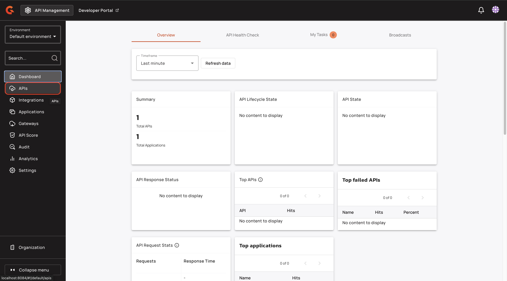<figcaption></figcaption></figure>
2.  Click your API.

    <figure><figcaption></figcaption></figure>
3.  Click **Consumers**.

    <figure>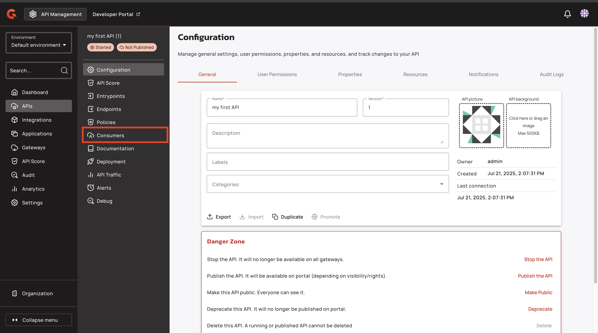<figcaption></figcaption></figure>
4.  Click **+ Add new plan**, and then click **API Key**.

    <figure>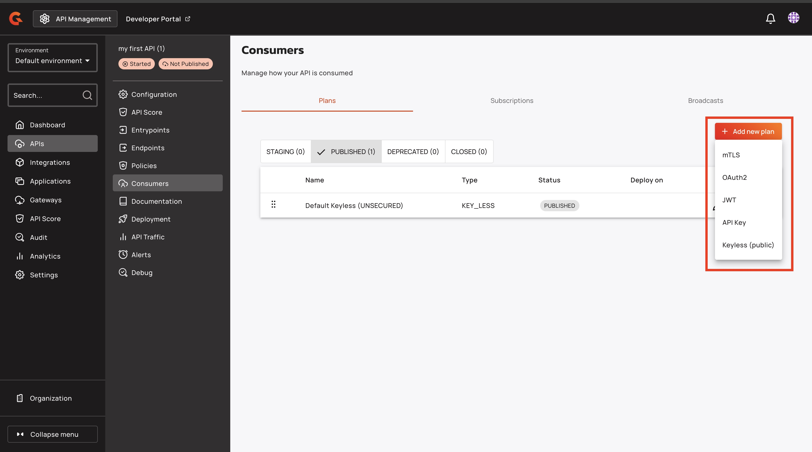<figcaption></figcaption></figure>
5.  In the **Name** field, type a name for your API.

    <figure>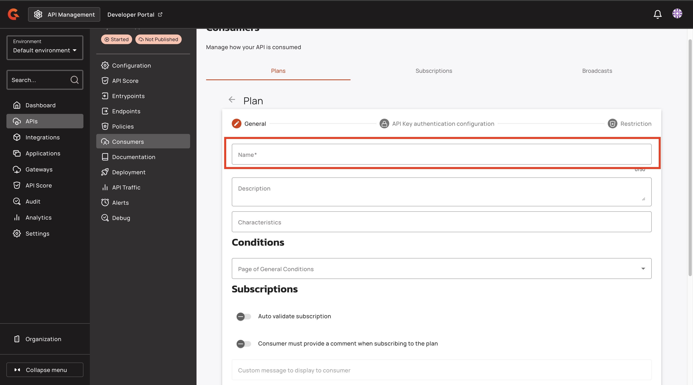<figcaption></figcaption></figure>
6.  In the **Subscriptions section**, turn on **Auto validate subscription**.

    <figure>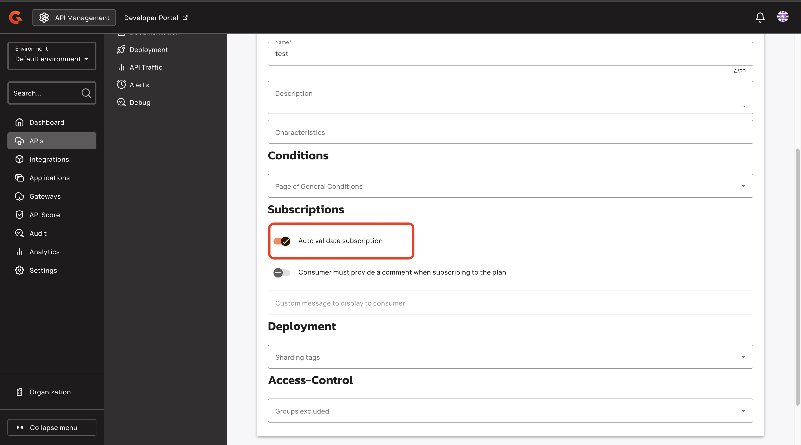<figcaption></figcaption></figure>
7.  Click **Next**.

    <figure>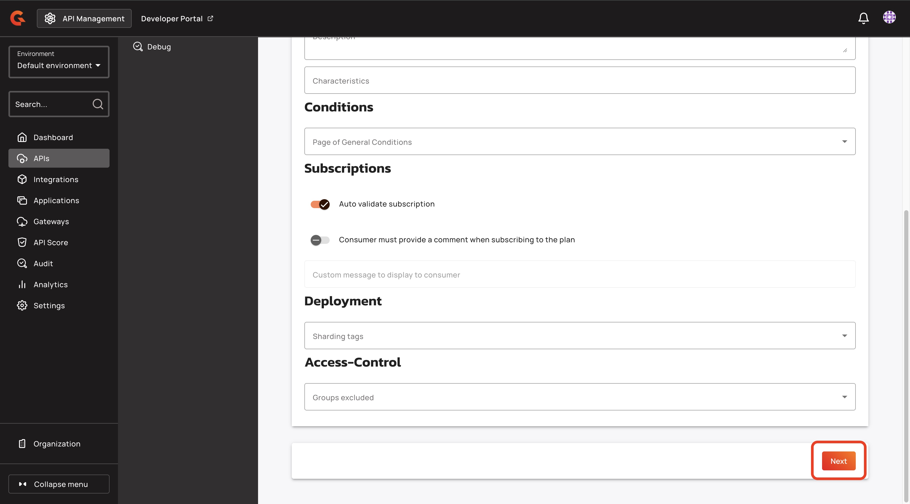<figcaption></figcaption></figure>
8.  In the API Key authentication configuration screen, click **Next**.

    <figure><figcaption></figcaption></figure>
9.  Click **Create**.

    <figure><figcaption></figcaption></figure>
10. In the **Consumers** screen, click the **Publish the plan** button.

    <figure>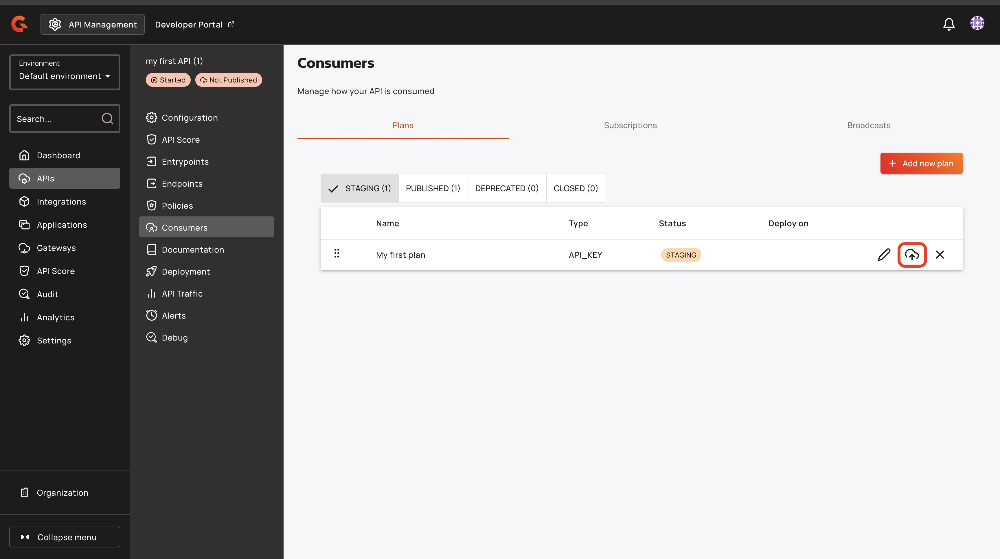<figcaption></figcaption></figure>
11. In the Publish plan pop-up window, click **Publish.**

    <figure><figcaption></figcaption></figure>
12. Click **Deploy API**.

    <figure><figcaption></figcaption></figure>
13. In the **Deploy your API** pop-up window, click **Deploy**.

    <figure><figcaption></figcaption></figure>

#### Verification

The new plan appears in the **PUBLISHED** tab of the **Consumers** screen.

<figure><figcaption></figcaption></figure>

### Remove the Keyless plan from your API


WARNING: Removing a plan is irreversible


1.  Navigate to the **PUBLISHED** tab of the screen.

    <figure><figcaption></figcaption></figure>
2.  For your **Default Keyless (UNSECURED)** plan, click **Close the plan** button.

    <figure>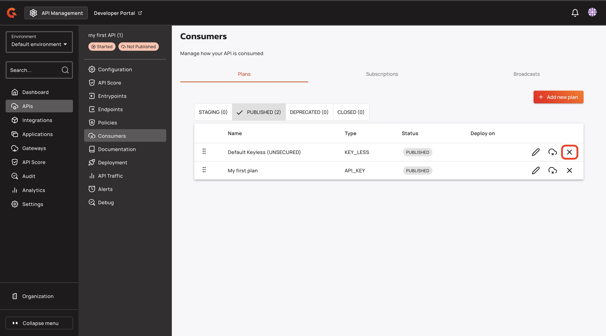<figcaption></figcaption></figure>
3.  In the **Close plan** pop-up window, type Default Keyless (UNSECURED), and then click **Yes, close this plan.**

    <figure><figcaption></figcaption></figure>

#### Verification

The Default Keyless (UNSECURED) plan is removed from the **PUBLISHED** tab.

<figure><figcaption></figcaption></figure>

## Verification

To test your API Key plan, complete the following steps:

* [#retrieve-your-api-key](add-security.md#retrieve-your-api-key "mention")

### Retrieve your API Key

1.  From the **Dashboard**, click **Applications**.

    <figure>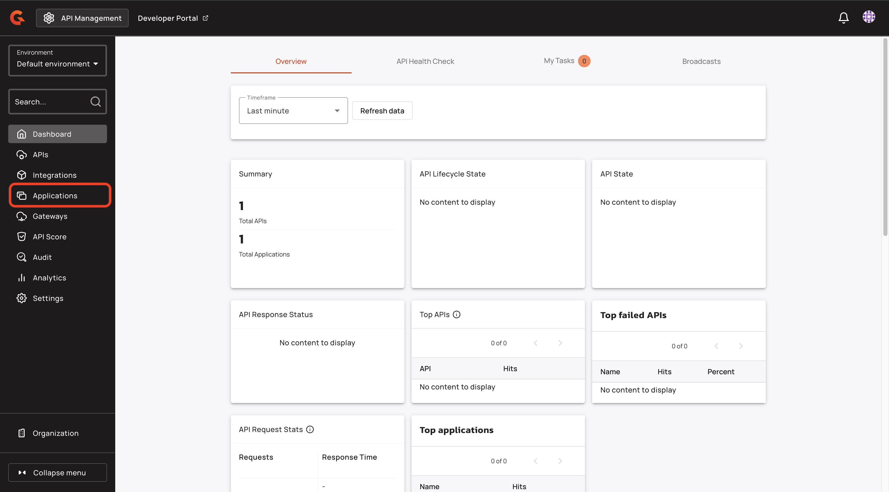<figcaption></figcaption></figure>
2.  In the **Applications** screen, click the **Default application**.

    <figure><figcaption></figcaption></figure>
3.  In the **Default application** configuration screen, click **Subscriptions**.

    <figure>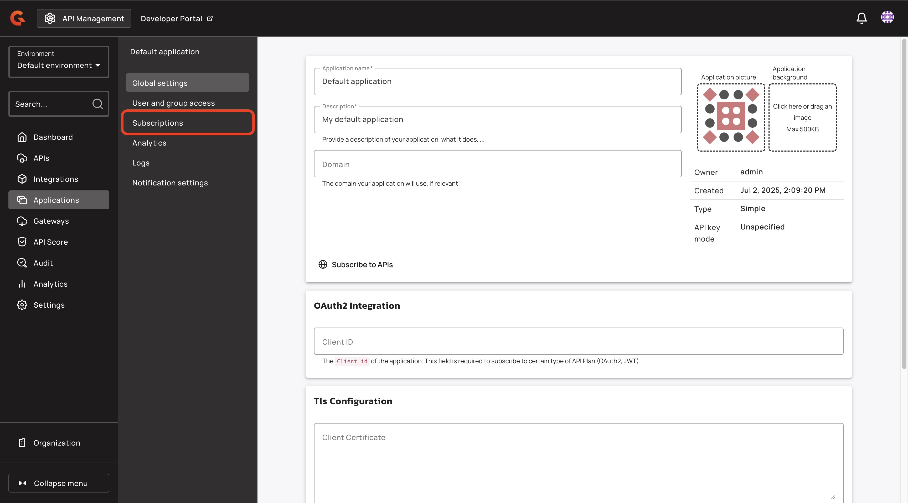<figcaption></figcaption></figure>
4.  Click **+ Create a subscription**.

    <figure><figcaption></figcaption></figure>
5. In the **Create a subscription** pop-up window, complete the following sub-steps:
   1. Type the name of the API that you created in [create-an-api.md](create-an-api.md "mention").
   2. Select your API.
   3. Click the name of the plan that you created in [#add-an-api-key-plan-to-your-api](add-security.md#add-an-api-key-plan-to-your-api "mention").
   4.  Click **Create**.

       <figure><figcaption></figcaption></figure>
6.  Copy your API key from the **API Keys** section of the **Subscriptions** page.

    <figure>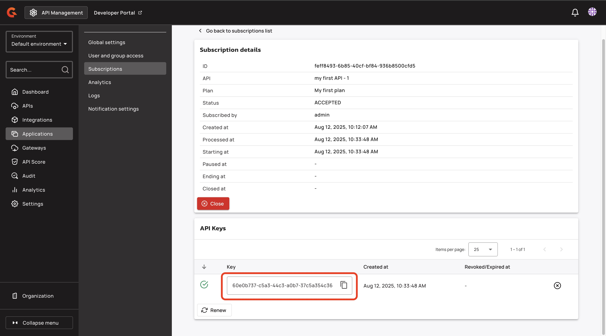<figcaption></figcaption></figure>

### Test your API Key

*   Test your API Key with the following command:

    ```
    curl -i "http://<gateway-domain>:<gateway-port>/<api-context-path>" \
      -H "X-Gravitee-Api-Key: <your-api-key>"
    ```

    * Replace `<gateway-domain>` with the hostname or IP address of your Gravitee gateway. For example, `localhost:` .
    * Replace `<gateway-port>` with the port where the gateway is exposed. For example, `8082` .
    * Replace `<api-context-path>` with the context path for your API. For example, myfirstapi.
    * Replace `<your-api-key>` with the API for your subscription.

You receive a `200 OK` response.

## Next steps

Add a policy to your API. For more information about adding a policy, see [add-a-policy.md](add-a-policy.md "mention").
