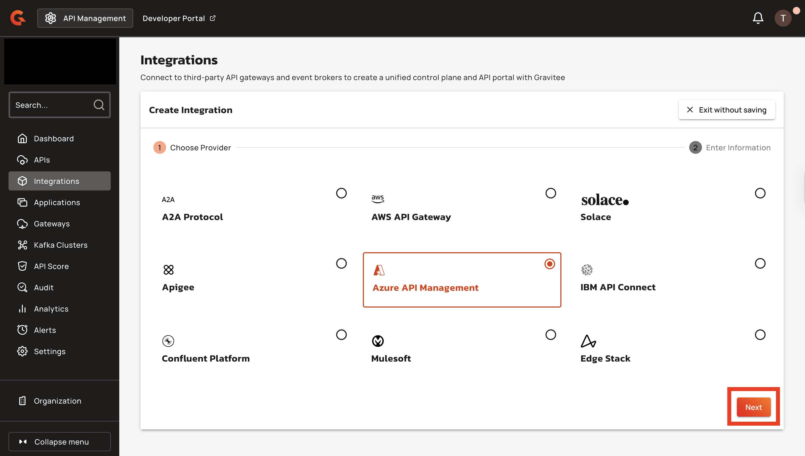
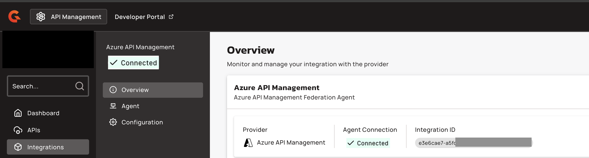

# Azure API Management

## Overview&#x20;

Azure API Management is Azure's built-in API management solution that you can use to expose services running in the Azure cloud to the public internet

## Prerequisites

Before you install the Azure API Management federation agent, complete the following steps:

* Access to an Azure API Management account with permissions to access the Azure API Management console.&#x20;
* Gravitee API Management version 4.5 or later, with an enterprise license. For more information about Enterprise edition, see [Enterprise Edition Licensing.](https://documentation.gravitee.io/platform-overview/gravitee-platform/gravitee-offerings-ce-vs-ee/enterprise-edition-licensing#license-support)
* Install and configure Azure CLI. For more information, see [Install the Azure CLI.](https://learn.microsoft.com/en-us/cli/azure/install-azure-cli?view=azure-cli-latest)
* An access token. For more information, see [how to create a service account and an access token.](https://documentation.gravitee.io/apim/govern-apis/federation/federation-agent-service-account)
* Obtain your Azure APIM Subscription ID, Resource Group name, Service name, and Tenant ID.
* Azure credentials: App ID and App Secret from a Service Principal with the Contributor role.

## Integrate Azure API Management with Gravitee APIM

To integrate Azure API Management with Gravitee APIM, complete the following steps:

1. [#create-an-azure-api-management-integration-in-the-gravitee-apim-console](azure-api-management.md#create-an-azure-api-management-integration-in-the-gravitee-apim-console "mention")
2. [#configure-the-azure-api-management-federation-agent](azure-api-management.md#configure-the-azure-api-management-federation-agent "mention")
3. [#run-the-azure-api-management-federation-agent](azure-api-management.md#run-the-azure-api-management-federation-agent "mention")

### Create an Azure API Management integration in the Gravitee APIM Console

1.  From the Dashboard, click **Integrations**

    <figure><figcaption></figcaption></figure>
2.  Click **Create Integration.**

    <figure><figcaption></figcaption></figure>
3.  Select **Azure API Management**, and then click **Next**.<br>

    <figure><figcaption></figcaption></figure>
4.  Type the **Integration Name**.

    <figure><figcaption></figcaption></figure>
5.  (Optional) Type a **Description** for the integration.

    <figure><figcaption></figcaption></figure>
6.  Click **Create Integration**.

    <figure><figcaption></figcaption></figure>
7.  From the Integration overview tab, copy the **Integration ID**. You need this ID for the agent configuration.

    <figure><figcaption></figcaption></figure>

### Configure the Azure API Management federation agent

The Azure API Management federation agent requires the following configuration parameters to connect to your Azure APIM account:

* Azure APIM Subscription ID
* Azure APIM Resource Group name
* Azure APIM Service name
* Azure APIM Tenant ID
* Azure credentials: App ID and App Secret

#### **Obtain Azure APIM configuration details**

1.  Login to Azure using the following command:

    ```bash
    az login
    ```
2.  List your tenants and subscriptions:

    ```bash
    az account list --output table --query '[].{Name:name, SubscriptionId:id, TenantId:tenantId}'
    ```

    \
    Here is an exmaple output:&#x20;

    ```bash
    Name           SubscriptionId                        TenantId
    -------------  ------------------------------------  ------------------------------------
    Gravitee       02ae5fba-...........................  b7389665-...........................
    ```
3. Copy your Azure APIM tenant and subscription IDs and save them for later use in the agent configuration
4.  Set your subscription:

    ```bash
    az account set --subscription <your-subscriptionId>
    ```

* Replace with your actual subscription ID from the previous step.

5.  Retrieve your Service name and Resource Group name:

    ```bash
    az apim list --query '[].{ServiceName:name, ResourceGroup:resourceGroup}' -o table
    ```

    \
    Here is an example output:

    ```bash
    ServiceName      ResourceGroup
    ---------------  ----------------------
    my-service-name  my-resource-group-name
    ```
6. Copy these values. You now have:

* Azure APIM Subscription ID
* Azure APIM Resource Group name
* Azure APIM Service name
* Azure APIM Tenant ID

#### **Create Azure Service Principal**

The agent requires a Service Principal with Contributor role for authentication.&#x20;

1.  Set environment variables:

    ```bash
    RESOURCE_GROUP_NAME=[your-resource-group-name]
    SERVICE_NAME=[your-service-name]
    SUBSCRIPTION_ID=[your-subscription-id]
    ```
2.  Create the Service Principal:

    ```bash
    az ad sp create-for-rbac --role Contributor --scopes /subscriptions/${SUBSCRIPTION_ID}/resourceGroups/${RESOURCE_GROUP_NAME}/providers/Microsoft.ApiManagement/service/${SERVICE_NAME}
    ```

    \
    The command returns the following output when the Service Principal is successfully created:

    ```json
    {
      "appId": "12345",
      "displayName": "12345",
      "password": "12345",
      "tenant": "12345"
    }
    ```

    \
    Copy the `appId` and `password` values and save them securely. You need these credentials for the agent configuration.

### Run the Azure API Management federation agent

You can deploy the Apigee X federation agent using either of the following installation methods:

* [#docker-compose](azure-api-management.md#docker-compose "mention")
* [#helm](azure-api-management.md#helm "mention")

### Docker Compose&#x20;

1.  Copy the following configuration, and then save it to your Docker Compose file:<br>

    ```bash
    services:
      integration-agent:
        image: graviteeio/federation-agent-azure-api-management:${AGENT_VERSION:-latest}
        restart: always
        environment:
          # Gravitee-specific configuration
          - gravitee_integration_connector_ws_endpoints_0=${WS_ENDPOINTS}
          - gravitee_integration_connector_ws_headers_0_name=Authorization
          - gravitee_integration_connector_ws_headers_0_value=Bearer ${WS_AUTH_TOKEN}
          - gravitee_integration_providers_0_integrationId=${INTEGRATION_ID}
          - gravitee_integration_providers_0_type=azure-api-management
          # If you are using Gravitee Next-Gen Cloud, then you need to also include a Cloud Token for Federation Agent
          # - gravitee_cloud_token=${GRAVITEE_CLOUD_TOKEN}
          # Azure APIM authentication
          - gravitee_integration_providers_0_configuration_auth_appId=${APP_ID}
          - gravitee_integration_providers_0_configuration_auth_appSecret=${APP_SECRET}
          - gravitee_integration_providers_0_configuration_auth_tenant=${TENANT_ID}
          - gravitee_integration_providers_0_configuration_subscription=${SUBSCRIPTION}
          - gravitee_integration_providers_0_configuration_resourceGroup=${RESOURCE_GROUP}
          - gravitee_integration_providers_0_configuration_service=${SERVICE}
          - gravitee_integration_providers_0_configuration_dev_email=${AZURE_DEV_EMAIL}
          - gravitee_integration_providers_0_configuration_dev_firstName=${AZURE_DEV_FIRST_NAME}
          - gravitee_integration_providers_0_configuration_dev_lastName=${AZURE_DEV_LAST_NAME}
          - gravitee_integration_providers_0_configuration_subscriptionApprovalType=${SUBSCRIPTION_APPROVAL_TYPE:-ALL}
    ```
2.  Create a file named `.env` in the same directory as your Docker Compose file, and then add the following environment variables:

    ```bash
    ## GRAVITEE PARAMETERS ##

    # Gravitee APIM management API URL, typically suffixed with the path /integration-controller
    WS_ENDPOINTS=https://[your-APIM-management-API-host]/integration-controller

    # Gravitee APIM token to be used by the agent
    WS_AUTH_TOKEN=[your-token]

    # ID of the APIM integration you created for this agent
    INTEGRATION_ID=[your-integration-id]

    # APIM organization ID, example: DEFAULT
    WS_ORG_ID=[organization-id]

    # If you are using Gravitee Next-Gen Cloud, then you also need to include a Cloud Token for Federation Agent (https://documentation.gravitee.io/apim/hybrid-installation-and-configuration-guides/next-gen-cloud#cloud-token)
    # GRAVITEE_CLOUD_TOKEN=[your-cloud-token-for-federation-agent]

    # Optionally specify a specific version of the agent, default will be latest
    # AGENT_VERSION=2.0.0

    ## AZURE API MANAGEMENT PARAMETERS ##

    # Azure APIM tenant ID
    TENANT_ID=[your-tenant-id]

    # Azure APIM subscription ID
    SUBSCRIPTION=[your-subscription-id]

    # Azure APIM resource group name
    RESOURCE_GROUP=[your-resource-group]

    # Azure APIM service name
    SERVICE=[your-service]

    # Azure APIM developer details
    # This developer will be used as the owner of applications 
    # that are created by Gravitee in Azure APIM
    # Gravitee will create the developer if it doesn't already exist
    # or will reuse an existing developer if it exists in Azure
    # The provided email address will receive notifications from Azure
    AZURE_DEV_EMAIL=[developer-email]
    AZURE_DEV_FIRST_NAME=[developer-firstname]
    AZURE_DEV_LAST_NAME=[developer-lastname]

    # Azure APIM credentials
    APP_ID=[your-app-id]
    APP_SECRET=[your-app-secret]

    # Azure APIM API products can have subscription validation set to manual or automatic.
    # This parameter determines if we ingest either or both of these API product types.
    # Possible values are [MANUAL|AUTOMATIC|ALL], default is ALL
    SUBSCRIPTION_APPROVAL_TYPE=ALL
    ```
3. Replace the following placeholder values with your own configuration:
   * `[your-APIM-management-API-host]`: Your Gravitee APIM management API URL.
   * `[your-token]`: Your Gravitee APIM access token.
   * `[your-integration-id]`: The Integration ID from the Gravitee Console.
   * `[organization-id]`: Your APIM organisation ID. For example, DEFAULT.&#x20;
   * `[your-tenant-id]`: Your Azure APIM tenant ID.
   * `[your-subscription-id]`: Your Azure APIM subscription ID.
   * `[your-resource-group]`: Your Azure APIM resource group name.
   * `[your-service]`: Your Azure APIM service name.
   * `[developer-email]`: Developer email for the Azure APIM developer account.
   * `[developer-firstname]`: Developer's first name.
   * `[developer-lastname]`: Developer's last name.
   * `[your-app-id]`: Your Azure Service Principal App ID.
   * `[your-app-secret]`: Your Azure Service Principal App Secret.
4.  Pull the latest Docker image using the following command:

    ```bash
    docker compose pull
    ```
5.  Start the agent in the background with the following command:

    ```bash
    docker compose up -d
    ```

#### Verification&#x20;

1.  In the Gravitee API Management console, after refreshing, you should now see the agent's status set to `Connected`.

    <figure><figcaption></figcaption></figure>
2. If the Agent Connection shows as **Disconnected**, inspect the agent container logs for error messages.&#x20;

### Helm&#x20;

To deploy the federation agent to your Kubernetes cluster, complete the following steps:

#### Update your Helm Chart&#x20;

Add the Gravitee Helm repository and update it to ensure you have access to the latest charts:

```bash
helm repo add gravitee https://helm.gravitee.io

helm repo update
```

#### Configure the Federation Agent Helm Values&#x20;

Create the Helm values file based on your APIM management API's certificate setup. You can use the standard configuration or custom certificate configuration:&#x20;

* [#standard-configuration](azure-api-management.md#standard-configuration "mention")
* [#custom-certificate-configuration](azure-api-management.md#custom-certificate-configuration "mention")

#### Standard configuration&#x20;

1.  This configuration uses the default Java truststore for your APIM management API certificates. Create a file named `federation-agent-azure-values.yaml` in your working directory, and then copy the following configuration:

    ```yaml
    # =========================
    # Kubernetes / RBAC
    # =========================
    kubernetes:
      serviceAccount:
        managed: true
        roleRules:
          - apiGroups:
              - ""
            resources:
              - configmaps
              - secrets
            verbs:
              - get
              - list
              - watch

      deployment:
        image:
          repository: graviteeio
          name: federation-agent-azure-api-management
          tag: 4.8.4

        resources:
          requests:
            memory: "256Mi"
            cpu: "100m"
          limits:
            memory: "512Mi"
            cpu: "250m"

    # =========================
    # Gravitee / Azure Agent
    # =========================
    config:
      graviteeYml:
        services:
          core:
            http:
              enabled: true
              port: 18084
              host: 0.0.0.0
              authentication:
                type: basic
                users:
                  admin: adminadmin
          metrics:
            enabled: false
            prometheus:
              enabled: false
        
        # Optional: Only if using Gravitee Cloud
        cloud:
          token: [your-cloud-token]
        
        integration:
          connector:
            ws:
              endpoints:
                - https://[your-APIM-management-API-host]/integration-controller
              headers:
                - name: Authorization
                  value: bearer [your-token]
          
          providers:
            - type: azure-api-management
              integrationId: [your-integration-id]
              configuration:
                auth:
                  appId: [your-app-id]
                  appSecret: [your-app-secret]
                  tenant: [your-tenant-id]
                subscription: [your-subscription-id]
                resourceGroup: [your-resource-group]
                service: [your-service]
                dev:
                  email: [developer-email]
                  firstName: [developer-firstname]
                  lastName: [developer-lastname]
                subscriptionApprovalType: ALL
    ```
2. Make the following modifications to your `federation-agent-azure-values.yaml` file:
   * Replace `[your-cloud-token]` with your Gravitee Cloud token or remove the entire `cloud:` section if using self-hosted APIM.
   * Replace `[your-APIM-management-API-host]` with your APIM management API URL. For example, `apim.example.com` or `gravitee-apim-api.gravitee-apim.svc.cluster.local:8083` for internal Kubernetes service.
   * Replace `[your-token]` with your service account bearer token.
   * Replace `[your-integration-id]` with the Integration ID.
   * Replace `[your-app-id]` with your Azure Service Principal App ID.
   * Replace `[your-app-secret]` with your Azure Service Principal App Secret.
   * Replace `[your-tenant-id]` with your Azure APIM tenant ID.
   * Replace `[your-subscription-id]` with your Azure APIM subscription ID.
   * Replace `[your-resource-group]` with your Azure APIM resource group name.
   * Replace `[your-service]` with your Azure APIM service name.
   * Replace `[developer-email]` with the developer email for the Azure APIM developer account. For example: `gravitee-integration@yourcompany.com`
   * Replace `[developer-firstname]` with the developer's first name for the Azure APIM developer account. For example: `Gravitee`
   * Replace `[developer-lastname]` with the developer's last name for the Azure APIM developer account. For example: `Integration`
3.  Deploy the federation agent to your Kubernetes cluster by running the following command:

    ```bash
    helm install federation-agent-azure \
      gravitee/federation-agent \
      -f federation-agent-azure-values.yaml \
      -n gravitee-apim \
      --create-namespace
    ```

#### Custom certificate configuration&#x20;

1.  This configuration includes custom truststore volume mounts for certificates from private certificate authorities or self-signed certificates. Create a file named `federation-agent-azure-values.yaml`, and then copy the following configuration:

    ```yaml
    # =========================
    # Kubernetes / RBAC
    # =========================
    kubernetes:
      serviceAccount:
        managed: true
        roleRules:
          - apiGroups:
              - ""
            resources:
              - configmaps
              - secrets
            verbs:
              - get
              - list
              - watch
      
      extraVolumes: |
        - name: custom-truststore
          secret:
            secretName: azure-truststore

      deployment:
        image:
          repository: graviteeio
          name: federation-agent-azure-api-management
          tag: 4.8.4
        
        extraVolumeMounts: |
          - name: custom-truststore
            mountPath: /opt/graviteeio-federation-agent/truststore
            readOnly: true

        resources:
          requests:
            memory: "256Mi"
            cpu: "100m"
          limits:
            memory: "512Mi"
            cpu: "250m"

    # =========================
    # Gravitee / Azure Agent
    # =========================
    config:
      graviteeYml:
        services:
          core:
            http:
              enabled: true
              port: 18084
              host: 0.0.0.0
              authentication:
                type: basic
                users:
                  admin: adminadmin
          metrics:
            enabled: false
            prometheus:
              enabled: false
        
        # Optional: Only if using Gravitee Cloud
        cloud:
          token: [your-cloud-token]
        
        integration:
          connector:
            ws:
              endpoints:
                - https://[your-APIM-management-API-host]/integration-controller
              headers:
                - name: Authorization
                  value: bearer [your-token]
              ssl:
                truststore:
                  # Type can be: JKS, PKCS12, or PEM
                  type: PKCS12
                  path: /opt/graviteeio-federation-agent/truststore/my_truststore.p12
                  password: secret://kubernetes/azure-truststore:password?namespace=gravitee-apim
          
          providers:
            - type: azure-api-management
              integrationId: [your-integration-id]
              configuration:
                auth:
                  appId: [your-app-id]
                  appSecret: [your-app-secret]
                  tenant: [your-tenant-id]
                subscription: [your-subscription-id]
                resourceGroup: [your-resource-group]
                service: [your-service]
                dev:
                  email: [developer-email]
                  firstName: [developer-firstname]
                  lastName: [developer-lastname]
                subscriptionApprovalType: ALL
    ```


If your APIM management API uses certificates that require a custom truststore, you must create the truststore and add it to Kubernetes as a secret before deploying the agent.


2. Make the following modifications to your `federation-agent-azure-values.yaml` file:
   * Replace `[your-cloud-token]` with your Gravitee Cloud token or remove the entire `cloud:` section if using self-hosted APIM.
   * Replace `[your-APIM-management-API-host]` with your APIM management API URL. For example, `apim.example.com` or `gravitee-apim-api.gravitee-apim.svc.cluster.local:8083` for internal Kubernetes service.
   * Replace `[your-token]` with your service account bearer token.
   * Replace `[your-integration-id]` with the Integration ID.
   * Replace `[your-app-id]` with your Azure Service Principal App ID.
   * Replace `[your-app-secret]` with your Azure Service Principal App Secret.
   * Replace `[your-tenant-id]` with your Azure APIM tenant ID.
   * Replace `[your-subscription-id]` with your Azure APIM subscription ID.
   * Replace `[your-resource-group]` with your Azure APIM resource group name.
   * Replace `[your-service]` with your Azure APIM service name.
   * Replace `[developer-email]` with the developer email for the Azure APIM developer account. For example: `gravitee-integration@yourcompany.com`
   * Replace `[developer-firstname]` with the developer's first name for the Azure APIM developer account. For example: `Gravitee`
   * Replace `[developer-lastname]` with the developer's last name for the Azure APIM developer account. For example: `Integration`
3.  Deploy the federation agent to your Kubernetes cluster by running the following command:

    ```bash
    helm install federation-agent-azure \
      gravitee/federation-agent \
      -f federation-agent-azure-values.yaml \
      -n gravitee-apim \
      --create-namespace
    ```

#### Verification&#x20;

1.  When the deployment is successful, verify the installation is running using the following command:

    ```bash
    kubectl get pods -n gravitee-apim -l app.kubernetes.io/name=federation-agent
    ```

    \
    The output should show the federation agent ready and running:

    ```bash
    NAME                                      READY   STATUS    RESTARTS   AGE
    federation-agent-azure-xxxxx-yyyyy        1/1     Running   0          30s
    ```
2.  Return to the Gravitee API Management console, refresh the page, and verify that the agent's status is set to Connected:

    <figure><figcaption></figcaption></figure>

## Limitations

By default, the agent only ingests the APIs of products that have a single API. To change this behavior, you can set a configuration:

```yaml
- gravitee_integration_providers_0_configuration_multipleApiByProduct=true
```

Azure API Management is Azure's built-in API management solution that exposes services running in the Azure cloud to the public internet.
