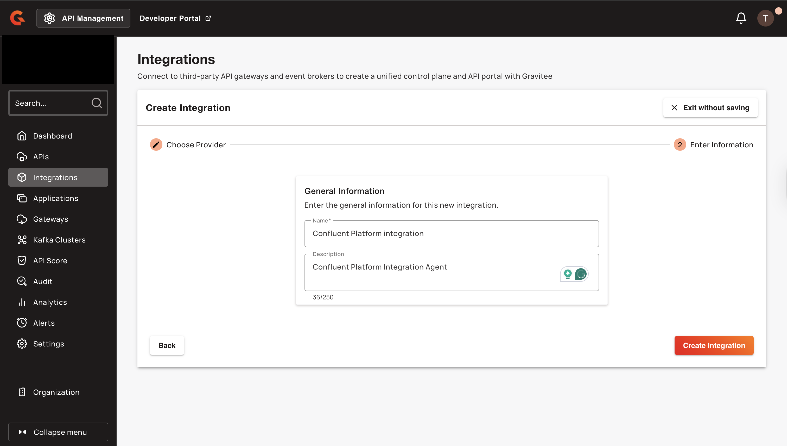

---
metaLinks:
  alternates:
    - >-
      https://app.gitbook.com/s/bGmDEarvnV52XdcOiV8o/govern-apis/federation/3rd-party-providers/confluent-platform
---

# Confluent Platform

## Overview

Confluent Platform is a comprehensive event streaming platform built on Apache Kafka. The Confluent Platform federation agent supports both enterprise and community editions.

## Prerequisites

Before you install the Confluent Platform federation agent, complete the following steps:

* Access to a Confluent Platform instance.
* Verify Gravitee API Management version 4.5 or later, with an enterprise license. For more information about Enterprise edition, see [Enterprise Edition Licensing](https://documentation.gravitee.io/platform-overview/gravitee-platform/gravitee-offerings-ce-vs-ee/enterprise-edition-licensing#license-support).
* An access token. For more information, see [how to create a service account and an access token.](../federation-agent-service-account.md)
* Identify your Confluent Platform cluster API endpoint and schema registry endpoint.
* Obtain Confluent Platform credentials, including username and password.
* (Optional) For testing, spin up a local Confluent Platform demo environment. For instructions, see [Confluent Platform demo project](https://github.com/confluentinc/cp-demo), and [how to deploy the Confluent Platform demo environment.](https://docs.confluent.io/platform/current/tutorials/cp-demo/on-prem.html#docker)

## Integrate Confluent Platform with Gravitee APIM

To integrate Confluent Platform with Gravitee APIM, complete the following steps:

1. [#create-a-confluent-platform-integration-in-the-gravitee-apim-console](confluent-platform.md#create-a-confluent-platform-integration-in-the-gravitee-apim-console "mention")
2. [#configure-the-confluent-platform-federation-agent](confluent-platform.md#configure-the-confluent-platform-federation-agent "mention")
3. [#run-the-confluent-platform-federation-agent](confluent-platform.md#run-the-confluent-platform-federation-agent "mention")

### Create a Confluent Platform integration in the Gravitee APIM Console

1.  From the Dashboard, click **Integrations**.<br>

    <figure><figcaption></figcaption></figure>
2.  Click **Create Integration**.<br>

    <figure><figcaption></figcaption></figure>
3.  Select **Confluent Platform**, and then click **Next**.<br>

    <figure><figcaption></figcaption></figure>
4.  Type the **Integration Name**.<br>

    <figure><figcaption></figcaption></figure>
5.  (Optional) Type the **Description** for the integration.<br>

    <figure><figcaption></figcaption></figure>
6.  Click **Create Integration**.

    <figure><figcaption></figcaption></figure>
7.  From the Integration overview tab, copy the **Integration ID**. You need this ID for the agent configuration.

    <figure><figcaption></figcaption></figure>

### Configure the Confluent Platform federation agent

The Confluent Platform federation agent requires the following configuration parameters to connect to your Confluent Platform instance:

* Cluster API endpoint
* Schema registry endpoint
* (username and password) Confluent Platform credentials

#### Determine cluster and schema registry endpoints

For local Confluent Platform demo installations, use the following steps to determine your endpoints.

1.  Find your local IP using the following command:

    ```bash
    ipconfig getifaddr en0
    ```

    \
    The command generates the following output: `192.168.1.27` .<br>
2.  Construct your endpoints using the following command:

    ```bash
    CLUSTER_API_ENDPOINT=https://192.168.1.27:8091/kafka

    SCHEMA_REGISTRY_ENDPOINT=https://192.168.1.27:8085
    ```

#### Verification

Verify the endpoints using the following command:

```bash
echo $CLUSTER_API_ENDPOINT
echo $SCHEMA_REGISTRY_ENDPOINT
```

The output from the command will display your constructed endpoints:

```bash
https://192.168.1.27:8091/kafka
https://192.168.1.27:8085
```

#### Obtain Confluent credentials

The agent requires credentials to connect to the cluster and schema registry APIs.

* **For demo environments:** Use the default super user account with both username and password set to `superUser`
* **For production environments:** Create a dedicated principal in Confluent Platform for the Gravitee agent.

### Run the Confluent Platform federation agent

You can deploy the Confluent Platform federation agent using either of the following installation methods:

* [#docker-compose](confluent-platform.md#docker-compose "mention")
* [#helm](confluent-platform.md#helm "mention")

### Docker Compose

1.  Copy the following configuration, and then save it to your Docker Compose file:

    ```bash
    services:
      integration-agent:
        image: graviteeio/federation-agent-confluent-platform:${AGENT_VERSION:-latest}
        restart: always
        environment:
          - gravitee_integration_connector_ws_endpoints_0=${WS_ENDPOINTS}
          - gravitee_integration_connector_ws_headers_0_name=Authorization
          - gravitee_integration_connector_ws_headers_0_value=Bearer ${WS_AUTH_TOKEN}
          - gravitee_integration_providers_0_integrationId=${INTEGRATION_ID}
          - gravitee_integration_providers_0_type=confluent-platform
          - gravitee_integration_providers_0_configuration_cluster_api_endpoint=${CLUSTER_API_ENDPOINT}
          - gravitee_integration_providers_0_configuration_schema_registry_endpoint=${SCHEMA_REGISTRY_ENDPOINT}
          - gravitee_integration_providers_0_configuration_auth_password=${BASIC_AUTH_PASSWORD:-}
          - gravitee_integration_providers_0_configuration_auth_username=${BASIC_AUTH_LOGIN:-}
          - gravitee_integration_providers_0_configuration_topic_prefix=${PREFIX:-}
          - gravitee_integration_providers_0_configuration_trust_all=${TRUST_ALL:-}
          # If you are using Gravitee NextGen Cloud, then you need to also include a Cloud Token for Federation Agent
          # - gravitee_cloud_token=${GRAVITEE_CLOUD_TOKEN}
    ```
2.  Create a file named `.env` in the same directory as your Docker Compose file, and then add the following environment variables:

    ```bash
    ## GRAVITEE PARAMETERS ##

    # Gravitee APIM management API URL, typically suffixed with the path /integration-controller
    WS_ENDPOINTS=https://[your-APIM-management-API-host]/integration-controller

    # Gravitee APIM token to be used by the agent
    WS_AUTH_TOKEN=[your-token]

    # ID of the APIM integration you created for this agent
    INTEGRATION_ID=[your-integration-id]

    # APIM organization ID, example: DEFAULT
    WS_ORG_ID=[organization-id]

    # If you are using Gravitee Next-Gen Cloud, then you also need to include a Cloud Token for Federation Agent (https://documentation.gravitee.io/apim/hybrid-installation-and-configuration-guides/next-gen-cloud#cloud-token)
    # GRAVITEE_CLOUD_TOKEN=[your-cloud-token-for-federation-agent]

    # Optionally specify a specific version of the agent, default will be latest
    # AGENT_VERSION=1.1.0

    ## CONFLUENT PLATFORM PARAMETERS ##

    # Cluster API endpoint, example: https://192.168.1.27:8091/kafka
    CLUSTER_API_ENDPOINT=[your-cluster-endpoint]

    # Schema registry endpoint, example: https://192.168.1.27:8085
    SCHEMA_REGISTRY_ENDPOINT=[your-schema-registry-endpoint]

    # Credentials for Confluent Platform, example: superUser/superUser
    BASIC_AUTH_LOGIN=[your-login]
    BASIC_AUTH_PASSWORD=[your-password]

    # Optional topic prefix filter
    # Gravitee creates one API per topic in the cluster
    # PREFIX allows you to only create APIs for topics that match the prefix
    PREFIX=[your-prefix]

    # Optional, for example set to TRUE to accept the self-signed cert when 
    # using the Confluent Platform demo project
    TRUST_ALL=true
    ```
3. Replace the following placeholder values with your own configuration:
   * `[your-APIM-management-API-host]`: Your Gravitee APIM management API URL.
   * `[your-token]`: Your Gravitee APIM access token.
   * `[your-integration-id]`: The Integration ID from the Gravitee Console.
   * `[organization-id]`: Your APIM organization ID. For example, DEFAULT
   * `[your-cluster-endpoint]`: Your Confluent Platform cluster API endpoint. For example, `https://192.168.1.27:8091/kafka`).
   * `[your-schema-registry-endpoint]`: Your Confluent Platform schema registry endpoint. For example, `https://192.168.1.27:8085`.
   * `[your-login]`: Your Confluent Platform username.
   * `[your-password]`: Your Confluent Platform password.
   * `[your-prefix]`: (Optional) Topic prefix filter to create APIs only for matching topics.<br>
4.  Pull the latest Docker image using the following command:

    ```bash
    docker compose pull
    ```
5.  Start the agent in the background with the following command:

    ```bash
    docker compose up -d
    ```

#### Verification

1.  In the Gravitee API Management console, after refreshing, you should now see the agent's status set to **Connected**.<br>

    <figure><figcaption></figcaption></figure>
2. (Optional) If the Agent Connection shows as `Disconnected`, inspect the agent container logs for error messages.

### Helm

To deploy the federation agent to your Kubernetes cluster, complete the following steps:

#### Update your Helm Chart

Add the Gravitee Helm repository and update it to ensure you have access to the latest charts:

```bash
helm repo add gravitee https://helm.gravitee.io

helm repo update
```

#### **Configure the Federation Agent Helm values**

Create the Helm values file based on your APIM management API's certificate setup. You can use the standard configuration or custom certificate configuration:

* [#standard-configuration](confluent-platform.md#standard-configuration "mention")
* [#custom-certificate-configuration](confluent-platform.md#custom-certificate-configuration "mention")

#### Standard configuration

1.  This configuration uses the default Java truststore for your APIM management API certificates. Create a file named `federation-agent-confluent-values.yaml` in your working directory, and then copy the following configuration:

    ```yaml
    # =========================
    # Kubernetes / RBAC
    # =========================
    kubernetes:
      serviceAccount:
        managed: true
        roleRules:
          - apiGroups:
              - ""
            resources:
              - configmaps
              - secrets
            verbs:
              - get
              - list
              - watch

      deployment:
        image:
          repository: graviteeio
          name: federation-agent-confluent-platform
          tag: 4.8.4

        resources:
          requests:
            memory: "256Mi"
            cpu: "100m"
          limits:
            memory: "512Mi"
            cpu: "250m"

    # =========================
    # Gravitee / Confluent Agent
    # =========================
    config:
      graviteeYml:
        services:
          core:
            http:
              enabled: true
              port: 18084
              host: 0.0.0.0
              authentication:
                type: basic
                users:
                  admin: adminadmin
          metrics:
            enabled: false
            prometheus:
              enabled: false
        
        # Optional: Only if using Gravitee Cloud
        cloud:
          token: [your-cloud-token]
        
        integration:
          connector:
            ws:
              endpoints:
                - https://[your-APIM-management-API-host]/integration-controller
              headers:
                - name: Authorization
                  value: bearer [your-token]
          
          providers:
            - type: confluent-platform
              integrationId: [your-integration-id]
              configuration:
                cluster_api_endpoint: [your-cluster-endpoint]
                schema_registry_endpoint: [your-schema-registry-endpoint]
                auth:
                  username: [your-login]
                  password: [your-password]
                topic_prefix: [your-prefix]
                trust_all: true
    ```
2. Make the following modifications to your `federation-agent-confluent-values.yaml` file:
   * Replace `[your-cloud-token]` with your Gravitee Cloud token or remove the entire `cloud:` section if using self-hosted APIM.
   * Replace `[your-APIM-management-API-host]` with your APIM management API URL. For example, `apim.example.com` or `gravitee-apim-api.gravitee-apim.svc.cluster.local:8083` for internal Kubernetes service.
   * Replace `[your-token]` with your service account bearer token.
   * Replace `[your-integration-id]` with the Integration ID.
   * Replace `[your-cluster-endpoint]` with your Confluent Platform cluster API endpoint. For example, `https://192.168.1.27:8091/kafka`.
   * Replace `[your-schema-registry-endpoint]` with your Confluent Platform schema registry endpoint. For example, `https://192.168.1.27:8085`.
   * Replace `[your-login]` with your Confluent Platform username.
   * Replace `[your-password]` with your Confluent Platform password.
   * (optional) Replace `[your-prefix]` with your topic prefix filter.
3.  Deploy the federation agent to your Kubernetes cluster by running the following command:

    ```bash
    helm install federation-agent-confluent \
      gravitee/federation-agent \
      -f federation-agent-confluent-values.yaml \
      -n gravitee-apim \
      --create-namespace
    ```

#### Custom certificate configuration

1.  This configuration includes custom truststore volume mounts for certificates from private certificate authorities or self-signed certificates. Create a file named `federation-agent-confluent-values.yaml`, and then copy the following configuration:<br>

    ```yaml
    # =========================
    # Kubernetes / RBAC
    # =========================
    kubernetes:
      serviceAccount:
        managed: true
        roleRules:
          - apiGroups:
              - ""
            resources:
              - configmaps
              - secrets
            verbs:
              - get
              - list
              - watch
      
      extraVolumes: |
        - name: custom-truststore
          secret:
            secretName: confluent-truststore

      deployment:
        image:
          repository: graviteeio
          name: federation-agent-confluent-platform
          tag: 4.8.4
        
        extraVolumeMounts: |
          - name: custom-truststore
            mountPath: /opt/graviteeio-federation-agent/truststore
            readOnly: true

        resources:
          requests:
            memory: "256Mi"
            cpu: "100m"
          limits:
            memory: "512Mi"
            cpu: "250m"

    # =========================
    # Gravitee / Confluent Agent
    # =========================
    config:
      graviteeYml:
        services:
          core:
            http:
              enabled: true
              port: 18084
              host: 0.0.0.0
              authentication:
                type: basic
                users:
                  admin: adminadmin
          metrics:
            enabled: false
            prometheus:
              enabled: false
        
        # Optional: Only if using Gravitee Cloud
        cloud:
          token: [your-cloud-token]
        
        integration:
          connector:
            ws:
              endpoints:
                - https://[your-APIM-management-API-host]/integration-controller
              headers:
                - name: Authorization
                  value: bearer [your-token]
              ssl:
                truststore:
                  # Type can be: JKS, PKCS12, or PEM
                  type: PKCS12
                  path: /opt/graviteeio-federation-agent/truststore/my_truststore.p12
                  password: secret://kubernetes/confluent-truststore:password?namespace=gravitee-apim
          
          providers:
            - type: confluent-platform
              integrationId: [your-integration-id]
              configuration:
                cluster_api_endpoint: [your-cluster-endpoint]
                schema_registry_endpoint: [your-schema-registry-endpoint]
                auth:
                  username: [your-login]
                  password: [your-password]
                topic_prefix: [your-prefix]
                trust_all: true
    ```


If your APIM management API uses certificates that require a custom truststore, you must create the truststore and add it to Kubernetes as a secret before deploying the agent.


2. Make the following modifications to your `federation-agent-confluent-values.yaml` file:
   * Replace `[your-cloud-token]` with your Gravitee Cloud token or remove the entire `cloud:` section if using self-hosted APIM.
   * Replace `[your-APIM-management-API-host]` with your APIM management API URL. For example, `apim.example.com` or `gravitee-apim-api.gravitee-apim.svc.cluster.local:8083` for internal Kubernetes service.
   * Replace `[your-token]` with your service account bearer token.
   * Replace `[your-integration-id]` with the Integration ID.
   * Replace `[your-cluster-endpoint]` with your Confluent Platform cluster API endpoint. For example, `https://192.168.1.27:8091/kafka`.
   * Replace `[your-schema-registry-endpoint]` with your Confluent Platform schema registry endpoint. For example, `https://192.168.1.27:8085`.
   * Replace `[your-login]` with your Confluent Platform username.
   * Replace `[your-password]` with your Confluent Platform password.
   * (optional) Replace `[your-prefix]` with your topic prefix filter.
3.  Deploy the federation agent to your Kubernetes cluster by running the following command:

    ```bash
    helm install federation-agent-confluent \
      gravitee/federation-agent \
      -f federation-agent-confluent-values.yaml \
      -n gravitee-apim \
      --create-namespace
    ```

### Verification

1.  When the deployment is successful, verify the installation is running using the following command:

    ```bash
    kubectl get pods -n gravitee-apim -l app.kubernetes.io/name=federation-agent
    ```

    \
    The output should show the federation agent ready and running:

    ```bash
    NAME                                         READY   STATUS    RESTARTS   AGE
    federation-agent-confluent-xxxxx-yyyyy       1/1     Running   0          30s
    ```
2.  Return to the Gravitee API Management console, refresh the page, and verify that the agent's status is set to **Connected**.

    <figure><figcaption></figcaption></figure>
