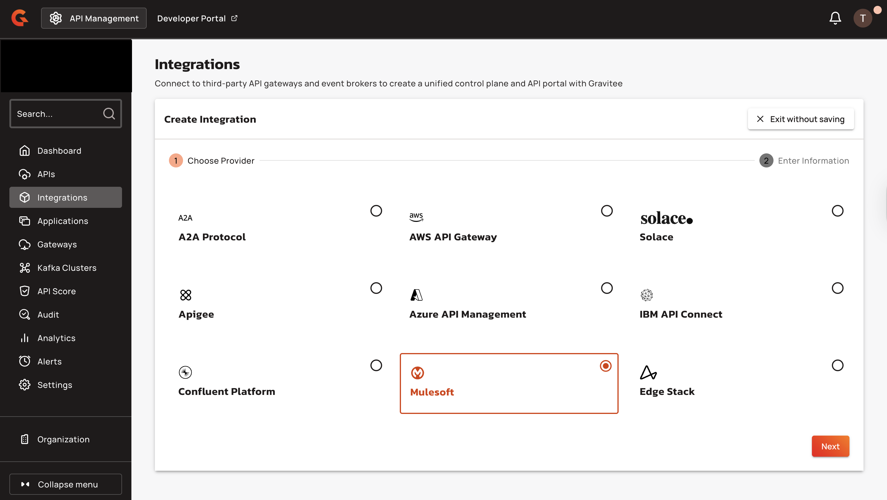
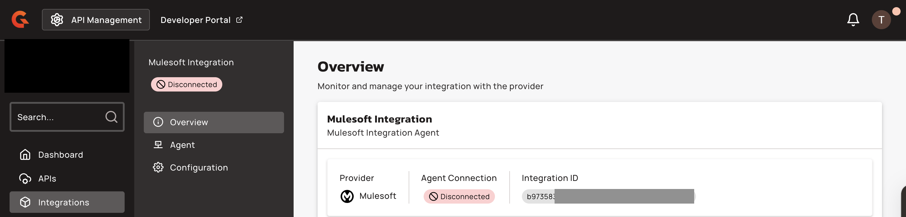

# Mulesoft Anypoint

## Overview

Mulesoft Anypoint Platform is Mulesoft's API management solution for designing, deploying, and managing APIs across hybrid and multi-cloud environments.

## Prerequisites

Before you install the Mulesoft Anypoint federation agent, complete the following steps:

* Obtain access to Mulesoft Anypoint Platform with permissions to manage and create Connected Apps. For more information, see [how to assign permissions and access management.](https://docs.mulesoft.com/access-management/creating-connected-apps-dev#before-you-begin)
* Install Gravitee API Management version 4.5 or later, with an enterprise license. For more information about the Enterprise edition, see[ Enterprise Edition Licensing](https://documentation.gravitee.io/platform-overview/gravitee-platform/gravitee-offerings-ce-vs-ee/enterprise-edition-licensing#license-support).
* Create an access token. For more information about creating service accounts and access tokens, see [how to create a service account and an access token](../federation-agent-service-account.md).
* Generate Mulesoft Connected App Client ID and Client Secret, and then obtain Mulesoft Root Organization ID. For more information, see [how to create a connected App.](https://docs.mulesoft.com/access-management/creating-connected-apps-dev)

## Integrate Mulesoft Anypoint with Gravitee APIM

To integrate Mulesoft Anypoint with Gravitee APIM, complete the following steps:

1. [#create-a-mulesoft-integration-in-the-gravitee-apim-console](mulesoft-anypoint.md#create-a-mulesoft-integration-in-the-gravitee-apim-console "mention")
2. [#run-the-mulesoft-anypoint-federation-agent](mulesoft-anypoint.md#run-the-mulesoft-anypoint-federation-agent "mention")

### Create a Mulesoft integration in the Gravitee APIM Console

1.  From the Dashboard, click **Integrations**.

    <figure><figcaption></figcaption></figure>
2.  Click **Create Integration.**

    <figure><figcaption></figcaption></figure>
3.  Select **Mulesoft**, and then click **Next**.

    <figure><figcaption></figcaption></figure>
4.  Type the **Integration Name.**

    <figure><figcaption></figcaption></figure>
5.  (Optional) Type the **Description** for the integration.

    <figure><figcaption></figcaption></figure>
6.  Click **Create Integration**.

    <figure><figcaption></figcaption></figure>
7.  From the Integration overview tab, copy the **Integration ID**. You need this ID for the agent configuration.

    <figure><figcaption></figcaption></figure>

### Run the Mulesoft Anypoint federation agent

You can deploy the Mulesoft Anypoint federation agent using either of the following installation methods:

* [#docker-compose](mulesoft-anypoint.md#docker-compose "mention")
* [#helm](mulesoft-anypoint.md#helm "mention")

### Docker Compose

1.  Copy the following configuration, and then save it to your Docker Compose file:

    ```yaml
    version: '3.8'

    services:
      integration-agent:
        image: ${APIM_REGISTRY:-graviteeio}/federation-agent-mulesoft:${AGENT_VERSION:-latest}
        restart: always
        environment:
          - gravitee_integration_connector_ws_endpoints_0=${WS_ENDPOINTS}
          - gravitee_integration_connector_ws_headers_0_name=Authorization
          - gravitee_integration_connector_ws_headers_0_value=bearer ${WS_AUTH_TOKEN}
          - gravitee_integration_providers_0_integrationId=${INTEGRATION_ID}
          - gravitee_integration_providers_0_type=mulesoft
          - gravitee_integration_providers_0_configuration_clientId=${CLIENT_ID}
          - gravitee_integration_providers_0_configuration_clientSecret=${CLIENT_SECRET}
          - gravitee_integration_providers_0_configuration_rootOrganizationId=${MULESOFT_ROOT_ORG_ID}
          # If you are using Gravitee NextGen Cloud, then you need to also include a Cloud Token for Federation Agent
          # - gravitee_cloud_token=${GRAVITEE_CLOUD_TOKEN}
    ```
2.  Create a file named `.env` in the same directory as your Docker Compose file, and then add the following environment variables:

    ```dotenv
    ## GRAVITEE PARAMETERS ##

    # Gravitee APIM management API URL, typically suffixed with the path /integration-controller
    WS_ENDPOINTS=https://[your-APIM-management-API-host]/integration-controller

    # Gravitee APIM token to be used by the agent
    WS_AUTH_TOKEN=[your-token]

    # ID of the APIM integration you created for this agent
    INTEGRATION_ID=[your-integration-id]

    # APIM organization ID, example: DEFAULT
    WS_ORG_ID=[organization-id]

    # If you are using Gravitee Next-Gen Cloud, then you also need to include a Cloud Token for Federation Agent (https://documentation.gravitee.io/apim/hybrid-installation-and-configuration-guides/next-gen-cloud#cloud-token)
    # GRAVITEE_CLOUD_TOKEN=[your-cloud-token-for-federation-agent]

    # Optionally specify a specific version of the agent, default will be latest
    # AGENT_VERSION=1.3.0

    ## MULESOFT PARAMETERS ##

    # Mulesoft Root Organization ID
    MULESOFT_ROOT_ORG_ID=[your-mulesoft-root-org-id]

    # Mulesoft Connected App Client ID
    CLIENT_ID=[your-connected-app-client-id]

    # Mulesoft Connected App Client Secret
    CLIENT_SECRET=[your-connected-app-client-secret]
    ```
3. Replace the following placeholder values with your own configuration:
   * `[your-APIM-management-API-host]`: Your Gravitee APIM management API URL.
   * `[your-token]`: Your Gravitee APIM access token.
   * `[your-integration-id]`: The Integration ID from the Gravitee Console.
   * `[organization-id]`: Your APIM organization ID. For example, DEFAULT.
   * `[your-mulesoft-root-org-id]`: Your Mulesoft Root Organization ID.
   * `[your-connected-app-client-id]`: Your Mulesoft Connected App Client ID.
   * `[your-connected-app-client-secret]`: Your Mulesoft Connected App Client Secret.
4.  Pull the latest Docker image using the following command:

    ```bash
    docker compose pull
    ```
5.  Start the agent in the background with the following command:

    ```bash
    docker compose up -d
    ```

#### Verification

1.  In the Gravitee API Management console, after refreshing, you should now see the agent's status set to Connected.

    <figure><figcaption></figcaption></figure>
2. (Optional) If the Agent Connection shows as `Disconnected`, inspect the agent container logs for error messages.

### Helm

To deploy the federation agent to your Kubernetes cluster, complete the following steps:

#### Update your Helm Chart

* Add the Gravitee Helm repository and update it to ensure you have access to the latest charts:

```bash
helm repo add gravitee https://helm.gravitee.io

helm repo update
```

#### Configure the Federation Agent Helm values

Create the Helm values file based on your APIM management API's certificate setup. You can use the default configuration or custom certificate configuration.

* [#default-configuration](mulesoft-anypoint.md#default-configuration "mention")
* [#custom-certificate-configuration](mulesoft-anypoint.md#custom-certificate-configuration "mention")

#### Default configuration

1.  This configuration uses the default Java truststore for your APIM management API certificates. Create a file named `federation-agent-mulesoft-values.yaml` in your working directory, and then copy the following configuration:

    ```yaml
    # =========================
    # Kubernetes / RBAC
    # =========================
    kubernetes:
      serviceAccount:
        managed: true
        roleRules:
          - apiGroups:
              - ""
            resources:
              - configmaps
              - secrets
            verbs:
              - get
              - list
              - watch

      deployment:
        image:
          repository: graviteeio
          name: federation-agent-mulesoft
          tag: 4.8.4

        resources:
          requests:
            memory: "256Mi"
            cpu: "100m"
          limits:
            memory: "512Mi"
            cpu: "250m"

    # =========================
    # Gravitee / Mulesoft Agent
    # =========================
    config:
      graviteeYml:
        services:
          core:
            http:
              enabled: true
              port: 18084
              host: 0.0.0.0
              authentication:
                type: basic
                users:
                  admin: adminadmin
          metrics:
            enabled: false
            prometheus:
              enabled: false
        
        # Optional: Only if using Gravitee Cloud
        cloud:
          token: [your-cloud-token]
        
        integration:
          connector:
            ws:
              endpoints:
                - https://[your-APIM-management-API-host]/integration-controller
              headers:
                - name: Authorization
                  value: bearer [your-token]
          
          providers:
            - type: mulesoft
              integrationId: [your-integration-id]
              configuration:
                clientId: [your-connected-app-client-id]
                clientSecret: [your-connected-app-client-secret]
                rootOrganizationId: [your-mulesoft-root-org-id]
    ```
2. Make the following modifications to your `federation-agent-mulesoft-values.yaml` file:
   * Replace `[your-cloud-token]` with your Gravitee Cloud token or remove the entire `cloud:` section if using self-hosted APIM.
   * Replace `[your-APIM-management-API-host]` with your APIM management API URL. For example, `apim.example.com` or `gravitee-apim-api.gravitee-apim.svc.cluster.local:8083` for internal Kubernetes service.
   * Replace `[your-token]` with your service account bearer token.
   * Replace `[your-integration-id]` with the Integration ID.
   * Replace `[your-connected-app-client-id]` with your Mulesoft Connected App Client ID.
   * Replace `[your-connected-app-client-secret]` with your Mulesoft Connected App Client Secret.
   * Replace `[your-mulesoft-root-org-id]` with your Mulesoft Root Organization ID.
3.  Deploy the federation agent to your Kubernetes cluster by running the following command:

    ```shellscript
    helm install federation-agent-mulesoft \
      gravitee/federation-agent \
      -f federation-agent-mulesoft-values.yaml \
      -n gravitee-apim \
      --create-namespace
    ```

#### Custom certificate configuration

1.  This configuration includes custom truststore volume mounts for certificates from private certificate authorities or self-signed certificates. Create a file named `federation-agent-mulesoft-values.yaml`, and then copy the following configuration:

    ```shellscript
    # =========================
    # Kubernetes / RBAC
    # =========================
    kubernetes:
      serviceAccount:
        managed: true
        roleRules:
          - apiGroups:
              - ""
            resources:
              - configmaps
              - secrets
            verbs:
              - get
              - list
              - watch
      
      extraVolumes: |
        - name: custom-truststore
          secret:
            secretName: mulesoft-truststore

      deployment:
        image:
          repository: graviteeio
          name: federation-agent-mulesoft
          tag: 4.8.4
        
        extraVolumeMounts: |
          - name: custom-truststore
            mountPath: /opt/graviteeio-federation-agent/truststore
            readOnly: true

        resources:
          requests:
            memory: "256Mi"
            cpu: "100m"
          limits:
            memory: "512Mi"
            cpu: "250m"

    # =========================
    # Gravitee / Mulesoft Agent
    # =========================
    config:
      graviteeYml:
        services:
          core:
            http:
              enabled: true
              port: 18084
              host: 0.0.0.0
              authentication:
                type: basic
                users:
                  admin: adminadmin
          metrics:
            enabled: false
            prometheus:
              enabled: false
        
        # Optional: Only if using Gravitee Cloud
        cloud:
          token: [your-cloud-token]
        
        integration:
          connector:
            ws:
              endpoints:
                - https://[your-APIM-management-API-host]/integration-controller
              headers:
                - name: Authorization
                  value: bearer [your-token]
              ssl:
                truststore:
                  # Type can be: JKS, PKCS12, or PEM
                  type: PKCS12
                  path: /opt/graviteeio-federation-agent/truststore/my_truststore.p12
                  password: secret://kubernetes/mulesoft-truststore:password?namespace=gravitee-apim
          
          providers:
            - type: mulesoft
              integrationId: [your-integration-id]
              configuration:
                clientId: [your-connected-app-client-id]
                clientSecret: [your-connected-app-client-secret]
                rootOrganizationId: [your-mulesoft-root-org-id]
    ```


If your APIM management API uses certificates that require a custom truststore, you must create the truststore and add it to Kubernetes as a secret before deploying the agent.


2. Make the following modifications to your `federation-agent-mulesoft-values.yaml` file:
   * Replace `[your-cloud-token]` with your Gravitee Cloud token or remove the entire `cloud:` section if using self-hosted APIM.
   * Replace `[your-APIM-management-API-host]` with your APIM management API URL. For example, `apim.example.com` or `gravitee-apim-api.gravitee-apim.svc.cluster.local:8083` for internal Kubernetes service.
   * Replace `[your-token]` with your service account bearer token.
   * Replace `[your-integration-id]` with the Integration ID.
   * Replace `[your-connected-app-client-id]` with your Mulesoft Connected App Client ID.
   * Replace `[your-connected-app-client-secret]` with your Mulesoft Connected App Client Secret.
   * Replace `[your-mulesoft-root-org-id]` with your Mulesoft Root Organization ID.
3.  Deploy the federation agent to your Kubernetes cluster by running the following command:

    ```shellscript
    helm install federation-agent-mulesoft \
      gravitee/federation-agent \
      -f federation-agent-mulesoft-values.yaml \
      -n gravitee-apim \
      --create-namespace
    ```

### Verification

1.  When the deployment is successful, verify the installation is running using the following command:

    ```shellscript
    kubectl get pods -n gravitee-apim -l app.kubernetes.io/name=federation-agent
    ```

    The output should show the federation agent ready and running:

    ```shellscript
    NAME                                       READY   STATUS    RESTARTS   AGE
    federation-agent-mulesoft-xxxxx-yyyyy      1/1     Running   0          30s
    ```
2.  Return to the Gravitee API Management console, refresh the page, and verify that the agent's status is set to **Connected**.

    <figure><figcaption></figcaption></figure>

## Limitations

The agent limits the size of the OpenAPI document to 1 000 000B (about 1MB). APIs with documentation in excess of this limit are ingested without documentation and generate a message in the agent logs:


```sh
The length of the API: ${apiId}/${ApiName} OAS document is too large ${sizeB} (${sizeHumanReadable}). The limit is {sizeB} (${sizeHumanReadable}). The document will not be ingested.
```

