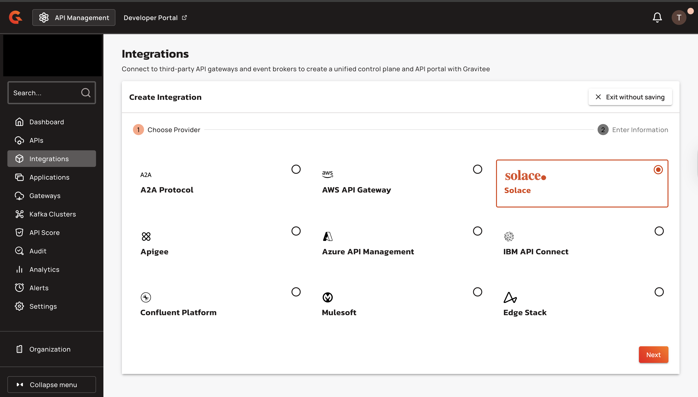

# Solace

## Overview

Solace is an advanced event broker that enables an event mesh architecture. Solace Event Portal acts as an API portal for events, and Gravitee's Solace federation agent integrates with this platform to manage Event APIs.

## Prerequisites&#x20;

Before you install the Solace federation agent, complete the following steps:

* Obtain access to a Solace PubSub+ Cloud account. For more information, see [creating a Solace event portal to manage Event API. ](https://api.solace.dev/cloud/reference/apim-getting-started)
* Install Gravitee API Management version 4.4 or later, with an enterprise license. For more information about Enterprise edition, see[ Enterprise Edition Licensing.](https://documentation.gravitee.io/platform-overview/gravitee-platform/gravitee-offerings-ce-vs-ee/enterprise-edition-licensing#license-support)
* Create an access token. For more information, see [how to create a service account and an access token.](../federation-agent-service-account.md)
* Generate Solace API token with appropriate permissions. See [#minimum-solace-permissions-required-by-the-agent](solace.md#minimum-solace-permissions-required-by-the-agent "mention")

## Integrate Solace with Gravitee APIM&#x20;

To integrate Solace with Gravitee APIM, complete the following steps:

1. [#create-a-solace-integration-in-the-grvaitee-apim-console](solace.md#create-a-solace-integration-in-the-grvaitee-apim-console "mention")
2. [#run-the-solace-federation-agent](solace.md#run-the-solace-federation-agent "mention")

### Create a Solace integration in the Grvaitee APIM Console&#x20;

1.  From the Dashboard, click **Integrations.**

    <figure><figcaption></figcaption></figure>
2.  Click **Create Integration**.

    <figure><figcaption></figcaption></figure>
3.  Select **Solace**, and then click **Next**.

    <figure><figcaption></figcaption></figure>
4.  Type the **Integration Name.**&#x20;

    <figure><figcaption></figcaption></figure>
5.  (Optional) Type the **Description** for the integration.

    <figure><figcaption></figcaption></figure>
6.  Click **Create Integration**.

    <figure><figcaption></figcaption></figure>
7.  From the Integration overview tab, copy the **Integration ID**. You need this ID for the agent configuration.

    <figure><figcaption></figcaption></figure>


### Run the Solace federation agent

You can deploy the Solace federation agent using either of the following installation methods:

* [#docker-compose](solace.md#docker-compose "mention")
* [#helm](solace.md#helm "mention")

### Docker Compose&#x20;

1.  Copy the following configuration, and then save it to your Docker Compose file:

    <pre class="language-yaml"><code class="lang-yaml"><strong>services:
    </strong>  integration-agent:
        image: graviteeio/federation-agent-solace:${AGENT_VERSION:-latest}
        restart: always
        environment:
          - gravitee_integration_connector_ws_endpoints_0=${WS_ENDPOINTS}
          - gravitee_integration_connector_ws_headers_0_name=Authorization
          - gravitee_integration_connector_ws_headers_0_value=bearer ${WS_AUTH_TOKEN}
          - gravitee_integration_providers_0_integrationId=${INTEGRATION_ID}
          - gravitee_integration_providers_0_type=solace
          - gravitee_integration_providers_0_configuration_authToken=${SOLACE_AUTH_TOKEN}
          - gravitee_integration_providers_0_configuration_url=${SOLACE_ENDPOINT:-https://apim-production-api.solace.cloud/api/v2/apim}
          - gravitee_integration_providers_0_configuration_0_appDomains=${SOLACE_APPLICATION_0_DOMAIN:-}
          # If you are using Gravitee NextGen Cloud, then you need to also include a Cloud Token for Federation Agent
          # - gravitee_cloud_token=${GRAVITEE_CLOUD_TOKEN}
    </code></pre>
2.  Create a file named `.env` in the same directory as your Docker Compose file, and then add the following environment variables:

    ```dotenv
    ## GRAVITEE PARAMETERS ##

    # Gravitee APIM management API URL, typically suffixed with the path /integration-controller
    WS_ENDPOINTS=https://[your-APIM-management-API-host]/integration-controller

    # Gravitee APIM token to be used by the agent
    WS_AUTH_TOKEN=[your-token]

    # ID of the APIM integration you created for this agent
    INTEGRATION_ID=[your-integration-id]

    # APIM organization ID, example: DEFAULT
    WS_ORG_ID=[organization-id]

    # If you are using Gravitee Next-Gen Cloud, then you also need to include a Cloud Token for Federation Agent (https://documentation.gravitee.io/apim/hybrid-installation-and-configuration-guides/next-gen-cloud#cloud-token)
    # GRAVITEE_CLOUD_TOKEN=[your-cloud-token-for-federation-agent]

    # Optionally specify a specific version of the agent, default will be latest
    # AGENT_VERSION=1.1.0

    ## SOLACE PARAMETERS ##

    # Solace endpoint (common for all Solace customers)
    SOLACE_ENDPOINT=https://apim-production-api.solace.cloud/api/v2/apim

    # Solace API token
    SOLACE_AUTH_TOKEN=[your-solace-token]

    # Optional: Filter for one or more Solace application domains
    SOLACE_APPLICATION_0_DOMAIN=[your-application-domain]
    ```


3. Replace the following placeholder values with your own configuration:
   * `[your-APIM-management-API-host]`: Your Gravitee APIM management API URL.
   * `[your-token]`: Your Gravitee APIM access token.
   * `[your-integration-id]`: The Integration ID from the Gravitee Console.
   * `[organization-id]`: (for example, DEFAULT) Your APIM organization ID.
   * `[your-solace-token]`: Your Solace API token.
   * (Optional) `[your-application-domain]`: Your Solace application domain for filtering.
4.  Pull the latest Docker image using the following command:

    ```shellscript
    docker compose pull
    ```
5.  Start the agent in the background with the following command:

    ```bash
    docker compose up -d
    ```

#### Verification&#x20;

1.  In the Gravitee API Management console, after refreshing, you should now see the agent's status set to **Connected**.

    <figure><figcaption></figcaption></figure>
2. (Optional) If the Agent Connection shows as `Disconnected`, inspect the agent container logs for error messages.

### Helm&#x20;

To deploy the federation agent to your Kubernetes cluster, complete the following steps:

#### Update your Helm Chart&#x20;

* Add the Gravitee Helm repository and update it to ensure you have access to the latest charts:

```shellscript
helm repo add gravitee https://helm.gravitee.io

helm repo update
```

#### Configure the Federation Agent Helm values&#x20;

Create the Helm values file based on your APIM management API's certificate setup. You can use the default configuration or custom certificate configuration.

#### Default configuration&#x20;

1.  This configuration uses the default Java truststore for your APIM management API certificates. Create a file named `federation-agent-solace-values.yaml` in your working directory, and then copy the following configuration:<br>

    ```yaml
    # =========================
    # Kubernetes / RBAC
    # =========================
    kubernetes:
      serviceAccount:
        managed: true
        roleRules:
          - apiGroups:
              - ""
            resources:
              - configmaps
              - secrets
            verbs:
              - get
              - list
              - watch

      deployment:
        image:
          repository: graviteeio
          name: federation-agent-solace
          tag: 4.8.4

        resources:
          requests:
            memory: "256Mi"
            cpu: "100m"
          limits:
            memory: "512Mi"
            cpu: "250m"

    # =========================
    # Gravitee / Solace Agent
    # =========================
    config:
      graviteeYml:
        services:
          core:
            http:
              enabled: true
              port: 18084
              host: 0.0.0.0
              authentication:
                type: basic
                users:
                  admin: adminadmin
          metrics:
            enabled: false
            prometheus:
              enabled: false
        
        # Optional: Only if using Gravitee Cloud
        cloud:
          token: [your-cloud-token]
        
        integration:
          connector:
            ws:
              endpoints:
                - https://[your-APIM-management-API-host]/integration-controller
              headers:
                - name: Authorization
                  value: bearer [your-token]
          
          providers:
            - type: solace
              integrationId: [your-integration-id]
              configuration:
                authToken: [your-solace-token]
                url: https://apim-production-api.solace.cloud/api/v2/apim
                appDomains:
                  - [your-application-domain]
    ```


2. Make the following modifications to your `federation-agent-solace-values.yaml` file:
   * Replace `[your-cloud-token]` with your Gravitee Cloud token or remove the entire `cloud:` section if using self-hosted APIM.
   * Replace `[your-APIM-management-API-host]` with your APIM management API URL. For example, `apim.example.com` or `gravitee-apim-api.gravitee-apim.svc.cluster.local:8083` for internal Kubernetes service.
   * Replace `[your-token]` with your service account bearer token.
   * Replace `[your-integration-id]` with the Integration ID.
   * Replace `[your-solace-token]` with your Solace API token.
   * (For filtering only) Replace `[your-application-domain]` with your Solace application domain.&#x20;
3.  Deploy the federation agent to your Kubernetes cluster by running the following command:

    ```shellscript
    helm install federation-agent-solace \
      gravitee/federation-agent \
      -f federation-agent-solace-values.yaml \
      -n gravitee-apim \
      --create-namespace
    ```

#### Custom certificate configuration&#x20;

1.  This configuration includes custom truststore volume mounts for certificates from private certificate authorities or self-signed certificates. Create a file named `federation-agent-solace-values.yaml`, and then copy the following configuration:

    ```yaml
    # =========================
    # Kubernetes / RBAC
    # =========================
    kubernetes:
      serviceAccount:
        managed: true
        roleRules:
          - apiGroups:
              - ""
            resources:
              - configmaps
              - secrets
            verbs:
              - get
              - list
              - watch
      
      extraVolumes: |
        - name: custom-truststore
          secret:
            secretName: solace-truststore

      deployment:
        image:
          repository: graviteeio
          name: federation-agent-solace
          tag: 4.8.4
        
        extraVolumeMounts: |
          - name: custom-truststore
            mountPath: /opt/graviteeio-federation-agent/truststore
            readOnly: true

        resources:
          requests:
            memory: "256Mi"
            cpu: "100m"
          limits:
            memory: "512Mi"
            cpu: "250m"

    # =========================
    # Gravitee / Solace Agent
    # =========================
    config:
      graviteeYml:
        services:
          core:
            http:
              enabled: true
              port: 18084
              host: 0.0.0.0
              authentication:
                type: basic
                users:
                  admin: adminadmin
          metrics:
            enabled: false
            prometheus:
              enabled: false
        
        # Optional: Only if using Gravitee Cloud
        cloud:
          token: [your-cloud-token]
        
        integration:
          connector:
            ws:
              endpoints:
                - https://[your-APIM-management-API-host]/integration-controller
              headers:
                - name: Authorization
                  value: bearer [your-token]
              ssl:
                truststore:
                  # Type can be: JKS, PKCS12, or PEM
                  type: PKCS12
                  path: /opt/graviteeio-federation-agent/truststore/my_truststore.p12
                  password: secret://kubernetes/solace-truststore:password?namespace=gravitee-apim
          
          providers:
            - type: solace
              integrationId: [your-integration-id]
              configuration:
                authToken: [your-solace-token]
                url: https://apim-production-api.solace.cloud/api/v2/apim
                appDomains:
                  - [your-application-domain]
    ```


If your APIM management API uses certificates that require a custom truststore, you must create the truststore and add it to Kubernetes as a secret before deploying the agent.


2. Make the following modifications to your `federation-agent-solace-values.yaml` file:
   * Replace `[your-cloud-token]` with your Gravitee Cloud token or remove the entire `cloud:` section if using self-hosted APIM.
   * Replace `[your-APIM-management-API-host]` with your APIM management API URL. For example, `apim.example.com` or `gravitee-apim-api.gravitee-apim.svc.cluster.local:8083` for internal Kubernetes service.
   * Replace `[your-token]` with your service account bearer token.
   * Replace `[your-integration-id]` with the Integration ID.
   * Replace `[your-solace-token]` with your Solace API token.
   * (optional, for filtering) Replace `[your-application-domain]` with your Solace application domain.&#x20;
3.  Deploy the federation agent to your Kubernetes cluster by running the following command:

    ```shellscript
    helm install federation-agent-solace \
      gravitee/federation-agent \
      -f federation-agent-solace-values.yaml \
      -n gravitee-apim \
      --create-namespace
    ```

### Verification&#x20;

1.  When the deployment is successful, verify the installation is running using the following command:<br>

    ```bash
    kubectl get pods -n gravitee-apim -l app.kubernetes.io/name=federation-agent
    ```


    The output should show the federation agent ready and running:

    ```bash
    NAME                                     READY   STATUS    RESTARTS   AGE
    federation-agent-solace-xxxxx-yyyyy      1/1     Running   0          30s
    ```


2.  Return to the Gravitee API Management console, refresh the page, and verify that the agent's status is set to **Connected**.<br>

    <figure><figcaption></figcaption></figure>

## Minimum Solace permissions required by the agent

Below are the minimum permissions required by the agent to perform the required operations against the Solace management API. For more information on Solace permissions, see [the official Solace documentation](https://api.solace.dev/cloud/reference/apim-getting-started#api-authentication).

```bash
mission_control:access
services:get:self
service_requests:post:client_profile
services:get
ep_environment:get:*
modeled_event_broker:get:*
modeled_event_mesh:get:*
apim_event_api_product:*:*
apim_event_api_product:get:*
application_domain:get:*
event_designer:access
```
