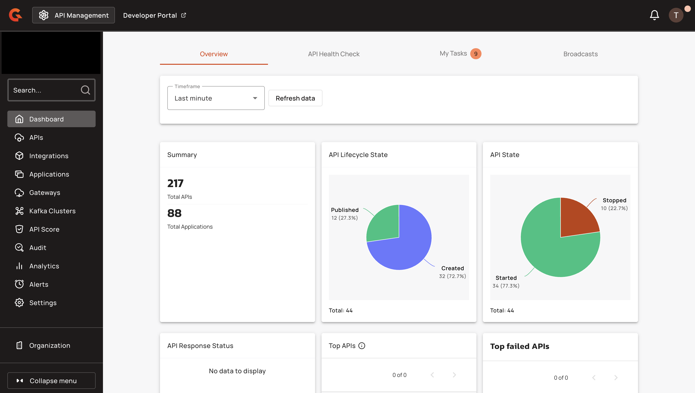
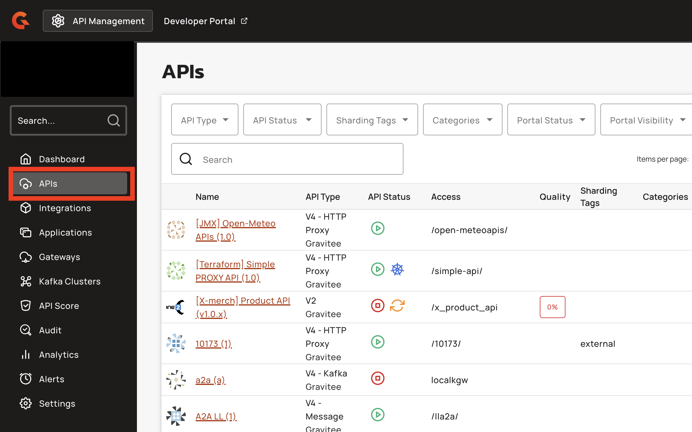
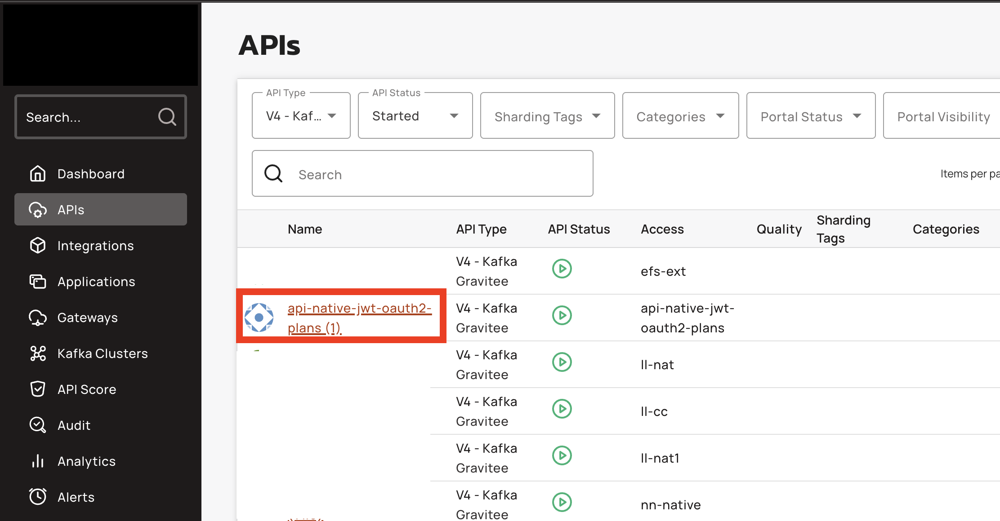
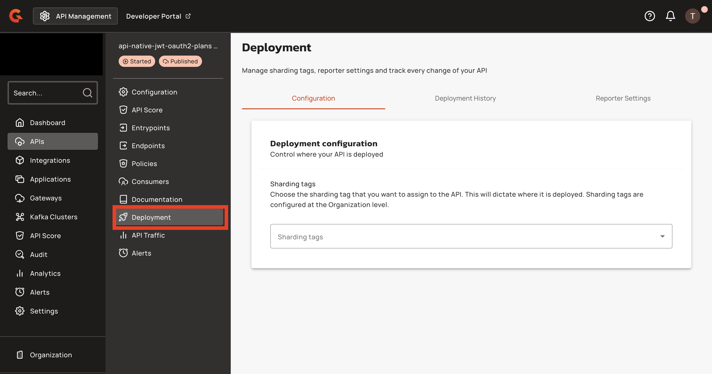
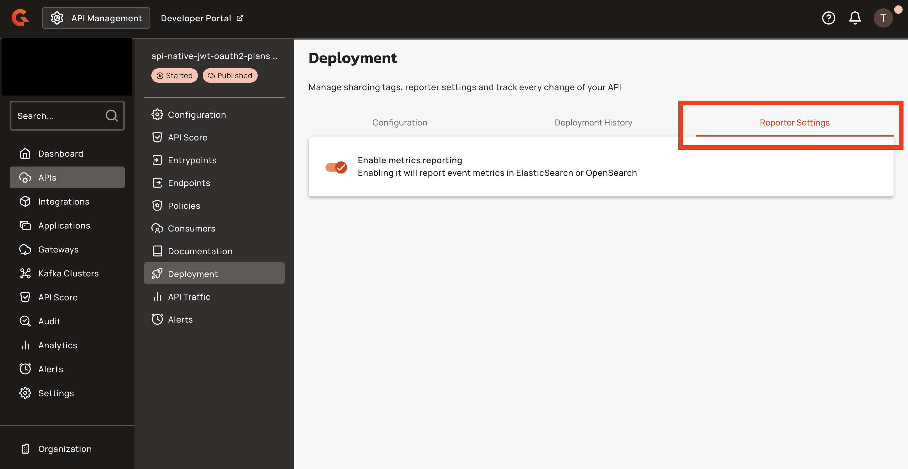
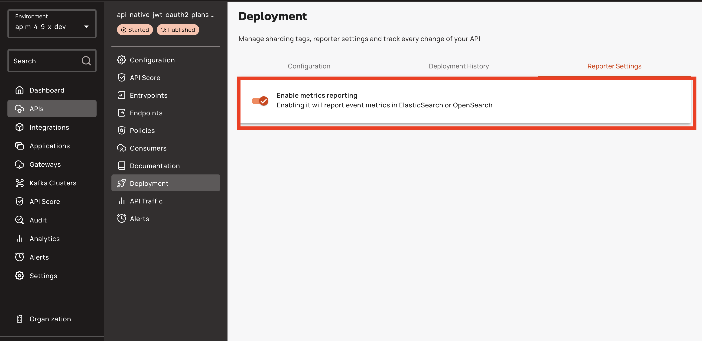
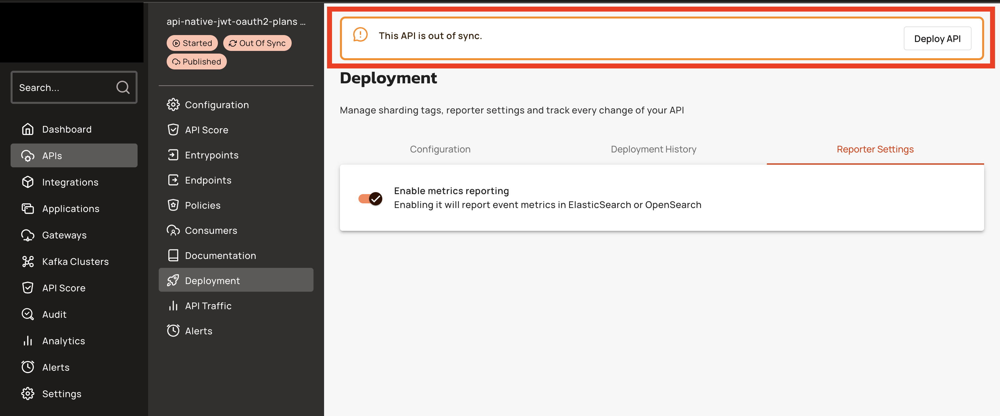

# Expose Metrics to Elasticsearch

## Overview

This guide explains how to configure the Elasticsearch reporter to collect and store runtime metrics from your Gravitee Kafka Gateway.

The reporter collects metrics from Kafka API operations and stores them in Elasticsearch as time-series data. This enables real-time monitoring and historical analysis by letting you do the following:

* Monitor Kafka API performance and throughput
* Track message production and consumption rates
* Analyze connection patterns and health
* Identify bottlenecks and performance issues

## Prerequisites

Before you expose metrics to Elasticsearch, complete the following steps:

* Ensure network connectivity from your Gateway to Elasticsearch on default port 9200.
* Elasticsearch version 8.x.
* Define a policy to manage the lifecycle of time series data. For example: rollover, delete after X days. For more information, see [Index Lifecycle Management](https://www.elastic.co/docs/manage-data/lifecycle/index-lifecycle-management).
* Obtain a Gravitee Enterprise license.
* [Configure the Elasticsearch reporter](../prepare-a-production-environment/repositories/elasticsearch.md#api-gateway-configuration) for your Kafka Gateway.

## Enable metrics reporting for Kafka APIs

Metrics reporting behavior depends on your version of APIM and the APIM version used to create your API:

* Metrics reporting is enabled by default for Kafka APIs created with APIM 4.9.
* Metrics reporting is disabled by default for APIM versions prior to 4.9 and APIs created with APIM versions prior to 4.9.


Before producing or consuming messages, verify that metrics reporting is enabled for your Kafka API. Without this setting enabled, metrics are not saved in Elasticsearch.


To enable metrics reporting in the APIM Console, complete the following steps:

1.  Navigate to your APIM Console

    <figure><figcaption></figcaption></figure>
2.  Click on **APIs**

    <figure><figcaption></figcaption></figure>
3.  Select your API

    <figure><figcaption></figcaption></figure>
4.  Click on **Deployment**

    <figure><figcaption></figcaption></figure>
5.  Select **Reporter Settings**

    <figure><figcaption></figcaption></figure>
6.  Enable **Enable metrics reporting**

    <figure><figcaption></figcaption></figure>
7.  Deploy the API

    <figure><figcaption></figcaption></figure>

The Gateway collects metrics when your API produces or consumes Kafka messages. For more information about message operations, see [#produce-and-consume-messages](configure-the-kafka-client-and-gateway.md#produce-and-consume-messages "mention").

## Kafka Gateway metrics reference

The following tables describe all available metrics collected by the Elasticsearch reporter.

### Common dimensions

All metrics include the following dimensions for filtering and grouping data:

| Dimension    | Description                             | Example                                |
| ------------ | --------------------------------------- | -------------------------------------- |
| `@timestamp` | Event timestamp                         | `2025-01-15T10:30:00Z`                 |
| `gw-id`      | Gateway instance ID                     | `d956fc60-9f77-4fbc-96fc-609f778fbcc2` |
| `org-id`     | Organization ID                         | `DEFAULT`                              |
| `env-id`     | Environment ID                          | `DEFAULT`                              |
| `api-id`     | Kafka API ID                            | `273f4728-1e30-4c78-bf47-281e304c78a5` |
| `plan-id`    | Plan ID (authenticated requests)        | `ec3c2f14-b669-4b4c-bc2f-14b6694b4c10` |
| `app-id`     | Application ID (authenticated requests) | `app-12345`                            |
| `topic`      | Kafka topic name                        | `my-topic`                             |

### **Connection metrics**

The following connection metrics (gauges) track the current number of active connections. These metrics provide real-time visibility into client connectivity.

| Metric                          | Description                                 |
| ------------------------------- | ------------------------------------------- |
| `downstream-active-connections` | Active client connections to Gateway        |
| `upstream-active-connections`   | Active Gateway connections to Kafka brokers |

### Message metrics

The following message counters track message volume across all operations. These metrics accumulate over time and measure the total number of messages processed:

| Metric                                | Description                                    |
| ------------------------------------- | ---------------------------------------------- |
| `downstream-publish-messages-total`   | Messages received from clients (produce)       |
| `upstream-publish-messages-total`     | Messages sent to Kafka brokers (produce)       |
| `downstream-subscribe-messages-total` | Messages sent to clients (consume)             |
| `upstream-subscribe-messages-total`   | Messages received from Kafka brokers (consume) |

### Data volume metrics

The following data volume counters track data throughput in bytes. These metrics accumulate over time and measure the total amounts of data processed.

| Metric                               | Description                                 |
| ------------------------------------ | ------------------------------------------- |
| `downstream-publish-message-bytes`   | Bytes received from clients (produce)       |
| `upstream-publish-message-bytes`     | Bytes sent to Kafka brokers (produce)       |
| `downstream-subscribe-message-bytes` | Bytes sent to clients (consume)             |
| `upstream-subscribe-message-bytes`   | Bytes received from Kafka brokers (consume) |
