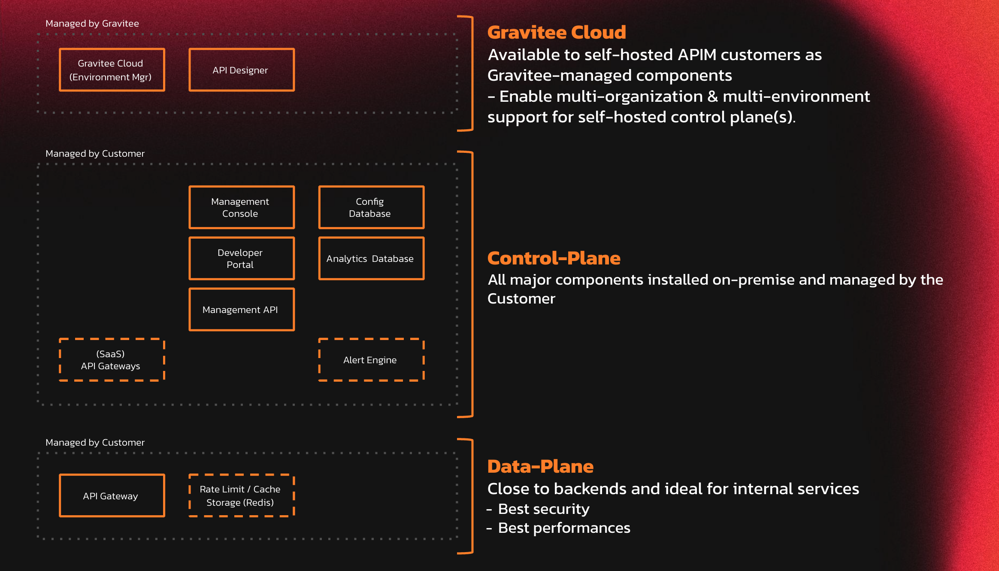
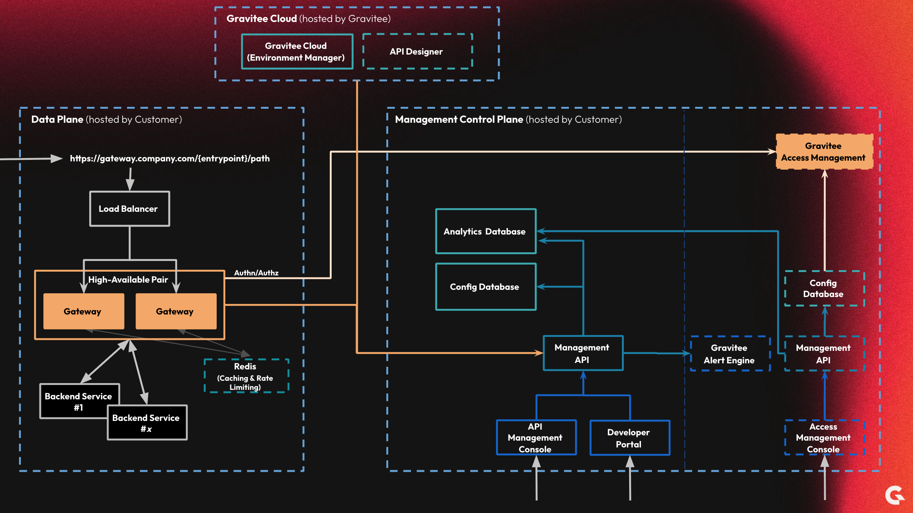

# Self-Hosted Installation Guides

## Overview


**Gravitee Cloud is recommended for new installations to reduce deployment complexity.**\
Let Gravitee run the control plane and database for you. With Gravitee Cloud, you only need to run the data planes. To register for a Gravitee Cloud account, go to the [Gravitee Cloud registration page](https://cloud.gravitee.io/).


Self-hosted architecture refers a scheme where all Gravitee API Management components are hosted by the user on-prem and/or in a private cloud. Gravitee Cloud and API Designer are optional Gravitee-managed components that can be connected to a self-hosted API Management installation.

## Deployment methods

Gravitee APIM can be installed using the following technology stacks and deployment methods.

### Docker

* [docker-compose.md](docker/docker-compose.md "mention")
* [docker-cli.md](docker/docker-cli.md "mention")

### Kubernetes

* [kubernetes](kubernetes/ "mention")
* [AWS EKS](kubernetes/aws-eks.md)
* [Azure AKS](kubernetes/azure-aks.md)
* [OpenShift](kubernetes/openshift.md)
* GCP GKE

### Linux

* [rpm](rpm/ "mention")
* [.zip.md](.zip.md "mention")

### Windows

* [.zip.md](.zip.md "mention")

## Architecture

The following diagrams illustrate the component management and design of a self-hosted architecture.

### Self-hosted component management

<figure><figcaption></figcaption></figure>

Self-hosted component management means that the customer hosts and manages both the Control Plane(s) and Data Plane(s).

To support a multi-environment configuration, the self-hosted Control Plane must be connected to Gravitee Cloud.

### Self-hosted architecture diagram

<figure><figcaption></figcaption></figure>

In a typical self-hosted architecture, the customer manages both the Data Plane and the Control Plane. The Management Control Plane consists of API Management (mAPI), and, optionally, Gravitee Alert Engine and Gravitee Access Management.

The API Gateways communicate directly with the self-hosted Management API to synchronize API configurations, and, optionally, publish metrics and logs data.
