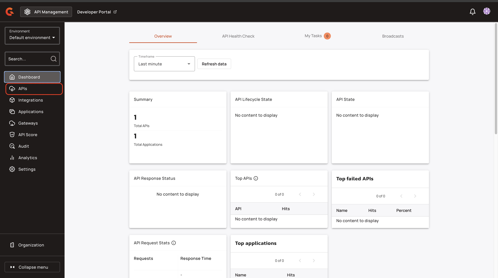

# Quick Start


This quick start uses configuration examples for HashiCorp Vault and Gravitee APIM Gateway. For other secret managers, use cases, and a complete reference, see [configuration.md](configuration.md "mention").


## Prerequisites

* A Gravitee APIM instance in a local or development environment running
* Credentials for your desired running Secret Manager


This feature work for only V4 APIs.


## Configure access to a secret manager and reference the secret

To configure access to the secret manager and reference the secret, complete the following steps:

* [#configure-gravitee-to-access-a-secret-manager](quick-start.md#configure-gravitee-to-access-a-secret-manager "mention")
* [#restart-and-test](quick-start.md#restart-and-test "mention")
* [#create-an-api](quick-start.md#create-an-api "mention")
* [#test-the-api](quick-start.md#test-the-api "mention")
* [#create-a-secret-in-hashicorp-vault](quick-start.md#create-a-secret-in-hashicorp-vault "mention")
* [#reference-secrets-in-an-api](quick-start.md#reference-secrets-in-an-api "mention")
* [#test-and-export](quick-start.md#test-and-export "mention")

### Configure Gravitee to access a secret manager

Once you instance of HashiCorp Vault is configured, you can add the following configurations to configure access to a Secret Manager.

#### Configure access to the secret manager with a gravitee.yml file.

* Add the following configuration to your `gravitee.yml` file.

```yaml
api:
  secrets:
    providers:
      - plugin: vault
        configuration: 
          enabled: true
          host: 127.0.0.1      
          port: 8200
          ssl:
            enabled: false
          auth:
            method: token 
            config:
              token: root
```

For more information about configuring access to your secret manager, see [configuration.md](configuration.md "mention").

#### Configure access to a secret manager with a Helm chart

* Add the following configuration to your Helm chart:

```yaml
gateway:
  api:
    secrets:
      providers:
        - plugin: vault
          configuration: 
            enabled: true   
            ## other properties as listed above
```

For more information about configuring access to your secret manager, see [configuration.md](configuration.md "mention").

#### Configure access to a secret manager with environment variables

* In your `docker-compose.yml` file, add the following configuration:

```bash
GRAVITEE_API_SECRETS_PROVIDERS_0_PLUGIN_VAULT="true"
GRAVITEE_API_SECRETS_PROVIDERS_0_CONFIGURATION_ENABLED="true"
GRAVITEE_API_SECRETS_PROVIDERS_0_CONFIGURATION_HOST="127.0.0.1"
GRAVITEE_API_SECRETS_PROVIDERS_0_CONFIGURATION_PORT="8200"
GRAVITEE_API_SECRETS_PROVIDERS_0_CONFIGURATION_SSL_ENABLED="true"
GRAVITEE_API_SECRETS_PROVIDERS_0_CONFIGURATION_AUTH_METHOD="token"
GRAVITEE_API_SECRETS_PROVIDERS_0_CONFIGURATION_AUTH_CONFIG_TOKEN="root"
```

For more information about configuring access to your secret manager, see [configuration.md](configuration.md "mention").

### Restart and test

1. Restart you Gateway.
2. Check the logs and ensure that there are no errors.

### Create an API

Create an API with a fake sensitive that you secure after we make sure everything works as expected.

1.  From the **Dashboard**, click **APIs**.

    <figure><figcaption></figcaption></figure>
2.  Click **+ Add API**.

    <figure><figcaption></figcaption></figure>
3.  In the **Choose API creation method** screen, click **Create V4 API**.

    <figure><figcaption></figcaption></figure>
4. In the **API name** field, type a name for the API. For example, test-api.
5. In the **Version number** field, type a version. For example, 1.1.
6.  Click **Validate my details**.

    <figure><figcaption></figcaption></figure>
7.  Select **HTTP Proxy**, and then click **Select my entrypoints**.

    <figure><figcaption></figcaption></figure>
8. In the **context-path** field, type a context path. For example, `/test/secrets/echo` .
9.  Click **Validate my entrypoints**.

    <figure><figcaption></figcaption></figure>
10. In the **Configure your API endpoints access**, complete the following sub-steps:
    1.  In the **Target url** field, set the target URL to `https://api.gravitee.io/echo` .

        <figure><figcaption></figcaption></figure>
    2.  In HTTP Headers section, add the following values:

        * KEY: `Authorization`
        * VALUE: `ApiKey 123456789`

        <figure><figcaption></figcaption></figure>
11. Click **Validate my endpoints**.

    <figure><figcaption></figcaption></figure>
12. Click V**alidate my plans**.

    <figure><figcaption></figcaption></figure>
13. Click **Save & Deploy API**.

    <figure><figcaption></figcaption></figure>

### Test the API

* Call the endpoint. Here is an example call with [httpie](https://httpie.io/cli):

```bash
http :8082/test/secrets/echo/
```

You receive the following output:

<pre class="language-json"><code class="lang-json">HTTP/1.1 200 OK
Content-Length: 311
Content-Type: application/json
Sozu-Id: 01K4PV89Y5A0X3X3CK9R902JX5
X-Gravitee-Client-Identifier: 54dca846a6d89edad8abf5a0f6158acef71d53242ea232831da778d3abc345c4
X-Gravitee-Request-Id: beb5e861-dfc1-456d-b5e8-61dfc1756d70
X-Gravitee-Transaction-Id: beb5e861-dfc1-456d-b5e8-61dfc1756d70

{
    "bodySize": 0,
    "headers": {
        "Accept": "*/*",
        <a data-footnote-ref href="#user-content-fn-1">"Authorization": "ApiKey 123456789",</a>
        "Host": "api.gravitee.io",
        "User-Agent": "HTTPie/3.2.4",
        "X-Gravitee-Request-Id": "8fdad3ae-7c91-4ef4-9ad3-ae7c91eef4ca",
        "X-Gravitee-Transaction-Id": "beb5e861-dfc1-456d-b5e8-61dfc1756d70",
        "accept-encoding": "deflate, gzip"
    },
    "query_params": {}
}
</code></pre>

If you export your API, you see the Authorization header as part of the definition:

```json
...
"endpointGroups": [
  {
    "name": "Default HTTP proxy group",
    "type": "http-proxy",
    "loadBalancer": {
      "type": "ROUND_ROBIN"
    },
    "sharedConfiguration": {
      "headers":[
        {
          "name": "Authorization",
          "value": "ApiKey {#secrets.get('/vault/secret/gravitee/apikeys:username')}"
        }
      ]
  ...
```

### Create a secret in HashiCorp Vault

*   Create a secret with name `gravitee/apikeys` using `secret` with one entry: `echo` containing the value `123456789` .

    ```bash
    vault kv put -mount=secret gravitee/apikeys echo=123456789
    ```

### Reference secrets in an API

1.  In your API configuration screen, click **Endpoints**.

    <figure><figcaption></figcaption></figure>
2.  Click **Edit**.

    <figure><figcaption></figcaption></figure>
3.  Click the **Configuration** tab, and then navigate to **HTTP Headers**.

    <figure><figcaption></figcaption></figure>
4. In the **VALUE** field, replace `ApiKey 123465798` with `ApiKey{#secrets.get('/vault/secret/gravitee/apikeys:username')}` .
5.  In the **You have unsaved changes** pop-up window, click **Save.**

    <figure><figcaption></figcaption></figure>
6.  In the **This API is out of sync** pop-up window, click **Deploy API**.

    <figure><figcaption></figcaption></figure>

### Test and export

1. Check the logs for errors.
2.  Call the endpoint. Here is an example call with [httpie](https://httpie.io/cli):

    ```bash
    http :8082/test/secrets/echo/
    ```
3. Export your API.

You receive the following output:

```json
...
"endpointGroups": [
  {
    "name": "Default HTTP proxy group",
    "type": "http-proxy",
    "loadBalancer": {
      "type": "ROUND_ROBIN"
    },
    "sharedConfiguration": {
      "headers":[
        {
          "name": "Authorization",
          "value": "ApiKey {#secrets.get('/vault/secret/gravitee/apikeys:username')}"
        }
      ]
  ...
```

## Next steps

* For more information about configurations for other secret managers and all available options, see [configuration.md](configuration.md "mention").
* For more information about the the `{#secrets.get(...)}` syntax, see [reference-secrets-in-apis.md](reference-secrets-in-apis.md "mention")

[^1]: This is the header that was set up above
