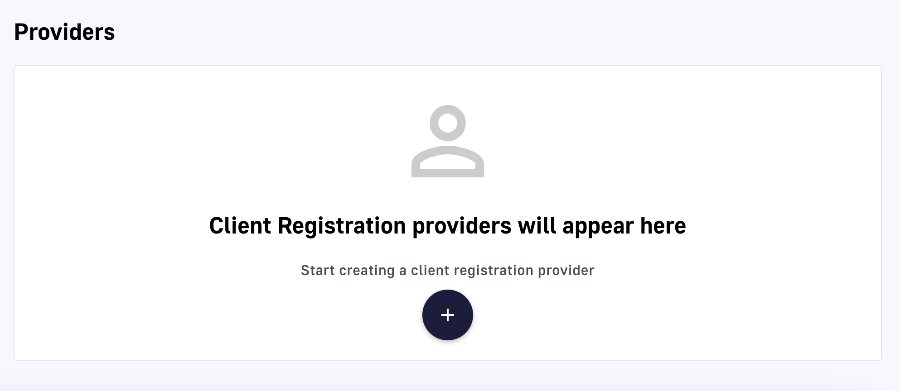
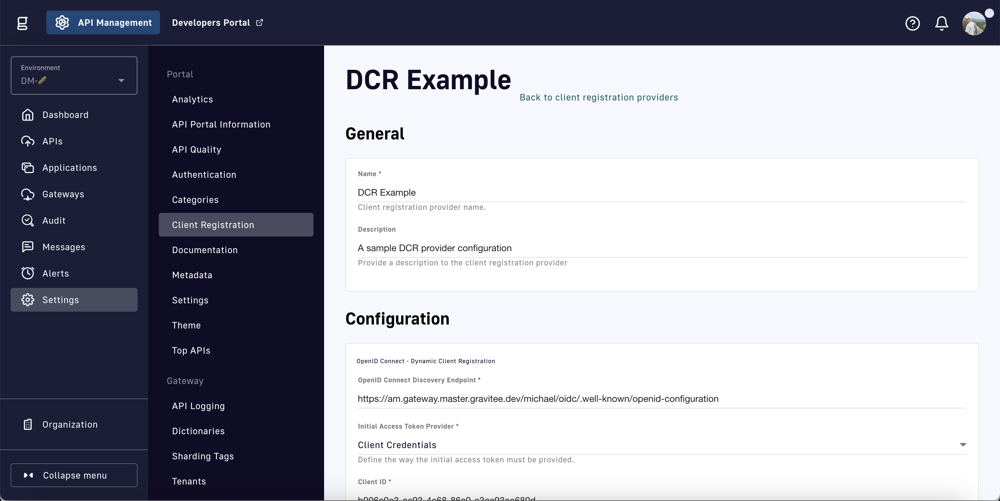
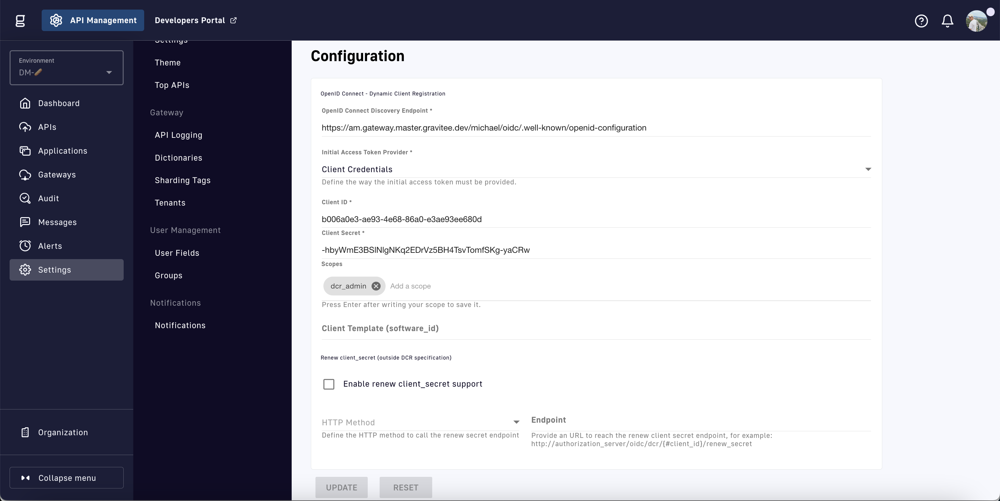

# Applications

To access your APIs, consumers must register an application and subscribe to a published API plan (unless the plan is keyless). Applications act on behalf of the user to request tokens, provide user identity information, and retrieve protected resources from remote services and APIs.

## Prerequisites

To allow API consumers to create applications, you need to first enable the correct options in the **Settings > Client Registration** page. Here, you can define the allowed types of applications that API consumers can create:

* **Simple:** does _not_ require enabling **Dynamic Client Registration.** API consumers can optionally define the `client_id` when creating the application.
* Advanced: the API producer must enable and configure **Dynamic Client Registration** to allow API consumers to create these application types. The client registration provider is responsible for creating the `client_id` and `client_secret` for each application that registers.
  * **Browser**
  * **Web**
  * **Native**
  * **Backend-to-Backend**

<figure><figcaption><p>Client Registration settings</p></figcaption></figure>

## Simple application configuration

To allow API consumers to create a simple application, enable the **Simple** option in the **Allowed application types** section. This allows the API consumer to define the `client_id` on their own for use in JWT and OAuth API plans.

## Advanced application configuration

API producers typically do not allow API consumers to create simple applications when using more secure plans with JWT or OAuth authentication types. To allow API consumers to register advanced applications, dynamic client registration must be enabled and configured with a client registration provider.&#x20;

[Dynamic client registration](https://www.rfc-editor.org/rfc/rfc7591) (DCR) is a protocol that allows OAuth client applications to register with an OAuth server through the OpenID Connect (OIDC) client registration endpoint. DCR allows API consumers to register applications with an OAuth server from Gravitee's developer portal or management UI.

Since DCR works with OAuth clients, we first wanted to provide some quick definitions of relevant OAuth terminology.

### Relevant OAuth terminology

OAuth 2.0 defines four roles:

* **Resource owner**: an entity enabled to grant access to a protected resource. When the resource owner is a person, it is referred to as an _end user_.
  * You, the owner of the backend APIs Gravitee's gateway is protecting, are the resource owner.
* **Client:** an application making protected resource requests on behalf of the resource owner and with the resource owner’s authorization. The term _client_ does not imply any particular implementation characteristics (e.g. whether the application executes on a server, a desktop or other device).
  * The API consumer's application attempting to register through the developer portal or management UI is the client.
* **Resource server:** the server hosting the protected resources, capable of accepting and responding to protected resource requests using access tokens.
  * The APIM gateway sitting in front of the backend APIs is the resource server.
* **Authorization server:** the server issuing access tokens to the client after successfully authenticating the resource owner and obtaining authorization.
  * The client registration provider we are about to configure is the authorization server.


The resource server and the authorization server can be the same server


Additional Oauth terminology:

* **Redirect URI**: the URL the authorization server will redirect the resource owner back to after granting permission to the client. Often referred to as the callback URL.
* **Response type:** the type of information the client expects to receive. Generally, it is an authorization code.
* **Scope:** granular permissions the clients request such as access to data
* **Consent:** verifies scopes with the resource owner to determine if the client will receive the requested permissions
* **Client ID:** used to identify the client with the authorization server
* **Client Secret:** password only the client and authorization server know
* **Authorization Code:** short-lived code sent back to the client from the authorization server. The client sends the authorization code in combination with the client secret back to the authorization server to receive an access token.
* **Access Token:** token that the client will use to communicate with the resource server

### Dynamic client registration provider configuration

Once dynamic client registration has been enabled in the **Client Registration** settings, you need to add a **Provider** at the bottom of the **Client Registration** page. We will be using Gravitee Access Management (AM) for our provider, but you are free to use any authentication server supporting OIDC.&#x20;

<figure><figcaption><p>Add a client registration provider</p></figcaption></figure>

You are presented with the following options when configuring a client registration provider:

<figure><figcaption><p>Configure a client registration provider</p></figcaption></figure>

The **General** section allows you to set a **Name** and **Description** for your client registration provider.

The **Configuration** section first requires you to set an **OpenID Connect Discovery Endpoint** which is the URL where an OIDC-compatible authorization server publishes its metadata. **** The metadata is a JSON listing of the OpenID/OAuth endpoints, supported scopes and claims, public keys used to sign the tokens, and other details. This information can be used to construct a request to the authorization server. The field names and values are defined in the [OIDC Discovery Specification.](https://openid.net/specs/openid-connect-discovery-1\_0.html)&#x20;

Once the endpoint is set, the configuration options branch in two directions based on the **Initial Access Token Provider: Client Credentials** or **Initial Access Token.** The initial access token is provided by the authorization server to grant access to its protected client registration endpoint.&#x20;

### Client Credentials

<figure><figcaption><p>Client credentials token provider</p></figcaption></figure>

Client credentials is an authorization grant flow used by clients to obtain an access token outside the context of a user. The flow is typically used when the client is acting on its own behalf (i.e., the client is also the resource owner).&#x20;

This allows you to set up your authorization server, obtain its associated **Client ID** and **Client Secret,** and add them to the provider's configuration settings. Therefore, when future API consumers register an advanced application, they will utilize this provider to generate an initial access token that grants access to the protected client registration endpoint.

The application then calls this endpoint&#x20;

### Initial Access Token


## Grant types

An authorization grant is a flow used by the client to obtain an access token. How you use grant types mainly depends on your application type.

APIM has five grant types:

* Authorization code
* Implicit
* Resource Owner Password
* Client Credentials
* Refresh Token

### Authorization code

The authorization code is used by applications to obtain a temporary code after requesting the authorization of the end user.

#### **Flow**

1. The end user clicks **Sign in** in the application.
2. The end user is redirected to the AM authorization server `/oauth/authorize?response_type=code`.
3. The end user authenticates using one of the configured identity providers and login options (MFA for example).
4. (Optional) A consent page is displayed to ask for user approval.
5. AM redirects the end user back to the application with an authorization code.
6. The application calls the AM authorization server `/oauth/token` to exchange the code for an access token (and optionally, a refresh token).
7. The application uses the access token to make secure API calls for the end user.

#### **Additional information**

* Authorization codes are single-use.
* For server-side web apps, such as native (mobile) and Javascript apps, you also use the [PKCE extension](https://tools.ietf.org/html/rfc7636) as part of your flow, which provides protection against other attacks where the authorization code may be intercepted.
* Authorization code grant URL: `GET https://am-gateway/{domain}/oauth/authorize?response_type=code&client_id=web-app&redirect_uri=https://web-app/callback`
* For more information about this flow, see the [RFC](https://tools.ietf.org/html/rfc6749#section-1.3.1).

### Implicit


**Security concerns**

The OAuth standard now discourages the use of an implicit grant to request access tokens from Javascript applications. You should consider using the [Authorization code](https://docs.gravitee.io/am/current/am\_devguide\_protocols\_oauth2\_overview.html#authorization\_code) grant with a PKCE extension for all your applications.


The implicit grant is a simplified authorization code flow. Instead of getting a temporary code first, you can retrieve an access token directly from web browser redirection.

#### **Flow**

1. The end user clicks **Sign in** in the application.
2. The end user is redirected to the AM authorization server `/oauth/authorize?response_type=token`.
3. The end user authenticates using one of the configured identity providers and login options (MFA for example).
4. (Optional) A consent page is displayed to ask for user approval.
5. AM redirects the end user back to the application with an access token.
6. The application uses the access token to make secure API calls for the end user.

#### **Additional information**

* Implicit grant URL: `GET https://am-gateway/{domain}/oauth/authorize?response_type=token&client_id=web-app&redirect_uri=https://web-app/callback`
* For more information about this flow, see the [RFC](https://tools.ietf.org/html/rfc6749#section-1.3.2).

### Resource owner password credentials

The resource owner password credentials (i.e. username and password) can be used directly as an authorization grant to obtain an access token (using a REST approach).

The biggest difference from other flows is that the authentication process is triggered by the application and not the AM authorization server.


**Trusted clients only**

This grant type should only be used when there is a high degree of trust between the resource owner and the client (e.g. the client is part of the device operating system or a highly privileged application) and when other authorization grant types are not available (such as the authorization code grant type).


#### **Flow**

1. The end user clicks **Sign in** and enters the user credentials (username/password) in the application form.
2. The application forward the credentials to the AM authorization server `/oauth/token`.
3. AM checks the credentials.
4. AM responds with an access token (and optionally, a refresh token).
5. The application uses the access token to make secure API calls for the end user.

#### **Additional information**

* Resource owner password credentials grant URL: `POST https://am-gateway/{domain}/oauth/token?grant_type=password&username=john&password=doe (with Basic client credentials)`
* For more information about this flow, see the [RFC](https://tools.ietf.org/html/rfc6749#section-1.3.3).

### Client credentials

The client credentials grant type is used by clients to obtain an access token outside the context of a user. This is typically used by clients to access resources about themselves rather than user resources.

#### **Additional information**

* The flow is typically used when the client is acting on its own behalf (the client is also the resource owner), i.e. machine-to-machine communication.
* Client credentials grant URL: `POST https://am-gateway/{domain}/oauth/token?grant_type=client_credentials` (with basic client credentials)
* For more information about this flow, see the [RFC](https://tools.ietf.org/html/rfc6749#section-1.3.4).

### Refresh token

A refresh token is used to get a new access token, prompting the client application to renew access to protected resources without displaying a login page to the resource owner.

#### **Additional information**

* The refresh token is single use only.
* For security reasons (a user can remain authenticated forever), a refresh token must be stored in a secure place (i.e server side).
* Refresh token grant URL: `POST https://am-gateway/{domain}/oauth/token?grant_type=refresh_token&refresh_token={refreshToken} (with Basic client credentials)`


###

## Create an application

To access your APIs, consumers must register an application and subscribe to a published API plan (unless the plan is keyless). By default,&#x20;

[](https://europe1.discourse-cdn.com/business20/uploads/graviteeforum/original/2X/8/84b18001a50959dc764d38ee5f714669ac8f4466.png)

Click **View API** to see what details about the API are exposed in the portal. From the perspective of the consumer, this acts as the API’s homepage which provides documentation, a method to contact support, issue tracking, reviews from other consumers, and most importantly, a way to subscribe to the API. Click the **Subscribe** button in the top right to get started.

[](https://europe1.discourse-cdn.com/business20/uploads/graviteeforum/original/2X/0/0fafad3f66ab0cfc124dbff69a1d0b764d2e53b3.png)

So where’s our plan with API key authentication we just created? If you remember, we never actually published the plan. Also, those of you with sharp eyes may notice that the **Access URL** shown in the sidebar has a placeholder domain. Let’s return to the management console for a moment to resolve both of these issues.

First, we’ll show you how to modify the default access url of your API. Click on **Organization** in the sidebar of the management console. Next, click on **Sharding tags** in the sidebar under the **Gateway** subheader. This page allows you to modify the default entrypoint of the gateway which is `https://localhost:8082` for this tutorial’s architecture.

>  **Sharding Tags and Gateway Entrypoint Mappings**
>
> ***
>
> At a high-level, sharding tags are assigned to APIs and Gravitee gateways to provide a method to deploy an API to a subset of gateways. Adding a mapping between these sharding tags and a gateway’s entrypoint url allows the developer portal to intelligently display different entrypoints depending on the API’s sharding tags.
>
> Sharding tags are used to help manage complex distributed architectures. If you want to learn more, we highly recommend reading Gravitee’s very own @nicobalestra’s [blog on the topic](https://www.gravitee.io/blog/manage-complex-environments-sharding-tags).

[](https://europe1.discourse-cdn.com/business20/uploads/graviteeforum/original/2X/8/8d8cf9a2ba0a7827d0069e7c08fe168982936911.png)


Our **API Key Plan** is summarized in the image above: subscriptions require _manual validation_ and authentication is dependent on a _personal key_. Manual validation refers to the fact that the API publisher has elected to manually approve every subscription to this plan as opposed to auto validation. A plan can easily be created or updated to use auto validation by using the **Auto validate subscription** toggle as shown in the image below.

[](https://europe1.discourse-cdn.com/business20/uploads/graviteeforum/original/2X/a/aa13b67ac923431c0248a972eb739bd23eb769c6.png)

As for the personal key authentication, we’ll double back to that in just a minute. Click **Next** to be greeted by the following roadblock:

[](https://europe1.discourse-cdn.com/business20/uploads/graviteeforum/original/2X/2/243246689fa0d391138d0f5bb9a6dea8af0b0335.png)

If this is your first time subscribing to an API plan with authentication enabled, an application may seem like a strange requirement just to access an API. Previously with the keyless plan, anyone on the network had the ability to start sending requests to the API, no application necessary. However, with authentication enabled, it is important for the API producer to be aware of all consumers of the API. If one consumer turns out to be a bad actor engaging in malicious activity, then producers require more granular control to revoke access for that one consumer instead of shutting the API down for all users. Additionally, more advanced authentication methods like OAuth 2.0 require the client to provide information such as a client id when subscribing. These more advanced methods will be detailed in a future tutorial.

So how are subscriptions monitored? Well, through _applications_ of course! Applications and plans go together like developers and repurposing code from stack overflow. Remember, plans are an access layer around APIs that provide the API producer a method to secure, monitor, and transparently communicate details around access. An application allows an API consumer to register and agree to this plan. The result is a successful contract or _subscription_.

So let’s make an application from the developer portal by clicking the aptly named **I want to create an application** link. Provide a name and description for your application and click **Next**.

[](https://europe1.discourse-cdn.com/business20/uploads/graviteeforum/original/2X/9/9f2c6d954f08482c8bd0512b328f32a834b301e5.png)

Because we’re using a more basic form of authentication, the only option on the **Security** page is a simple application. Creating a browser, web, native, or backend-to-backend application requires enabling [dynamic client registration](https://docs.gravitee.io/am/current/am\_userguide\_dynamic\_client\_registration.html) as detailed in [the docs](https://docs.gravitee.io/apim/3.x/apim\_consumerguide\_manage\_applications.html#prerequisites).

For this tutorial, leave everything blank and click **Next** again. This will take you to the **Subscription** page where you have the option to request a subscription to any available plans. For now, that is limited to the singular **API Key Plan** tied to the **Dev Guide API**. Click **Subscribe**, add a comment if you’d like, and click **Next** one more time. This should take you to the final page shown below where you can click **Create the App**.

[](https://europe1.discourse-cdn.com/business20/uploads/graviteeforum/original/2X/5/5f840477110d2da207008673192f828ca8bd8e45.png)

Easy enough. We were able to complete the application and subscription request in one go. So where’s the API key? If we navigate to the **Applications** tab, then the **Subscriptions** tab on the submenu, we can see the subscription is still awaiting approval.

[](https://europe1.discourse-cdn.com/business20/uploads/graviteeforum/original/2X/6/643caf6873231077f974ba5c90737fb0697eb283.png)

To quickly approve that subscription, return to the management console and click on your profile icon in the top right. Select the **Task** option that appears in the dropdown to navigate to the following page.

[](https://europe1.discourse-cdn.com/business20/uploads/graviteeforum/original/2X/1/1adb13370733ef8d510f26ba1ae048d9c97fa009.png)

Next, click **Validate** to be taken taken to the subscription requests page. This provides all the high-level details about any subscription requests including the user and application making the request. Clicking **Accept** returns the modal shown in the image below where you can set an expiration date on the subscription. For our use case, leave that blank and confirm the subscription. An API producer can pause, close, or add an expiration date to a subscription at any time.

[](https://europe1.discourse-cdn.com/business20/uploads/graviteeforum/original/2X/f/f2825ef1077bdfca97e4e4b35898f830a70255e1.jpeg)

The following page is shown after accepting the subscription. Most importantly, the API key to be used for authentication in future requests is shown with the ability to renew, revoke, or set an expiration date on the API key itself, as opposed to on the actual subscription. Generally, it is good practice to rotate the means of authentication on a regular basis instead of providing long-lived access tokens like this static API key.

[](https://europe1.discourse-cdn.com/business20/uploads/graviteeforum/original/2X/6/6709f0f781e8210ec41bb5f81bb49a9e81234c8f.png)

If you scroll up to the top of the page, you can click on the **Back to subscriptions** link to see a list of all current, pending, paused, and closed subscriptions. Currently, you should only see the subscription we just approved. However, there are a number of filtering mechanisms provided for managing more popular APIs that may include a number of different types of plans.

[](https://europe1.discourse-cdn.com/business20/uploads/graviteeforum/original/2X/b/bcc7f130fe0f52862ac42ac6a2cd0298d75239b6.png)

With the subscription approved, we can switch our perspective back to that of the API consumer and return to the developer portal. Refreshing the “Subscriptions” tab under the “Internal Consumer” application shows the accepted subscription. Click anywhere on the row to reveal the API key.

[](https://europe1.discourse-cdn.com/business20/uploads/graviteeforum/original/2X/2/2c3f030c8cd56d9dd34e5a1f4f21d2cb0c59092b.png)

Excellent! Now we just need a way to pass this API key to our todo application. Feel free to take a look at the source code for the todo app, but essentially, each API call is passing a header with the following key-value pair:

`"X-Gravitee-Api-Key": process.env.REACT_APP_API_KEY`

where `"X-Gravitee-Api-Key"` is the default API key header accepted by the Gravitee gateway. If needed, this header can be customized as [outlined in the docs](https://docs.gravitee.io/apim/3.x/apim\_policies\_apikey.html#gateway).

To successfully authenticate, we need to provide a value for the `REACT_APP_API_KEY` environment variable as it is currently undefined. There are two steps to passing environment variables to our application:

1. Create a `.env` file with the correct key-value pair
2. Modify the docker-compose.yml file to pass the environment variables to individual containers

The first step is easy enough. Simply create a `.env` file in the root directory of the cloned repo then copy and paste this key-value pair:

`REACT_APP_API_KEY="your-api-key-string"`

Next, open the docker-compose file and uncomment lines 55 and 56 to pass the environment variable to the `app-frontend` container.

[](https://europe1.discourse-cdn.com/business20/uploads/graviteeforum/original/2X/f/fc7b73263405e7a08072858a2e3786913f4fe6bb.png)

Finally, save the files and run `docker-compose up -d` to rebuild and restart the necessary containers. If you return to the [todo application](http://localhost:3000/), you should be greeted by the fruits of your labor: a functioning todo app using API key authentication!

[](https://europe1.discourse-cdn.com/business20/uploads/graviteeforum/original/2X/2/2646c8286ba91a81a1bf4a2d8463b47218b6c5ac.png)

### External Exposure <a href="#external-exposure-4" id="external-exposure-4"></a>

The workflow demonstrated in the Internal Exposure section works great for API publishers and API consumers working at the same company. But what if the API publishers wanted to expose APIs to external consumers? This is a common use case when developers are looking to monetize their APIs so let’s dive into the details of how to set this up.

First, open the management console and navigate back to the **Dev Guide API’s** plans. We’re going to quickly create and publish a new plan for external consumers. This plan will use the same API key authentication as our **API Key Plan**, and for now, the will only the change will be to the name and description. Sticking with our history of creative names, we’ll call the new plan **External API Key Plan**. You’re witnessing poetry in motion.

Build the plan in the console and publish it. Your plans page should now look like the following:

[](https://europe1.discourse-cdn.com/business20/uploads/graviteeforum/original/2X/e/e89e8db222168f6007715ad709766dc1db54928d.png)

Now, in the previous section we simulated internal exposure of our API by using the same admin account for both the API producer and API consumer. However, external exposure necessitates the ability to create new accounts which requires some additional configuration. We’ll walk you through how to set that up.

The ability to create new user accounts has [two requirements](https://docs.gravitee.io/apim/3.x/apim\_consumerguide\_create\_account.html#prerequisites):

1. the “Allow User Registration” option enabled in settings
2. email [SMTP (simple mail transfer protocol) configuration](https://docs.gravitee.io/apim/3.x/apim\_installguide\_rest\_apis\_configuration.html#smtp-configuration)

User registration is already enabled by default, but emailing is disabled since it requires configuring an SMTP email service. To set that up, return to the management console and select **Settings** in the main menu and select **Settings** again under the **Portal** header in the submenu.

[](https://europe1.discourse-cdn.com/business20/uploads/graviteeforum/original/2X/d/d033d41925c00cd1b56d9934ca774e89d4d118a2.png)

Here, you can customize a number of aspects of the developer portal, but notice the warning at the top of the page. It essentially says the configuration file takes precedence. For example, if you scroll to the bottom of that page, you will see the SMTP settings, but the option to enable emailing is greyed out due to the previously mentioned configuration file.

[](https://europe1.discourse-cdn.com/business20/uploads/graviteeforum/original/2X/a/abe13454c6d7c6a968428f085632edd92d44276c.png)

This configuration file is known as the `gravitee.yml` file. It is one of [three ways to configure settings for your APIM environment](https://docs.gravitee.io/apim/3.x/apim\_installguide\_rest\_apis\_configuration.html#overview): environment variables, system properties, and `gravitee.yml`, in order of precedence. We will be overriding these settings using environment variables, but first, we want to show you where in our docker installation the `gravitee.yml` file for APIM lives.

Open **Docker Desktop**, click on the `gio_apim_management_api` container, and switch to the **Terminal** tab. The `gravitee.yml` file lives in the `config` directory as shown in the image below. If you use the `cat` command to print the contents of the file, you will be able to search for and see the default SMTP settings.

>  The gateway component has a separate `gravitee.yml` file.

[](https://europe1.discourse-cdn.com/business20/uploads/graviteeforum/original/2X/f/f9048fa605cb73e34636e17358268f1f4e4e0193.png)\
[](https://europe1.discourse-cdn.com/business20/uploads/graviteeforum/original/2X/1/18291fe9b031f5d3becfdc0c6750eeffc1f4b96d.png)

Rather than modify this file directly, we’re going to stick with our theme of using environment variables. Environment variables have precedence over the other two configuration types and allow us to define them in the same `.env` file we created earlier.

>  **Gravitee Environment Variable Syntax**
>
> ***
>
> Unlike our `REACT_APP_API_KEY` environment variable which was injected into our todo application, these environment variables are being used to modify Gravitee specific configurations. You must ensure you use the correct syntax for each property:
>
> * Each level of indentation in the `gravitee.yml` file needs to be seperated by an underscore. For example, this inside a `gravitee.yml` file
>
> ***
>
> ```
> management:
>    Mongodb:
>       dbname: myDatabase
> ```
>
> ***
>
> **becomes** `gravitee_management_mongodb_dbname=myDatabase`
>
> * Some properties are case-sensitive and cannot be written in uppercase (for example, `gravitee_security_providers_0_tokenIntrospectionEndpoint`). Therefore, we advise you to define all Gravitee environment variables in lowercase.
> * In some systems, hyphens are not allowed in variable names. For example, you may need to write `gravitee_policy_api-key_header` as `gravitee_policy_apikey_header`.

Open the `.env` file created in the Internal Exposure section and add the following environment variables:

```
gravitee_email_enabled=true
gravitee_email_host=fqdn-smtp-service-provider.com
gravitee_email_username=your-email@your-email-host.com
gravitee_email_password=your-password
gravitee_email_from=your-email@your-email-host.com
```

where `fqdn-smtp-service-provider` (fqdn = fully qualified domain name) and `your-email-host` is dependent on the email service you would like to use (e.g. Gmail, Yahoo, etc.). For Gmail, they have several options as [detailed here](https://support.google.com/a/answer/176600?hl=en). The rest should be self-explanatory; however, if you are using two-factor authentication with Gmail, then you need to [generate an application password](https://security.google.com/settings/security/apppasswords). This password will be used in place of your standard account password for the `gravitee_email_password` environment variable.

Similar to before, once you’ve input your email information, you need to make sure the environment variables are passed to the `management_api` container. Open the `docker-compose.yml` file again and uncomment lines 141 and 142. Finally, save the files and run `docker-compose up -d` to rebuild and restart the necessary containers one more time.

[](https://europe1.discourse-cdn.com/business20/uploads/graviteeforum/original/2X/5/5e88cbd9ab8cc9e67bcb48cf9e780cbdfbb3368a.png)

After you give the containers a chance to restart, you should be able to return to the management console to see your updated settings. You also now have the option to enable auth and TLS in the management console which is recommended.

[](https://europe1.discourse-cdn.com/business20/uploads/graviteeforum/original/2X/9/96bc69d764fee7a570e2bb2b238424769d72ce1a.png)

Alright, let’s test these new settings by attempting to create a new user. We recommend [opening the developer portal](http://localhost:8085/) in an incognito window to avoid being automatically signed out of the admin account being used in the management console. In the new incognito window, click **Sign in** then **Sign up**. Enter a name and functioning email.

[](https://europe1.discourse-cdn.com/business20/uploads/graviteeforum/original/2X/4/423e485a2a5abd1477b326d9f795408e556dbe08.png)

If all goes smoothly, you should get a registration confirmation and an email to the address you provided. Open the email and click on the link. Make sure the link opens in the incognito tab; otherwise, it will just open the developer portal with the admin account signed in.

You will taken to a page to finalize your account and add a password. By default, the password must meet the following requirements:

* 8 to 32 characters
* no more than 2 consecutive equal characters
* min 1 special characters (@ & # …)
* min 1 upper case character

>  **Password Customization**
>
> ***
>
> Password requirements can be modified by changing the regex pattern under **User Management Configuration** in the `gravitee.yml` file or by using environment variables. Additionally, you can provide [custom UI errors](https://docs.gravitee.io/am/current/am\_userguide\_user\_management\_password\_policy.html#custom\_ui\_errors) for future new users by modifying the sign up and register HTML templates.

Once you finish creating your password, you should be able to sign in without issue. The newly created external user will also be immediately visible in the admin’s management console. Leave the incognito window and return to the standard window where you are singed in as an admin in the management console. In the sidebar menu, you can reach your organization settings by clicking on **Organization** at the bottom. Once there, navigate to the **Users** tab in the sidebar. Here you will see a list of all current users tied to the organization. As an admin, you can click on any user for more details and to apply administrative policies. Additionally, admins can pre-register users by clicking the **Add user** button in the top right.

[](https://europe1.discourse-cdn.com/business20/uploads/graviteeforum/original/2X/7/712b65b5d81ff0459a41a4f2f76487611d5ce4f8.png)

Next, click on **Applications** in the sidebar. Interestingly, you should see a new application called **Default application** which is owned by the user you just created.

[](https://europe1.discourse-cdn.com/business20/uploads/graviteeforum/original/2X/1/186f0300a51db63b3fece375675232e15e40486e.png)

So why did the new user not have to create a first application like the admin? In order to allow new users to quickly move forward with API consumption, the default settings are every new user automatically has a default application created. This can be easily disabled through the aforementioned three configuration options.

To follow the wisdom of Gravitee’s creators and take advantage of this default setting meant to promote speed of API consumption, let’s quickly have our external user subscribe to the **Dev Guide API**. Return to the developer portal in the incognito tab and navigate to the **Dev Guide API** inside the catalog. Once there, we will subscribe to **External API Key Plan** just like we did previously with our internal consumer and the original **API Key Plan**. Complete and submit the subscription request.

[](https://europe1.discourse-cdn.com/business20/uploads/graviteeforum/original/2X/5/5f399e12252a024dce57d56ce7b14e823e43eb03.png)

To approve this subscription, leave the incognito tab and return to the management console with the admin signed in. From there, navigate to the **Task** page shown under the profile dropdown in the top right. And just like before, validate this subscription request.

With the new subscription approved, let’s update the todo application to use the API key tied to the **External API Key Plan**. This will be at the bottom of the page as shown below.

[](https://europe1.discourse-cdn.com/business20/uploads/graviteeforum/original/2X/b/b86752223c9815e7ead90f7ce97c5adbc104b12e.png)

Copy the key and return to the `.env` file in the root of the cloned repo and update `REACT_APP_API_KEY` environment variable. Once again, save the files and run `docker-compose up -d` to rebuild and restart the necessary containers. Give the containers at least a minute to fully start back up. You can test the functionality by trying to create a new task in the [todo app](http://localhost:3000/). It should function exactly as it did before.

Once completed, you can return to the subscriptions page to see both active subscriptions.

[](https://europe1.discourse-cdn.com/business20/uploads/graviteeforum/original/2X/f/f8bf594a92c21554196b989893ec2a3fae5f1aa5.png)

With this API now being used by to external consumers, we may want to consider using some additional policies to restrict how the API is used. We’ll do this by adding some policies to the **External API Key Plan** instead of directly to the API so the internal consumers are not impacted.

To illustrate a potential issue an we want to protect against, open the todo app and create a todo with the following text:

> Lorem Ipsum is simply dummy text of the printing and typesetting industry. Lorem Ipsum has been the industry’s standard dummy text ever since the 1500s, when an unknown printer took a galley of type and scrambled it to make a type specimen book. It has survived not only five centuries, but also the leap into electronic typesetting, remaining essentially unchanged. It was popularised in the 1960s with the release of Letraset sheets containing Lorem Ipsum passages, and more recently with desktop publishing software like Aldus PageMaker including versions of Lorem Ipsum.

Your result should look similar to the image below.\


[](https://europe1.discourse-cdn.com/business20/uploads/graviteeforum/original/2X/3/36c8b88099909c1f7ab1855e548370e56c638f5d.png)

Clearly, multi-line todos are causing some issues with the UI. This is an issue your internal users are aware of and know to avoid, but there is no way to ensure all external users are notified and comply with this restricted usage of the API. Your first thought is probably to update the UI, but let’s pretend that is not an option. Perhaps our hypothetical frontend developer does not have an immediate solution or is away vacationing deep in the Alps. To handle this, we’re going to create a new flow to restrict how much content external users can pass in a POST request to our todo application.

Click **Design** at the top of the page to access the Design Studio. If you completed Part 3 of the dev guide, you should see the API-level flow that implements rate limiting. Click on the empty flow beneath the **External API Key Plan**.

[](https://europe1.discourse-cdn.com/business20/uploads/graviteeforum/original/2X/d/d4f4664da294aa531a556e0463a5ef1bf19e76fe.jpeg)

Next, provide the flow a name and restrict it to the POST method. Then drag and drop the **Request Content Limit** policy from the sidebar into the **Request** part of the flow as shown below. In the policy settings, set the **Limit** to 175 then save and redeploy the API.

>  **Request Content Limit Units**
>
> ***
>
> The limit specified for this policy is in number of octets (an octet is synonymous with a byte on most architectures). However, if your payload is text and is encoded using UTF-8 like this example, then you can assume each character is equal to one octet.

[](https://europe1.discourse-cdn.com/business20/uploads/graviteeforum/original/2X/1/1b28aac714f87f5f81c5a0990f5acb7b9c8b83f4.jpeg)

Finally, return to the todo app and attempt to create a new todo with the same lorem ipsum block of text. You should receive an alert with a **HTTP 413 Content Too Large** response status code. Congrats! As a quick final note, flows can be paused be paused in the UI by hovering over the flow in the sidebar, clicking the toggle, saving, and redeploying the API.

Bravo. Both the internal and external consumers now have access to the API with different restrictions and authentication. However, it is worth noting that both types of consumer would likely be at a loss on how to actually use the API since we do not provide any API documentation. This is something we will be diving into deeper in a future tutorial as we explore things like Gravitee’s API designer that has the capability to generate documentation automatically. Additionally, we will be working with Gravitee’s access management offering to implement more advanced authentication with protocols like Oauth2.0 in the coming tutorials.

As always, please provide any feedback or requests you may have with a comment below!
