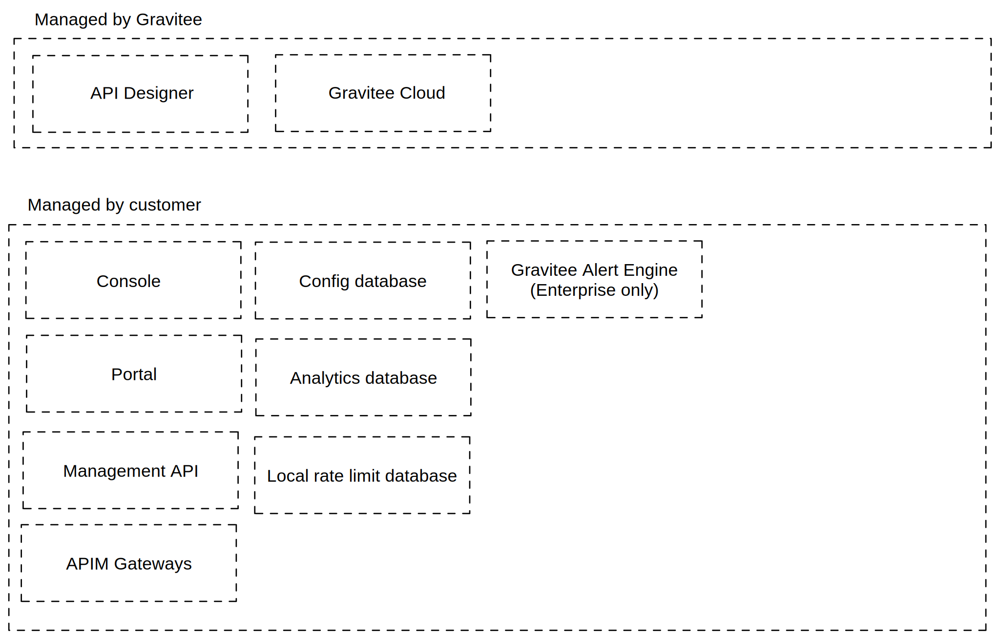

# APIM Architecture

## Introduction

Gravitee offers three different API Management architecture schemes: [self-hosted](apim-architecture.md#self-hosted-architecture), [hybrid](apim-architecture.md#hybrid-architecture), and [Gravitee-managed](apim-architecture.md#gravitee-managed-architecture).

Each architecture relies on a specific set of Gravitee components. Some components are common to all architectures while others are architecture-specific. The following table compares the component types and management of self-hosted and hybrid architectures.

<table><thead><tr><th width="326">Component</th><th data-type="checkbox">Self-hosted</th><th data-type="checkbox">Hybrid</th></tr></thead><tbody><tr><td>API Management UI</td><td>true</td><td>true</td></tr><tr><td>Management API</td><td>true</td><td>true</td></tr><tr><td>Developer Portal</td><td>true</td><td>true</td></tr><tr><td>APIM Gateway</td><td>true</td><td>true</td></tr><tr><td>Bridge Gateway</td><td>false</td><td>true</td></tr><tr><td>Config Database</td><td>true</td><td>true</td></tr><tr><td>Analytics Database</td><td>true</td><td>true</td></tr><tr><td>Logstash</td><td>false</td><td>true</td></tr><tr><td>Redis</td><td>false</td><td>true</td></tr><tr><td>Rate Limits Database</td><td>true</td><td>false</td></tr><tr><td>[Enterprise] Gravitee Cloud</td><td>true</td><td>true</td></tr><tr><td>[Enterprise] API Designer</td><td>true</td><td>true</td></tr><tr><td>[Enterprise] Alert Engine</td><td>true</td><td>true</td></tr></tbody></table>

### Component Descriptions

Component descriptions for the full catalog of Gravitee architecture components are summarized in the following table:

<table><thead><tr><th width="199">Component</th><th>Description</th></tr></thead><tbody><tr><td>Gravitee API Management UI (for API producers)</td><td>Web UI to access key <a href="https://docs.gravitee.io/apim/3.x/apim_overview_components.html#gravitee-components-rest-api">APIM API</a> services. Allows <a href="https://docs.gravitee.io/apim/3.x/apim_overview_concepts.html#gravitee-concepts-publisher">API Publishers</a> to publish APIs. Allows administrators to configure global platform settings and specific portal settings.</td></tr><tr><td>Management API</td><td>RESTful API exposing services to manage and configure the <a href="https://docs.gravitee.io/apim/3.x/apim_overview_components.html#gravitee-components-mgmt-ui">APIM Console</a> and <a href="https://docs.gravitee.io/apim/3.x/apim_overview_components.html#gravitee-components-portal-ui">APIM Portal</a> web UIs. Exposed services are restricted by authentication and authorization rules (see <a href="https://docs.gravitee.io/apim/3.x/apim_installguide_rest_apis_documentation.html">API Reference</a>). May be installed twice to separate Dev Portal and Administration Console, e.g., for internal access to the Administration Console (LAN) and external access to the Dev Portal (DMZ), a dedicated Management API will expose operations relating to each access type.</td></tr><tr><td>Dev / API Portal (for API consumers)</td><td>Web UI to access key <a href="https://docs.gravitee.io/apim/3.x/apim_overview_components.html#gravitee-components-rest-api">APIM API</a> services. Allows <a href="https://docs.gravitee.io/apim/3.x/apim_overview_concepts.html#gravitee-concepts-consumer">API Consumers</a> to manage <a href="https://docs.gravitee.io/apim/3.x/apim_overview_concepts.html#gravitee-concepts-application">applications</a> and search for, view, test or subscribe to a published API.</td></tr><tr><td>APIM Gateway</td><td>Core component of the APIM platform. Unlike a traditional HTTP proxy, APIM Gateway can apply <a href="https://docs.gravitee.io/apim/3.x/apim_overview_plugins.html#gravitee-plugins-policies">policies</a> (i.e., rules) to HTTP requests/responses. Policies enhance request/response processing by adding transformations, security, and other advanced features. In a hybrid architecture scheme, the self-hosted APIM Gateway is replaced by the Gravitee-managed SaaS APIM Gateway and the self-hosted Gravitee.io APIM Gateway.</td></tr><tr><td>Bridge Gateway</td><td>In a hybrid architecture, exposes HTTP services for bridging HTTP calls to the underlying Gravitee-supported repository (e.g., MongoDB, JDBC).</td></tr><tr><td>Config Database</td><td>Database that stores API Management data such as API definitions, users, applications, and plans.</td></tr><tr><td>Analytics Database</td><td>Database that stores Gateway events and logs. In a hybrid architecture, the Analytics Database is supplemented by an "S3 Bucket."</td></tr><tr><td>Logstash</td><td>Collects and sends local Gateway logs/metrics to the Gravitee.io APIM SaaS Control Plane. Exclusive to hybrid architecture and hosted by user on-prem or in a private cloud.</td></tr><tr><td>Redis</td><td>Local database for rate limit synchronized counters (Rate Limit, Quota, Spike Arrest). (Optional) Acts as an external cache in accordance with the <a href="https://docs.gravitee.io/apim/3.x/apim_resources_cache_redis.html#redis_cache_resource">Cache policy</a>. Exclusive to hybrid architecture and hosted by user on-prem or in a private cloud.</td></tr><tr><td>Rate Limits Database</td><td>Local database for rate limit synchronized counters (Rate Limit, Quota, Spike Arrest). (Optional) Acts as an external cache in accordance with the <a href="https://docs.gravitee.io/apim/3.x/apim_resources_cache_redis.html#redis_cache_resource">Cache policy</a>. Exclusive to self-hosted architecture.</td></tr><tr><td>[Enterprise] Gravitee Cloud</td><td>Tool for centralized, multi-environment/organization management of APIM and AM installations.</td></tr><tr><td>[Enterprise] API Designer</td><td>Drag-and-drop graphical (MindMap-based) tool to quickly and intuitively design APIs (Swagger/OAS) and deploy mocked APIs for testing.</td></tr><tr><td>[Enterprise] Alert Engine</td><td>Provides APIM and AM users with efficient and flexible API platform monitoring. Enables advanced alerting configuration and notifications sent via webhooks or over email, Slack, etc. Does not require external components or a database; receives events and sends notifications according to conditions pre-configured upstream via triggers.</td></tr></tbody></table>

## Self-hosted architecture

Self-hosted architecture refers a scheme where all Gravitee API Management components are hosted by the user on-prem and/or in a private cloud. Gravitee Cloud and API Designer are optional, Gravitee-managed components that can be connected to a self-hosted API Management installation.

The following diagrams illustrate the component management, design, and virtual machine internal/external access deployment of a self-hosted architecture.

### Self-hosted component management 

### Self-hosted architecture diagram 

### Self-hosted VM installation: LAN + DMZ deployment 

## Hybrid architecture

Hybrid architecture refers to a scheme where certain Gravitee API Management components are Gravitee-managed SaaS components while others remain self-hosted by the user on-prem and/or in a private cloud. Gravitee Cloud and API Designer are optional, Gravitee-managed components that can be connected to a hybrid API Management installation.

The following diagrams illustrate the component management, design, and self-hosted-to-SaaS connections of a hybrid architecture.

### Hybrid component management 

### Hybrid architecture diagram 

### Self-hosted-to-SaaS connections 

## Gravitee-managed architecture

Gravitee-managed architecture refers to a scheme where all Gravitee API Management components are Gravitee-managed SaaS components. Gravitee Cloud and API Designer are optional and can be connected to a Gravitee-managed API Management installation.
