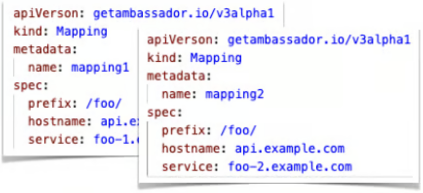
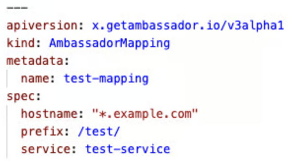

# Release Notes

### Version 3.12.9 (October 17, 2025) 

#### Upgrade Coraza to 3.3.3

Ambassador Edge Stack now uses Coraza version 3.3.3. This update addresses and resolves various security fixes. Please note that with this update Coraza has introduced additional logging around certain variables. These logs can be disabled by updating your WAF rules. Please visit the [WAF rules page](edge-stack-user-guide/web-application-firewalls/configuring-web-application-firewall-rules-in-ambassador-edge-stack.md) for more information.

### Version 3.12.8 (October 9, 2025) 

#### Patch XSRF vulnerability

Previously there was an error with how we verified XSRF cookies on the redirection endpoint allowing for potential XSRF attacks. This has been patched and further verification of the XSRF cookie has been added.

#### Update to JSON logging format

When using JSON log format, Filter errors would output with the `host` tag to describe the host of the request. This caused issues when importing with Datadog and has been updated to be `hostname`.

#### Upgrade to Envoy 1.31.10

Ambassador Edge Stack is now built on Envoy v1.31.10, which includes security enhancements. For more information, see [Envoy Proxy 1.31.10 Release Notes](https://www.envoyproxy.io/docs/envoy/v1.31.10/version_history/version_history).

### Version 3.12.7 (September 16, 2025) 

#### Fix SameSite behavior when multiple FilterPolicies point to a single Filter

Previously there was an error with how the `SameSite` value on the Cookie were set when multiple FilterPolicies pointed to the same Filter. The Cookie would use the FilterPolicy that had the highest precedence for that Filter even if it was on the wrong paths. Now, the `SameSite` value in the FilterPolicy is respected for that path.

#### Added further debug log information on the AuthService

When using the `debug` log level, more information is now logged when using Filters and other Capabilities related to the AuthService.

#### Upgraded Golang to 1.24.5

Ambassador Edge Stack now uses Golang version 1.24.5. This update resolves various security fixes.

### Version 3.12.6 (July 25, 2025) 

#### Downgraded Coraza to 3.0.4

Coraza 3.3.2 introduced a logging bug that caused Ambassador Edge Stack to excessively log debug entries which could lead to performance degradation. This release downgrades Coraza to 3.0.4 to mitigate this issue.

### Version 3.12.5 (June 23, 2025) 

#### OAuth2Filter now supports redirects at the redirection endpoint when state is expired or invalid

`OAuth2Filter` now includes a `StateExpireRedirect` field that allows you to configure redirects to the identity provider when the redirection endpoint is accessed with an expired or invalid state. For more information see [The OAuth2 Filter Type (v1alpha1)](crd-api-references/gateway.getambassador.io-v1alpha1/filter/the-oauth2-filter-type.md).

#### JWTFilter now supports AND or OR comparisons for multiple audiences

Previously, `JWTFilter` compared the required `audiences` list in a filter to the JWT's `aud` claim using an OR operation. As long as one audience in `audiences` was present, the JWT's `aud` was considered valid. The new `RequiredAudienceAll` field allows this behavior to change to an AND operation. When set to `true`, all values in the filter’s `audiences` list must be present in the JWT’s `aud` claim for the token to be considered valid.

#### Upgraded Golang to 1.22.12

Ambassador Edge Stack now uses Golang version 1.22.12. This update resolves various security fixes.

#### Upgraded Coraza to 3.3.2

Ambassador Edge Stack now uses Coraza version 3.3.2. Due to this upgrade, WAF users should update their rule set based on [Coraza's documentation](https://coraza.io/docs/tutorials/coreruleset/).

### Version 3.12.4 (February 25, 2025) 

#### Fixed an issue where mapping results were inaccurate when using the KubernetesEndpointResolver during an upstream service restart

Previously, when using the `KubernetesEndpointResolver` with certain `Mapping` configurations, the `Mapping` would produce incorrect results when the upstream service restarted. The `KubernetesEndpointResolver` now produces more accurate `Mapping` after an upstream service restart. Expected behaviors remain unchanged.

### Version 3.12.3 (January 22, 2025) 

#### JWTFilter now supports multiple audiences

Previously, `JWTFilter` allowed one audience per filter. Using the new `audiences` field, you can now include multiple audiences in a single `gateway.getambassador.io/v1alpha1` filter. For more information, see [The JWT Filter Type (v1alpha1)](crd-api-references/gateway.getambassador.io-v1alpha1/filter/the-jwt-filter-type.md).

#### Upgraded Golang to 1.22.11

Ambassador Edge Stack now uses the latest version of Golang. This update resolves CVE-2024-45336, CVE-2024-45341, and CVE-2024-24791.

### Version 3.12.2 (January 13, 2025) 

#### Fixed an issue with how the Ambassador Consul Connector applies secrets

Previously, the Ambassador Consul Connector relied on legacy Consul behaviors to apply Kubernetes secrets. Now, the Ambassador Consul Connector properly applies secrets in all environments. For more information, see [consul-integration.md](edge-stack-user-guide/ambassador-edge-stack-integrations/consul-integration.md "mention").

#### Fixed an issue with the internal address configuration setting

Previously, the `internalAddressConfig` field in the Listener CRD didn't identify the expected addresses as internal. Now, the field properly identifies internal addresses. For more information, see [the-listener-resource.md](technical-reference/using-custom-resources/the-listener-resource.md "mention").

### Version 3.12.1 (November 26, 2024) 

#### Updated the logging level for EnvoyFilter and EnvoyFilterPolicy

By default, the `EnvoyFilter` and `EnvoyFilterPolicy` custom resources logged configuration details at the `info` log level. They are now logged at the `debug` log level.

### Version 3.12.0 (November 25, 2024) 

#### Introduced new EnvoyFilter with Wasm support

You can now configure an `EnvoyFilter` with a `WasmFilter` (WebAssembly filter) to introduce additional processing for incoming or outgoing traffic while maintaining the flow of requests. This allows you to implement custom logic for your specific needs. For more information, see [the-envoy-filter-type.md](crd-api-references/getambassador.io-v3alpha1/the-envoy-filter-type.md "mention").

#### Enabled Envoy's internal address configuration to be modified

You can now configure an IP address for Envoy to trust using Envoy's `internal_address_config` setting. For more information, see [the-listener-resource.md](technical-reference/using-custom-resources/the-listener-resource.md "mention").

#### Fixed an issue that affected how FilterPolicy handled sameSite

In the 3.9 release of Edge Stack, changes to `FilterPolicy` handling introduced an issue where the `sameSite` value set in the `FilterPolicy` rules was not honored on redirection. The `sameSite` value set in the `FilterPolicy` is now honored.

#### Upgrade to Envoy 1.31.3

Ambassador Edge Stack is now built on Envoy v1.31.3, which includes security enhancements. For more information, see [Envoy Proxy 1.31.3 Release Notes](https://www.envoyproxy.io/docs/envoy/v1.31.3/version_history/version_history).

### Version 3.11.1 (June 27, 2024) 

#### Fix regression in FilterPolicy matching requests with query parameters

In the 3.9 release of Edge Stack, changes to the `Filter`/`FilterPolicy` handling introduced a regression where requests with query parameters would not match `FilterPolicy` rules that had an exact path match. Any `FilterPolicy` using wildcards (`*`) on their path match would not have been impacted by this, but ones that specify an exact path to match were impacted. Requests will now properly match `FilterPolicy` resources regardless of query parameters as they did in versions 3.8.2 and below.

#### Upgrade to Envoy 1.30.3

This upgrades Ambassador Edge Stack to be built on Envoy v1.30.3 which fixes an issue present for users of the DataDog tracing service driver. You can read more about the entire Envoy changelogs here: [Envoy Proxy 1.30.3 Release Notes](https://www.envoyproxy.io/docs/envoy/v1.30.3/version_history/version_history)

### Version 3.11.0 (June 17, 2024) 

#### Upgrade to Envoy 1.30.2

This upgrades Ambassador Edge Stack to be built on Envoy v1.30.2 which provides security, performance and feature enhancements. You can read more about them here: [Envoy Proxy 1.30.2 Release Notes](https://www.envoyproxy.io/docs/envoy/v1.30.2/version_history/version_history)

#### Upgrade Golang to 1.22.4

Upgrading to the latest release of Golang as part of our general dependency upgrade process.

#### Optional latency and Filter processing time metrics

Edge stack now provides some additional opt-in metrics around latency and processing time added by `Filter` resources.

### Version 3.10.2 (March 06, 2024) 

#### Upgrade Golang to 1.21.8

Upgrading to the latest release of Golang as part of our general dependency upgrade process. This update resolves CVE-2023-45290, CVE-2024-24783 and CVE-2023-45289.

### Version 3.10.1 (February 05, 2024) 

#### Propagate modified headers between External Filters

This fixes a regression where headers modified in an External Filter were not properly being propagated to the next External Filter within a `FilterPolicy.Rule`. This has been fixed and headers are now properly propagated.

#### Ensure APIExt Server can run in custom namespace

The rewrite of the APIExt introduced a bug so that the CA Cert manager was unable to watch for CA secrets not stored in the default `emissary-system` namespace. This has been fixed and the APIExt can be properly installed in other namespaces.

#### Allow configuring the CRD label selectors in the APIExt Server

The rewrite of the APIExt Server assumed that the default labels provided were being used on the getambassador.io CRDs registered in the cluster. This allowed the APIExt Server to only watch and cache the necessary CRD's rather than all CRD's in a cluster.\
\
However, some users modify these or remove them completely which prevents the APIEXT Server from patching the CRD's with the CABundle.\
\
A new flag `--crd-label-selector "app.kubernetes.io/part-of=emissary-apiext"` has been added to the APIExt Server Deployment so that these labels can be configured. By default, it will filter for CRD's using the default labels but can be modified.

#### Decrease CPU Usage for Users Not Utilizing WAF

In the 3.7 update, we introduced a new Web Application Firewall (WAF) feature. On every request, it would first check if that request matched any existing WAF Policies. This verification process resulted in higher CPU usage. In cases where the WAF feature is not being used and no WAF Policies are configured, we have now eliminated the need for this check, bringing the CPU usage per pod back to the levels seen in version 3.6.

### Version 3.10.0 (January 19, 2024) 

#### Introduce Proof Key for Code Exchange (PKCE) Support to OAuth2Filter

The `OAuth2Filter.v1alpha1.gateway.getambassador.io` now supports configuring and utilizing [Proof Key for Code Exchange](https://oauth.net/2/pkce/) to help prevent CSRF and authorization code injection attacks.

#### API Ext Webhook improved reliabilty and features

The API Ext Webhook has been re-written to provide reliability, reduce race conditions and provide more flexibile configuration.\
\- Added Leader Election support to remove race conditions between replicas when managing the CA Certificate and CRD Patching.\
\- Add ability to disable CA Certificate Management and CRD Patching to support managing these using external tools (i.e. CertManager). - Improved Readiness check to ensure CA Certificate and all CRDs are properly patched before coming ready.

#### API Ext Webhook - CA Certificate Rotation

The API Ext Conversion Webhook generates its own CA Certificate on first install which is then injected into each CRD. The kube-api-server uses this CA bundle to validate server certificates when communicating with the API Ext conversion webhook.\
Previously, the API Ext would generate the CA Certificate to be only valid for 1 year and would not renew the Certitficate when it was about to expire. This caused Ambassador Edge Stack to no longer be able to fetch Custom Resources from the kube-api-server.\
This has been fixed and the API Ext Webhook server will now generate the CA Certificate, renew it when it is about to expire and ensure the CRD's have been properly patched with the updated CA Certificate.

#### Improve short-lived connections for the WAF Service

Ambassador Edge Stack 3.7 introduced WAF support and under high loads the WAF Service would generate lots of short-lived TCP connections that would be held in TIME\_WAIT. This has been fixed and the WAF Service now properly reuses long-lived connections.

#### Adding support for typed\_json logging

Ambassador Edge Stack now supports envoy logging in the [typed json format](https://www.envoyproxy.io/docs/envoy/latest/configuration/observability/access_log/usage#format-dictionaries) by setting in the module.

#### Updated Golang and Python dependencies

Multiple Golang and Python dependencies have been updated to ensure Ambassador Edge Stack is using the latest supported versions.

#### Shipped Helm chart v8.10.0

\- Update default image to Ambassador Edge Stack v3.10.0.

### Version 3.9.3 (December 14, 2023) 

#### Fix AmbassadorID being ignored in Filter and FilterPolicy

Ambassador Edge Stack 3.9 introduced a regression in the `Filter.v3alpha1.getambassador.io` and `FilterPolicy.v3alpha1.getambassador.io` CRDs which caused these resources to ignore the AmbassadorID value. This caused these resources to be ignored when utilizing AmbassadorID. This has been fixed and it is highly recommended that you update if you leverage this feature.

### Version 3.9.2 (December 01, 2023) 

#### Fix IfRequestHeader.Negate improperly being set in FilterPolicy

Ambassador Edge Stack 3.9 introduced a regression in the `FilterPolicy.v3alpha1.getambassador.io` CRD which caused it to ignore the value set for the `ifRequestHeader.negate` field. This effectively meant it would always be `false` and could cause a FilterPolicy to not properly match on an incoming request. This has been fixed and it is highly recommended that you update if you leverage this feature.

### Version 3.9.1 (November 20, 2023) 

#### Fix Route Shifting Bug

Previously, after reconfiguration, routes could briefly be misconfigured due to a shift in the routes list. This has now been patched. Thanks to [Joe Andaverde](https://github.com/dynajoe) for contributing this bugfix!

### Version 3.9.0 (November 13, 2023) 

#### gateway.getambassador.io/v1alpha1 Filter & FilterPolicy resources

Filter and FilterPolicy resources are now available via `gateway.getambassador.io/v1alpha1`. It is NOT backwards compatible with `getambassador.io/v3alpha1` Filter and FilterPolicy resources. These are the next generation of CRD's that you can progressively adopt over time. They provide stronger typings so that feedback is given at apply time rather than runtime.

#### getambassador.io/v3alpha1 Filter & FilterPolicy statuses

Filter and FilterPolicy resources for the getambassador.io/v3alpha1 version will now provide statuses when they are "Ready". If there are configuration errors they will provide an error message with details about the configuration issues. This will help troubleshoot configuration issues.

#### Upgrade to Envoy 1.27.2

This upgrades Ambassador Edge Stack to be built on Envoy v1.27.2 which provides security, performance and feature enhancements. You can read more about them here: [Envoy Proxy 1.27.2 Release Notes](https://www.envoyproxy.io/docs/envoy/v1.27.2/version_history/version_history)

#### Upgrade Golang to 1.21.3

Upgrading to the latest release of Golang as part of our general dependency upgrade process.

#### Upgrade base image to Alpine 3.18

Upgraded the base image that Ambassador Edge Stack is built on to ensure we have the latest dependencies.

#### Upgrade Python to 3.11

Upgraded to Python 3.11 to ensure we stay updated on our dependenceies and to take advantage of the performance benefits introduced in 3.11.

#### Added support for RESOURCE\_EXHAUSTED responses to grpc clients when rate limited

By default, Ambassador Edge Stack will return an `UNAVAILABLE` code when a request using gRPC is rate limited. The `RateLimitService` resource now exposes a new `grpc.use_resource_exhausted_code` field that when set to `true`, Ambassador Edge Stack will return a `RESOURCE_EXHAUSTED` gRPC code instead. Thanks to [Jerome Froelich](https://github.com/jeromefroe) for contributing this feature!

#### Added support for setting specific Envoy runtime flags in the Module

Envoy runtime fields that were provided to mitigate the recent HTTP/2 rapid reset vulnerability can now be configured via the Module resource so the configuration will persist between restarts. This configuration is added to the Envoy bootstrap config, so restarting Emissary is necessary after changing these fields for the configuration to take effect.

#### Update APIExt minimum TLS version

APIExt would previously allow for TLS 1.0 connections. We have updated it to now only use a minimum TLS version of 1.3 to resolve security concerns.

#### Shipped Helm chart v8.9.0

\- Update default image to Ambassador Edge Stack v3.9.0.

#### Ensure APIExt server is available before starting Edge Stack

The APIExt server provides CRD conversion between the stored version v2 and the version watched for by Ambassador Edge Stack v3alpha1. Since this component is required to operate Ambassador Edge Stack, we have introduced an init container that will ensure it is available before starting. This will help address some of the intermittent issues seen during install and upgrades.

### Version 3.8.2 (October 11, 2023) 

#### Upgrade Envoy

This release includes security patches to the current Envoy proxy version to address CVE 2023-44487 and includes a fix to determine if a client is making too many requests with premature resets. The connection is disconnected if more than 50 percent of resets are considered premature. Another fix is also included which exposes a runtime setting to control the limit on the number of HTTP requests processed from a single connection in a single I/O cycle to mitigate CPU starvation.

#### Upgrade Golang to 1.20.10

Upgrading to the latest release of Golang as part of our general dependency upgrade process. This update resolves CVE-2023-39323 and CVE-2023-39325.

### Version 3.8.1 (September 18, 2023) 

#### Upgrade Golang to 1.20.8

Upgrading to the latest release of Golang as part of our general dependency upgrade process. This includes security fixes for CVE-2023-39318, CVE-2023-39319.

### Version 3.8.0 (August 29, 2023) 

#### Ambassador Edge Stack will fail to run if a valid license is not present

Ambassador Edge Stack will now require a valid non-expired license to run the product. If a valid license is not present or your clusters are not connected to and showing licensed in Ambassador Cloud, then Ambassador Edge Stack will refuse to startup. If you already have an enterprise license then you do not need to do anything so long as it is properly applied and not expired. Please view the [license documentation](ambassador-edge-stack-licenses.md) page for more information on your license. If you do not have an enterprise license for Ambassador Edge Stack then you can visit [the quickstart guide](README.md) to get setup with a free community license by signing into Ambassador Cloud and connecting your installation.

#### Account for matchLabels when associating mappings with the same prefix to different Hosts

As of v2.2.2, if two mappings were associated with different Hosts through host `mappingSelector` labels but share the same prefix, the labels were not taken into account which would cause one Mapping to be correctly routed but the other not. This change fixes this issue so that Mappings sharing the same prefix but associated with different Hosts will be correctly routed.

#### Duplication of values when using multiple Headers/QueryParameters in Mappings

In previous versions, if multiple Headers/QueryParameters were used in a `v3alpha1` mapping, these values would duplicate and cause all the Headers/QueryParameters to have the same value. This is no longer the case and the expected values for unique Headers/QueryParameters will apply. This issue was only present in `v3alpha1` Mappings. For users who may have this issue, please be sure to re-apply any `v3alpha1` Mappings in order to update the stored `v2` Mapping and resolve the issue.

#### Ambassador Agent no longer collects Envoy metrics

When the Ambassador agent is being used, it will no longer attempt to collect and report Envoy metrics. In previous versions, Ambassador Edge Stack would always create an Envoy stats sink for the agent as long as the AMBASSADOR\_GRPC\_METRICS\_SINK environment variable was provided. This environment variable was hardcoded on the release manifests and has now been removed and an Envoy stats sink for the agent is no longer created.

#### Removed default environment variable \`HOST\_IP\`

The environment variable \`HOST\_IP\` has been removed from the default Ambassador Edge Stack deployments and helm charts for simplicity sake. If you use this environment variable, please make sure to update your deployment.

### Version 3.7.2 (July 25, 2023) 

#### Upgrade to Envoy 1.26.4

This upgrades Ambassador Edge Stack to be built on Envoy v1.26.4 which includes a fixes for CVE-2023-35942, CVE-2023-35943, CVE-2023-35944.

#### Shipped Helm chart v8.7.2

\- Update default image to Ambassador Edge Stack v3.7.2.

### Version 3.7.1 (July 13, 2023) 

#### Upgrade to Envoy 1.26.3

This upgrades Ambassador Edge Stack to be built on Envoy v1.26.3 which includes a fix for [CVE-2023-35945](https://github.com/envoyproxy/envoy/security/advisories/GHSA-jfxv-29pc-x22r).

### Version 3.7.0 (June 20, 2023) 

#### Configurable Web Application Firewalls

Ambassador Edge Stack now provides configurable Web Application Firewalls (WAFs) that can be used to add additional security to your services by blocking dangerous requests. They can be configured globally or route by route. We have also published a ready to use set of rules to get you started and protected against the OWASP Top 10 vulnerabilities and adheres to PCI 6.6 requirements. The published rule set will be updated and maintained regularly.

#### Upgrade to Envoy 1.26.1

This upgrades Ambassador Edge Stack to be built on Envoy v1.26.1 which provides security, performance and feature enhancements. You can read more about them here: [Envoy Proxy 1.26.1 Release Notes](https://www.envoyproxy.io/docs/envoy/v1.26.1/version_history/v1.26/v1.26)

#### ExternalFilter - Add support for configuring TLS Settings

The `ExternalFilter` now supports configuring a CA certificate and/or client certificate via the new `tlsConfig` attribute. This allows Ambassador Edge Stack to communicate with the configured AuthService using custom TLS certificates signed by a different CA. It also allows the ExternalFilter to originate mTLS and have Ambassador Edge Stack present mTLS client certificates to the AuthService. Custom TLS certificates are provided as Kubernetes Secrets.

### Version 3.6.0 (April 17, 2023) 

#### Deprecation of insteadOfRedirect.filters argument in FilterPolicy

The `insteadOfRedirect.filters` field within the OAuth2 path-specific arguments has been deprecated and it will be fully removed in a future version of Ambassador Edge Stack. Similar behavior can be accomplished using `onDeny=continue` and chaining a fallback Filter to run.

#### Upgrade to Envoy 1.25.4

This upgrades Ambassador Edge Stack to be built on Envoy v1.25.4 which provides security, performance and feature enhancements. You can read more about them here: [Envoy Proxy 1.25.4 Release Notes](https://www.envoyproxy.io/docs/envoy/v1.25.4/version_history/v1.25/v1.25)

#### Shipped Helm chart v8.6.0

\- Update default image to Ambassador Edge Stack v3.6.0.\
\- Add support for setting `nodeSelector`, `tolerations` and `affinity` on the Ambassador Agent. Thanks to [Philip Panyukov](https://github.com/ppanyukov).\
\- Use autoscaling API version based on Kubernetes version. Thanks to [Elvind Valderhaug](https://github.com/eevdev).\
\- Upgrade `KubernetesEndpointResolver` & `ConsulResolver` apiVersions to `getambassador.io/v3alpha1`

### Version 3.5.2 (April 05, 2023) 

#### Upgrade to Envoy 1.24.5

This upgrades Ambassador Edge Stack to be built on Envoy v1.24.5. This update includes various security patches including CVE-2023-27487, CVE-2023-27491, CVE-2023-27492, CVE-2023-27493, CVE-2023-27488, and CVE-2023-27496. It also contains the dependency update for c-ares which was patched on top.\
\
One notable item is that upstream header names and values are now validated according to RFC 7230, section 3.2. Users utilizing external filters should check whether their external service is forwarding headers containing forbidden characters

#### Upgrade to Golang 1.20.3

Upgrading to the latest release of Golang as part of our general dependency upgrade process. This includes security fixes for CVE-2023-24537, CVE-2023-24538, CVE-2023-24534, CVE-2023-24536.

### Version 3.5.1 (February 24, 2023) 

#### Fix regression with ExternalFilter parsing port incorrectly

A regression with parsing the `authService` field of the ExternalFilter has been fixed. This would cause the ExternalFilter to fail without sending a request to the service causing a 403 response.

#### Shipped Helm chart v8.5.1

Fix regression where the `Module` resource fails validation when setting the `ambassador_id` after upgrading to `getambassador.io/v3alpha1`.\
\
Thanks to [Pier](https://github.com/pie-r).

### Version 3.5.0 (February 15, 2023) 

#### Upgraded to golang 1.20.1

Upgraded to the latest release of Golang as part of our general dependency upgrade process. This includes security fixes for CVE-2022-41725, CVE-2022-41723.

#### TracingService support for native OpenTelemetry driver

In Envoy 1.24, experimental support for a native OpenTelemetry tracing driver was introduced that allows exporting spans in the otlp format. Many observability platforms accept that format and is the recommended replacement for the LightStep driver. Ambassador Edge Stack now supports setting the `TracingService.spec.driver=opentelemetry` to export traces in the otlp format.\
\
Thanks to [Paul](https://github.com/psalaberria002) for helping us get this tested and over the finish line!

#### Switch to a non-blocking readiness check

The `/ready` endpoint used by Ambassador Edge Stack was using the Envoy admin port (8001 by default).This generates a problem during config reloads with large configs as the admin thread is blocking so the /ready endpoint can be very slow to answer (in the order of several seconds, even more).\
\
Ambassador Edge Stack will now use a specific envoy listener that can answer /ready calls from an Envoy worker thread so the endpoint is always fast and it does not suffer from single threaded admin thread slowness on config reloads and other slow endpoints handled by the admin thread.\
\
Configure the listener port using `AMBASSADOR_READY_PORT` and enable access log using `AMBASSADOR_READY_LOG` environment variables.

#### Fix envoy config generated when including port in Host.hostname

When wanting to expose traffic to clients on ports other than 80/443, users will set a port in the Host.hostname (eg.`Host.hostname=example.com:8500`). The config generated allowed matching on the :authority header. This worked in v1.Y series due to the way Ambassador Edge Stack was generating Envoy configuration under a single wild-card virtual\_host and matching on :authority.\
\
In v2.Y/v3.Y+, the way Ambassador Edge Stack generates Envoy configuration changed to address memory pressure and improve route lookup speed in Envoy. However, when including a port in the hostname, an incorrect configuration was generated with an sni match including the port. This caused incoming request to never match causing a 404 Not Found.This has been fixed and the correct envoy configuration is being generated which restores existing behavior.

#### Fix GRPC TLS support with ExternalFilter

Configuring an `ExternalFilter` to communicate using gRPC with TLS would fail due to Ambassador Edge Stack trying to connect via cleartext. This has been fixed so that setting `ExternalFilter.spec.tls=true` Ambassador Edge Stack will talk to the external filter using TLS.\
\
If using self-signed certs see [installing self-signed certificates](technical-reference/filters/using-filters-and-filterpolicies.md) on how to include it into the Ambassador Edge Stack deployment.

#### Add support for resolving port names in Ingress resource

Previously, specifying backend ports by name in Ingress was not supported and would result in defaulting to port 80. This allows Ambassador Edge Stack to now resolve port names for backend services. If the port number cannot be resolved by the name (e.g named port in the Service doesn't exist) then it will continue to default back to port 80.\
\
Thanks to [Anton Ustyuzhanin](https://github.com/antonu17)!.

#### Upgraded to Python 3.10

Upgraded to Python 3.10 as part of continued investment in keeping dependencies updated.

#### Upgraded base image to alpine-3.17

Upgraded base image to alpine-3.17 as part of continued investment in keeping dependencies updated.

#### Shipped Helm chart v8.5.0

\- Update default image to Ambassador Edge Stack v3.5.0.\
\- Add support for configuring `startupProbes` on the Ambassador Edge Stack deployment.\
\- Allow setting pod and container security settings on the Ambassador Agent.\
\- Added new securityContext fields to the Redis and Agent helm charts, allowing users to further manage privilege and access control settings which can be used for tools such as PodSecurityPolicy.\
\- Added deprecation notice in the values.yaml file for `podSecurityPolicy` value because support has been removed in Kubernetes 1.25.

### Version 3.4.1 (February 07, 2023) 

#### Upgrade to Envoy 1.24.2

This upgrades Ambassador Edge Stack to be built on Envoy v1.24.2. This update addresses the following notable items:\
\
\- Updates boringssl to address High CVE-2023-0286\
\- Updates c-ares dependency to address issue with cname wildcard dns resolution for upstream clusters\
\
Users that are using Ambassador Edge Stack with Certificate Revocation List and allow external users to provide input should upgrade to ensure they are not vulnerable to CVE-2023-0286.

### Version 3.4.0 (January 03, 2023) 

#### Upgrade to Envoy 1.24.1

This upgrades Ambassador Edge Stack to be built on Envoy v1.24.1. Two notable changes were introduced:\
\
First, the team at LightStep and the Envoy Maintainers have decided to no longer support the native LightStep tracing driver in favor of using the Open Telemetry driver. The code for the native Enovy LightStep driver has been removed from the Envoy code base. This means Ambassador Edge Stack will no longer support LightStep in the `TracingService`. The recommended upgrade path is to leverage a supported Tracing driver such as `Zipkin` and use the [Open Telemetry Collector](https://opentelemetry.io/docs/collector/) to collect and forward Observabity data to LightStep. A guide for this can be found here: [distributed-tracing-with-opentelemetry-and-lightstep.md](edge-stack-user-guide/service-monitoring/distributed-tracing-with-opentelemetry-and-lightstep.md "mention").\
\
Second, a bug was fixed in Envoy 1.24 that changes how the upstream clusters distributed tracing `span` is named. Prior to Envoy 1.24 it would always set the span name to the `cluster.name`. The expected behavior from Envoy was that if provided an `alt_stat_name` then use it else fallback to `cluster.name`.

#### Re-add support for getambassador.io/v1

Support for the `getambassador.io/v1` apiVersion has been re-introduced, in order to facilitate smoother migrations from Ambassador Edge Stack 1.y. Previously, in order to make migrations possible, an "unserved" `v1` version was declared to Kubernetes, but was unsupported by Ambassador Edge Stack. That unserved `v1` could cause an excess of errors to be logged by the Kubernetes Nodes (regardless of whether the installation was migrated from 1.y or was a fresh 2.y install). It is still recommended that \`v3alpha1\` be used but fully supporting `v1` again should resolve these errors.

#### Add support for active health checking configuration.

It is now possible to configure active healhchecking for upstreams within a `Mapping`. If the upstream fails its configured health check then Envoy will mark the upstream as unhealthy and no longer send traffic to that upstream. Single pods within a group may can be marked as unhealthy. The healthy pods will continue to receive traffic normally while the unhealthy pods will not receive any traffic until they recover by passing the health check.

#### Add environment variables to the healthcheck server.

The healthcheck server's bind address, bind port and IP family can now be configured using environment variables:\
\
`AMBASSADOR_HEALTHCHECK_BIND_ADDRESS`: The address to bind the healthcheck server to.\
\
`AMBASSADOR_HEALTHCHECK_BIND_PORT`: The port to bind the healthcheck server to.\
\
`AMBASSADOR_HEALTHCHECK_IP_FAMILY`: The IP family to use for the healthcheck server.\
\
This allows the healthcheck server to be configured to use IPv6-only k8s environments. (Thanks to [Dmitry Golushko](https://github.com/TimonOmsk)!).

#### Added metrics for External Filters to the /metrics endpoint

Ambassador Edge Stack now tracks metrics for External Filters which includes responses approved/denied, the response codes returned as well as configuration and connection errors.

#### Allow setting the OAuth2 client's session max idle time

When using the OAuth2 Filter, Ambassador Edge Stack creates a new session when submitting requests to the upstream backend server and sets a cookie containing the sessionID. This session has a limited lifetime before it expires or is extended, prompting the user to log back in. This session idle length can now be controlled under a new field in the OAuth2 Filter, `clientSessionMaxIdle`, which controls how long the session will be active without activity before it is expired.

#### Updated redis client to improve performance with Redis

We have updated the client library used to communicate with Redis. The new client provides support for better connection handling and sharing and improved overall performance. As part of our update to the new driver we reduced chattiness with Redis by taking advantage of Pipelinig and Scripting features of Redis. This means the `AES_REDIS_EXPERIMENTAL_DRIVER_ENABLED` flag is now a no-op and can be safely removed.

#### Adopt stand alone Ambassador Agent

Previously, the Agent used for communicating with Ambassador Cloud was bundled into Ambassador Edge Stack. This tied it to the same release schedule as Ambassador Edge Stack and made it difficult to iterate on its feature set. It has now been extracted into its own repository and has its own release process and schedule.

#### Fix Filters not properly caching large jwks responses

In some cases, a `Filter` would fail to properly cache the response from the jwks endpoint due to the response being too large to cache. This would hurt performance and cause Ambassador Edge Stack to be rate-limited by the iDP. This has been fixed to accommodate iDP's that are configured to support multiple key sets thus returning a response that is larger than the typical default response from most iDP's.

### Version 3.3.1 (December 08, 2022) 

#### Update Golang to 1.19.4

Updated Golang to latest 1.19.4 patch release which contained two CVEs: CVE-2022-41720, CVE-2022-41717. CVE-2022-41720 only affects Windows and Ambassador Edge Stack only ships on Linux. CVE-2022-41717 affects HTTP/2 servers that are exposed to external clients. By default, Ambassador Edge Stack exposes the endpoints for DevPortal, Authentication Service, and RateLimitService via Envoy. Envoy enforces a limit on request header size which mitigates the vulnerability.

### Version 3.3.0 (November 02, 2022) 

#### Update Golang to 1.19.2

Updated Golang to 1.19.2 to address the CVEs: CVE-2022-2879, CVE-2022-2880, CVE-2022-41715.

#### Update golang.org/x/net

Updated golang.org/x/net to address the CVE: CVE-2022-27664.

#### Update golang.org/x/text

Updated golang.org/x/text to address the CVE: CVE-2022-32149.

#### Update JWT library

Updated our JWT library from https://github.com/dgrijalva/jwt-go to https://github.com/golang-jwt/jwt in order to address spurious complaints about CVE-2020-26160. Edge Stack has never been affected by CVE-2020-26160.

#### Fix regression in http to https redirects with AuthService

By default Ambassador Edge Stack adds routes for http to https redirection. When an AuthService is applied in v2.Y of Ambassador Edge Stack, Envoy would skip the ext\_authz call for non-tls http request and would perform the https redirect. In Envoy 1.20+ the behavior has changed where Envoy will always call the ext\_authz filter and must be disabled on a per route basis. This new behavior change introduced a regression in v3.0 of Ambassador Edge Stack when it was upgraded to Envoy 1.22. The http to https redirection no longer works when an AuthService was applied. This fix restores the previous behavior by disabling the ext\_authz call on the https redirect routes.

#### Fix regression in host\_redirects with AuthService

When an AuthService is applied in v2.Y of Ambassador Edge Stack, Envoy would skip the ext\_authz call for all redirect routes and would perform the redirect. In Envoy 1.20+ the behavior has changed where Envoy will always call the ext\_authz filter so it must be disabled on a per route basis. This new behavior change introduced a regression in v3.0 of Ambassador Edge Stack when it was upgraded to Envoy 1.22. The host\_redirect would call an AuthService prior to redirect if applied. This fix restores the previous behavior by disabling the ext\_authz call on the host\_redirect routes.

#### Propagate trace headers to http external filter

Previously, tracing headers were not propagated to an ExternalFilter configured with `proto: http`. Now, adding supported tracing headers (b3, etc...) to the `spec.allowed_request_headers` will propagate them to the configured service.

### Version 3.2.0 (September 27, 2022) 

#### Update Golang to 1.19.1

Updated Golang to 1.19.1 to address the CVEs: CVE-2022-27664, CVE-2022-32190.

#### Add Post Logout Redirect URI support for Oauth2 Filter

You may now define (on supported IDPs) a `postLogoutRedirectURI` to your `Oauth2` filter. This will allow you to redirect to a specific URI upon logging out. However, in order to achieve this you must define your IDP logout URL to `https:{{host}}/.ambassador/oauth2/post-logout-redirect`. Upon logout Ambassador Edge Stack will redirect to the custom URI which will then redirect to the URI you have defined in `postLogoutRedirectURI`.

#### Add support for Host resources using secrets from different namespaces

Previously the `Host` resource could only use secrets that are in the namespace as the Host. The `tlsSecret` field in the Host has a new subfield `namespace` that will allow the use of secrets from different namespaces.

#### Allow bypassing of EDS for manual endpoint insertion

Set `AMBASSADOR_EDS_BYPASS` to `true` to bypass EDS handling of endpoints and have endpoints be inserted to clusters manually. This can help resolve with `503 UH` caused by certification rotation relating to a delay between EDS + CDS. The default is `false`.

#### Add support for config change batch window before reconfiguring Envoy

The `AMBASSADOR_RECONFIG_MAX_DELAY` env var can be optionally set to batch changes for the specified non-negative window period in seconds before doing an Envoy reconfiguration. Default is "1" if not set

#### Allow setting custom\_tags for traces

It is now possible to set `custom_tags` in the `TracingService`. Trace tags can be set based on literal values, environment variables, or request headers. The existing `tag_headers` field is now deperacated. If both `tag_headers` and `custom_tags` are set then `tag_headers` will be ignored. (Thanks to [Paul](https://github.com/psalaberria002)!)

#### Add failure\_mode\_deny option to the RateLimitService

By default, when Envoy is unable to communicate with the configured RateLimitService then it will allow traffic through. The `RateLimitService` resource now exposes the [failure\_mode\_deny](https://www.envoyproxy.io/docs/envoy/v1.23.0/configuration/http/http_filters/rate_limit_filter) option. Set `failure_mode_deny: true`, then Envoy will deny traffic when it is unable to communicate to the RateLimitService returning a 500.

#### Change to behavior for associating Hosts with Mappings and Listeners with Hosts

Changes to label matching will change how `Hosts` are associated with `Mappings` and how `Listeners` are associated with `Hosts`. There was a bug with label selectors that was causing resources that configure a `selector` to be incorrectly associated with more resources than intended. If any single label from the selector was matched then the resources would be associated. Now it has been updated to correctly only associate these resources if all labels required by their selector are present. This brings the `mappingSelector`/`selector` fields in-line with how label selectors are used in Kubernetes. To avoid unexpected behavior after the upgrade, add all labels that `Hosts`/`Listeners` have in their `mappingSelector`/`selector` to `Mappings`/`Hosts` you want to associate with them. You can opt-out of the new behavior by setting the environment variable `DISABLE_STRICT_LABEL_SELECTORS` to `"true"` (default: `"false"`). (Thanks to [Filip Herceg](https://github.com/f-herceg) and [Joe Andaverde](https://github.com/dynajoe)!).

#### Envoy upgraded to 1.23.0

The envoy version included in Ambassador Edge Stack has been upgraded from 1.22 to that latest release of 1.23.0. This provides Ambassador Edge Stack with the latest security patches, performances enhancements,and features offered by the envoy proxy.

#### Properly convert FilterPolicy and ExternalFilter between CRD versions

Previously, Ambassador Edge Stack would incorrectly include empty fields when converting a FilterPolicy or ExternalFilter between versions. This would cause undesired state to be persisted in k8s which would lead to validation issues when trying to kubectl apply the custom resource. This fixes these issues to ensure the correct data is being persisted and roundtripped properly between CRD versions.

#### Correctly manage cluster names when service names are very long

Distinct services with names that are the same in the first forty characters will no longer be incorrectly mapped to the same cluster.

#### Properly populate alt\_stats\_name for Tracing, Auth and RateLimit Services

Previously, setting the `stats_name` for the `TracingService`, `RateLimitService` or the `AuthService` would have no affect because it was not being properly passed to the Envoy cluster config. This has been fixed and the `alt_stats_name` field in the cluster config is now set correctly. (Thanks to [Paul](https://github.com/psalaberria002)!).

#### Diagnostics stats properly handles parsing envoy metrics with colons

If a `Host` or `TLSContext` contained a hostname with a `:` when using the diagnostics endpoints `ambassador/v0/diagd` then an error would be thrown due to the parsing logic not being able to handle the extra colon. This has been fixed and Ambassador Edge Stack will not throw an error when parsing envoy metrics for the diagnostics user interface.

#### TCPMappings use correct SNI configuration

Ambassador Edge Stack 2.0.0 introduced a bug where a `TCPMapping` that uses SNI, instead of using the hostname glob in the `TCPMapping`, uses the hostname glob in the `Host` that the TLS termination configuration comes from.

#### TCPMappings configure TLS termination without a Host resource

Ambassador Edge Stack 2.0.0 introduced a bug where a `TCPMapping` that terminates TLS must have a corresponding `Host` that it can take the TLS configuration from. This was semi-intentional, but didn't make much sense. You can now use a `TLSContext` without a `Host`as in Ambassador Edge Stack 1.y releases, or a `Host` with or without a `TLSContext` as in prior 2.y releases.

#### TCPMappings and HTTP Hosts can coexist on Listeners that terminate TLS

Prior releases of Ambassador Edge Stack had the arbitrary limitation that a `TCPMapping` cannot be used on the same port that HTTP is served on, even if TLS+SNI would make this possible. Ambassador Edge Stack now allows `TCPMappings` to be used on the same `Listener` port as HTTP `Hosts`, as long as that `Listener` terminates TLS.

### Version 3.1.0 (August 01, 2022) 

#### Add new Filter to support authenticating APIKey's

A new `Filter` has been added to support validating APIKey's on incoming requests.The new `APIKeyFilter` when applied with a `FilterPolicy` will check to see if the incoming requests has a valid API Key in the request header. Ambassador Edge Stack uses Kubernetes `Secret`'s to lookup valid keys for authorizing requests.

#### Add support to watch for secrets with APIKey's

Emissary-ingress has been taught to watch for APIKey secrets when Ambassador Edge Stack is running and makes them available to be used with the new `APIKeyFilter`.

#### A new experimental Redis driver for use with the OAuth2 Filter

A new opt-in feature flag has been added that allows Ambassador Edge Stack to use a new Redis driver when storing state between requests for the OAuth2 Filter. The new driver has better connection pool handling, shares connections and supports the Redis RESP3 protocol. Set `AES_REDIS_EXPERIMENTAL_DRIVER_ENABLED=true` to enable the experimental feature. Most of the standard Redis configuration fields (e.g.`REDIS_*`) can be used with the driver. However, due to the drivers better connection handling the new driver no longer supports setting `REDIS_SURGE_LIMIT_INTERVAL`, `REDIS_SURGE_LIMIT_AFTER`, `REDIS_SURGE_POOL_SIZE`, `REDIS_SURGE_POOL_DRAIN_INTERVAL` and these will be ignored. Note: Other Ambassador Edge Stack features such as the `RateLimitService` will continue to use the current Redis driver and in future releases we plan to roll out the new driver for those features as well.

#### Add support for injecting a valid synthetic RateLimitService

If Ambassador Edge Stack is running then Emissary-ingress ensures that only a single RateLimitService is active. If a user doesn't provide one or provides an invalid one then a synthetic RateLimitService will be injected. If the `protocol_version` field is not set or set to an invalid value then it will automatically get upgraded `protocol_version: v3`. This matches the existing behavior that was introduced in Ambassador Edge Stack v3.0.0 for the `AuthService`. For new installs a valid `RateLimitService` will be added but this change ensures a smooth upgrade from Ambassador Edge Stack to v2.3.Z to v3.Y for users who use the manifest in a GitOps scenario.

#### Add Agent support for OpenAPI 2 contracts

The agent is now able to parse api contracts using swagger 2, and to convert them to OpenAPI 3, making them available for use in the dev portal.

#### Default YAML enables the diagnostics interface from non-local clients on the admin service port

In the standard published `.yaml` files, the `Module` resource enables serving remote client requests to the `:8877/ambassador/v0/diag/` endpoint.The associated Helm chart release also now enables it by default.

#### Add additional pprof endpoints

Add pprof endpoints serving additional profiles including CPU profiles (`/debug/pprof/profile`) and tracing (`/debug/pprof/trace`). Also add additional endpoints serving the command line running (`/debug/pprof/cmdline`) and program counters (`/debug/pprof/symbol`) for the sake of completeness.

#### Correct cookies for mixed HTTP/HTTPS OAuth2 origins

When an `OAuth2` filter sets cookies for a `protectedOrigin`, it should set a cookie's "Secure" flag to true for `https://` origins and false for `http://` origins. However, for filters with multiple origins, it set the cookie's flag based on the first origin listen in the Filter, rather than the origin that the cookie is actually for.

#### Correctly handle refresh tokens for OAuth2 filters with multiple origins

When an `OAuth2` filter with multiple `protectedOrigins` needs to adjust the cookies for an active login (which only happens when using a refresh token), it would erroneously redirect the web browser to the last origin listed, rather than returning to the original URL. This has been fixed.

#### Correctly handle CORS and CORs preflight request within the OAuth2 Filter known endpoints

Previously, the `OAuth2` filter's known endpoints `/.ambassador/oauth2/logout` and `/.ambassador/oauth2/multicookie` did not understand CORS or CORS preflight request which would cause the browser to reject the request. This has now been fixed and these endpoints will attach the appropriate CORS headers to the response.

#### Fix regression in the agent for the metrics transfer.

A regression was introduced in 2.3.0 causing the agent to miss some of the metrics coming from emissary ingress before sending them to Ambassador cloud. This issue has been resolved to ensure that all the nodes composing the emissary ingress cluster are reporting properly.

#### Handle long cluster names for injected acme-challenge route.

Previously, we would inject an upstream route for acme-challenge that was targeting the localhost auth service cluster. This route is injected to make Envoy configuration happy and the AuthService that is shipped with Ambassador Edge Stack will handle it properly. However, if the cluster name is longer than 60 characters due to a long namespace, etc... then Ambassador Edge Stack will truncate it and make sure it is unique. When this happens the name of the cluster assigned to the acme-challenge route would get out-of-sync and would introduce invalid Envoy configuration. To avoid this Ambassador Edge Stack will now inject a route that returns a direct `404` response rather than pointing at an arbitrary cluster. This matches existing behavior and is a transparent change to the user.

#### Update Golang to 1.17.12

Updated Golang to 1.17.12 to address the CVEs: CVE-2022-23806, CVE-2022-28327, CVE-2022-24675, CVE-2022-24921, CVE-2022-23772.

#### Update Curl to 7.80.0-r2

Updated Curl to 7.80.0-r2 to address the CVEs: CVE-2022-32207, CVE-2022-27782, CVE-2022-27781, CVE-2022-27780.

#### Update openSSL-dev to 1.1.1q-r0

Updated openSSL-dev to 1.1.1q-r0 to address CVE-2022-2097.

#### Update ncurses to 1.1.1q-r0

Updated ncurses to 1.1.1q-r0 to address CVE-2022-29458

#### Upgrade jwt-go

Upgrade jwt-go to latest commit to resolve CVE-2020-26160.

### Version 3.0.0 (June 28, 2022) 

#### Upgrade to Envoy 1.22

Ambassador Edge Stack has been upgraded to Envoy 1.22 which provides security, performance and feature enhancements. You can read more about them here: [Envoy Proxy 1.22.0 Release Notes](https://www.envoyproxy.io/docs/envoy/v1.22.0/version_history/current) This is a major jump in Envoy versions from the current of 1.17 in EdgeStack 2.X. Most of the changes are under the hood and allow Ambassador Edge Stack to adopt new features in the future. However, one major change that will effect users is the removal of V2 Transport Protocol support. You can find a transition guide here:

#### Envoy V2 xDS Transport Protocol Support Removed

Envoy removed support for V2 xDS Transport Protocol which means Ambassador Edge Stack now only supports the Envoy V3 xDS Transport Protocol. User should first upgrade to Ambassador Edge Stack 2.3 prior to ensure that the `LogService`s and External `Filter`s are working properly by setting `protocol_version: "v3"`. If `protocol_version` is not specified in 3.Y, the default value of `v2` will cause an error to be posted and a static response will be returned. Therefore, you must set it to `protocol_version: v3`. If upgrading from a previous version, you will want to set it to `v3` and ensure it is working before upgrading to Emissary-ingress 3.Y. The default value for `protocol_version` remains `v2` in the `getambassador.io/v3alpha1` CRD specifications to avoid making breaking changes outside of a CRD version change. Future versions of CRD's will deprecate it.

#### Initial HTTP/3 Downstream Support

With the upgrade to Envoy, Ambassador Edge Stack is now able to provide downstream support for HTTP/3. The initial implementation supports exposing http/3 endpoints on port \`443\`. Future version of Ambassador Edge Stack will seek to provide additional configuration to support more scenarios. HTTP/3 uses the Quic protocol over UDP. Changes to your cloud provider provisioned Load Balancer will be required to support UDP traffic if using HTTP/3. External Load Balancers must serve traffic on port `443` because the `alt-svc` header is not configurable in the initial release of the feature.

### Version 2.5.1 (December 08, 2022) 

#### Update Golang to 1.19.4

Updated Golang to latest 1.19.4 patch release which contained two CVEs: CVE-2022-41720, CVE-2022-41717. CVE-2022-41720 only affects Windows and Ambassador Edge Stack only ships on Linux. CVE-2022-41717 affects HTTP/2 servers that are exposed to external clients. By default, Ambassador Edge Stack exposes the endpoints for DevPortal, Authentication Service, and RateLimitService via Envoy. Envoy enforces a limit on request header size which mitigates the vulnerability.

### Version 2.5.0 (November 03, 2022) 

#### Propagate trace headers to http external filter

Previously, tracing headers were not propagated to an ExternalFilter configured with \`proto: http\`. Now, adding supported tracing headers (b3, etc...) to the \`spec.allowed\_request\_headers\` will propagate them to the configured service.

#### Diagnostics stats properly handles parsing envoy metrics with colons

If a `Host` or `TLSContext` contained a hostname with a `:` then when using the diagnostics endpoints `ambassador/v0/diagd` then an error would be thrown due to the parsing logic not being able to handle the extra colon. This has been fixed and Ambassador Edge Stack will not throw an error when parsing envoy metrics for the diagnostics user interface.

#### Bump Golang to 1.19.2

Bump Go from 1.17.12 to 1.19.2. This is to keep the Go version current.

### Version 2.4.2 (October 10, 2022) 

#### Diagnostics stats properly handles parsing envoy metrics with colons

If a `Host` or `TLSContext` contained a hostname with a `:` then when using the diagnostics endpoints `ambassador/v0/diagd` then an error would be thrown due to the parsing logic not being able to handle the extra colon. This has been fixed and Ambassador Edge Stack will not throw an error when parsing envoy metrics for the diagnostics user interface.

#### Backport fixes for handling synthetic auth services

The synthetic AuthService didn't correctly handle AmbassadorID, which was fixed in version 3.1 of Ambassador Edge Stack.The fix has been backported to make sure the AuthService is handled correctly during upgrades.

### Version 2.4.1 (September 27, 2022) 

#### Addressing release issue with 2.4.0

During the Ambassador Edge Stack 2.4.0 release process there was an issue with the Emissary binary. This has been patched and resolved.

### Version 2.4.0 (September 19, 2022) 

#### Add support for Host resources using secrets from different namespaces

Previously the `Host` resource could only use secrets that are in the namespace as the Host. The `tlsSecret` field in the Host has a new subfield `namespace` that will allow the use of secrets from different namespaces.

#### Allow bypassing of EDS for manual endpoint insertion

Set `AMBASSADOR_EDS_BYPASS` to `true` to bypass EDS handling of endpoints and have endpoints be inserted to clusters manually. This can help resolve with `503 UH` caused by certification rotation relating to a delay between EDS + CDS. The default is `false`.

#### Properly convert FilterPolicy and ExternalFilter between CRD versions

Previously, Ambassador Edge Stack would incorrectly include empty fields when converting a FilterPolicy or ExternalFilter between versions. This would cause undesired state to be persisted in k8s which would lead to validation issues when trying to kubectl apply the custom resource. This fixes these issues to ensure the correct data is being persisted and roundtripped properly between CRD versions.

#### Properly populate alt\_stats\_name for Tracing, Auth and RateLimit Services

Previously, setting the `stats_name` for the `TracingService`, `RateLimitService` or the `AuthService` would have no affect because it was not being properly passed to the Envoy cluster config. This has been fixed and the `alt_stats_name` field in the cluster config is now set correctly. (Thanks to [Paul](https://github.com/psalaberria002)!)

#### Diagnostics stats properly handles parsing envoy metrics with colons

If a `Host` or `TLSContext` contained a hostname with a `:` when using the diagnostics endpoints `ambassador/v0/diagd` then an error would be thrown due to the parsing logic not being able to handle the extra colon. This has been fixed and Ambassador Edge Stack will not throw an error when parsing envoy metrics for the diagnostics user interface.

#### TCPMappings use correct SNI configuration

Ambassador Edge Stack 2.0.0 introduced a bug where a `TCPMapping` that uses SNI, instead of using the hostname glob in the `TCPMapping`, uses the hostname glob in the `Host` that the TLS termination configuration comes from.

#### TCPMappings configure TLS termination without a Host resource

Ambassador Edge Stack 2.0.0 introduced a bug where a `TCPMapping` that terminates TLS must have a corresponding `Host` that it can take the TLS configuration from. This was semi-intentional, but didn't make much sense. You can now use a `TLSContext` without a `Host`as in Ambassador Edge Stack 1.y releases, or a `Host` with or without a `TLSContext` as in prior 2.y releases.

#### TCPMappings and HTTP Hosts can coexist on Listeners that terminate TLS

Prior releases of Ambassador Edge Stack had the arbitrary limitation that a `TCPMapping` cannot be used on the same port that HTTP is served on, even if TLS+SNI would make this possible. Ambassador Edge Stack now allows `TCPMappings` to be used on the same `Listener` port as HTTP `Hosts`, as long as that `Listener` terminates TLS.

### Version 2.3.2 (August 01, 2022) 

#### Correct cookies for mixed HTTP/HTTPS OAuth2 origins

When an `OAuth2` filter sets cookies for a `protectedOrigin`, it should set a cookie's "Secure" flag to true for `https://` origins and false for `http://` origins. However, for filters with multiple origins, it set the cookie's flag based on the first origin listen in the Filter, rather than the origin that the cookie is actually for.

#### Correctly handle refresh tokens for OAuth2 filters with multiple origins

When an `OAuth2` filter with multiple `protectedOrigins` needs to adjust the cookies for an active login (which only happens when using a refresh token), it would erroneously redirect the web browser to the last origin listed, rather than returning to the original URL. This has been fixed.

#### Correctly handle CORS and CORs preflight request within the OAuth2 Filter known endpoints

Previously, the `OAuth2` filter's known endpoints `/.ambassador/oauth2/logout` and `/.ambassador/oauth2/multicookie` did not understand CORS or CORS preflight request which would cause the browser to reject the request. This has now been fixed and these endpoints will attach the appropriate CORS headers to the response.

#### Fix regression in the agent for the metrics transfer.

A regression was introduced in 2.3.0 causing the agent to miss some of the metrics coming from emissary ingress before sending them to Ambassador cloud. This issue has been resolved to ensure that all the nodes composing the emissary ingress cluster are reporting properly.

#### Update Golang to 1.17.12

Updated Golang to 1.17.12 to address the CVEs: CVE-2022-23806, CVE-2022-28327, CVE-2022-24675, CVE-2022-24921, CVE-2022-23772.

#### Update Curl to 7.80.0-r2

Updated Curl to 7.80.0-r2 to address the CVEs: CVE-2022-32207, CVE-2022-27782, CVE-2022-27781, CVE-2022-27780.

#### Update openSSL-dev to 1.1.1q-r0

Updated openSSL-dev to 1.1.1q-r0 to address CVE-2022-2097.

#### Update ncurses to 1.1.1q-r0

Updated ncurses to 1.1.1q-r0 to address CVE-2022-29458

#### Upgrade jwt-go

Upgrade jwt-go to latest commit to resolve CVE-2020-26160.

### Version 2.3.1 (June 10, 2022) 

#### Fix regression in tracing service config

A regression was introduced in 2.3.0 that leaked zipkin default config fields into the configuration for the other drivers (lightstep, etc...). This caused Ambassador Edge Stack to crash on startup. This issue has been resolved to ensure that the defaults are only applied when driver is `zipkin`

#### Envoy security updates

We have backported patches from the Envoy 1.19.5 security update to Ambassador Edge Stack's 1.17-based Envoy, addressing CVE-2022-29224 and CVE-2022-29225. Ambassador Edge Stack is not affected by CVE-2022-29226, CVE-2022-29227, or CVE-2022-29228; as it [does not support internal redirects](https://github.com/emissary-ingress/emissary/issues/2846), and does not use Envoy's built-in OAuth2 filter.

### Version 2.3.0 (June 06, 2022) 

#### Remove unused packages

Completely remove `gdbm`, `pip`, `smtplib`, and `sqlite` packages, as they are unused.

#### CORS now happens before auth

When CORS is specified (either in a `Mapping` or in the `Ambassador` `Module`), CORS processing will happen before authentication. This corrects a problem where XHR to authenticated endpoints would fail.

#### Correctly handle caching of Mappings with the same name in different namespaces

In 2.x releases of Ambassador Edge Stack when there are multiple `Mapping`s that have the same `metadata.name` across multiple namespaces, their old config would not properly be removed from the cache when their config was updated. This resulted in an inability to update configuration for groups of `Mapping`s that share the same name until the Ambassador Edge Stack pods restarted.

#### Fix support for Zipkin API-v1 with Envoy xDS-v3

It is now possible for a `TracingService` to specify `collector_endpoint_version: HTTP_JSON_V1` when using xDS v3 to configure Envoy (which has been the default since Ambassador Edge Stack 1.14.0). The `HTTP_JSON_V1` value configures Envoy to speak to Zipkin using Zipkin's old API-v1, while the `HTTP_JSON` value configures Envoy to speak to Zipkin using Zipkin's new API-v2. In previous versions of Ambassador Edge Stack it was only possible to use `HTTP_JSON_V1` when explicitly setting the `AMBASSADOR_ENVOY_API_VERSION=V2` environment variable to force use of xDS v2 to configure Envoy.

#### Added Support for transport protocol v3 in External Filters

External Filters can now make use of the v3 transport protocol. In addition to the support for the v3 transport protocol, the default `AuthService` installed with Ambassador Edge Stack will now only operate with transport protocol v3. In order to support existing External Filters using v2, Ambassador Edge Stack will automatically translate v2 to the new default of v3. Any External Filters will be assumed to be using transport protocol v2 and will use the automatic conversion to v3 unless the new `protocol_version` field on the External Filter is explicitly set to `v3`.

#### Allow setting propagation modes for Lightstep tracing

It is now possible to set `propagation_modes` in the `TracingService` config when using lightstep as the driver. (Thanks to [Paul](https://github.com/psalaberria002)!)

#### Added Support for Certificate Revocation Lists

Ambassador Edge Stack now supports [Envoy's Certificate Revocation lists.](https://www.envoyproxy.io/docs/envoy/v1.17.4/api-v3/extensions/transport_sockets/tls/v3/common.proto.html?highlight=crl) This allows users to specify a list of certificates that Ambassador Edge Stack should reject even if the certificate itself is otherwise valid.

#### Added support for the LogService v3 transport protocol

Previously, a `LogService` would always have Ambassador Edge Stack communicate with the external log service using the `envoy.service.accesslog.v2.AccessLogService` API. It is now possible for the `LogService` to specify `protocol_version: v3` to use the newer `envoy.service.accesslog.v3.AccessLogService` API instead. This functionality is not available if you set the `AMBASSADOR_ENVOY_API_VERSION=V2` environment variable.

#### Improved performance processing OAuth2 Filters

When each OAuth2 Filter that references a Kubernetes secret is loaded, Ambassador Edge Stack previously needed to communicate with the API server to request and validate that secret before loading the next Filter. To improve performance, Ambassador Edge Stack will now load and validate all secrets required by OAuth2 Filters at once prior to loading the filters.

#### Deprecated v2 transport protocol for External Filters and AuthServices

A future release of Ambassador Edge Stack will remove support for the now deprecated v2 transport protocol in both AuthServices as well as External Filters. Migrating Existing External Filters from v2 to v3 is simple and and example can be found on the External Filter page. This change only impacts gRPC External Filters. HTTP External Filters are unaffected by this change.

### Version 2.2.2 (February 25, 2022) 

#### TLS Secret validation is now opt-in

You may now choose to enable TLS Secret validation by setting the `AMBASSADOR_FORCE_SECRET_VALIDATION=true` environment variable. The default configuration does not enforce secret validation.

#### Correctly validate EC (Elliptic Curve) Private Keys

Kubernetes Secrets that should contain an EC (Elliptic Curve) TLS Private Key are now properly validated.

### Version 2.2.1 (February 22, 2022) 

#### Envoy V2 API deprecation

Support for the Envoy V2 API is deprecated as of Ambassador Edge Stack v2.1, and will be removed in Ambassador Edge Stack v3.0. The `AMBASSADOR_ENVOY_API_VERSION` environment variable will be removed at the same time. Only the Envoy V3 API will be supported (this has been the default since Ambassador Edge Stack v1.14.0).

#### Envoy security updates

Upgraded Envoy to address security vulnerabilities CVE-2021-43824, CVE-2021-43825, CVE-2021-43826, CVE-2022-21654, and CVE-2022-21655.

#### Correctly support canceling rollouts

The Ambassador Agent now correctly supports requests to cancel a rollout.

### Version 2.2.0 (February 10, 2022) 

#### Envoy V2 API deprecation

Support for the Envoy V2 API is deprecated as of Ambassador Edge Stack v2.1, and will be removed in Ambassador Edge Stack v3.0. The `AMBASSADOR_ENVOY_API_VERSION` environment variable will be removed at the same time. Only the Envoy V3 API will be supported (this has been the default since Ambassador Edge Stack v1.14.0).

#### Change: Ambassador Edge Stack will watch for Cloud Connect Tokens

Ambassador Edge Stack will now watch for ConfigMap or Secret resources specified by the `AGENT_CONFIG_RESOURCE_NAME` environment variable in order to allow all components (and not only the Ambassador Agent) to authenticate requests to Ambassador Cloud.

<figure><figcaption></figcaption></figure>

#### Update Alpine and libraries

Ambassador Edge Stack has updated Alpine to 3.15, and Python and Go dependencies to their latest compatible versions, to incorporate numerous security patches.

#### Support a log-level metric

Ambassador Edge Stack now supports the metric `ambassador_log_level{label="debug"}` which will be set to 1 if debug logging is enabled for the running Emissary instance, or to 0 if not. This can help to be sure that a running production instance was not actually left doing debugging logging, for example. (Thanks to [Fabrice](https://github.com/jfrabaute)!)

#### Feature: Envoy configuration % escaping

Ambassador Edge Stack is now leveraging a new Envoy Proxy patch that allows Envoy to accept escaped '%' characters in its configuration. This means that error\_response\_overrides and other custom user content can now contain '%' symbols escaped as '%%'.

<figure><figcaption></figcaption></figure>

#### Stream metrics from Envoy to Ambassador Cloud

Support for streaming Envoy metrics about the clusters to Ambassador Cloud.

#### Support received commands to pause, continue and abort a Rollout via Agent directives

The Ambassador agent now receives commands to manipulate Rollouts (pause, continue, and abort are currently supported) via directives and executes them in the cluster. A report is sent to Ambassador Cloud including the command ID, whether it ran successfully, and an error message in case there was any.

#### Bug Fix: Validate certificates in TLS Secrets

Kubernetes Secrets that should contain TLS certificates are now validated before being accepted for configuration. A Secret that contains an invalid TLS certificate will be logged as an invalid resource.

<figure><figcaption></figcaption></figure>

#### Devportal support for using API server definitions from OpenAPI docs

You can now set `preserve_servers` in Ambassador Edge Stack's `DevPortal` resource to configure the DevPortal to use server definitions from the OpenAPI document when displaying connection information for services in the DevPortal.

### Version 2.1.2 (January 25, 2022) 

#### Envoy V2 API deprecation

Support for the Envoy V2 API is deprecated as of Ambassador Edge Stack v2.1, and will be removed in Ambassador Edge Stack v3.0. The `AMBASSADOR_ENVOY_API_VERSION` environment variable will be removed at the same time. Only the Envoy V3 API will be supported (this has been the default since Ambassador Edge Stack v1.14.0).

#### Docker BuildKit always used for builds

Docker BuildKit is enabled for all Emissary builds. Additionally, the Go build cache is fully enabled when building images, speeding up repeated builds.

#### Bug Fix: Fix OAuth2 Filter jwtAssertion

In Ambassador Edge Stack 2.1.0 and 2.1.1, an OAuth2 Filter with `clientAuthentication.method=jwtAssertion` would not function correctly as it would fail to select the signing-method-appropriate function to parse the private key.

<figure><figcaption></figcaption></figure>

#### Fix ifRequestHeader without a value

In Ambassador Edge Stack 2.1.0 and 2.1.1, an `ifRequestHeader` selector (in a FilterPolicy, OAuth2 Filter `useSessionCookies`, or OAuth2 Filter `insteadOfRedirect`) without a `value` or `valueRegex` would erroneously behave as if `valueRegex='^$'`, rather than performing a simple presence check.

#### Bug Fix: Fix support for for v2 Mappings with CORS

Ambassador Edge Stack 2.1.1 generated invalid Envoy configuration for `getambassador.io/v2` `Mappings` that set `spec.cors.origins` to a string rather than a list of strings; this has been fixed, and these `Mappings` should once again function correctly.

<figure><figcaption></figcaption></figure>

#### Correctly handle canary Mapping weights when reconfiguring

Changes to the `weight` of `Mapping` in a canary group will now always be correctly managed during reconfiguration; such changes could have been missed in earlier releases.

#### Bug Fix: Correctly handle solitary Mappings with explicit weights

A `Mapping` that is not part of a canary group, but that has a `weight` less than 100, will be correctly configured to receive all traffic as if the `weight` were 100.

<figure><figcaption></figcaption></figure>

#### Bug Fix: Correctly handle empty rewrite in a Mapping

Using `rewrite: ""` in a `Mapping` is correctly handled to mean "do not rewrite the path at all".

<figure><figcaption></figcaption></figure>

#### Correctly use Mappings with host redirects

Any `Mapping` that uses the `host_redirect` field is now properly discovered and used. Thanks to [Gabriel Féron](https://github.com/gferon) for contributing this bugfix!

#### Bug Fix: Correctly handle DNS wildcards when associating Hosts and Mappings

`Mapping`s with DNS wildcard `hostname` will now be correctly matched with `Host`s. Previously, the case where both the `Host` and the `Mapping` use DNS wildcards for their hostnames could sometimes not correctly match when they should have.

<figure><figcaption></figcaption></figure>

#### Fix overriding global settings for adding or removing headers

If the `ambassador` `Module` sets a global default for `add_request_headers`, `add_response_headers`, `remove_request_headers`, or `remove_response_headers`, it is often desirable to be able to turn off that setting locally for a specific `Mapping`. For several releases this has not been possible for `Mappings` that are native Kubernetes resources (as opposed to annotations), as an empty value ("mask the global default") was erroneously considered to be equivalent to unset ("inherit the global default"). This is now fixed.

#### Fix empty error\_response\_override bodies

It is now possible to set a `Mapping` `spec.error_response_overrides` `body.text_format` to an empty string or `body.json_format` to an empty dict. Previously, this was possible for annotations but not for native Kubernetes resources.

#### Bug Fix: Annotation conversion and validation

Resources that exist as `getambassador.io/config` annotations rather than as native Kubernetes resources are now validated and internally converted to v3alpha1 and, the same as native Kubernetes resources.

<figure><figcaption></figcaption></figure>

#### Validation error reporting

Resource validation errors are now reported more consistently; it was the case that in some situations a validation error would not be reported.

### Version 2.1.1 (January 14, 2022) 

#### Not recommended; upgrade to 2.1.2 instead

_Ambassador Edge Stack 2.1.1 is not recommended; upgrade to 2.1.2 instead._

#### Envoy V2 API deprecation

Support for the Envoy V2 API is deprecated as of Ambassador Edge Stack v2.1, and will be removed in Ambassador Edge Stack v3.0. The `AMBASSADOR_ENVOY_API_VERSION` environment variable will be removed at the same time. Only the Envoy V3 API will be supported (this has been the default since Ambassador Edge Stack v1.14.0).

#### Fix discovery of Filters, FilterPolicies, and RateLimits

In Edge Stack 2.1.0, it erroneously ignored `Filters`, `FilterPolicies`, and `RateLimits` that were created as `v3alpha1` (but correctly paid attention to them if they were created as `v2` or older). This is fixed; it will now correctly pay attention to both API versions.

### Version 2.1.0 (December 16, 2021) 

#### Not recommended; upgrade to 2.1.2 instead

_Ambassador Edge Stack 2.1.0 is not recommended; upgrade to 2.1.2 instead._

#### Envoy V2 API deprecation

Support for the Envoy V2 API is deprecated as of Ambassador Edge Stack v2.1, and will be removed in Ambassador Edge Stack v3.0. The `AMBASSADOR_ENVOY_API_VERSION` environment variable will be removed at the same time. Only the Envoy V3 API will be supported (this has been the default since Ambassador Edge Stack v1.14.0).

#### Feature: Smoother migrations with support for getambassador.io/v2 CRDs

Ambassador Edge Stack supports `getambassador.io/v2` CRDs, to simplify migration from Ambassador Edge Stack 1.X. Note: it is important to read the [migration documentation](installation-and-updates/upgrade-or-migrate-to-a-newer-version.md) before starting migration.

<figure><figcaption></figcaption></figure>

#### Change: Ambassador Edge Stack CRDs are fully validated

The Ambassador Edge Stack CRDs (`Filter`, `FilterPolicy`, and `RateLimit`) will now be validated for correct syntax by Kubernetes itself. This means that `kubectl apply` will reject invalid CRDs before they are actually applied, preventing them from causing errors.

<figure><figcaption></figcaption></figure>

#### Bug Fix: Correctly handle all changing canary configurations

The incremental reconfiguration cache could miss some updates when multiple `Mapping`s had the same `prefix` ("canary"ing multiple `Mapping`s together). This has been corrected, so that all such updates correctly take effect.

<figure><figcaption></figcaption></figure>

#### Secrets used for ACME private keys will not log errors

When using Kubernetes Secrets to store ACME private keys (as the Edge Stack ACME client does), an error would always be logged about the Secret not being present, even though it was present, and everything was working correctly. This error is no longer logged.

#### Bug Fix: When using gzip, upstreams will no longer receive encoded data

When using gzip compression, upstream services will no longer receive compressed data. This bug was introduced in 1.14.0. The fix restores the default behavior of not sending compressed data to upstream services.

<figure><figcaption></figcaption></figure>

#### Update to busybox 1.34.1

Update to busybox 1.34.1 to resolve CVE-2021-28831, CVE-2021-42378, CVE-2021-42379, CVE-2021-42380, CVE-2021-42381, CVE-2021-42382, CVE-2021-42383, CVE-2021-42384, CVE-2021-42385, and CVE-2021-42386.

#### Update Python dependencies

Update Python dependencies to resolve CVE-2020-28493 (jinja2), CVE-2021-28363 (urllib3), and CVE-2021-33503 (urllib3).

#### Remove test-only code from the built image

Previous built images included some Python packages used only for test. These have now been removed, resolving CVE-2020-29651.

### Version 2.0.5 

#### Change: More aggressive HTTP cache behavior

When Ambassador Edge Stack makes a cacheable internal request (such as fetching the JWKS endpoint for a `JWT` `Filter`), if a cache-miss occurs but a request for that resource is already in-flight, then instead of performing a second request in parallel, it will now wait for the first request to finish and (if the response is cacheable) use that response. If the response turns out to be non-cacheable, then it will proceed to make the second request. This avoids the situation where if a cache entry expires during a moment with high number of concurrent requests, then Edge Stack creates a deluge of concurrent requests to the resource when one aught to have sufficed; this allows the result to be returned more quickly while putting less load on the remote resource. However, if the response turns out to be non-cacheable, then this does effectively serialize requests, increasing the latency for concurrent requests.

<figure><figcaption></figcaption></figure>

#### Feature: AuthService circuit breakers

It is now possible to set the `circuit_breakers` for `AuthServices`, exactly the same as for `Mappings` and `TCPMappings`. This makes it possible to configure your `AuthService` to be able to handle more than 1024 concurrent requests.

<figure><figcaption></figcaption></figure>

#### More accurate durations in the logs

When Ambassador Edge Stack completes an internal request (such as fetching the JWKS endpoint for a `JWT` `Filter`) it logs (at the `info` log level) how long the request took. Previously, the duration logged was how long it took to receive the response header, and did not count the time it takes to receive the entire response body; now it properly times the entire thing. Additionally, it now separately logs the "total duration" and the "networking duration", in order to make it possible to identify when a request was delayed waiting for other requests to finish.

#### Improved validity checking for error response overrides

Any token delimited by '%' is now validated against a whitelist of valid Envoy command operators. Any mapping containing an `error_response_overrides` section with invalid command operators will be discarded.

#### Bug Fix: mappingSelector is now correctly supported in the Host CRD

The `Host` CRD now correctly supports the `mappingSelector` element, as documented. As a transition aid, `selector` is a synonym for `mappingSelector`; a future version of Ambassador Edge Stack will remove the `selector` element.

<figure><figcaption></figcaption></figure>

### Version 2.0.4 (October 19, 2021) 

#### Feature: General availability!

We're pleased to introduce Ambassador Edge Stack 2.0.4 for general availability! The 2.X family introduces a number of changes to allow Ambassador Edge Stack to more gracefully handle larger installations, reduce global configuration to better handle multitenant or multiorganizational installations, reduce memory footprint, and improve performance. We welcome feedback!! Join us on [Slack](http://a8r.io/slack) and let us know what you think.

<figure><figcaption></figcaption></figure>

#### Change: API version getambassador.io/v3alpha1

The `x.getambassador.io/v3alpha1` API version has become the `getambassador.io/v3alpha1` API version. The `Ambassador-` prefixes from `x.getambassador.io/v3alpha1` resources have been removed for ease of migration. Note that `getambassador.io/v3alpha1` is the only supported API version for 2.0.4 — full support for `getambassador.io/v2` will arrive soon in a later 2.X version.

<figure><figcaption></figcaption></figure>

#### Feature: Support for Kubernetes 1.22

The `getambassador.io/v3alpha1` API version and the published chart and manifests have been updated to support Kubernetes 1.22. Thanks to [Mohit Sharma](https://github.com/imoisharma) for contributions to this feature!

<figure><figcaption></figcaption></figure>

#### Feature: Mappings support configuring strict or logical DNS

You can now set `dns_type` between `strict_dns` and `logical_dns` in a `Mapping` to configure the Service Discovery Type.

<figure><figcaption></figcaption></figure>

#### Mappings support controlling DNS refresh with DNS TTL

You can now set `respect_dns_ttl` to `true` to force the DNS refresh rate for a `Mapping` to be set to the record's TTL obtained from DNS resolution.

#### Support configuring upstream buffer sizes

You can now set `buffer_limit_bytes` in the `ambassador` `Module` to to change the size of the upstream read and write buffers. The default is 1MiB.

#### Bug Fix: Version number reported correctly

The release now shows its actual released version number, rather than the internal development version number.

<figure><figcaption></figcaption></figure>

#### Large configurations work correctly with Ambassador Cloud

Large configurations no longer cause Ambassador Edge Stack to be unable to communicate with Ambassador Cloud.

#### Bug Fix: Listeners correctly support l7Depth

The `l7Depth` element of the `Listener` CRD is properly supported.

<figure><figcaption></figcaption></figure>

### Version 2.0.3-ea (September 16, 2021) 

#### Developer Preview!

We're pleased to introduce Ambassador Edge Stack 2.0.3 as a developer preview. The 2.X family introduces a number of changes to allow Ambassador Edge Stack to more gracefully handle larger installations, reduce global configuration to better handle multitenant or multiorganizational installations, reduce memory footprint, and improve performance. We welcome feedback!! Join us on [Slack](http://a8r.io/slack) and let us know what you think.

#### AES\_LOG\_LEVEL more widely effective

The environment variable `AES_LOG_LEVEL` now also sets the log level for the `diagd` logger.

#### AmbassadorMapping supports setting the DNS type

You can now set `dns_type` in the `AmbassadorMapping` to configure how Envoy will use the DNS for the service.

#### Building Emissary no longer requires setting DOCKER\_BUILDKIT

It is no longer necessary to set `DOCKER_BUILDKIT=0` when building Emissary. A future change will fully support BuildKit.

### Version 2.0.2-ea (August 24, 2021) 

#### Developer Preview!

We're pleased to introduce Ambassador Edge Stack 2.0.2 as a developer preview. The 2.X family introduces a number of changes to allow Ambassador Edge Stack to more gracefully handle larger installations, reduce global configuration to better handle multitenant or multiorganizational installations, reduce memory footprint, and improve performance. We welcome feedback!! Join us on [Slack](http://a8r.io/slack) and let us know what you think.

#### Envoy security updates

Upgraded envoy to 1.17.4 to address security vulnerabilities CVE-2021-32777, CVE-2021-32778, CVE-2021-32779, and CVE-2021-32781.

#### Expose Envoy's allow\_chunked\_length HTTPProtocolOption

You can now set `allow_chunked_length` in the Ambassador Module to configure the same value in Envoy.

#### Envoy-configuration snapshots saved

Envoy-configuration snapshots get saved (as `ambex-#.json`) in `/ambassador/snapshots`. The number of snapshots is controlled by the `AMBASSADOR_AMBEX_SNAPSHOT_COUNT` environment variable; set it to 0 to disable. The default is 30.

### Version 2.0.1-ea (August 12, 2021) 

#### Developer Preview!

We're pleased to introduce Ambassador Edge Stack 2.0.1 as a developer preview. The 2.X family introduces a number of changes to allow Ambassador Edge Stack to more gracefully handle larger installations, reduce global configuration to better handle multitenant or multiorganizational installations, reduce memory footprint, and improve performance. We welcome feedback!! Join us on [Slack](http://a8r.io/slack) and let us know what you think.

#### Improved Ambassador Cloud visibility

Ambassador Agent reports sidecar process information and `AmbassadorMapping` OpenAPI documentation to Ambassador Cloud to provide more visibility into services and clusters.

#### Configurable per-AmbassadorListener statistics prefix

The optional `stats_prefix` element of the `AmbassadorListener` CRD now determines the prefix of HTTP statistics emitted for a specific `AmbassadorListener`.

#### Configurable statistics names

The optional `stats_name` element of `AmbassadorMapping`, `AmbassadorTCPMapping`, `AuthService`, `LogService`, `RateLimitService`, and `TracingService` now sets the name under which cluster statistics will be logged. The default is the `service`, with non-alphanumeric characters replaced by underscores.

#### Configurable Dev Portal fetch timeout

The `AmbassadorMapping` resource can now specify `docs.timeout_ms` to set the timeout when the Dev Portal is fetching API specifications.

#### Dev Portal search strips HTML tags

The Dev Portal will now strip HTML tags when displaying search results, showing just the actual content of the search result.

#### Updated klog to reduce log noise

We have updated to `k8s.io/klog/v2` to track upstream and to quiet unnecessary log output.

#### Subsecond time resolution in logs

Logs now include subsecond time resolutions, rather than just seconds.

#### Configurable Envoy-configuration rate limiting

Set `AMBASSADOR_AMBEX_NO_RATELIMIT` to `true` to completely disable ratelimiting Envoy reconfiguration under memory pressure. This can help performance with the endpoint or Consul resolvers, but could make OOMkills more likely with large configurations. The default is `false`, meaning that the rate limiter is active.

#### Improved Consul certificate rotation visibility

Consul certificate-rotation logging now includes the fingerprints and validity timestamps of certificates being rotated.

#### Add configurable cache for OIDC replies to the JWT Filter

The `maxStale` field is now supported in in the JWT Filter to configure how long $productname$ should cache OIDC responses for similar to the existing `maxStale` field in the OAuth2 Filter.

### Version 2.0.0-ea (June 24, 2021) 

#### Developer Preview!

We're pleased to introduce Ambassador Edge Stack 2.0.0 as a developer preview. The 2.X family introduces a number of changes to allow Ambassador Edge Stack to more gracefully handle larger installations, reduce global configuration to better handle multitenant or multiorganizational installations, reduce memory footprint, and improve performance. We welcome feedback!! Join us on [Slack](http://a8r.io/slack) and let us know what you think.

#### Feature: Configuration API v3alpha1

Ambassador Edge Stack 2.0.0 introduces API version `x.getambassador.io/v3alpha1` for configuration changes that are not backwards compatible with the 1.X family. API versions `getambassador.io/v0`, `getambassador.io/v1`, and `getambassador.io/v2` are deprecated. Further details are available in the [changes-in-ambassador-edge-stack-2.x.md](changes-in-ambassador-edge-stack-2.x.md "mention") document.

<figure><figcaption></figcaption></figure>

#### Feature: The AmbassadorListener Resource

The new `AmbassadorListener` CRD defines where and how to listen for requests from the network, and which `AmbassadorHost` definitions should be used to process those requests. Note that the `AmbassadorListener` CRD is mandatory and consolidates _all_ port configuration; see the [`AmbassadorListener` documentation](technical-reference/using-custom-resources/the-listener-resource.md) for more details.

<figure><figcaption></figcaption></figure>

#### AmbassadorMapping hostname DNS glob support

Where `AmbassadorMapping`'s `host` field is either an exact match or (with `host_regex` set) a regex, the new `hostname` element is always a DNS glob. Use `hostname` instead of `host` for best results.

#### Feature: Memory usage improvements for installations with many AmbassadorHosts

The behavior of the Ambassador module `prune_unreachable_routes` field is now automatic, which should reduce Envoy memory requirements for installations with many `AmbassadorHost`s

<figure><figcaption></figcaption></figure>

#### Bug Fix: Independent Host actions supported

Each `AmbassadorHost` can specify its `requestPolicy.insecure.action` independently of any other `AmbassadorHost`, allowing for HTTP routing as flexible as HTTPS routing.

<figure><figcaption></figcaption></figure>

#### Bug Fix: Correctly set Ingress resource status in all cases

Ambassador Edge Stack 2.0.0 fixes a regression in detecting the Ambassador Kubernetes service that could cause the wrong IP or hostname to be used in Ingress statuses -- thanks, [Noah Fontes](https://github.com/impl)!

<figure><figcaption></figcaption></figure>

#### Stricter mTLS enforcement

Ambassador Edge Stack 2.0.0 fixes a bug where mTLS could use the wrong configuration when SNI and the `:authority` header didn't match

#### Port configuration outside AmbassadorListener has been moved to AmbassadorListener

The `TLSContext` `redirect_cleartext_from` and `AmbassadorHost` `requestPolicy.insecure.additionalPort` elements are no longer supported. Use a `AmbassadorListener` for this functionality instead.

#### PROXY protocol configuration has been moved to AmbassadorListener

The `use_proxy_protocol` element of the Ambassador `Module` is no longer supported, as it is now part of the `AmbassadorListener` resource (and can be set per-`AmbassadorListener` rather than globally).

#### Stricter rules for AmbassadorHost/AmbassadorMapping association

An `AmbassadorMapping` will only be matched with an `AmbassadorHost` if the `AmbassadorMapping`'s `host` or the `AmbassadorHost`'s `selector` (or both) are explicitly set, and match. This change can significantly improve Ambassador Edge Stack's memory footprint when many `AmbassadorHost`s are involved. Further details are available in the [2.0.0 Changes](changes-in-ambassador-edge-stack-2.x.md#host-and-mapping-association) document.

#### Change: AmbassadorHost or Ingress now required for TLS termination

An `AmbassadorHost` or `Ingress` resource is now required when terminating TLS -- simply creating a `TLSContext` is not sufficient. Further details are available in the [`AmbassadorHost` CRD documentation](changes-in-ambassador-edge-stack-2.x.md#host-tlscontext-and-tls-termination).

<figure><figcaption></figcaption></figure>

#### Envoy V3 APIs

By default, Ambassador Edge Stack will configure Envoy using the V3 Envoy API. This change is mostly transparent to users, but note that Envoy V3 does not support unsafe regular expressions or, e.g., Zipkin's V1 collector protocol. Further details are available in the [Major Changes in 2.X](changes-in-ambassador-edge-stack-2.x.md) document.

#### Change: Module-based TLS no longer supported

The `tls` module and the `tls` field in the Ambassador module are no longer supported. Please use `TLSContext` resources instead.

<figure><figcaption></figcaption></figure>

#### Higher performance while generating Envoy configuration now enabled by default

The environment variable `AMBASSADOR_FAST_RECONFIGURE` is now set by default, enabling the higher-performance implementation of the code that Ambassador Edge Stack uses to generate and validate Envoy configurations.

#### Service Preview no longer supported

Service Preview and the `AGENT_SERVICE` environment variable are no longer supported. The Telepresence product replaces this functionality.

#### edgectl no longer supported

The `edgectl` CLI tool has been deprecated; please use the `emissary-ingress` helm chart instead.

### Version 1.14.2 (September 29, 2021) 

#### Mappings support controlling DNS refresh with DNS TTL

You can now set `respect_dns_ttl` in Ambassador Mappings. When true it configures that upstream's refresh rate to be set to resource record’s TTL

#### Mappings support configuring strict or logical DNS

You can now set `dns_type` in Ambassador Mappings to use Envoy's `logical_dns` resolution instead of the default `strict_dns`.

#### Support configuring upstream buffer size

You can now set `buffer_limit_bytes` in the `ambassador` `Module` to to change the size of the upstream read and write buffers. The default is 1MiB.

### Version 1.14.1 (August 24, 2021) 

#### Envoy security updates

Upgraded Envoy to 1.17.4 to address security vulnerabilities CVE-2021-32777, CVE-2021-32778, CVE-2021-32779, and CVE-2021-32781.

### Version 1.14.0 (August 19, 2021) 

#### Envoy upgraded to 1.17.3!

Update from Envoy 1.15 to 1.17.3

#### Expose Envoy's allow\_chunked\_length HTTPProtocolOption

You can now set `allow_chunked_length` in the Ambassador Module to configure the same value in Envoy.

#### Default Envoy API version is now V3

`AMBASSADOR_ENVOY_API_VERSION` now defaults to `V3`

#### Subsecond time resolution in logs

Logs now include subsecond time resolutions, rather than just seconds.

### Version 1.13.10 (July 28, 2021) 

#### Bug Fix: Fix for CORS origins configuration on the Mapping resource

Fixed a regression when specifying a comma separated string for `cors.origins` on the `Mapping` resource. (\[#3609]\(https://github.com/emissary-ingress/emissary/issues/3609))

<figure><figcaption></figcaption></figure>

#### New Envoy-configuration snapshots for debugging

Envoy-configuration snapshots get saved (as `ambex-#.json`) in `/ambassador/snapshots`. The number of snapshots is controlled by the `AMBASSADOR_AMBEX_SNAPSHOT_COUNT` environment variable; set it to 0 to disable. The default is 30.

#### Optionally remove ratelimiting for Envoy reconfiguration

Set `AMBASSADOR_AMBEX_NO_RATELIMIT` to `true` to completely disable ratelimiting Envoy reconfiguration under memory pressure. This can help performance with the endpoint or Consul resolvers, but could make OOMkills more likely with large configurations. The default is `false`, meaning that the rate limiter is active.

#### Bug Fix: Mappings support configuring the DevPortal fetch timeout

The `Mapping` resource can now specify `docs.timeout_ms` to set the timeout when the Dev Portal is fetching API specifications.

<figure><figcaption></figcaption></figure>

#### Dev Portal will strip HTML tags when displaying results

The Dev Portal will now strip HTML tags when displaying search results, showing just the actual content of the search result.

#### Change: Consul certificate rotation logs more information

Consul certificate-rotation logging now includes the fingerprints and validity timestamps of certificates being rotated.

<figure><figcaption></figcaption></figure>

### Version 1.13.9 (June 30, 2021) 

#### Fix for TCPMappings

Configuring multiple TCPMappings with the same ports (but different hosts) no longer generates invalid Envoy configuration.

### Version 1.13.8 (June 08, 2021) 

#### Bug Fix: Fix Ambassador Cloud Service Details

Ambassador Agent now accurately reports up-to-date Endpoint information to Ambassador Cloud

<figure><figcaption></figcaption></figure>

#### Improved Argo Rollouts Experience with Ambassador Cloud

Ambassador Agent reports ConfigMaps and Deployments to Ambassador Cloud to provide a better Argo Rollouts experience.

### Version 1.13.7 (June 03, 2021) 

#### Feature: JSON logging support

Add AMBASSADOR\_JSON\_LOGGING to enable JSON for most of the Ambassador control plane. Some (but few) logs from gunicorn and the Kubernetes client-go package still log text.

<figure><figcaption></figcaption></figure>

#### Bug Fix: Consul resolver bugfix with TCPMappings

Fixed a bug where the Consul resolver would not actually use Consul endpoints with TCPMappings.

<figure><figcaption></figcaption></figure>

#### Change: Memory usage calculation improvements

Ambassador now calculates its own memory usage in a way that is more similar to how the kernel OOMKiller tracks memory.

<figure><figcaption></figcaption></figure>

### Version 1.13.6 (May 24, 2021) 

#### Quieter logs in legacy mode

Fixed a regression where Ambassador snapshot data was logged at the INFO label when using `AMBASSADOR_LEGACY_MODE=true`.

### Version 1.13.5 (May 13, 2021) 

#### Correctly support proper\_case and preserve\_external\_request\_id

Fix a regression from 1.8.0 that prevented `ambassador` `Module` config keys `proper_case` and `preserve_external_request_id` from working correctly.

#### Correctly support Ingress statuses in all cases

Fixed a regression in detecting the Ambassador Kubernetes service that could cause the wrong IP or hostname to be used in Ingress statuses (thanks, \[Noah Fontes]\(https://github.com/impl)!

### Version 1.13.4 (May 11, 2021) 

#### Security Update: Envoy 1.15.5

Incorporate the Envoy 1.15.5 security update by adding the `reject_requests_with_escaped_slashes` option to the Ambassador module.

<figure><figcaption></figcaption></figure>

