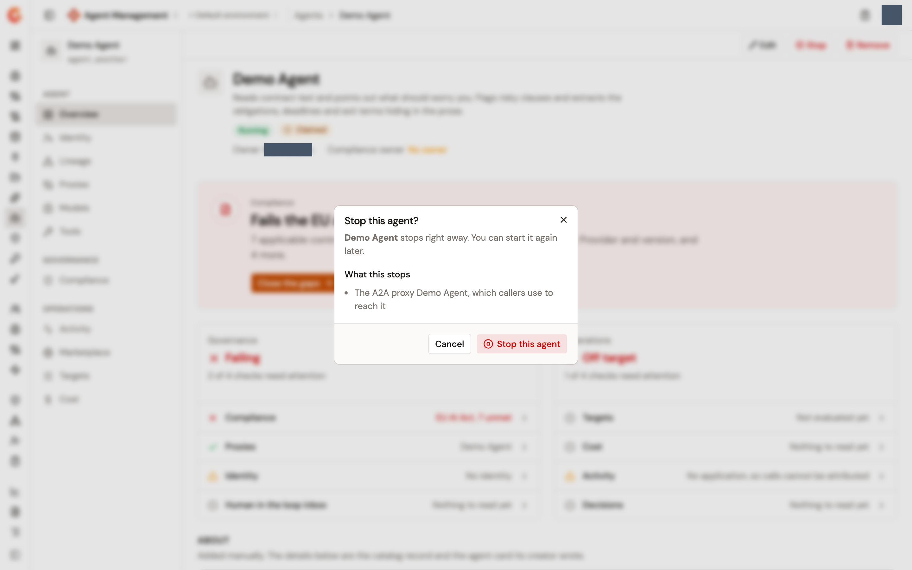
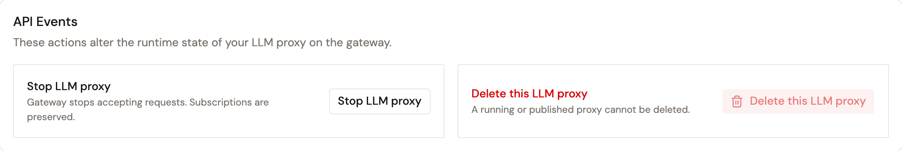

# Agent kill switch

Stopping an agent takes it out of service in one move. The **Stop** button on the agent's page stops the A2A Proxy that fronts it, pauses the accepted subscriptions of its gateway application, and, for an agent imported from an Azure AI Foundry project, asks Foundry to disable the agent where it runs. **Start** puts everything back. Stopping is reversible, and the dialog names everything the switch reaches before you confirm.

A proxy has a stop of its own on its **Configuration** page, which cuts the traffic that proxy carries whoever the consumer is. Both switches are covered here.

## What the agent switch reaches

The switch pulls up to three levers, and the **Stop this agent?** dialog lists the ones your agent has under **What this stops**, in the order they're pulled:

* **The A2A proxy &lt;name&gt;, which callers use to reach it**. This lever exists when an A2A Proxy fronts the agent and that proxy still exists. The proxy is stopped on the gateway, the same stop as on its own **Configuration** page, and a proxy that's already stopped is left as it is.
* **Its proxy subscriptions, through application &lt;id&gt;**. Every accepted subscription of the agent's gateway application is paused. A paused subscription reads **Paused** on the **Consumers** page of the proxy it was made on, and it's resumed, not recreated, when you start the agent again.
* **The agent itself, at its provider**. This lever exists for an agent imported from an Azure AI Foundry integration whose connection declares the project's agents endpoint. Gamma calls Foundry to disable the agent, and to enable it again on start. The line also reports the provider's own word for the agent's state in brackets, as of the last synchronization.

An agent with no A2A Proxy in front of it, no gateway application, and no controllable platform has nothing the switch can pull. The dialog then reads **Cannot stop this agent**, says that an A2A Proxy or an application is needed to block its calls, and offers **Go to Identity**, where the application is created.

The A2A Proxy is stopped whoever can see it, so the agent's callers are cut even when the proxy sits outside your own view. To stop a proxy on its own, for every agent and consumer it serves, use its page as described in [Stop a proxy](#stop-a-proxy).

## Stop an agent

1. From the Gamma console sidebar, select **Agent Management**.
2. In the **Catalog** section of the sidebar, select **Agents**.
3. Click the agent's name.
4. In the bar at the top of the agent's page, click **Stop**.
5. In the **Stop this agent?** dialog, read the **What this stops** list.
6. Click **Stop this agent**. The button reads **Stopping…** while the request runs.

The dialog states the consequence before you confirm: the agent stops right away, and you can start it again later.

<figure><figcaption>
The Stop this agent? dialog lists what the switch stops
</figcaption></figure>

Three outcomes are possible:

* **Agent stopped**. Every lever answered.
* **Agent only partly stopped. Check its provider and its subscriptions.** At least one lever failed. The levers are pulled in order, the proxy first, the subscriptions next, and the platform last, and the ones that answered stay pulled: a subscription that couldn't be paused doesn't stop the others from being paused, and a platform that refused the command leaves the proxy stopped and the subscriptions paused. The agent is still recorded as stopped, because the record is your intent, not a summary of what the levers did.
* **Could not stop the agent**. The request itself failed, and the message says why.

After a stop, the agent's header badge reads **Stopped**, and the **Gateway state** column of the **Agents** list reads **Stopped** too. The **Provider state** column carries the platform's own word, **Enabled** or **Disabled** for a Foundry agent, and can disagree with the gateway state for a while: Foundry applies the change after it acknowledges it, and the column is refreshed from the platform right after a successful command and at each synchronization.

The **Stop** button appears for users who can update the Catalog. It's absent from an agent that Edge Management detected, because the traffic of a detected domain bypasses the gateway.

## Start an agent

1. In the bar at the top of the agent's page, click **Start**.
2. In the **Start this agent?** dialog, read the **What this restarts** list.
3. Click **Start this agent**. The button reads **Starting…** while the request runs.

The levers are pulled in reverse: the platform is told first, the paused subscriptions are resumed next, including one somebody paused by hand, and the A2A Proxy is started last. An **Agent started** notification confirms the move. **Agent only partly started. Check its provider and its subscriptions.** reports a lever that failed, for example a fronting proxy with no published plan, which can't be started. **Could not start the agent** reports a request that failed. The header badge returns to **Running**.

## What the agent switch leaves in place

* **The gateway application and its subscriptions**. The subscriptions are paused, not closed, so nothing has to be approved again.
* **The agent's entry in the Catalog**. A stop isn't a removal. **Remove** in the same bar is the action that deletes the agent.
* **The LLM and MCP Proxies**. The proxies its subscriptions were made on keep running for every other consumer. The A2A Proxy that fronts the agent is the exception: it's stopped with the agent and started with it.

Only an agent published with an endpoint of its own can be disabled on Foundry. For any other agent, Foundry refuses the command, the platform lever fails, and the notification reads **Agent only partly stopped. Check its provider and its subscriptions.**

The agent switch writes no audit entry of its own. Each subscription it pauses or resumes is audited as a subscription event, and the A2A Proxy it stops or starts is audited like any proxy stop, as described in [Review a proxy stop or start](#review-a-proxy-stop-or-start).

## Stop a proxy

Stopping a proxy cuts off the traffic it carries. The gateway stops accepting requests for that proxy, and the subscriptions consumers hold are preserved, so a stop is reversible. The control works the same way for an LLM Proxy, an MCP Proxy, and an A2A Proxy.

1. In the module sidebar, click the list of proxies: **LLM Proxies**, **MCP Proxies**, or **A2A Proxies**.
2. Click the proxy you want to control.
3. In the **General** group of the proxy's sidebar, click **Configuration**.
4. Scroll to the **API Events** card. The card reads **These actions alter the runtime state of your LLM proxy on the gateway.**, with the type of proxy you opened.
5. Click the stop action. The button names the type of proxy, so it reads **Stop LLM proxy**, **Stop MCP proxy**, or **Stop A2A proxy**.

The button reads **Stopping…** while the request is in flight. The card states the effect of the action: **Gateway stops accepting requests. Subscriptions are preserved.** When the request completes, the **Status** row of the **Details** panel reads **Stopped**.


The stop action has no confirmation dialog. The proxy stops as soon as you click, and the change reaches the gateway without a separate deployment.


<figure><figcaption>
The API Events card of a started LLM Proxy
</figcaption></figure>

The **Details** panel on the right of the page is read-only. It lists **Owner**, **Created**, **Updated**, **Visibility**, **Lifecycle**, and **Status**, and the **Status** row reads either **Started** or **Stopped**.

## Restart a proxy

A stopped proxy is restarted from the same card. To restart it, follow these steps:

1. On the proxy's **Configuration** page, scroll to the **API Events** card.
2. Click the start action. The button reads **Start LLM proxy**, **Start MCP proxy**, or **Start A2A proxy**.

The button reads **Starting…** while the request is in flight. The card describes the effect as **Gateway starts accepting requests for this proxy.** When the request completes, the **Status** row reads **Started**.

## What a proxy stop leaves in place

* **Subscriptions**. Consumers keep the subscriptions they hold.
* **Plans and policies**. The configuration of the proxy is untouched.
* **The proxy itself**. A stop isn't a delete.

While a proxy is started, the delete action in the **API Events** card is unavailable and the card reads **A running or published proxy cannot be deleted.** Stop the proxy first if you intend to delete it.

## Review a proxy stop or start

Every proxy stop and start is recorded in the audit log of the proxy, under the event `API_UPDATED`. To review it, follow these steps:

1. In the **Monitoring** group of the proxy's sidebar, click **Audit Logs**.
2. Open the **Event** filter and select `API_UPDATED`.

The table lists **Date**, **Actor**, **Event**, and **Target** for each entry.

## Next steps

* [Manage a registered agent](../import/manage-a-registered-agent.md). Find the actions bar and the rest of the agent's page.
* [Manage subscriptions](../publish/manage-subscriptions.md). Act on one consumer's subscription instead of stopping the whole proxy.
* [Connect integrations](../import/connect-integrations.md). Connect the Azure AI Foundry project the platform lever depends on.
