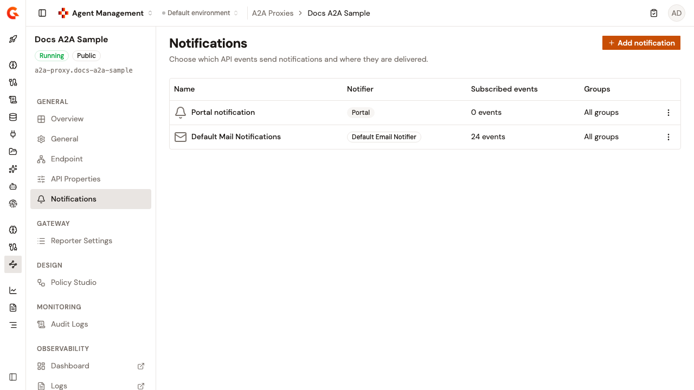

# Configure A2A Proxy notifications

The **Notifications** page controls which API events send notifications and where they are delivered. Each notification pairs a notifier with the set of events that trigger it.

To open the page, follow these steps:

1. Click **A2A Proxies** in the module sidebar.
2. Select your A2A Proxy.
3. Click **Notifications** in the A2A Proxy sidebar.

<figure><figcaption>
The Notifications page
</figcaption></figure>

The table lists each notification's **Name**, **Notifier**, **Subscribed events**, and **Groups** columns. An **Actions** column is added when you can edit or delete a notification.

Every A2A Proxy starts with a **Portal notification**, shown with the **Portal** notifier. Other rows show the notifier they use, such as **Default Email Notifier**. The **Subscribed events** column shows how many events trigger the notification. The **Groups** column shows **All groups** when no group is set, or the number of groups selected.

When nothing is configured, the table reads **No notifications are configured.** If the list can't be loaded, the page shows **Could not load notifications**, followed by the reason.

To create, edit, or delete notifications, you need the **API_NOTIFICATION** permission with the **CREATE**, **UPDATE**, or **DELETE** access level. The **Add notification** button appears only with the create permission, and the **Actions** menu offers only the entries your permissions allow. The **Portal notification** can be edited, but it can't be deleted.

## Add a notification

To add a notification, follow these steps:

1. Click **Add notification**.
2. Enter a **Name**.
3. Select a **Channel**. The list offers the notifiers configured for your organization, such as **Default Email Notifier**. The channel sets the target field: **Email list** for an email notifier, or **Webhook** for a webhook notifier.
4. Enter the target. Separate multiple email addresses with a space, a comma, or a semicolon. The field supports Expression Language.
5. For a webhook, optionally enable **Use system proxy** to route webhook calls through the gateway's configured system proxy.
6. Under **Events**, select the API events that send a notification. Events are grouped by category.
7. Click **Add notification**.

## Edit or delete a notification

To change a notification, open its **Actions** menu, and then click **Edit**. You can adjust its target and its selected events, and then click **Save**. The channel of an existing notification can't be changed. The form shows it as a read-only **Email** or **Webhook** badge.

The **Portal notification** is the only notification with a **Groups** section. When you edit it, you can limit it to selected groups. Only the primary owner can change them.

To delete a notification, open its **Actions** menu, and then click **Delete**. The **Delete this notification?** dialog warns that the notification stops receiving API event notifications, and that the action can't be undone. Click **Delete notification** to confirm.

## Verification

To verify a notification is working as expected, follow these steps:

1. Add a notification, select one or more events, and click **Add notification**.
2. The **Notifications** page reopens, and the new notification appears in the table with its notifier.
3. Confirm that the **Subscribed events** count matches the number of events you selected.
