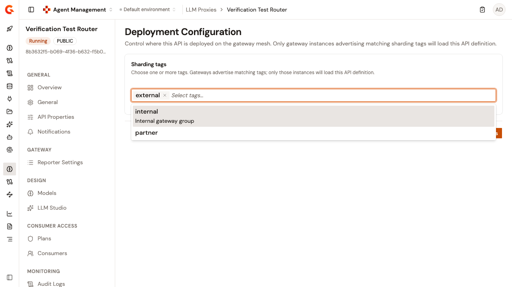

# Configure LLM Proxy deployment

The **Deployment Configuration** page controls where this LLM Proxy is deployed on the gateway mesh. Only gateway instances advertising matching sharding tags load its API definition.

To open the page, follow these steps:

1.  Click **LLM Proxies** in the module sidebar.
2.  Select your LLM Proxy.
3.  Under **Operations**, click **Deployment**.
4.  Click **Configuration**.

    <figure><figcaption>
The Deployment Configuration page
</figcaption></figure>

## Assign sharding tags

The **Sharding tags** card lists the tags defined for your organization. To assign them, follow these steps:

1. Open the tag list and select a tag. Each row shows the tag name and, when the tag has one, its description.
2. Repeat for each tag you want to assign. Every selected tag appears as a chip beneath the list.
3. Optional: to unassign a tag, click the remove control on its chip.
4.  Click **Save changes**, or **Discard** to revert.

The **Discard** and **Save changes** buttons appear only once your selection differs from the saved value. A successful save confirms with **Deployment configuration saved**.

When your organization has no tags, the card reads **No sharding tags configured**. Sharding tags are managed at the organization level, on the **Entrypoints & Sharding Tags** page in Platform Management.

An assigned tag that no longer appears in the organization list is still shown as a chip, labeled with its tag key, and it's preserved when you save.

If the tags can't be loaded, the card reads **Failed to load sharding tags. Please try again.**

To change sharding tags, you need the **API_DEFINITION** permission with the **UPDATE** access level. Without it, the tag list is disabled, the chips lose their remove control, and the card reads **You do not have permission to change sharding tags for this API.**


When the LLM Proxy is managed by the Gravitee Kubernetes Operator (GKO), the card shows **This API is managed by the Kubernetes operator. Sharding tags can only be changed from its source definition.**


## Verification

To verify the deployment configuration is working as expected, follow these steps:

1. Assign a sharding tag that one of your gateway instances advertises, and click **Save changes**.
2. Deploy the LLM Proxy.
3. Send a request through a gateway instance advertising the tag. The request is served. Gateway instances without a matching tag don't load the API definition.
