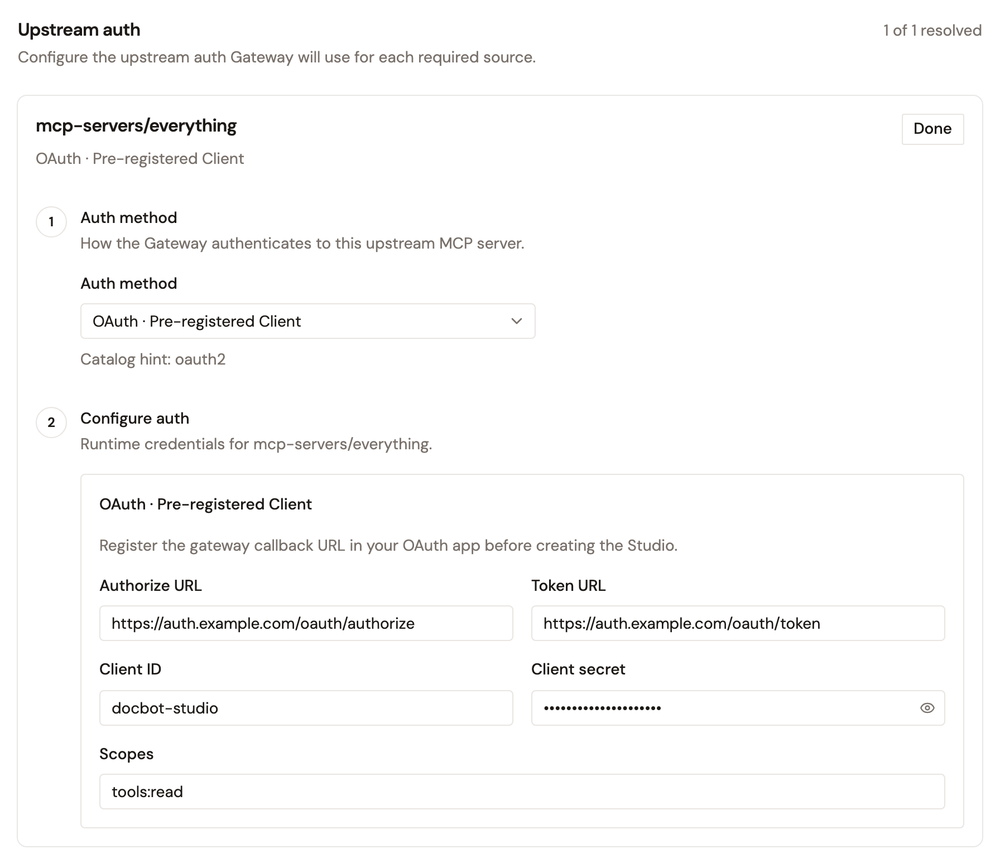

# Configure your MCP proxy

After creating an MCP Proxy, configure how it handles upstream authentication. These settings control how the proxy authenticates with upstream MCP servers on behalf of your users and agents.

## Upstream Authentication

Securing third-party MCP servers (HubSpot, Salesforce, GitHub, Slack, Jira) is one of the most important problems the MCP Proxy solves. The MCP Proxy handles authentication by injecting the necessary credentials before forwarding the request to the upstream server.

The MCP Proxy currently supports injecting static credentials into the request headers.

In an MCP Studio, a source can also use OAuth. For more information, see [Use OAuth for an MCP Studio source](#use-oauth-for-an-mcp-studio-source).

## Configure Upstream Authentication

1. Navigate to your MCP Proxy in the Gravitee console.
2. Open the **Upstream Authentication** section for the server.
3. Select an authentication method:
   * **Static credential**: Inject a static credential into a request header on every call.
   * **No upstream auth**: Call the upstream without injecting credentials (passthrough).
4. If you chose **Static credential**, select the **Credential type**:
   * **API key**: Enter the Header name (e.g., `x-api-key`) and the API key value.
   * **Bearer token**: Enter the token value (injected as `Authorization: Bearer <token>`).
   * **Basic auth**: Enter the Username and Password (injected as `Authorization: Basic <base64>`).
   * **Custom secret**: Enter a Custom Header name and the secret value.
5. Save your configuration.

## Use OAuth for an MCP Studio source

In an MCP Studio, a source can use the **OAuth · Pre-registered Client** auth method. Access to the source is then authorized through your OAuth provider, and the Gateway calls the source with the token that it receives.

1. In your OAuth provider, register the Gateway callback URL as a redirect URI of your OAuth app:

    ```
    https://<gateway-host>/<context-path>/.auth/callback
    ```

    `https://<gateway-host>` is the address that your MCP clients use to reach the Gateway, and `<context-path>` is the **Context path** of the MCP Studio. The Gateway sends this exact redirect URI from APIM 4.12.13.
2. When you create the MCP Studio, in the **Connect** step, open the **Auth method** list of the source, and then select **OAuth · Pre-registered Client**.
3. Enter the **Authorize URL** and **Token URL** of your OAuth provider, and the **Client ID** and **Client secret** of your OAuth app. Optionally, enter the **Scopes** to request.

    <figure><figcaption></figcaption></figure>

Until access is authorized, a call to a tool from the source returns a link to authorize it. To confirm the redirect URI that the Gateway sends, open that link, and then read the `redirect_uri` parameter in the address of your OAuth provider's page.

## Next steps

* [Add policies to your MCP server](add-policies-to-mcp-server.md) — Apply fine-grained authorization at the tool level.
* [Layered governance for MCP tools](govern-mcp-tool-access.md) — Combine authorization, rate limits, and response redaction on one server.
