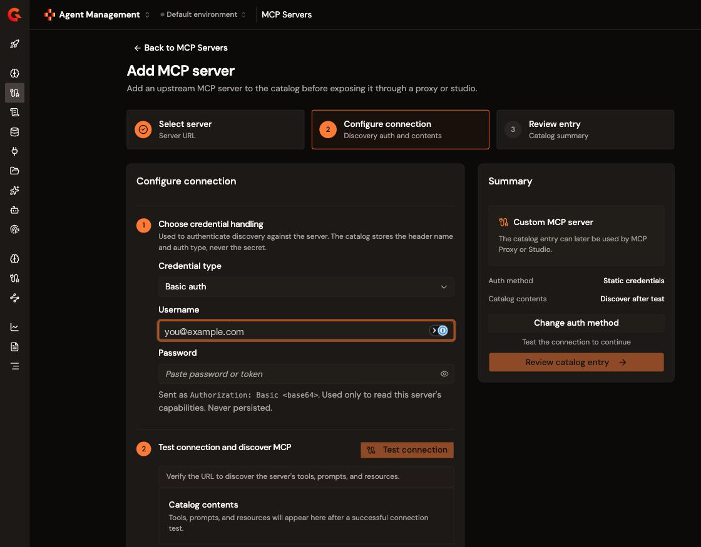
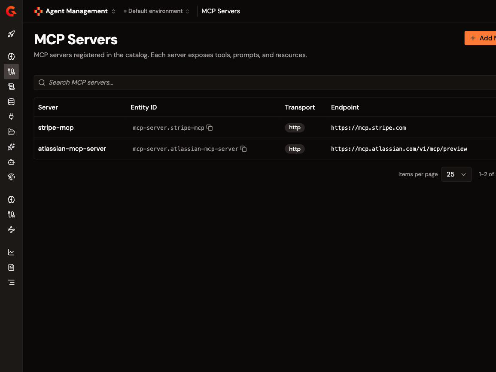
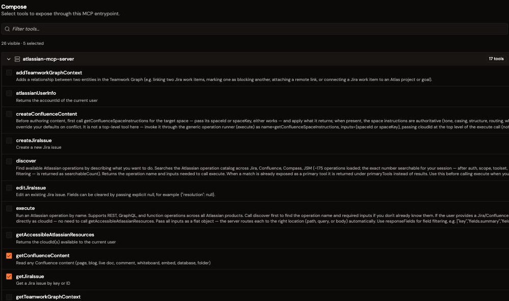
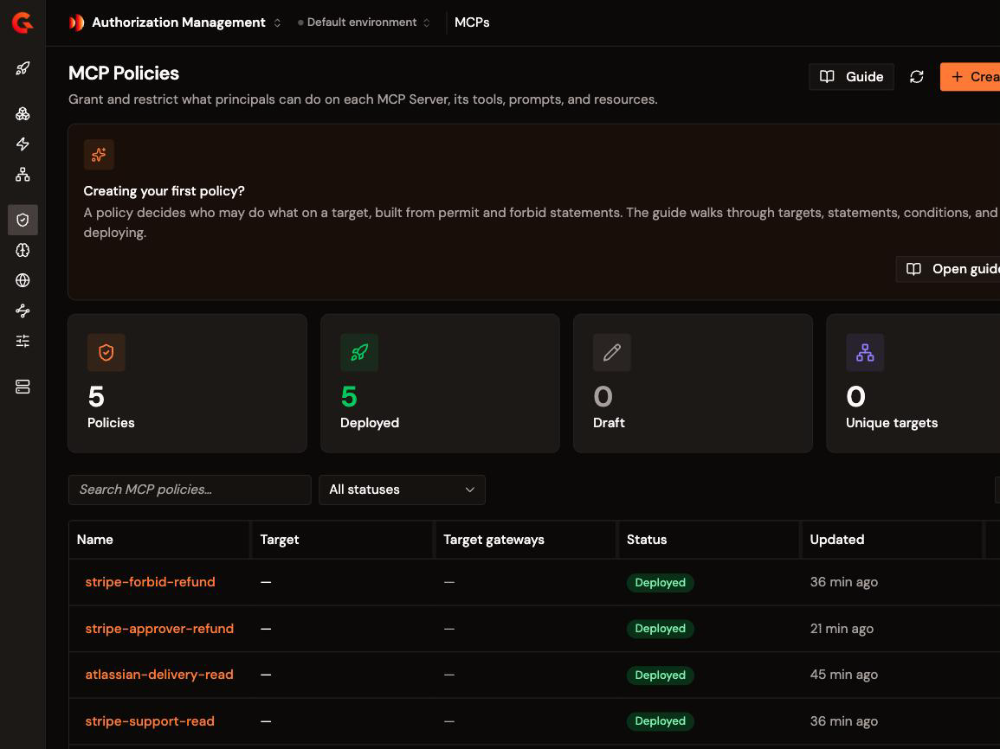

# Connect and secure the Atlassian MCP server

## Overview

* **Outcome.** Atlassian's MCP server is reachable through Gravitee as a curated Composite MCP Server. Its tools are protected by authentication and per-tool authorization. Its call volume is capped per caller, its responses are redacted, and every invocation is recorded against the identity that made it.
* **Use this when.** You want agents to reach Jira and Confluence through Gravitee rather than connecting to Atlassian's MCP server directly. The API token stays on the Gateway instead of being copied into every agent's configuration, and every tool call is authorized and audited against the caller's own identity.
* **Not covered here.**
  * [What the Atlassian MCP server does and which tools it exposes](https://support.atlassian.com/atlassian-rovo-mcp-server/docs/getting-started-with-the-atlassian-remote-mcp-server/)
  * [How Gravitee governs MCP servers](govern-mcp-tool-access.md "mention")
  * [Building the agent that calls these tools](../create-an-agent-identity.md "mention")

Atlassian's MCP server authenticates with an API token, and that token carries every permission its owner holds. An agent handed the token can read any issue the token can read and edit any issue it can edit. Atlassian records the activity as the token's owner rather than as the agent or the person who prompted it. Jira sharpens this, because issue descriptions and comments on a service desk project are text that people outside your organization can write. An agent reading them is reading instructions from strangers. Gravitee closes that exposure without changing the upstream server. The token is held once on the Gateway, and the tool surface is curated before any policy is written. Each call is then authorized, limited, redacted, and logged under the caller's identity.

## Prerequisites

Before you begin, ensure you have met the following requirements:

* Gravitee Gamma 4.12 or later, with Agent Management enabled.
* Permission to register catalog entities, create and deploy an MCP Proxy, and author Authorization Management policies in the environment you are configuring.
* An Atlassian Cloud site, and an API token created against Atlassian's **Rovo MCP V2** application, whose scope family covers the Jira and Confluence tools this guide composes. Tokens created against a different application authenticate and complete discovery, and then fail every Jira and Confluence call. Scopes cannot be changed after a token is created, so the application you choose at creation decides whether the integration works. For more information about Atlassian API tokens, go to [Atlassian's documentation](https://support.atlassian.com/atlassian-rovo-mcp-server/docs/configuring-authentication-via-api-token/).
* An identity provider that is configured in Gravitee and holds the groups that your authorization policies reference. For more information about configuring an identity provider, see [Configure your Access Management instance](../configure-your-access-management-instance.md "mention").
* If you are adding PII redaction on your environment, an AI Model Token Classification resource. For more information about AI resources, see [AI resources](../ai-resources.md "mention").


Agent Management and Authorization Management are licensed as separate packs. Without the `agent-management` and `authorization-management` packs, the module renders as a locked upgrade prompt rather than an error. That reads as though the feature is missing from your version. Contact your Gravitee account manager if either is unavailable.

Until you complete the authorization phase, any consumer holding a valid token for the server can invoke every tool you composed into it. That includes `transitionJiraIssue`, which moves an issue between statuses. Complete the authorization and policy phases before you publish the server to consumers.


## Connect and secure the Atlassian MCP server

To connect and secure the Atlassian MCP server, complete the following steps:

1. [Connect the Atlassian MCP server](#connect-the-atlassian-mcp-server)
2. [Expose the Atlassian tools as a Composite MCP Server](#expose-the-atlassian-tools-as-a-composite-mcp-server)
3. [Authenticate access to your deployed Atlassian MCP server](#authenticate-access-to-your-deployed-atlassian-mcp-server)
4. [Restrict Atlassian tool access with fine-grained authorization](#restrict-atlassian-tool-access-with-fine-grained-authorization)
5. [Apply policies to the Atlassian MCP server](#apply-policies-to-the-atlassian-mcp-server)
6. [Observe Atlassian MCP interactions](#observe-atlassian-mcp-interactions)

### Connect the Atlassian MCP server

When you register the server, Gravitee adds it to the Catalog with its tools. The Catalog entry is what makes those tools selectable in MCP Studio and available to authorization policies.

To connect the Atlassian MCP server, complete the following steps:

1. Sign in to the Gravitee console.
2. From the product navigation menu, select **Agent Management**.
3. Navigate to the **Import** section, and then select **MCP Servers**.
4. Select **+ Add MCP server**. The **Add MCP server** wizard opens.
5. In the **Endpoint URL** field, enter the following Atlassian MCP server endpoint:

   ```
   https://mcp.atlassian.com/v1/mcp/preview
   ```

   The **Transport** is fixed to **Streamable HTTP**.

    <figure><figcaption></figcaption></figure>

6. Select **Test connection**.
7. On the **Configure connection** step, select **Static credentials**, and then set the credential type to **Basic auth**. Enter the email address that owns the token as the username, and then enter the API token as the password. Discovery uses the credential to read the server's capabilities. It is stored on the Catalog entry and is not used for runtime traffic. Runtime traffic authenticates with the credential you set on the Composite MCP Server.
8. Select **Test connection** again to re-run discovery, and then on the **Review entry** step select **Save catalog entry**.


Atlassian publishes several MCP endpoints, and they do not expose the same tools. The preceding endpoint exposes the Jira and Confluence set this guide composes. Others expose only a small Teamwork Graph set. A reader following Atlassian's getting-started page can then authenticate successfully, see a server reporting healthy, and find none of the tools used here. The `/v1/sse` endpoint is retired.

This endpoint is Atlassian's early access MCP v2 and is explicitly subject to change, so treat what discovery returns as authoritative rather than assuming this list is current.



A token from the wrong Atlassian application authenticates, completes discovery, and returns the full tool list, and then fails on the first real tool call with an insufficient-scopes error. A successful connection and a populated tool list do not prove authorization, so confirm with a real tool call before you build on the Catalog entry.


#### Verification

To confirm that the Atlassian MCP server is connected, complete the following steps:

1. Navigate to the **Import** section, and then select **MCP Servers**.
2. Confirm that `atlassian-mcp-server` is listed, with the entity ID `mcp-server.atlassian-mcp-server`, the transport `http`, and the endpoint you entered.
3. Select the server to open its detail page, and then confirm the **Overview** card shows the protocol version, an **Auth type** of **Basic auth**, and a **Capabilities** row with a tool count.
4. Confirm that the tools you plan to compose appear under **Tools**. Treat the discovered list as authoritative for this endpoint, because Atlassian's documentation describes a different, finer-grained catalog for its other endpoints.

    <figure><figcaption></figcaption></figure>


Authorization policies reference tools by the server's slug, `atlassian-mcp-server`, and not by the entity ID shown alongside it. A resource written as `MCPTool::"mcp-server.atlassian-mcp-server.getjiraissue"` carries the entity-ID prefix, matches nothing, and is denied by default.


### Expose the Atlassian tools as a Composite MCP Server

Rather than proxying Atlassian's whole tool surface, use MCP Studio to compose a Composite MCP Server that exposes only the tools a role needs. Curation is the control that precedes all the others. A tool you never compose is a tool no policy has to defend against, and one an agent's model never sees in `tools/list`.

The following steps build a delivery triage toolbelt from five Atlassian tools: `searchJiraIssuesUsingJql`, `getJiraIssue`, `searchConfluence`, `getConfluenceContent`, and `transitionJiraIssue`.

To expose the Atlassian tools as a Composite MCP Server, complete the following steps:

1. From the **Agent Management** menu, navigate to **Secure**, and then select **MCP Proxies**.
2. Select **+ Create MCP proxy**, and then select **Studio mode**.
3. In the **General information** section, enter a **Name**, for example `atlassian-triage-toolbelt`, and a **Context path**, for example `/atlassian-triage-toolbelt`.
4. On the **Secure** page, select **Gravitee as Authorization Server**. To use an external identity provider, select **External Authorization Server** instead.


Fine-grained authorization requires OAuth2 with Gravitee as the authorization server. If Access Management is not configured in this environment, that option is unavailable and the only selectable method is API Key, which does not carry user identity. Every policy in this guide then evaluates against the same subject. Configure Access Management before you continue.


5. In the **Compose** step, select the Atlassian MCP server from the palette, and then select only the five tools listed at the start of this section.

    <figure><figcaption></figcaption></figure>

6. In the **Connect** step, select the Atlassian MCP server, set the credential type to **Basic auth**, and then enter the email address and API token. The Gateway injects the pair as an `Authorization` header on every upstream call. The token is held once rather than distributed to each agent.
7. In the **Review** step, confirm the composition, and then select **Create & deploy**.


Leave `execute` and `discover` out of the composition. `execute` is a dispatcher that runs any operation `discover` can find, so composing it re-exposes the tools you chose to leave out. Compose named tools only.



The credential on the Catalog entry authenticates discovery, and the credential on the Composite MCP Server authenticates traffic at runtime. Keep both current when you rotate the token. Update the Catalog entry, and then update the Composite MCP Server on the **Tools** page of the **Design** section. Select **Edit tools**, and then replace the credential on the **Connect** step. Updating one alone produces an upstream failure that looks identical to an authorization failure.


#### Verification

To confirm that the Atlassian tools are exposed, complete the following steps:

1. Send a `tools/list` request to the Composite MCP Server's endpoint:

   ```sh
   curl -s https://<gateway-host>/atlassian-triage-toolbelt \
     -H 'Content-Type: application/json' \
     -H 'Accept: application/json, text/event-stream' \
     -H "Authorization: Bearer $TOKEN" \
     -d '{"jsonrpc":"2.0","id":1,"method":"tools/list","params":{}}'
   ```

2. Confirm that the response lists only the five tools. The tools you did not compose are absent from this list rather than denied at call time. They never reach the agent, and the model behind it never has them as options.
3. Note that `tools/list` returns each tool under its composed name, for example `getJiraIssue`. Authorization policies reference the same tool under its server-qualified identifier, in the lowercased form `atlassian-mcp-server.getjiraissue`.

### Authenticate access to your deployed Atlassian MCP server


If you authenticated your Atlassian MCP server during the [Expose the Atlassian tools as a Composite MCP Server](#expose-the-atlassian-tools-as-a-composite-mcp-server) section, you can skip this section and go to [Restrict Atlassian tool access with fine-grained authorization](#restrict-atlassian-tool-access-with-fine-grained-authorization).


Authorization policies can only distinguish callers if the Gateway knows who each caller is. Authenticate the server against an authorization server rather than a shared key, so that each token resolves to a user or an agent identity.

To require authentication for the Atlassian MCP server, complete the following steps:

1. On an existing server, open the MCP Server, navigate to the **Consumer access** section, and then select **Plans**.


Do not select **Keyless** or **API Key** on a server you intend to govern per caller. Neither resolves a user identity, so every fine-grained authorization policy evaluates against the same subject.


2. Select **+ Create plan**, and then select **OAuth2**.
3. Configure and publish the plan, and then deploy the server.

#### Verification

To confirm that authentication to the Atlassian MCP server is enforced, complete the following steps:

1. Call the Atlassian MCP server without a token:

   ```sh
   curl -s -i https://<gateway-host>/atlassian-triage-toolbelt \
     -H 'Content-Type: application/json' \
     -d '{"jsonrpc":"2.0","id":1,"method":"tools/list","params":{}}'
   ```

2. You receive a response like the following:

   ```
   HTTP/1.1 401 Unauthorized
   WWW-Authenticate: Bearer resource_metadata="https://<gateway-host>/.well-known/oauth-protected-resource/atlassian-triage-toolbelt" scope="openid profile email offline_access searchJiraIssuesUsingJql getJiraIssue transitionJiraIssue searchConfluence getConfluenceContent"

   {"message":"Unauthorized","http_status_code":401}
   ```

3. Repeat the call with a valid access token.
4. Confirm that the response is `200` and lists the five composed tools.


The plan's required scopes are derived from the composition. Re-check them on the plan whenever you add or remove a tool, so that a client is not asked to request a scope it cannot use.

The scopes carry each tool's own casing, and the authorization policies in the next section use the lowercased form. These are two different layers, and the difference is expected.


### Restrict Atlassian tool access with fine-grained authorization

All authenticated callers can invoke all five tools, including the one that moves an issue. Fine-grained authorization narrows that per identity. When you enable fine-grained authorization, the Gateway adds the GAPL Authorization PEP to the server's `tools/call` flow. The Gateway then asks the in-gateway Policy Decision Point for a decision before it forwards anything upstream.

To restrict which tools each caller can use, complete the following steps:

1. Open your Composite MCP Server. On the **Overview** page, turn on **Enable FGA**. A confirmation panel reports that the Authorization PEP has been added to the Policy Studio.
2. From the product selector, open **Authorization Management**, navigate to the **Policy Management** section, and then select **MCPs**.
3. Select **+ Create policy**, enter a **Policy name**, and then switch to the **Code** tab.
4. Enter the policy. The following statement grants one delivery caller the four read tools:

   ```
   permit (
     principal == User::"<delivery-caller-id>",
     action,
     resource
   ) when {
     resource == MCPTool::"atlassian-mcp-server.getjiraissue" ||
     resource == MCPTool::"atlassian-mcp-server.searchjiraissuesusingjql" ||
     resource == MCPTool::"atlassian-mcp-server.getconfluencecontent" ||
     resource == MCPTool::"atlassian-mcp-server.searchconfluence"
   };
   ```

5. Select **Create and Deploy policy**.
6. Before you create the forbid statement, transition one issue directly against Atlassian with the upstream credential, to establish that the token can write. The later denial is then demonstrably the Gateway's rather than the upstream's.
7. Repeat steps 2 to 5 for the remaining statement. The following statement closes the one tool that writes, for the same caller:

   ```
   forbid (
     principal == User::"<delivery-caller-id>",
     action,
     resource == MCPTool::"atlassian-mcp-server.transitionjiraissue"
   );
   ```

The Gateway loads a deployed policy without a restart, typically within a minute.


These statements name a single caller. Enabling fine-grained authorization sets the Authorization PEP's subject type to `User`, so the Policy Decision Point receives the caller as `User::"<id>"`. Take the identifier from the decision log, which records `subject=User::"..."` for every call it evaluates.

To write `principal in Group::"..."` instead, the Policy Decision Point has to know the group memberships. Sync your identity provider's groups into Authorization Management as entities and set the subject type to match. A group statement evaluated against an empty entity store matches nothing, which denies a `permit` and silently disables a `forbid`.


<figure><figcaption></figcaption></figure>


Write the tool name in lowercase in the resource identifier. The console, the Catalog, and `tools/list` show each tool's own casing, and the policy engine evaluates the lowercased form.

A mistyped resource fails in opposite directions depending on the statement. In a `permit` statement it fails closed, because nothing matches and the call is denied. In a `forbid` statement it fails open, because the statement never matches and any broader `permit` still applies. Confirm every `forbid` statement by making the call and reading the decision in the log, rather than by reading the policy back.



A tool that no policy permits is denied. Nothing is allowed by omission, so a role scoped to two read tools needs no forbid statement to be closed to the rest. A `forbid` statement always beats a `permit`, so a later broad grant cannot reopen `transitionJiraIssue`.

Every entity reference is an identifier, not a display name. `principal` takes the group's identifier, and `resource` takes the server-qualified tool identifier. For more information about layered governance for MCP tools, see [Govern MCP tool access](govern-mcp-tool-access.md "mention").


#### Verification

To confirm that Atlassian tool access is restricted, complete the following steps:

1. As a caller in the delivery group, call `getJiraIssue`:

   ```sh
   curl -s https://<gateway-host>/atlassian-triage-toolbelt \
     -H 'Content-Type: application/json' \
     -H 'Accept: application/json, text/event-stream' \
     -H "Authorization: Bearer $DELIVERY_TOKEN" \
     -d '{"jsonrpc":"2.0","id":2,"method":"tools/call","params":{"name":"getJiraIssue",
          "arguments":{"cloudId":"<cloud-id>","issueIdOrKey":"<issue-key>"}}}'
   ```

2. Confirm that the call succeeds and returns the issue.
3. As the same caller, call `transitionJiraIssue`.
4. Confirm that the response is `403`, and that the issue has not moved. The decision runs in the request phase, so the Gateway denies the call before it reaches Atlassian.


Jira tools require a `cloudId` argument. If you omit it, the call returns a connection-settings error that reads like a permissions failure and is not. Retrieve the value with `getAccessibleAtlassianResources`. That tool may sit in a different scope family from the Jira tools, in which case the token that calls your Jira tools cannot list your resources. Confirm which token can retrieve the `cloudId` before you rely on it.

`searchJiraIssuesUsingJql` rejects unbounded queries, so any JQL you test with needs a real restriction in it.

A permitted call can return `403` from Atlassian rather than from the Gateway, for example `error 1010 browser_signature_banned`. In that case, add a **Transform Headers** policy to the `tools/call` request phase that sets an identifying `User-Agent`. Atlassian's edge rejects some default agents, and the resulting `403` is indistinguishable from an authorization failure at the client.



Read the tool result as well as the HTTP status. A call that reaches Atlassian and is rejected there is still a successful call at the transport level, so the result tells you which layer answered.


### Apply policies to the Atlassian MCP server

Authorization decides which tools a caller reaches, not how often it calls them or what comes back. An agent iterating over JQL results can exhaust a shared Atlassian allowance while staying inside its permissions. A permitted read of an issue returns reporter names and any contact details pasted into a description. Add a rate limit and a redaction policy on the `tools/call` flow to close both.

To apply policies to the Atlassian MCP server, complete the following steps:

1. Open your Composite MCP Server, navigate to the **Design** section, and then select **Policy Studio**.
2. Navigate to the **MCP method flows** section, add a flow, enter a **Flow name**, select the **`tools/call`** method, and then select **Create**. If you enabled FGA, this flow already exists, with the Authorization PEP already in the request phase.
3. In the flow's **Request phase**, select **+** to open the policy catalog, and then select **Rate Limit**.
4. Configure the limit using the following settings:
   * Set **Max requests (static)** to the number of calls allowed, for example `5`.
   * Set **Static time duration** and **Static time unit** to the window, for example `60` and `SECONDS`. The window is two fields rather than one.
   * Set **Key** to `{#context.attributes['user']}` so that each identity draws on its own allowance rather than on a shared plan counter.
   * Enable **Add response headers** so that responses carry `X-Rate-Limit-Limit`, `X-Rate-Limit-Remaining`, and `X-Rate-Limit-Reset`.
   * Set **Error strategy** to block on internal error where the limit is a control rather than a courtesy.
5. Add the **PII Filtering** policy to the same request phase. In **AI Resource**, select the AI Model Token Classification resource from the prerequisites. In **PII Categories**, select the categories to redact, for example person, email, phone, location, financial account, and government ID. Leave **Confidence Threshold** at the default of `0.5`. The policy runs in the request phase and still filters the response payload, which is what redacts the tool result on the way back.
6. Select **Save**, and then deploy the server.


To limit one tool rather than the whole server, add a **Condition** to the flow that matches the tool name, for example `{#context.attributes['mcp_tool_name'] == 'searchJiraIssuesUsingJql'}`. A tight limit scoped to the tool an iterating agent calls most caps it without constraining the rest. For more information, see [Apply policies to tool invocations](apply-policies-to-tool-invocations.md "mention").



PII Filtering fails the call rather than passing the payload through if no AI Model Token Classification resource is selected. Categories are a required setting with no default. A higher confidence threshold redacts less and risks letting data through. A lower threshold redacts more and risks removing the content that made the response useful.

The two policies default in opposite directions on failure. The authorization policy denies when it has no policy snapshot. The rate limit policy accepts requests when its store is unavailable, which is why step 4 sets its error strategy explicitly.



Policy order decides who pays for denied traffic. With the Authorization PEP ahead of the rate limit, a forbidden caller is rejected before consuming any allowance. Place the rate limit first instead if your goal is to throttle abusive callers rather than to protect the allowance of legitimate ones. Neither order is automatically correct.


#### Verification

To confirm that the policies are applied to the Atlassian MCP server, complete the following steps:

1. As the same caller, call `getJiraIssue` six times within 60 seconds.
2. Confirm that the sixth call returns `429` and carries the `X-Rate-Limit-Limit`, `X-Rate-Limit-Remaining`, and `X-Rate-Limit-Reset` headers, and that a second caller's first call still succeeds.
3. Using the upstream credential, read an issue whose description contains a name and an email address directly from Atlassian.
4. Read the same issue through the Composite MCP Server.
5. Confirm that the name and the email address are present in the first response and replaced with `[REDACTED]` in the second.


To confirm redaction, compare a direct upstream read against a read through the Gateway. Detection is probabilistic, so treat redaction as a depth control rather than as the only control for a field you already know is sensitive.

Redaction replaces each detected value with a marker, so a redacted field can carry a string where the upstream sent another type. Test your agent against redacted responses as well as against the upstream shape.


### Observe Atlassian MCP interactions

A tool call through the Gateway has two legs. The **entrypoint** leg is the agent's call to the Composite MCP Server, and the **endpoint** leg is the Gateway's call to Atlassian. Both legs together turn a tool call into an auditable event, because each leg answers a different question:

| Leg | What it records | What it answers |
| --- | --- | --- |
| Entrypoint request | The inbound call: headers, the caller's credential, the session, and the timestamp | Which identity called, and when |
| Endpoint request | The outbound JSON-RPC call to Atlassian, including the tool name and its arguments | Which tool ran, against which issue, with which arguments |
| Endpoint response | The payload Atlassian returned | What the upstream actually sent back |
| Entrypoint response | The payload the agent received | What reached the model after policies ran |

To observe Atlassian MCP interactions, complete the following steps:

1. Open your Composite MCP Server, navigate to the **Gateway** section, and then select **Reporter Settings**.
2. In the **Settings** card, enable the reporter, navigate to **Logging mode**, and then enable both **Entrypoint** and **Endpoint** so that the inbound client-to-gateway leg and the outbound gateway-to-upstream leg are both captured.
3. Enable both the **Request** and **Response** phases, and then enable the **Headers** and **Payload** content data so tool arguments and tool responses are recorded rather than only their metadata.
4. In the **OpenTelemetry** card, enable **Trace enabled** to emit execution spans for each call. Enable **OTel Logs** to emit the request and response payloads as OpenTelemetry log records correlated to the active trace. Enable **Verbose** only while debugging a specific call, because it adds headers, context attributes, and policy execution detail to every span.
5. With **Trace enabled** and **Verbose** both on, a **Span Attribute Redaction** section appears. Add a rule for each attribute that carries a credential or an identifier you do not want exported.
6. Select **Save changes**.
7. Navigate to the **Design** section, select **Policy Studio**, open the `tools/call` flow, and then select **Gravitee Authorization PEP (GAPL)**. Confirm that **Log every decision (SLF4J)** is enabled, and then deploy the server. Each evaluated call then writes a line to the Gateway's log output recording the subject, the action, the resource, the decision, and the matched policy. A denial carrying the reason `No applicable policy` means that nothing matched at all, which is default deny rather than your forbid statement.


Atlassian's MCP server streams its responses, and on this build the endpoint leg recorded the payload before response policies ran. A permitted `getJiraIssue` logged 520 bytes on the endpoint leg carrying the reporter's email address in clear, against 496 bytes on the entrypoint leg carrying `[REDACTED]`. Redacting a response therefore does not keep personal data out of your log store. Restrict payload logging, or restrict access to the log store, wherever the payload is sensitive.

Payload logging records the arguments an agent sends and the content a tool returns, which is the data you most want to review and also the data most likely to be sensitive. Enable it deliberately, pair it with span attribute redaction, and keep verbose tracing on only for as long as you are debugging.


To review the calls, open your Composite MCP Server, and then under **Observability** select **Logs**. Each row records the timestamp, the MCP method, the status, the response time, and whether the endpoint was reached. Filter by **MCP methods** to isolate `tools/call`.

For the OpenTelemetry span view, see [Inspect your agent log](../../observe/inspect-your-agent-log.md "mention").

#### Verification

To confirm that Atlassian MCP interactions are recorded, complete the following steps:

1. As a permitted caller, call `getJiraIssue` on an issue whose description contains an email address.
2. Open the log entry for that call. Navigate to the **Request** page of the **Details** section, and then confirm that the **Consumer** column records the inbound call to your context path and that the **Gateway** column records the outbound call to Atlassian, with a body carrying the tool name and its arguments.
3. On the **Response** page of the **Details** section, confirm that the endpoint response leg carries the email address in clear and that the entrypoint response leg carries `[REDACTED]`. That difference is the streaming behavior described in the preceding warning. A server that returns a single JSON body records both legs after redaction instead, so treat the comparison as a property of this upstream rather than as a general check.
4. As a caller that the policy forbids, call `transitionJiraIssue`.
5. In the log list, confirm that the denied call is recorded with a `403` status and an empty **Endpoint reached** column, while the permitted call shows a check mark. An unreached endpoint is the evidence that Atlassian was never called.
6. Confirm that the decision log records the subject, the resource, and a `FORBID` decision naming the policy that denied it.


A `tools/list` or `initialize` call is answered from the composition rather than forwarded upstream, so those entries also show no endpoint reached. An unreached endpoint means the Gateway answered or denied the call itself.


A shared upstream token cannot produce any of this on Atlassian's side, because Atlassian attributes every call to the token's owner. The per-caller record exists only because the Gateway sits between the agent and the tool.

## Verification

To confirm that the Atlassian MCP server is connected and secured, complete the following steps:

1. Connect an agent to the Composite MCP Server using a token for an identity in the delivery group.
2. Prompt the agent to summarize the open issues on a project and to read the one it considers most urgent.
3. Confirm that the agent completes the action, and that any personal data in the issue is redacted in what the agent received.
4. Prompt the agent to move that issue to another status.
5. Confirm that the agent reports that the action is not permitted, and that the issue has not moved.
6. Open the agent log.
7. Confirm that both interactions appear, one allowed and one denied, each attributed to the agent's own identity.

Step 5 is the result worth keeping. The agent held a valid token, and the upstream credential on the Gateway could move the issue. The transition still did not happen, because the identity making the call was not permitted to make it. That containment holds whether the agent was asked to move the issue by its operator or by the issue description it just read. That matters when anyone outside your organization can write that description.

## Extend your Atlassian MCP setup

Consider the following refinements once your governed Atlassian MCP server is working:

* **Reference the agent, not only the user.** Create an agent identity so policies can name the agent making the call as a principal, and grant an autonomous agent less than the person who runs it. For more information about creating an agent identity, see [Create an agent identity](../create-an-agent-identity.md "mention").
* **Add conditions to write access.** Constrain `transitionJiraIssue` with a condition, for example a business-hours window or a corporate IP range, so an unexpected transition is denied rather than reviewed after the fact.
* **Compose per role rather than per upstream.** A triage role governed by a forbid statement on a five-tool server is weaker than a triage role given a four-tool server. Curation removes the tool from `tools/list` as well as from the permitted set.
* **Add a longer-period allowance.** A per-minute rate limit does not bound a day. Add the Quota policy for allowances measured over longer periods, and Spike Arrest to smooth bursts.
* **Sync principals from your identity provider.** Connect a SCIM-compatible tenant so groups referenced in policies stay current as people join and leave teams.
* **Rotate the upstream token in both places.** The Gateway holds one credential for every caller. When you rotate it, update the Catalog entry and the Composite MCP Server together, because updating one alone fails in a way that looks like an authorization problem.

## Next steps

* [Layered governance for MCP tools](govern-mcp-tool-access.md "mention")
* [Add policies to your MCP server](add-policies-to-mcp-server.md "mention")
* [Apply policies to individual tool invocations](apply-policies-to-tool-invocations.md "mention")
* [Inspect your agent log](../../observe/inspect-your-agent-log.md "mention")
* [Monitor your MCP servers](../../observe/monitor-your-mcp-servers.md "mention")
