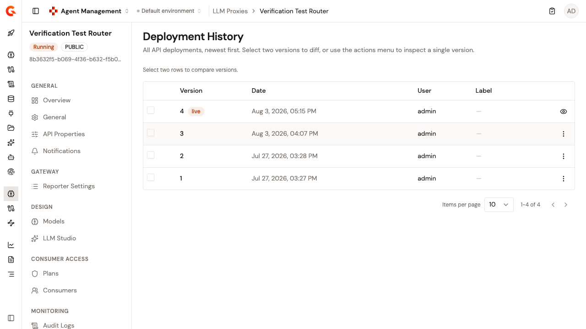

# Review LLM Proxy deployment history

The **Deployment History** page lists all deployments of this LLM Proxy, newest first. You can inspect a single version, compare two versions, and roll back to an earlier one.

To open the page, follow these steps:

1.  Click **LLM Proxies** in the module sidebar.
2.  Select your LLM Proxy.
3.  Under **Operations**, click **Deployment**.
4.  Click **History**.

    <figure><figcaption>
The Deployment History page
</figcaption></figure>

The table lists each deployment's **Version**, **Date**, **User**, and **Label** columns. The most recent deployment carries the **live** badge. The label is the optional deployment label entered when the LLM Proxy was deployed. Before the first deployment, the page reads **No deployments yet**, with the description **Deployment records will appear here after the first publish.**

If the history can't be loaded, the page reads **Failed to load deployment history. Please try again.**

Use **Items per page** to show 10, 25, 50, or 100 entries per page. Changing the page size returns you to page 1.

## Inspect a single version

To view the API definition a deployment shipped, click **View definition** in the row's actions. The live version exposes **View definition** directly. Every other row offers it in the actions menu.

## Compare two versions

Select the checkboxes of two versions. The toolbar tracks the selection, and once two versions are selected, the diff view opens.

Until you make a selection, the toolbar reads **Select two rows to compare versions.** After one selection it reads **1 version selected — select one more to compare.**, and after two, **2 versions selected — diff view is open below.** Once two are selected, the remaining checkboxes are disabled. To reset the selection, click **Clear** in the toolbar.

To compare an earlier version against the live one in a single step, click **Compare with live** in that row's actions menu.

The diff dialog shows the differences between the two definitions, with **Side-by-side** and **Line-by-line** view modes. The panes are labeled **Before** and **After**, and **Before** holds the first of the two versions you selected.

## Roll back to an earlier version

To roll back, follow these steps:

1. Open the target version, either by selecting two versions to open the diff view or by clicking **View definition** on a single version.
2.  Click **Rollback**, which names the target version.
3. Confirm in the rollback dialog, which names the target version.

The rollback restores the LLM Proxy's API definition and its plans to the selected version.


The rollback doesn't deploy the LLM Proxy. The restored definition is saved, and the LLM Proxy is left with undeployed changes until you deploy it. The confirmation dialog describes the action as redeploying to the gateway, but no deployment takes place. The action can't be undone.


If the rollback fails, a card stays on screen reading **Rollback failed**, followed by the reason.

The rollback controls are hidden unless you have the **API_DEFINITION** permission with the **UPDATE** access level.

## Verification

To verify the deployment history is working as expected, follow these steps:

1. Deploy the LLM Proxy twice with different configurations, and give each deployment a label.
2. Open the **Deployment History** page. Both deployments appear with their labels, and the newest one carries the **live** badge.
3.  Select both versions. The diff view shows the configuration change.
