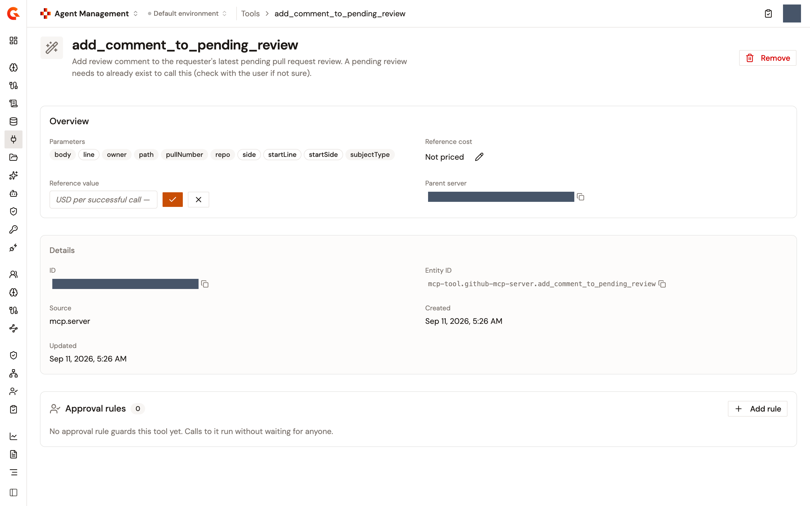
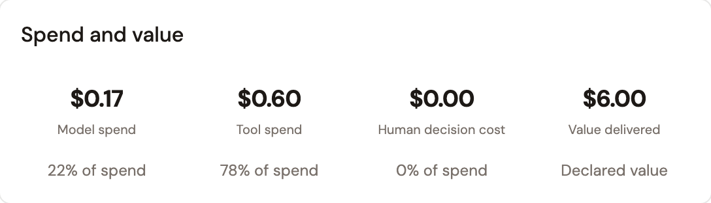

# Attribute business value to agent runs

## Overview

Counting tokens shows what an agent run cost. It doesn't show what the spend bought. Value attribution adds the other half of the ledger: the business owner of an MCP tool declares what one successful call of it is worth, and the platform credits that value to the agent's successful calls, next to what they cost.

The value is declared, not measured, and the tile that shows it is labelled as declared.

## Declare the value of an MCP tool

A tool's value is a **Reference value** in US dollars per successful call, set inline on the tool's page in the Catalog. For a tool that settles a claim, that value is the handling cost a human would otherwise incur. It's independent of the tool's **Reference cost**: a tool can carry either, both, or neither.

1. From the Gamma console sidebar, select **Agent Management**.
2. In the **Catalog** section of the sidebar, select **Tools**.
3. Click the tool's name.
4. Next to **Reference value**, click the edit button, enter the amount in US dollars per successful call, and save. Leave the field blank to declare no value. A negative amount is refused.

A tool with no declared value reads **No declared value**. The notification that confirms the change says when it takes effect: the value applies on the next deployment of the MCP servers that use the tool. Saving a changed value rewrites the value book of every MCP Studio proxy that references the tool, and each proxy picks it up when you deploy it next.

<figure><figcaption>
The Reference value row on an MCP tool's page, in edit mode
</figcaption></figure>

## Read the value an agent delivered

The value credited to an agent's successful tool calls shows in two places, both scoped to the agent's gateway application:

* On the agent's **Cost** page, the **Spend and value** card carries a **Value delivered** tile next to **Model spend**, **Tool spend**, and **Human decision cost**. The tile is marked **Declared value**.
* On the **Agent — Overview** dashboard, **Total Tool Value** in the **Key Metrics** and **Value Over Time (USD)** chart the same figure over the selected range. The chart counts credited calls only.

See [Read what an agent cost](read-what-an-agent-cost.md) for the rest of both screens.

<figure><figcaption>
The Spend and value card of an agent's Cost page
</figcaption></figure>

## Next steps

* [Agent FinOps](agent-finops.md). Set the prices the cost half of the ledger is built from.
* [Read what an agent cost](read-what-an-agent-cost.md). Read value against spend for one agent.
