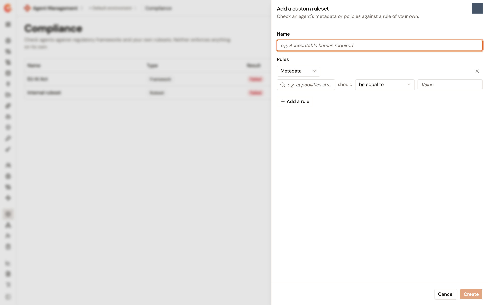
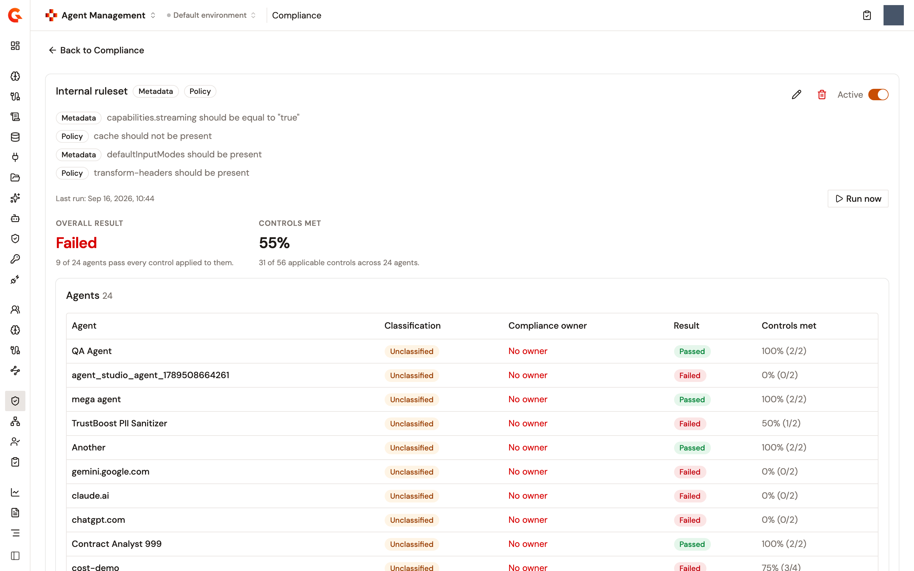

# Create a custom compliance ruleset

A custom ruleset checks an agent's metadata or the policies on the proxies it depends on against rules of your own. It's listed on the **Compliance** page beside the built-in frameworks, with the type **Ruleset**. Once it's active, it appears on every agent's **Compliance** page with that agent's verdict. Like a framework, a ruleset measures and doesn't enforce.

## Create a ruleset

1. From the Gamma console sidebar, select **Agent Management**.
2. In the **Govern** section of the sidebar, select **Compliance**.
3. Click **Add a custom ruleset**.
4. Enter a **Name**.
5. Under **Rules**, define the first rule. Pick its type, **Metadata** or **Policy**, and then fill in the rule as described in the next section.
6. To add another rule, click **Add a rule**. A ruleset needs at least one.
7. Click **Create**.

A **&lt;name&gt; created** notification appears and the ruleset is listed on the **Compliance** page.

<figure><figcaption>
The Add a custom ruleset panel
</figcaption></figure>

### What a rule reads

A **Metadata** rule names a **Metadata field** and what it should be. The field picker lists the fields the agents of the environment already carry, and a field that doesn't match any of them is used as typed. A name that starts with `metadata.` reads a metadata key recorded on the agent, for example `metadata.compliance.accountableHuman`. Any other name is a path into the agent's definition, for example `capabilities.streaming`. When the field holds a list, the rule is met as soon as one element meets it, except **be different from**, which every element must meet.

<table>
    <thead>
        <tr>
            <th width="220">The field should…</th>
            <th>Met when</th>
        </tr>
    </thead>
    <tbody>
        <tr>
            <td><strong>be equal to</strong></td>
            <td>The field holds exactly the <strong>Value</strong>.</td>
        </tr>
        <tr>
            <td><strong>be different from</strong></td>
            <td>The field holds anything other than the <strong>Value</strong>.</td>
        </tr>
        <tr>
            <td><strong>start with</strong></td>
            <td>The field starts with the <strong>Value</strong>.</td>
        </tr>
        <tr>
            <td><strong>end with</strong></td>
            <td>The field ends with the <strong>Value</strong>.</td>
        </tr>
        <tr>
            <td><strong>contain</strong></td>
            <td>The field contains the <strong>Value</strong>.</td>
        </tr>
        <tr>
            <td><strong>be present</strong></td>
            <td>The field is set. No <strong>Value</strong> is asked for.</td>
        </tr>
        <tr>
            <td><strong>not be present</strong></td>
            <td>The field isn't set. No <strong>Value</strong> is asked for.</td>
        </tr>
    </tbody>
</table>

A **Policy** rule names a **Policy** picked from the list of policies and asks that it **be present** or **not be present**. The rule is read on every proxy the agent's lineage links to it through its application, and it's met only when every one of those proxies answers it. An agent with no proxy has nothing for a policy rule to read, so the rule is left out of that agent's verdict.

## Run the ruleset

A ruleset is scored when you run it, and the last run is what its page and the agents' pages show.

1. On the **Compliance** page, click the ruleset's name.
2. Click **Run now**.

A **&lt;name&gt;: &lt;n&gt;/&lt;m&gt; agents passed** notification appears, and the card reads **Last run** with the time. Before the first run it reads **Never run**. The **Agents** table lists every agent that was scored with its **Classification**, **Compliance owner** (**No owner** until one is named), **Result**, and **Controls met**. **Close the gaps** lists the rules that are open, with **Answered on the agent's page.** for a metadata rule and **Enforced by a policy on the proxies this agent depends on.** for a policy rule.

Turn on the **Active** switch to list the ruleset on every agent's **Compliance** page. There, the agent's row opens the detail with each **Rule** and whether it's **Met**, a **Result** tile, and a **Run now** button that runs the whole ruleset again.

**Export evidence for an auditor** opens the same kind of evidence page a framework offers, generated from the last run.

<figure><figcaption>
A custom ruleset's page after a run
</figcaption></figure>

## Edit or delete a ruleset

To edit, click the edit icon on the ruleset's card, change the name or the rules in the **Edit &lt;name&gt;** panel, and click **Save**. A **&lt;name&gt; updated** notification appears.

To delete, click the delete icon, and in the **Delete &lt;name&gt;?** dialog click **Delete**. The ruleset and every run recorded for it are removed, and the deletion can't be undone.

## Next steps

* [Score agent compliance with the EU AI Act framework](score-agent-compliance-with-the-eu-ai-act.md). The built-in framework listed beside your rulesets.
* [Rate an agent's risk level](rate-an-agents-risk-level.md). The rating the run tables show.
