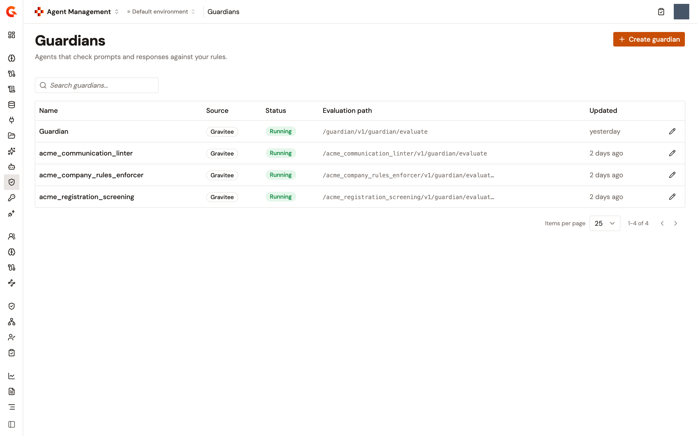
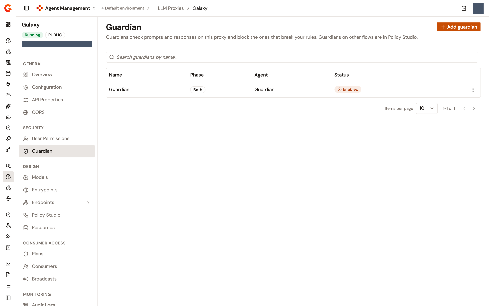

# Screen prompts and answers with Guardian Agents

A Guardian Agent is an agent that evaluates a prompt or an answer before it travels on. Bound to an LLM Proxy, it's handed what the caller sends, what the model answered, or both, and the AI Gateway refuses the exchange when the guardian says so, answering the caller itself rather than letting the model answer.

Guardians are agents of your environment that expose a guardian entrypoint. They're built in the agent builder, listed under **Guardians** in the Catalog, and bound to an LLM Proxy from the proxy's **Guardian** page. Only an LLM Proxy takes a guardian.

## How a guardian screens an exchange

Binding a guardian adds a step of the **AI Guardian** policy to the **Prompt** flow of the proxy, one in each phase the guardian screens, and declares the guardian agent as a resource of the proxy under the guardian's name. The step hands the exchange to that resource and acts on the verdict.

* In the request phase, the guardian is shown what the caller just sent, its prompt or the tool result it hands back. A refusal means the model is never called.
* In the response phase, the guardian is shown what the model answered. A refusal replaces the answer before the caller reads it, and the model isn't asked again.
* The tool calls an answer carries are screened by name and arguments, beside the text. A refused answer loses the tool calls it carried.
* A streamed answer is screened block by block. Frames are held, the answer is submitted whenever the model closes a block, and what was held is released once a verdict allows it, so the caller reads the stream a block at a time.
* The tool definitions offered to the model, and anything that isn't text, such as an image or a file the caller attaches, aren't screened.

A refused exchange reaches the caller as an ordinary assistant message with a `200` status, not an error, so an agent SDK reads the refusal instead of retrying. The message is what the guardian wrote about what it found. A **Refusal message** set on the step in the Policy Studio overrides it.

A guardian can conclude more than let it through or refuse:

<table>
    <thead>
        <tr>
            <th width="180">Verdict</th>
            <th>What the gateway does</th>
        </tr>
    </thead>
    <tbody>
        <tr>
            <td>Let it through</td>
            <td>The exchange is carried untouched. When the guardian found something worth recording but nothing to act on, the finding goes to the decision record only.</td>
        </tr>
        <tr>
            <td>Refuse</td>
            <td>None of it is carried. The caller reads the refusal.</td>
        </tr>
        <tr>
            <td>Rewrite</td>
            <td>The guardian's rewriting is carried in place of what was screened: a prompt before the model reads it, or an answer that arrived whole. A turn that carries tool calls is refused instead, and a streamed answer is carried as the model wrote it and recorded as a control that didn't apply.</td>
        </tr>
        <tr>
            <td>Ask for a human</td>
            <td>Nothing in a model call can wait for a person, so the exchange is refused, and the record says separately that an approval was needed and that the gateway denied it. The call isn't handed to the HITL inbox.</td>
        </tr>
    </tbody>
</table>


At version 1.0.0-beta.1 of the AI Guardian policy, a guardian that can't be reached, times out, or names a resource the gateway doesn't have lets the exchange through, and the record says that nothing was concluded. That version reads neither the **Fail mode** nor the **Dry run** setting of the **Add guardian** sheet.


Every decision is written down as a decision event that the gateway's reporters index: what the guardian concluded and, separately, what the gateway did about it, one record for the prompt and one for the answer. See [Where a guardian's decisions show](#where-a-guardians-decisions-show).

## Find the guardians of your environment

1. From the Gamma console sidebar, select **Agent Management**.
2. In the **Catalog** section of the sidebar, select **Guardians**.

The **Guardians** page lists the agents of the environment that expose a guardian entrypoint. It's a live search over your agents, so an agent you can't see in API Management is absent from it, and the search box narrows the list on the name and the paths.

<table>
    <thead>
        <tr>
            <th width="180">Column</th>
            <th>What it shows</th>
        </tr>
    </thead>
    <tbody>
        <tr>
            <td><strong>Name</strong></td>
            <td>The agent's name. It links to the agent in the agent builder.</td>
        </tr>
        <tr>
            <td><strong>Source</strong></td>
            <td><strong>Gravitee</strong>. Only Gravitee agents can be guardians today.</td>
        </tr>
        <tr>
            <td><strong>Status</strong></td>
            <td><strong>Not deployed</strong> until the agent reached the gateway, then <strong>Running</strong> or <strong>Stopped</strong>, with <strong>Out of sync</strong> beside it when the agent was saved after its last deployment.</td>
        </tr>
        <tr>
            <td><strong>Evaluation path</strong></td>
            <td>The gateway path evaluations are submitted to: the agent's context path followed by the listening path of its guardian entrypoint, <code>/v1/guardian/evaluate</code> unless the entrypoint sets another.</td>
        </tr>
        <tr>
            <td><strong>Updated</strong></td>
            <td>When the agent was last saved.</td>
        </tr>
    </tbody>
</table>

Nothing is edited on this page. The edit icon on a row opens the agent in the agent builder, at the entrypoints section that makes it a guardian. **Create guardian** opens the agent builder's creation screen, where the agent becomes a guardian once it's given a guardian entrypoint. **Create guardian** appears for users who can create APIs. Before any guardian exists, the page reads **No guardians yet** and offers **Create guardian** there too.

<figure><figcaption>
The Guardians page of the Catalog
</figcaption></figure>

## Add a guardian to an LLM Proxy

1. In the **Secure** section of the sidebar, select **LLM Proxies**.
2. Click the proxy's name.
3. In the **Security** group of the proxy's sidebar, click **Guardian**.
4. Click **Add guardian**.
5. Under **Guardian agent**, pick the agent in the list, or type to narrow it down. Picking an agent fills **Resource name** with the agent's name and **Evaluation URL** with the endpoint the gateway submits evaluations to. Before any guardian agent exists, the list reads **This environment exposes no guardian agent yet.**
6. Select the **Phase**: **Both**, the default, which runs the guardian on what the caller sends and on what the model answered, **Request**, or **Response**.
7. Review the **Resource name**. It names the resource the gateway hands the exchange to, and the guardian goes by that name in the list and in the Policy Studio. Two guardians of one proxy can't share a name.
8. Review the **Evaluation URL**.
9. Enter the **API key** of the plan the agent is published under, or leave it empty for a keyless plan. The key is stored unencrypted in the proxy definition, where anyone who can read that definition can read it back.
10. Under **Refusal format**, keep **As an answer**, or select **As a refusal** to end a refused answer as a refusal in the caller's own format, which a client that parses answers reads as the rest never coming.
11. Under **Fail mode**, keep **Fail open** or select **Fail closed**. The hint says what happens when the agent can't be reached or doesn't respond.
12. Turn on **Dry run** to log the agent's decision without enforcing it.
13. Optional: Expand **Advanced** to set the **API key header**, which defaults to `X-Gravitee-Api-Key`, the **Request timeout (ms)**, written as `300000` when left blank, the **Max retries**, and the **Retry backoff (ms)**.
14. Read the **Guardian summary**, which repeats the resource name, the agent, the phase, and the evaluation URL.
15. Click **Create guardian**.

A **Guardian created** notification appears, and the guardian joins the list. Saving doesn't deploy: the **This proxy is out of sync** banner appears at the top of the proxy's pages, and its **Deploy** button opens the **Deploy your proxy** dialog that pushes the guardian to the gateway.

The sheet needs a guardian agent resource plugin on the gateway. Without one, it reads **This gateway has no guardian agent resource plugin, so guardians cannot reach an agent.** and can't be submitted.

## Read the Guardian page

The **Guardian** page of an LLM Proxy lists the guardians of its **Prompt** flow. A guardian added to another flow from the Policy Studio isn't listed here, and the page says so.

<table>
    <thead>
        <tr>
            <th width="180">Column</th>
            <th>What it shows</th>
        </tr>
    </thead>
    <tbody>
        <tr>
            <td><strong>Name</strong></td>
            <td>The resource name of the guardian.</td>
        </tr>
        <tr>
            <td><strong>Phase</strong></td>
            <td><strong>Request</strong>, <strong>Response</strong>, or <strong>Both</strong>, read from the phases its steps sit in.</td>
        </tr>
        <tr>
            <td><strong>Agent</strong></td>
            <td>The name of the agent the guardian hands the exchange to, the evaluation URL when the agent can't be resolved, or a dash when the resource holds neither.</td>
        </tr>
        <tr>
            <td><strong>Status</strong></td>
            <td><strong>Enabled</strong> when every step of the guardian is on, <strong>Disabled</strong> when none is, and <strong>Partially enabled</strong> when a guardian screening both sides has one side off.</td>
        </tr>
    </tbody>
</table>

The proxy's **Resources** page, in the **Design** group of its sidebar, lists the guardian's resource too, with a **Configure on the Guardian tab** link back to this page. The row keeps the ordinary **Edit**, **Disable**, and **Delete** actions. Those change or remove the resource without touching the guardian's steps, so edit a guardian from the **Guardian** page instead.

<figure><figcaption>
The Guardian page of an LLM Proxy
</figcaption></figure>

## Edit a guardian

1. On the **Guardian** page, open the row's menu and click **Edit**.
2. On the guardian's page, titled with its name, open the tab you want to change. Each phase the guardian screens is a tab, **Request** or **Response**, and the **Resource** tab holds how the gateway reaches the agent.
3. To screen the other side too, click **Add request policy** or **Add response policy**. The new step is filled in from the existing one. To stop screening one side, click **Remove request policy** or **Remove response policy**, which appears once the guardian has two steps.
4. On a phase tab, change the AI Guardian policy's own settings. **Guardian agent** is read-only there, because it's the guardian's own name. A step that's turned off carries a **Disabled** badge.
5. On the **Resource** tab, pick another **Guardian agent** to point the guardian at it, or change the resource's own settings. Picking an agent fills in the evaluation endpoint. Typing another endpoint over it points the guardian at an endpoint no agent of the environment answers for, and the row then shows the URL instead of an agent's name.
6. Click **Save guardian**.

A **Guardian updated** notification appears and the list opens again. **Back to Guardian** leaves without saving. The save is refused when the proxy definition changed since the page was opened, from the Policy Studio or by someone else. The message reads **The guardians of '&lt;proxy&gt;' changed since they were read. Read them again and retry.** and the page reloads the guardians.

The tabs are built from the schema of the AI Guardian policy deployed on the gateway. When that schema describes no guardian agent, the page reads **This guardian cannot be configured here**, and the guardian is edited in the Policy Studio instead.

## Remove a guardian

1. On the **Guardian** page, open the row's menu and click **Delete**.
2. In the **Remove this guardian?** dialog, read which phases of the **Prompt** flow it's removed from.
3. Click **Remove guardian**.

A **Guardian removed** notification appears. The traffic the guardian screened is no longer checked once the proxy is redeployed. The resource is dropped with the guardian, unless another step of the proxy still names it.

## Where a guardian's decisions show

* On the **Decisions** page, the **Guardians** source lists the prompts and answers your guardian agents let through, blocked, or altered in the last 7 days, and the table notes **Guardian decisions cover the last 7 days.** When the APIM behind the console can't list them, the page reads **This version of APIM cannot list guardian decisions. Upgrade APIM to see them here.**
* The **Insights** page of Decisions charts human approvals only. With **Guardians** as the only source it reads **Not available for Guardians**, and beside the figures of the other sources it reads **Not included: Guardians.**, in both cases with the reason that guardians decide instantly, so approval rate, time to decide, and approval cost don't apply to them.
* The agent's **Activity** page lists a guardian's decision among the steps of a request, and its **Stepped in** filter offers **A Guardian**.
* The EU AI Act framework's required **Guardian on the model's traffic** control is satisfied when every LLM Proxy the agent was observed calling carries an AI Guardian step. See [Score agent compliance with the EU AI Act framework](score-agent-compliance-with-the-eu-ai-act.md).

## Next steps

* [Configure an LLM Proxy](../build/configure-an-llm-proxy.md). Add the other policies of the **Prompt** flow, and deploy the proxy.
* [Require human approval for MCP tool calls](require-human-approval-for-mcp-tool-calls.md). Hold a tool call for a person's decision, which a guardian's verdict can't do.
* [Score agent compliance with the EU AI Act framework](score-agent-compliance-with-the-eu-ai-act.md). Read the control a guardian satisfies.
