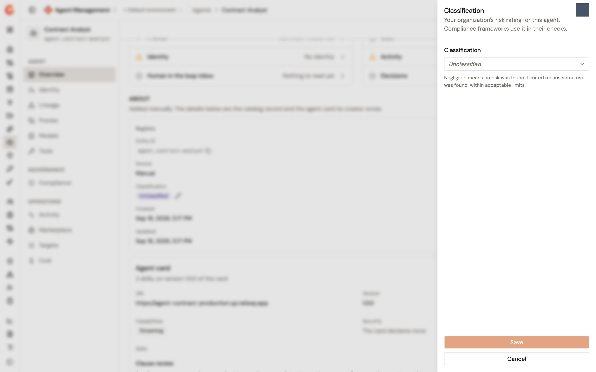

# Rate an agent's risk level

Every agent in the Catalog carries a risk classification: the risk your organization rates the agent at. The scale is Gravitee's own, and compliance frameworks use the rating in their checks. Until someone rates the agent, it reads **Unclassified**.

The scale has four values:

* **Negligible risk**. No risk was found.
* **Limited risk**. Some risk was found, within acceptable limits.
* **Moderate risk**.
* **High risk**.

Once set, a rating can be changed to another value and can't be cleared back to **Unclassified**.

## Rate an agent

1. From the Gamma console sidebar, select **Agent Management**.
2. In the **Catalog** section of the sidebar, select **Agents**.
3. Click the agent's name. Its **Overview** page opens.
4. In the **Registry** column of the card that describes the agent, find the **Classification** row and click the rating. The rating is a button when you can update Catalog items, and a plain badge otherwise.
5. In the **Classification** panel, pick a value under **Classification**.
6. Click **Save**.

A **Classification updated** notification appears and the row shows the new rating.

<figure><figcaption>
The Classification panel on an agent's Overview page
</figcaption></figure>

## Where the rating is read

* The **Agents** list shows it in the **Classification** column, and its **Classification** filter narrows the list to one rating or to **Unclassified** agents.
* The built-in EU AI Act framework requires it: its **Risk classification** control is met once the agent is rated. The agent's **Compliance** page shows the rating in a **Classification** tile with an **Open Overview** link, because the rating is set on the agent's page and not on the compliance one. See [Score agent compliance with the EU AI Act framework](score-agent-compliance-with-the-eu-ai-act.md).
* The estate tables of a framework and of a custom ruleset list every scored agent with its **Classification**.

## Next steps

* [Score agent compliance with the EU AI Act framework](score-agent-compliance-with-the-eu-ai-act.md). Read what else the framework asks of the agent.
* [Manage a registered agent](../import/manage-a-registered-agent.md). The other facts recorded on the agent's page.
