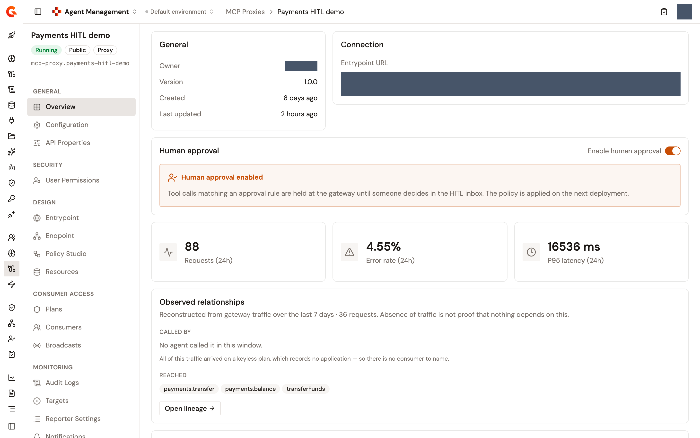
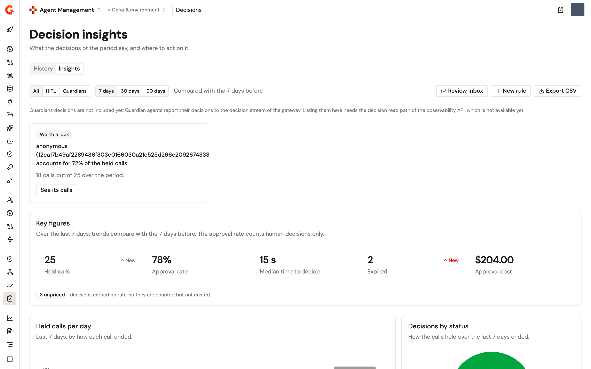

# Require human approval for MCP tool calls

Human-in-the-Loop approval makes human oversight a property of the tool call rather than a feature of the agent. You declare approval rules against MCP tools, turn human approval on for an MCP Proxy, and the AI Gateway holds every matching tool call until someone approves, edits, or rejects it in the **HITL** inbox. The agent that made the call perceives a slow tool call. It needs no client change and no cooperation from the platform it runs on.

Four screens make up the feature. Rules and the inbox live under **HITL** in the **Govern** section of the Agent Management sidebar. Decisions and their insights live under **Decisions** in the same section. The switch that puts a proxy under approval lives on the proxy's **Overview** page.

## Before you start

* Set `modules.aim.approvals.gatewaySecret` in the Management API configuration, or the `gravitee_modules_aim_approvals_gatewaySecret` environment variable. The gateway presents this secret when it opens a held call. Until it's set, the Management API refuses every call from the gateway and logs a warning, so no tool call is ever held.
* Optional: Tune the two housekeeping properties. `modules.aim.approvals.sweepIntervalSeconds` sets how often overdue approvals are expired and defaults to 30 seconds, and `0` applies expiry only when an approval is read. `modules.aim.approvals.retentionDays` sets how long settled approvals are kept and defaults to 90 days, and `0` keeps them forever.

## Turn on human approval for an MCP Proxy

Rules don't hold anything on their own. A proxy holds its tool calls only once human approval is turned on for it.

1. From the Gamma console sidebar, select **Agent Management**.
2. Under **Secure**, select **MCP Proxies**.
3. Select the proxy.
4. On the **Overview** page, in the **Human approval** card, turn on **Enable human approval**.

The card reads **Human approval enabled** and explains that tool calls matching an approval rule are held at the gateway until someone decides in the HITL inbox. The setting is saved as you switch it and applies on the proxy's next deployment. It adds a flow named **Human approval** to the proxy, on the `tools/call` method, with a **Human approval** step on the request and the response, which you can see in the Policy Studio. Turning the switch off removes that flow.

To see which proxies are under approval, open **HITL** in the **Govern** section and click **Coverage**. The **Human approval** column reads **On** or **Off** for each MCP Proxy, and the page reminds you that it shows the saved configuration, which takes effect on the proxy's next deployment. Use **Covered** and **All proxies** to narrow the list.

<figure><figcaption>
The Human approval card on an MCP Proxy's Overview page
</figcaption></figure>

## Create an approval rule

A rule names the tool calls that wait for a person, how long they wait, and what happens when nobody answers. You create a rule in one of two places:

* **From the catalog tool.** In the **Catalog** section of the sidebar, select **Tools**, open the tool, and click **Add rule** in the **Approval rules** card. The rule is anchored on that tool and follows it on every proxy that exposes it, under the name it has there.
* **From the rules list.** Open **HITL** in the **Govern** section, click **Rules**, and then click **New rule**. You type the tool name or a pattern yourself, and the rule matches tool names on every proxy.

Both open the **New approval rule** panel with the following fields:

<table>
    <thead>
        <tr>
            <th width="220">Field</th>
            <th>What it sets</th>
        </tr>
    </thead>
    <tbody>
        <tr>
            <td><strong>Name</strong></td>
            <td>Required.</td>
        </tr>
        <tr>
            <td><strong>Description</strong></td>
            <td>Optional. Why the rule exists.</td>
        </tr>
        <tr>
            <td><strong>Tool</strong></td>
            <td>The tool name, or a glob on it. <code>*</code> matches every tool and <code>|</code> separates alternatives. Read-only when the rule is anchored on a catalog tool.</td>
        </tr>
        <tr>
            <td><strong>Argument conditions</strong></td>
            <td>Optional. Each condition names an argument path, an operator, and a value, and the rule holds a call only when every condition matches its arguments. Operators: <strong>=</strong>, <strong>≠</strong>, <strong>&gt;</strong>, <strong>≥</strong>, <strong>&lt;</strong>, <strong>≤</strong>, <strong>contains</strong>, and <strong>matches</strong>. A rule without conditions holds every call of the tool.</td>
        </tr>
        <tr>
            <td><strong>Time to decide (seconds)</strong></td>
            <td>How long the approval stays actionable in the inbox. New rules start from the environment default, 900 seconds unless you change it. At most 30 days.</td>
        </tr>
        <tr>
            <td><strong>When nobody decides</strong></td>
            <td><strong>Deny the call</strong> or <strong>Let the call through</strong>. New rules start from the environment default, which is to deny.</td>
        </tr>
        <tr>
            <td><strong>Cost (USD)</strong></td>
            <td>Optional. The price of one human decision on this rule. Leave it empty to use the environment's rate. See <a href="#price-a-human-decision">Price a human decision</a>.</td>
        </tr>
        <tr>
            <td><strong>Priority</strong></td>
            <td>Lower runs first when several rules match, and ties break by creation time. New rules start at 100.</td>
        </tr>
        <tr>
            <td><strong>Enabled</strong></td>
            <td>On by default. A disabled rule is kept but guards nothing.</td>
        </tr>
    </tbody>
</table>

Click **Create rule**. A **Rule created** notification appears.

The conditions compare as follows. An argument the call didn't send satisfies only **≠**. When both the argument and the value read as numbers, the comparison is numeric, and otherwise it's a text comparison. **contains** looks for the value inside the argument, and **matches** tests the argument against a regular expression, which is checked when you save the rule.

The **Rules** tab lists the rules in evaluation order, with **P** and the priority on each name, a **catalog** badge on anchored rules, and **every call** under **Conditions** for a rule without conditions. When a held call could match several rules, the first enabled match decides. A call no rule matches runs without waiting for anyone. Deleting a rule stops it guarding new calls, and the approvals it already opened are kept.

### Set the environment defaults

The **Rule defaults** card on the **Rules** tab sets what a new rule starts with: **Default time to decide (seconds)**, **Default when nobody decides**, and **Cost per decision (USD)**. Existing rules keep their own time to decide and expiry outcome. Click **Save settings**.

### Simulate a call

To check which rule a call would hit, click **Simulate** on the **Rules** tab. In the **Simulate a call** dialog, enter the **Tool name** and, optionally, the **Arguments (JSON)**. The result reads **Held for approval** with the matched rule, its time to decide, and its outcome when nobody decides, or **Runs unguarded** when no rule matches. Nothing runs and nothing is recorded. The simulation evaluates the rules against the tool's catalog name, not against the name a particular proxy exposes it under.

### Which proxies a rule reaches

When a proxy holds a call, Gamma resolves the rules for that proxy. A rule anchored on a catalog tool applies only to the proxies that expose that tool, under the name the tool carries on each proxy. A pattern rule applies to every proxy. When Gamma can't read which tools a proxy exposes, every rule applies to it by pattern.

## Decide on a held call

Open **HITL** in the **Govern** section. The **Inbox** lists the calls held at the gateway with their **Tool**, **Proxy**, **Agent**, **Rule**, **Requested** time, and **Time left**, and the heading carries the number of pending calls. The list refreshes itself every few seconds, and **Refresh the inbox** refreshes it now. When nothing is held, the page reads **No pending approvals**.

1. Click a held call to open it. The **Decision required** card shows **Expires in** and the remaining time, and the page shows the rule that matched, the call's **Arguments**, and who requested it.
2. Take one of three actions:
    * **Approve**. The call proceeds with the arguments the agent sent. An **Approval granted** notification appears.
    * **Edit & approve…**. In the **Edit the arguments and approve** dialog, change the **Arguments (JSON)**, review the diff under **Changes the agent will not see coming**, add an optional **Reason**, and click **Approve with edits**. The call runs with your arguments instead.
    * **Reject…**. In the **Reject this call?** dialog, enter a **Reason**, which is recorded with the decision and returned to the agent, and click **Reject call**.

<!-- TODO: Screenshot of a held call open in the HITL inbox, showing the Decision required card and the Arguments -->

<figure><figcaption>
A held call open in the HITL inbox
</figcaption></figure>

The decision buttons appear only for users who can update the Catalog. Anyone else sees the held call, its countdown, and its record, and can't decide. When two people decide the same call, the second one sees **Someone else decided this call in the meantime.**

The rule's time to decide and its outcome are fixed on the approval the moment the call is held, so editing the rule afterward doesn't change a call that's already waiting. When the time runs out, the approval expires and the card reads **Expired** followed by whether the rule denies or allows the call. An expired approval can't be decided.

After the decision, the record shows the **Verdict** as **Approved**, **Approved with edits**, or **Rejected**, who decided and when, and, under **What happened next**, the **Gateway outcome**: **Forwarded**, **Upstream error**, **Refused** when the call was rejected or expired with a deny outcome, or **Not forwarded** when the decision came too late for the held call.

## Review decisions

Open **Decisions** in the **Govern** section. The **History** tab lists every decision with its **Source**, **Decision**, **Tool**, **Proxy**, **Agent**, **Rule**, **Decided by**, **Decided** time, and **Outcome**. Filter by tool name, by status with **All decisions**, **Approved**, **Approved with edits**, **Rejected**, or **Expired**, or by the agent or rule you arrived from. The page shows the most recent held calls and says how many exist in total.

The **Source** toggle offers **All**, **HITL**, and **Guardians**. **Guardians** can't be selected in this build. Its tooltip explains that Guardian agents report their decisions to the decision stream of the gateway, which this page can't read yet.

**Export CSV** and **Export JSON** download the register as a file named `approval-register`, with the newest ten thousand decisions regardless of the filters. Settled decisions are kept for the retention period set in the Management API configuration, 90 days by default.

## Price a human decision

A human decision can carry a price, so the cost of oversight appears next to the cost of model and tool calls.

* **Cost per decision (USD)** in the **Rule defaults** card of the **Rules** tab is the environment's rate. Leave it empty, as it is by default, to leave decisions unpriced. An unpriced decision isn't a decision that costs zero.
* **Cost (USD)** on a rule overrides the environment's rate for the calls that rule holds.

The rate is read when the call is held and fixed on the approval, so a rate you change later doesn't reprice a call already waiting. The price is charged when a person decides. A call that expires costs nothing. Prices are in US dollars.

The price feeds the **Approval cost** figure of the decision insights and the **Human decision** part of an agent's cost. See [Read what an agent cost](../cost-and-value/read-what-an-agent-cost.md).

## Read the decision insights

Open **Decisions** in the **Govern** section and click **Insights**. Select a period of **7 days**, **30 days**, or **90 days**. Every figure is compared with the same number of days before.

* **Observations** name what changed and what to do about it, each tagged **Needs attention**, **Worth a look**, or **Looking good**, such as a rise in held calls, slower reviewers, or calls expiring without a decision.
* The key figures are **Held calls**, **Approval rate**, **Median time to decide**, **Expired**, and **Approval cost**, each with its trend. The approval rate counts human decisions only. When some decisions carried no rate, a note says how many were counted but not costed.
* **Held calls per day** and **Decisions by status** chart the period.
* **Where the holds come from** breaks the period down by **Tools**, **Agents**, or **Rules**, with **Held**, **Approved**, **Rejected**, **Expired**, **Approval rate**, and **Median time to decide** per row. Each row offers **See in history**, and a rule row offers **Edit rule**.

**Review inbox**, **New rule**, and **Export CSV** at the top of the page lead to the matching actions.

<figure><figcaption>
The Decision insights page
</figcaption></figure>

## Next steps

* [Read what an agent cost](../cost-and-value/read-what-an-agent-cost.md). See human decisions next to model and tool spend for one agent.
* [Audit agent activity logs](agent-activity-logs.md). Read the record of a consequential action.
* [Configure your MCP proxy](../build/configure-your-mcp/README.md). Find the proxy pages the **Human approval** flow lands on.
