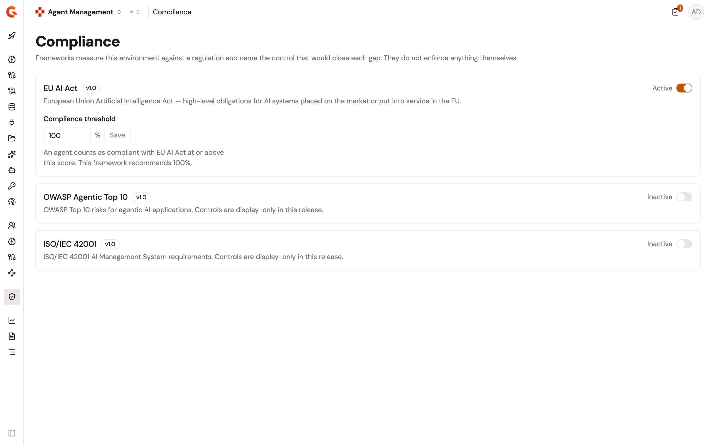

# Score agent compliance with the EU AI Act framework

## Overview

Compliance frameworks turn regulatory requirements into a live, continuously computed property of your agent estate. A framework is a set of controls, and every agent in the catalog is scored against the controls of each framework you activate.

The score is computed from two evidence sources:

* **Declared metadata**: what the agent's catalog entry states about it, for example its intended purpose and its risk classification.
* **Enforced gateway controls**: the policies that are actually installed on the proxy linked to the agent. Because the Gateway proxies the agent's traffic, this half of the score reflects controls that are enforced at runtime, not controls that are merely claimed.

An agent that has no linked proxy can still be scored on its declared metadata. Its gateway controls can't be evidenced until a proxy is linked.


The EU AI Act framework is built in and requires no configuration. You activate it, and every agent in the environment is scored against it.


## The EU AI Act framework controls

The framework contains four required controls. Three are evidenced from the agent's catalog metadata, and one is evidenced from the gateway.

<table><thead><tr><th width="220">Control</th><th>What satisfies it</th><th width="160">Evidence source</th></tr></thead><tbody><tr><td>Accountable Human</td><td>A natural person is designated as accountable for the AI system's operation and outcomes.</td><td>Catalog metadata</td></tr><tr><td>Intended Purpose</td><td>The intended purpose of the AI system is documented in clear language. A description shorter than 20 characters doesn't satisfy the control.</td><td>Catalog metadata</td></tr><tr><td>Risk Classification</td><td>The system is classified under one of the EU AI Act risk tiers: <code>minimal</code>, <code>limited</code>, <code>high</code>, or <code>unacceptable</code>. The <code>unacceptable</code> tier is a blocking value, because unacceptable risk systems must not be deployed.</td><td>Catalog metadata</td></tr><tr><td>Transparency Disclosure</td><td>A disclosure policy is installed on the agent's linked proxy, so users are informed that they're interacting with an AI system.</td><td>Gateway</td></tr></tbody></table>

## Read the compliance score

Each control the framework assesses receives a status:

* **Satisfied**: the evidence for the control is present.
* **Missing**: the evidence is absent, for example a required metadata field is empty or too short.
* **Blocking**: the evidence is present but names a value that must not be deployed, for example an `unacceptable` risk classification.
* **Not assessed**: the platform has no automated check for the control, so it doesn't count toward the score.

The framework's score is the percentage of assessed controls that are satisfied. The framework is compliant when the score meets its compliance threshold, which defaults to 100 percent for the EU AI Act framework.

The agent's overall status summarizes every active framework:

* `Compliant`: the agent meets every active framework.
* `Partially compliant`: the agent meets some active frameworks but not all.
* `Non-compliant`: the agent meets none of the active frameworks.
* `Not assessed`: no framework is active in the environment.

<!-- TODO: Screenshot of the compliance dashboard showing the EU AI Act framework card with per-agent scores -->

<figure><figcaption>
The compliance dashboard scores every agent in the environment against the active frameworks.
</figcaption></figure>

Each agent's catalog entry also carries its own compliance view. It drills down into which controls passed, which failed, and which weren't assessed, so the score is explainable rather than opaque.

<!-- TODO: Screenshot of an agent's Compliance tab showing the per-control drill-down -->

<figure><figcaption>
The agent's compliance view explains the score control by control.
</figcaption></figure>

## Activate the framework

Activation is scoped to the environment. Once the framework is active, every agent in the environment is scored against it, and deactivating it stops the scoring without deleting any agent metadata.

<!-- TODO: verify label in Console UI — the steps and figure below were verified on 2026-09-03 against the Agent Management module's compliance console change (AIAM-489), which hasn't merged yet. Re-verify when it ships. -->

1. From the Gamma console sidebar, select **Agent Management**.
2. In the **Govern** section of the sidebar, select **Compliance**.
3. On the **EU AI Act** card, turn on the switch. Its label changes from **Inactive** to **Active**, and the **Compliance threshold** field appears.
4. Optional: to change the threshold, enter a whole number from 1 to 100 in **Compliance threshold**, and then click **Save**. Until you save a different value, the field shows the framework's recommended threshold of 100 percent.

<figure><figcaption>
The Compliance page lists the built-in frameworks. The EU AI Act framework is active for this environment, with its compliance threshold set to 100 percent.
</figcaption></figure>

## Remediate a failing control

Scoring tells you where an agent falls short. Remediation closes the loop in two ways, depending on the control's evidence source:

* **Metadata controls**: edit the agent's catalog entry and provide the missing information, for example designate the accountable human or document the intended purpose.
* **Gateway controls**: apply the missing policies directly. When you apply the recommended controls, the platform installs the missing policies on the agent's linked proxy.

Applying gateway controls requires a linked proxy. If the agent isn't linked to a proxy, link one first, then apply the controls.

<!-- TODO: Screenshot of the remediation recommendations with the apply action -->

<figure><figcaption>
Remediation turns a score into a list of actions, and gateway controls can be applied directly.
</figcaption></figure>
