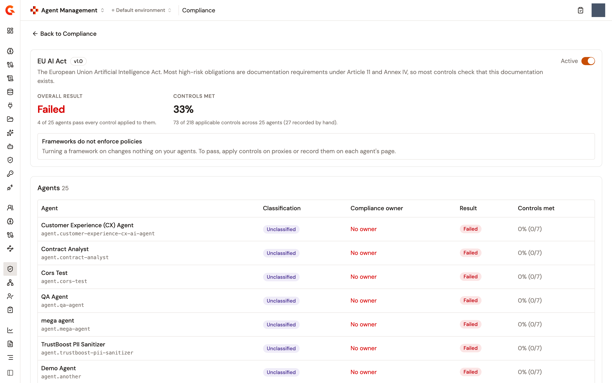
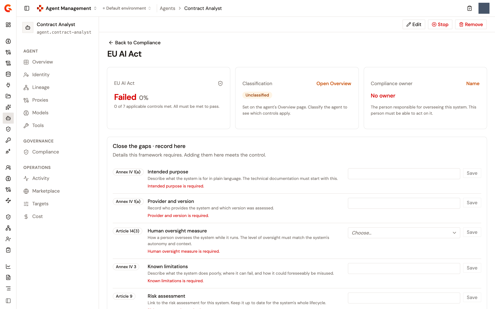

# Score agent compliance with the EU AI Act framework

A compliance framework measures the environment against a regulation. The built-in **EU AI Act** framework holds 15 controls. Once it's active, every agent in the environment is scored against them. The framework's own page scores the whole estate, and each agent's **Compliance** page scores that agent alone.

The framework measures and doesn't enforce. A control is met by a fact recorded on the agent, by a policy the platform reads on the proxies the agent depends on, or by a person marking it as done. Nothing on the framework's pages installs a policy or changes an agent.

## What the framework checks

Each control is answered from one place. The controls answered from the agent's record are recorded on the agent's **Compliance** page. The controls answered from the proxies are read by the platform, as long as it has something to read. When no application acts for the agent, when no gateway-mediated call from the agent was observed in the last 24 hours, or when no LLM Proxy carries it, those controls read **Not assessed** instead. The controls answered elsewhere can't be read by the platform yet. A control that reads **Not assessed** doesn't count against the score until someone marks it as done, whichever place it's answered from.

<table>
    <thead>
        <tr>
            <th width="230">Control</th>
            <th>What meets it</th>
            <th width="180">Answered from</th>
        </tr>
    </thead>
    <tbody>
        <tr>
            <td><strong>Risk classification</strong></td>
            <td>The agent is rated on its Overview page. See <a href="rate-an-agents-risk-level.md">Rate an agent's risk level</a>.</td>
            <td>The agent's record</td>
        </tr>
        <tr>
            <td><strong>Intended purpose</strong></td>
            <td>A statement of at least 20 characters.</td>
            <td>The agent's record</td>
        </tr>
        <tr>
            <td><strong>Provider and version</strong></td>
            <td>A value of at least 3 characters.</td>
            <td>The agent's record</td>
        </tr>
        <tr>
            <td><strong>Accountable human</strong></td>
            <td>A person picked from the environment's users.</td>
            <td>The agent's record</td>
        </tr>
        <tr>
            <td><strong>Human oversight measure</strong></td>
            <td>One of the three measures the field offers.</td>
            <td>The agent's record</td>
        </tr>
        <tr>
            <td><strong>Known limitations</strong></td>
            <td>A statement of at least 20 characters.</td>
            <td>The agent's record</td>
        </tr>
        <tr>
            <td><strong>Risk assessment</strong></td>
            <td>A value of at least 5 characters.</td>
            <td>The agent's record</td>
        </tr>
        <tr>
            <td><strong>Event logging</strong></td>
            <td>The agent's traffic went through a Gravitee proxy in the last 24 hours.</td>
            <td>The Gateway</td>
        </tr>
        <tr>
            <td><strong>Prompt injection screening</strong></td>
            <td>The <code>ai-prompt-guard-rails</code> policy is on every LLM Proxy the agent depends on.</td>
            <td>The LLM Proxies</td>
        </tr>
        <tr>
            <td><strong>Personal data protection</strong></td>
            <td>The <code>pii-filtering</code> policy is on every LLM Proxy the agent depends on.</td>
            <td>The LLM Proxies</td>
        </tr>
        <tr>
            <td><strong>Guardian on the model's traffic</strong></td>
            <td>The <code>ai-guardian</code> policy is on every LLM Proxy the agent depends on.</td>
            <td>The LLM Proxies</td>
        </tr>
        <tr>
            <td><strong>Transparency disclosure</strong></td>
            <td>Marked as done by a person.</td>
            <td>The A2A Proxies, not read yet</td>
        </tr>
        <tr>
            <td><strong>Tool inventory</strong></td>
            <td>Marked as done by a person.</td>
            <td>The tool inventory, not read yet</td>
        </tr>
        <tr>
            <td><strong>Authenticated identity</strong></td>
            <td>Marked as done by a person.</td>
            <td>The agent identity, not read yet</td>
        </tr>
        <tr>
            <td><strong>Authorization rule</strong></td>
            <td>Marked as done by a person.</td>
            <td>The authorization service, not read yet</td>
        </tr>
    </tbody>
</table>

The proxies an agent depends on are the ones its lineage links to it through its application. An agent with no proxy has nothing for the proxy-read controls to check.

## How a verdict is computed

On an agent, every control ends in one of five states:

* **Met**. The evidence is there.
* `Gap`. The evidence is missing, too short, or absent from at least one of the proxies it's read from.
* **Blocking**. The evidence names a value the control refuses. No control of the EU AI Act framework declares such a value, so none of them reaches this state.
* **Recorded**. A person marked the control as done. It counts as met, and the framework page says how many controls were recorded by hand.
* **Not assessed**. The platform can't read the control, because it's answered elsewhere, or because the agent has no application, no gateway-mediated call in the last 24 hours, or no LLM Proxy to read it from, and nobody marked it as done. It's left out of the score.

The percentage of controls met is counted over the assessed controls only. The result is **Passed** when every assessed control is met or recorded, and **Failed** otherwise. An agent with nothing assessed reads **Not assessed**.

## Activate the framework

1. From the Gamma console sidebar, select **Agent Management**.
2. In the **Govern** section of the sidebar, select **Compliance**. The page lists the frameworks and the custom rulesets of the environment with their **Type**, **Result**, **Controls met**, and whether each one is **Active**.
3. Click **EU AI Act**. The framework's page opens.
4. Turn on the **Active** switch.

An **EU AI Act activated** notification appears. From then on the page scores the estate, and the framework appears on every agent's **Compliance** page. Turning the switch off stops the scoring and lists the framework as **Inactive**.

<figure><figcaption>
The EU AI Act framework page scoring the estate
</figcaption></figure>

The framework's page reads as follows:

* **Overall result** is **Passed** or **Failed** for the estate, and **Controls met** is the share of controls met across it, with the number recorded by hand when someone marked one as done. Before anything is scored it reads **Nothing could be scored yet.**
* An alert reads **Frameworks do not enforce policies**.
* The **Agents** table lists every scored agent with its **Classification**, its **Compliance owner** (**No owner** until one is named), its **Result**, and its **Controls met** as a percentage over the assessed controls.
* **Close the gaps** lists the controls that are open across the estate and how many agents each one is open on, with an **Open overview** or **Open compliance** link to the agent. When nothing is open it reads **Every assessed agent meets every control that applies to it.**
* **Where controls are enforced** lists each control with what it's **Satisfied by** and where it's **Enforced at**, including the policy that answers it.

## Close an agent's gaps

1. In the **Catalog** section of the sidebar, select **Agents**, and then click the agent's name.
2. Under **Governance**, click **Compliance**. The page lists every active framework and custom ruleset with the agent's **Result** and **Controls met** for each.
3. Click **EU AI Act**.
4. Under **Close the gaps · record here**, fill in each open fact in its field and click **Save**. Recording the fact is the control.
5. Under **Close the gaps · done elsewhere**, act on each open control:
   * A control read from the proxies reads **Missing on &lt;n&gt; of &lt;m&gt; proxies**. Click **Open policy studio** to add the policy on the proxy, and the control is met on the next read.
   * A control the platform can't read reads **Enforced at &lt;surface&gt;, which Gravitee cannot check yet, so it does not count against the score.** This is also where a proxy-read control lands while the agent has nothing for the platform to read. Click the link to reach the surface, and once it's done, click **Mark as done**. The control turns **Recorded**.

The page also carries a **Classification** tile with an **Open Overview** link, because the rating is set on the agent's Overview page, and a **Compliance owner** tile with a **Name** or **Change** action to name the person accountable for the agent's compliance. **Show table** opens the full list of controls with where each one is **Enforced at** and its **Answer**.

<figure><figcaption>
An agent's Compliance page for the EU AI Act framework
</figcaption></figure>

## Export the evidence for an auditor

On the framework's page, click **Export evidence for an auditor**. The page that opens is titled **EU AI Act · Evidence** and lists which controls are met and where each is enforced, as of the moment it was generated. It isn't a certification.

## Score over the API

The same assessment is served by the module's REST API, for a dashboard or a report of your own:

* `GET /gamma/organizations/{orgId}/environments/{envId}/modules/aim/compliance/assessment` scores every agent of the environment in one pass against everything activated there.
* `GET /gamma/organizations/{orgId}/environments/{envId}/modules/aim/compliance/agents/{agentId}/assessment` scores one agent against everything activated there.

Both paths are relative to the Management API's base URL, and the calls take the same authentication as the Management API.

## Next steps

* [Rate an agent's risk level](rate-an-agents-risk-level.md). The framework's first control.
* [Create a custom compliance ruleset](create-a-custom-compliance-ruleset.md). Add checks of your own beside the framework.
