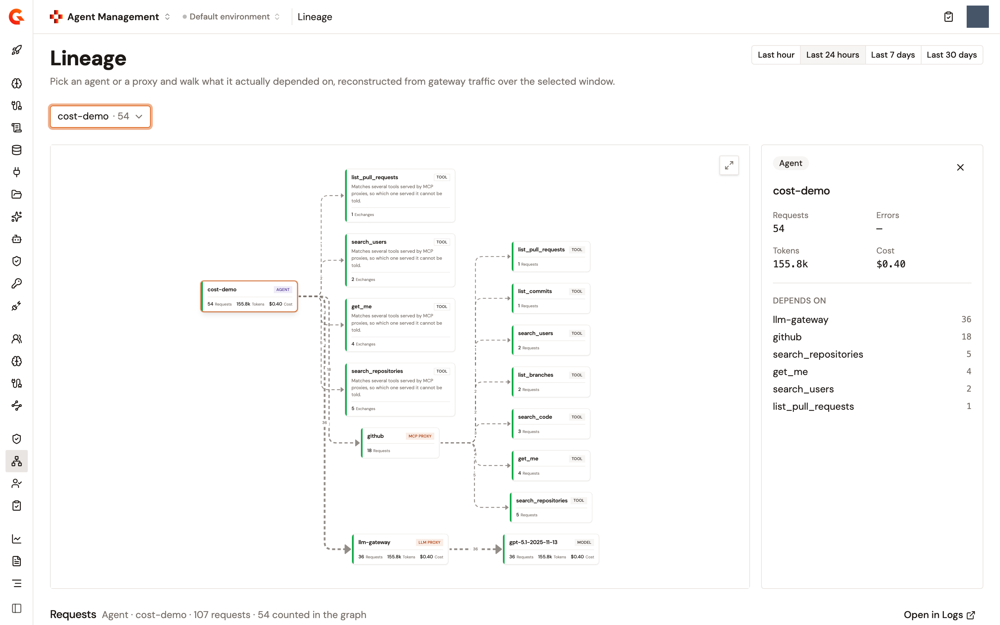

# View the lineage of an agent or a proxy

Lineage shows what an agent actually depended on, reconstructed from the traffic that crossed the AI Gateway over a time window: the proxies it called, the models and tools behind them, and, from a proxy's side, the agents that called it. It records what happened, not what was configured to happen, so a dependency that carried no traffic in the window isn't drawn.

Lineage is read from the gateway's analytics, and it keeps the top talkers of each level rather than an exhaustive list. Treat an absence in the graph as something that wasn't observed in the window, never as proof that nothing depends on the node.

## Open the Lineage page

1. From the Gamma console sidebar, select **Agent Management**.
2. In the **Govern** section of the sidebar, select **Lineage**.
3. Under **Time window**, select **Last hour**, **Last 24 hours**, **Last 7 days**, or **Last 30 days**. The page opens on the last 24 hours. Changing the window clears the starting point.
4. In **Choose a starting point…**, pick an agent or a proxy. The list holds only the agents and proxies that carried traffic in the window, grouped under **Agents**, **LLM proxies**, **MCP proxies**, and **A2A proxies**, each with its request count.

Until you pick one, the page reads **Choose a starting point**. When nothing carried traffic in the window, it reads **No traffic in this window** and suggests a longer window.

You can also reach the page from the things it draws:

* On an LLM Proxy, MCP Proxy, or A2A Proxy, the **Govern** group of the proxy's sidebar carries a **Lineage** item that opens the page in a new browser tab with the proxy as the starting point.
* On a registered agent's page, the **Lineage** item of the **Agent** section shows a summary and an **Open lineage** button. See [Read the summary on an agent or a proxy](#read-the-summary-on-an-agent-or-a-proxy).

<figure><figcaption>
The Lineage page walked from an agent
</figcaption></figure>

## Read the graph

The graph flows from left to right. An agent points at the proxies it called, a proxy points at the models or tools behind it, and an edge's label is the number of requests it carried in the window. Thicker edges carried more requests than thinner ones in the same view.

Each node carries a badge for its kind:

<table>
    <thead>
        <tr>
            <th width="220">Badge</th>
            <th>What the node is</th>
        </tr>
    </thead>
    <tbody>
        <tr>
            <td><strong>Agent</strong></td>
            <td>An application of type agent that called a proxy. The node is named after the application.</td>
        </tr>
        <tr>
            <td><strong>App</strong></td>
            <td>Any other application that called a proxy, and any consumer whose application type couldn't be read.</td>
        </tr>
        <tr>
            <td><strong>LLM proxy</strong>, <strong>MCP proxy</strong>, <strong>A2A proxy</strong>, <strong>API</strong></td>
            <td>The proxy or API that mediated the traffic, named after it. An A2A Proxy and an API are the last node on their branch, because the gateway records no dimension below them.</td>
        </tr>
        <tr>
            <td><strong>Model</strong></td>
            <td>A model an LLM Proxy routed to.</td>
        </tr>
        <tr>
            <td><strong>Tool</strong></td>
            <td>A tool served by an MCP Proxy, or a tool the agent reported running through its LLM traffic that matched one served by an MCP Proxy.</td>
        </tr>
        <tr>
            <td><strong>Unproxied MCP tool</strong></td>
            <td>A tool the agent reached on an MCP server without going through an MCP Proxy. The node and the edge into it are drawn as degraded so the missing proxy stands out.</td>
        </tr>
        <tr>
            <td><strong>Local tool</strong></td>
            <td>A tool no MCP Proxy serves, most likely a function the agent runs itself.</td>
        </tr>
        <tr>
            <td><strong>Tool</strong> with an outline</td>
            <td>A tool the agent reported that matches several tools served by MCP Proxies, so the graph can't tell which one served it.</td>
        </tr>
    </tbody>
</table>

A node card shows its request count, or its exchange count for a tool observed through LLM traffic, and adds **Tokens** and **Cost** when the node carried tokens and **Errors** when it carried errors. Nodes and edges are colored by health: an error rate above 10% reads as an error, above 1% as degraded, and anything lower as healthy.

Select a node to open its details beside the graph:

* Its badge, name, and the **Requests** or **Exchanges**, **Errors**, **Tokens**, and **Cost** it carried.
* **Depends on** and **Used by**, the nodes on either side of it, each with its request count.
* A note under **Used by** when some or all the traffic arrived on a keyless plan. A keyless plan records no application, so those callers can't be named.
* **Walk from here**, which restarts the graph from that node, for agents and proxies.
* **Open LLM proxy**, **Open MCP proxy**, or **Open A2A proxy**, which opens the proxy's page. Agents, models, and tools have no page to open from here.

Below the graph, the **Requests** section lists the gateway requests behind the selected node, with an **Open in Logs** button that opens the Logs page on the same scope and window and a **View trace** action on each request the gateway traced. For an MCP Proxy the list counts HTTP requests while the graph counts tool invocations, and the section explains the difference: every MCP tool call carries two more requests, the initialize call and its notification.

## What the graph doesn't show

* **Only the top talkers.** Each level of the reconstruction keeps its busiest entries, so a proxy, model, or tool with little traffic can be missing from a busy window.
* **Only traffic that names an application.** Traffic on a keyless plan reaches the graph, but its consumer can't be drawn. The graph tells you how many requests were keyless instead.
* **No errors on tools reported through LLM traffic.** A failed model exchange would paint the tool red for a failure that isn't its own, so the graph withholds errors on those tools until the gateway records them for the tool itself.
* **A partial graph when part of the read fails.** Each kind of traffic is read in its own query. When one query fails, the rest of the graph still draws, and the missing kind is logged on the Management API.

## Read the summary on an agent or a proxy

A registered agent's **Lineage** page and the **Overview** page of an LLM Proxy, MCP Proxy, or A2A Proxy carry an **Observed relationships** card. It's reconstructed from the last 7 days and reads **Called by** and **Reached**, up to six names each, with a count for the rest. **Open lineage** opens the full page with the node as the starting point and the same 7-day window.

The agent's card needs the agent's gateway application, because gateway traffic is attributed to that application. Until the agent has one, the card reads **This agent has no application yet, so nothing it does is attributed to it in gateway traffic.** and links to the agent's **Identity** page. An agent whose application carried no traffic reads **Nothing called this agent in this window.** and **This agent reached nothing in this window.**

The same data guards deletion. The dialog that removes an MCP Proxy or an A2A Proxy warns **Still in use over the last 7 days** and names what still calls it when the proxy carried traffic in that window.

## Next steps

* [Trace an agent request and view its lineage](../observe/trace-an-agent-request.md). Read a single request span by span in the Trace Explorer.
* [Manage a registered agent](../import/manage-a-registered-agent.md). Find the **Lineage** item and the rest of the agent's page.
* [Score agent compliance with the EU AI Act framework](score-agent-compliance-with-the-eu-ai-act.md). Lineage also feeds the proxy checks of a compliance assessment.
