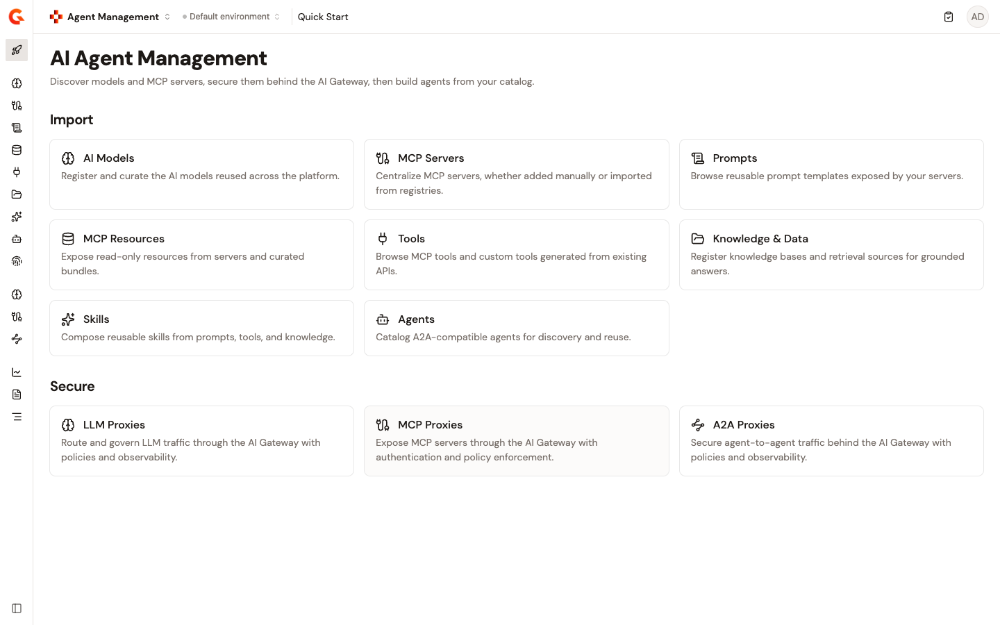

# Import

Populate the Catalog with the assets your agents need: models, MCP servers, tools, prompts, resources, skills, and agents. The Catalog is the authoritative registry of everything an agent can use, and fine-grained authorization policies are authored against cataloged entities. A rich Catalog enables precise governance.

<figure><figcaption>
The Import section of the Agent Management dashboard. Each card links to a Catalog entity type. The full set of import operations is listed under Import operations.
</figcaption></figure>

## Catalog entity types

| Entity type | Sources |
| --- | --- |
| **AI Models** | Synced from a connected provider integration, synced from Azure AI Foundry, or registered manually. |
| **MCP Servers** | Registered from a Streamable HTTP endpoint, or authored in MCP Studio. Type: **Native** (upstream) or **Composite**. |
| **Prompts** | Reusable, parameterized templates with declared arguments. |
| **MCP Resources** | Server resources discovered from registered MCP servers, and repository resources from Git. |
| **Tools** | **MCP Tools** from connected MCP servers, **API Tools** built from REST APIs in API Management, and **Kafka API Tools** from Event Stream Management. |
| **Knowledge & Data** | Document sources registered for agent consumption, inline or fetched from a remote URL. |
| **Skills** | Uploaded as `.zip` skill packages, exposed to agents as MCP resources using the FastMCP Skills-as-Resources pattern. |
| **Agents** | Registered from the A2A agent card an agent publishes. |

## Import operations

* [**Connect integrations**](connect-integrations.md). Connect Gamma to a model provider or to Azure AI Foundry so their models import into the Catalog.
* [**Add an AI model**](add-an-ai-model.md). Import models from a connected integration, and see the metadata each model records.
* [**Add an MCP Registry**](add-an-mcp-registry.md) _(coming soon)_. Connecting to external MCP registries (GitHub, Smithery) to import servers in bulk is planned for a future release.
* [**Register an MCP server**](register-an-mcp-server.md). Add an MCP server through a guided setup or a direct URL, including upstream authentication configuration.
* [**Import prompts**](import-prompts.md). Upload reusable, parameterized prompt templates to the Catalog.
* [**Add MCP resources**](add-mcp-resources.md). Catalog server resources from connected MCP servers and repository resources from Git.
* [**Create API tools**](create-api-tools.md). Expose REST APIs from API Management as agent-accessible tools in the Catalog.
* [**Add a knowledge source**](add-knowledge-source.md). Add external knowledge (documentation, knowledge bases) to the Catalog for agent consumption.
* [**Upload skills**](upload-skills.md). Catalog skill folders that agents can consume as MCP resources.
* [**Register an agent**](import-an-agent.md). Add an external agent to the Catalog from the A2A agent card it publishes.
* [**Re-sync catalog assets**](re-sync-catalog-assets.md). Refresh imported AI models and MCP servers against the source they came from, and read what changed.
