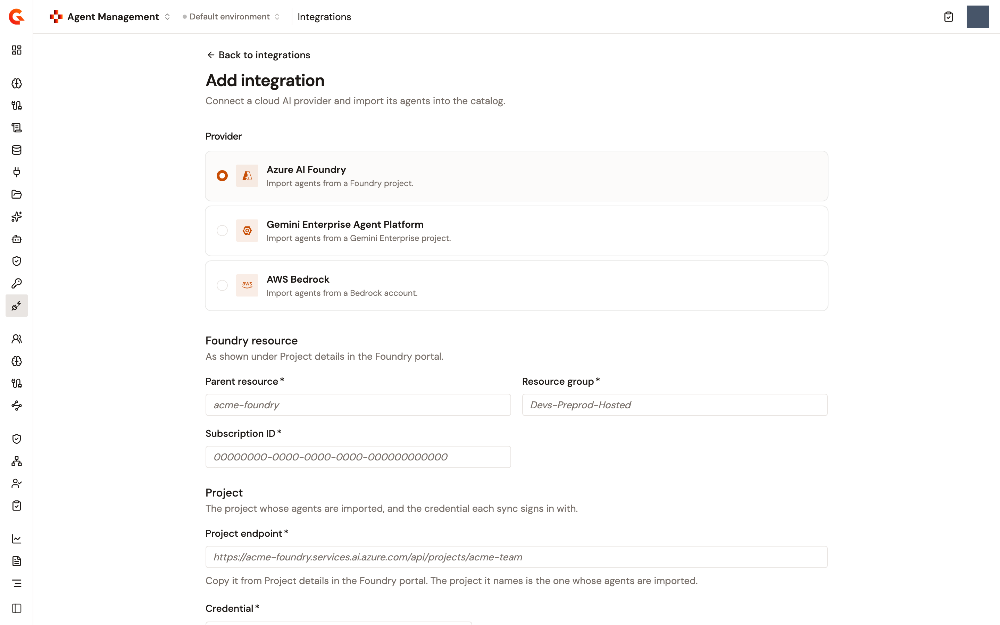
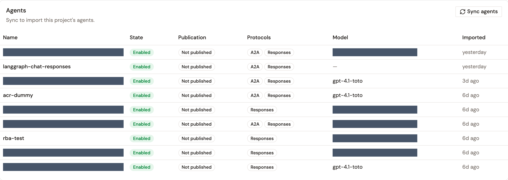

# Connect an agent platform

An integration connects a cloud AI provider once, so the agents it hosts can be imported into the Catalog and kept in step with the platform. Each integration names one project on one platform and the credential every sync signs in with. Its agents come in when you sync it, and a sync mirrors the platform: what the platform lists is imported or refreshed, and what it no longer lists is removed.

The **Integrations** page lists the providers this environment connected, with a **Provider** column. Two providers can be connected from the console today: **Azure AI Foundry** and **Gemini Enterprise Agent Platform**. The **Provider** picker also lists **AWS Bedrock**, and selecting it reads **AWS Bedrock is not supported yet.** with no fields.

## Before you start

* Have a credential of the right type registered under **Credentials**, in the **Catalog** section of the sidebar, and allowed on the **Agent Platform** usage. Azure AI Foundry takes an **OAuth 2.0** credential, which mints a token on every call. Gemini Enterprise Agent Platform takes a **GCP service account** credential, which signs a fresh assertion on every read. The integration form lists only the credentials of the right type and usage, and reads **Add one in Credentials** when none exists.
* For Azure AI Foundry, copy the project's details from the Foundry portal: the parent resource, the resource group, the subscription ID, and the project endpoint.
* For Gemini Enterprise Agent Platform, copy the project ID as the **Project info** card of the Google Cloud console shows it. Neither the display name nor the project number works, because every address on the platform is built from the ID.

## Connect a platform

1. From the Gamma console sidebar, select **Agent Management**.
2. In the **Catalog** section of the sidebar, select **Integrations**.
3. Click **Add integration**.
4. Under **Provider**, select the provider.
5. Fill in the connection. The fields depend on the provider, as described in the next two sections.
6. Click **Test connection**. The button stays disabled until every field is filled in. When the provider answers, a **Connection successful** alert names the credential that was accepted and how long the call took. For Azure AI Foundry it also counts and names the agents the project hosts, or reads **No agents in this project yet.** For Gemini Enterprise Agent Platform it adds that the credential can read the project, and the **Regions to import from** field appears.
7. Click **Create integration**. The button is enabled only while the test's answer still matches what's typed. Any edit after a passed test asks for a new one.

An **Integration connected** notification appears and the list opens again. A test that fails reads **Could not reach the provider** with the provider's reason, and a save that fails reads **Could not create integration**.

<figure><figcaption>
The Add integration page with Azure AI Foundry selected
</figcaption></figure>

### Azure AI Foundry fields

<table>
    <thead>
        <tr>
            <th width="220">Field</th>
            <th>What to enter</th>
        </tr>
    </thead>
    <tbody>
        <tr>
            <td><strong>Parent resource</strong></td>
            <td>The Foundry account, as shown under <strong>Project details</strong> in the Foundry portal.</td>
        </tr>
        <tr>
            <td><strong>Resource group</strong></td>
            <td>The account's resource group.</td>
        </tr>
        <tr>
            <td><strong>Subscription ID</strong></td>
            <td>The account's Azure subscription.</td>
        </tr>
        <tr>
            <td><strong>Project endpoint</strong></td>
            <td>The address the Foundry portal offers to copy under <strong>Project details</strong>, which ends with <code>/api/projects/</code> and the project's name. The project it names is the one whose agents are imported. An address that doesn't name a project is refused with <strong>The address of a project ends with /api/projects/ and its name.</strong></td>
        </tr>
        <tr>
            <td><strong>Credential</strong></td>
            <td>The OAuth 2.0 credential the syncs sign in with. Only OAuth 2.0 credentials for agent providers are listed.</td>
        </tr>
    </tbody>
</table>

An account that's already connected as an integration is reused rather than duplicated, and a second integration can't import the same project from the same account.

### Gemini Enterprise Agent Platform fields

<table>
    <thead>
        <tr>
            <th width="220">Field</th>
            <th>What to enter</th>
        </tr>
    </thead>
    <tbody>
        <tr>
            <td><strong>Project ID</strong></td>
            <td>The Google Cloud project ID.</td>
        </tr>
        <tr>
            <td><strong>Credential</strong></td>
            <td>The service account credential the reads sign in with. Only service account credentials for agent providers are listed.</td>
        </tr>
        <tr>
            <td><strong>Regions to import from</strong></td>
            <td>Shown once the connection test answered, listing the regions the project reports. Pick the ones you use. Left empty, every region the project reports is imported from, and each region adds one request per sync.</td>
        </tr>
    </tbody>
</table>

No region is asked for before the test. The provider places an agent in one region without being told, and the region each agent lives in is read back when it's imported.

## Sync the agents

1. On the **Integrations** page, click the integration's name.
2. In the **Agents** card, click **Sync agents**.
3. In the **Sync agents from &lt;project&gt;?** dialog, read what the sync does, and then click **Sync now**.

The card reads **Syncing agents from &lt;project&gt;…** while the provider is read and the catalog rewritten, which can take a while on a large project. When it's done, the card reads **Last sync just now: &lt;n&gt; imported, &lt;n&gt; updated, &lt;n&gt; removed.** and an **Agents synced** notification appears. A sync that fails reads **Could not sync agents** with the provider's reason, and the button reads **Retry**. A sync runs only when you trigger it, and the card can't say when the previous one ran.

<figure><figcaption>
The Agents card of an integration after a sync
</figcaption></figure>

The card lists the agents the integration brought in, newest first, 25 per page, with their **State**, **Publication**, **Protocols**, **Model**, and **Imported** date. **State** and **Publication** are the provider's own words for the agent, as of the last sync. Before the first sync the card reads **No agents imported yet**.

A sync mirrors the provider:

* An agent the provider lists and the Catalog doesn't hold is imported.
* An agent the Catalog already holds is rewritten from what the provider says: its name, description, model, tags, state, endpoints, protocols, skills, version, and security schemes. The URL, provider, and documentation URL you set, the metadata you added, the owner, and whether you stopped the agent survive a sync.
* An agent the provider no longer lists is removed, and only after a listing that completed. A listing that fails part-way removes nothing. On Gemini Enterprise Agent Platform, removal is scoped to the regions the sync managed to read.
* For Azure AI Foundry, each agent's own card is read after the listing, eight agents at a time. When one card can't be read, that agent keeps the description, skills, version, and security schemes it already had, and the sync still succeeds.
* For Azure AI Foundry, a listing of more than 5,000 agents, by default, is refused rather than cut short, because a short listing would remove the agents it failed to mention. For Gemini Enterprise Agent Platform, a sync reads up to 100 pages of agents per region.

To refresh one agent without syncing the whole project, resync it from the bar at the top of the agent's page. See [Manage a registered agent](manage-a-registered-agent.md).

## Edit the connection

An Azure AI Foundry integration's account details and credential can be corrected. The project itself is shown and not edited, because it's what the integration imports from. To import another project, add another integration.

1. On the integration's page, in the **Details** card, click **Edit**.
2. Change the account fields or the **Credential**.
3. Click **Test connection**, and then **Save changes**. As on creation, the save waits for the provider's answer, and a save that fails reads **Could not save connection**.

A **Connection updated** notification appears. A save that points the integration at a project another integration already imports is refused with **Another integration already imports this project from this account.**

A Gemini Enterprise Agent Platform integration has no **Edit** action. Another project is another integration, and its credential is rotated under **Credentials**.

When the credential an integration signs in with was removed from **Credentials**, the **Credential** row reads **Credential missing** and every sync fails. On an Azure AI Foundry integration, attach another credential with **Edit**. A Gemini Enterprise Agent Platform integration has no **Edit**, so the only way back is to remove the integration, which removes the agents it imported, and add it again.

## Remove an integration

1. On the **Integrations** page or on the integration's page, open the actions menu and click **Remove**.
2. In the **Remove this integration?** dialog, read the consequence: everything imported through the integration, agents and models included, is removed from the Catalog with it, and the removal can't be undone.
3. Click **Remove integration**.

A **Removed &lt;name&gt;** notification appears.

## Next steps

* [Manage a registered agent](manage-a-registered-agent.md). Open an imported agent's page.
* [Agent kill switch](../build/agent-killswitch.md). Stop an agent imported from Azure AI Foundry on the platform itself.
* [Connect integrations](connect-integrations.md). Connect a model provider or Azure AI Foundry for its models.
