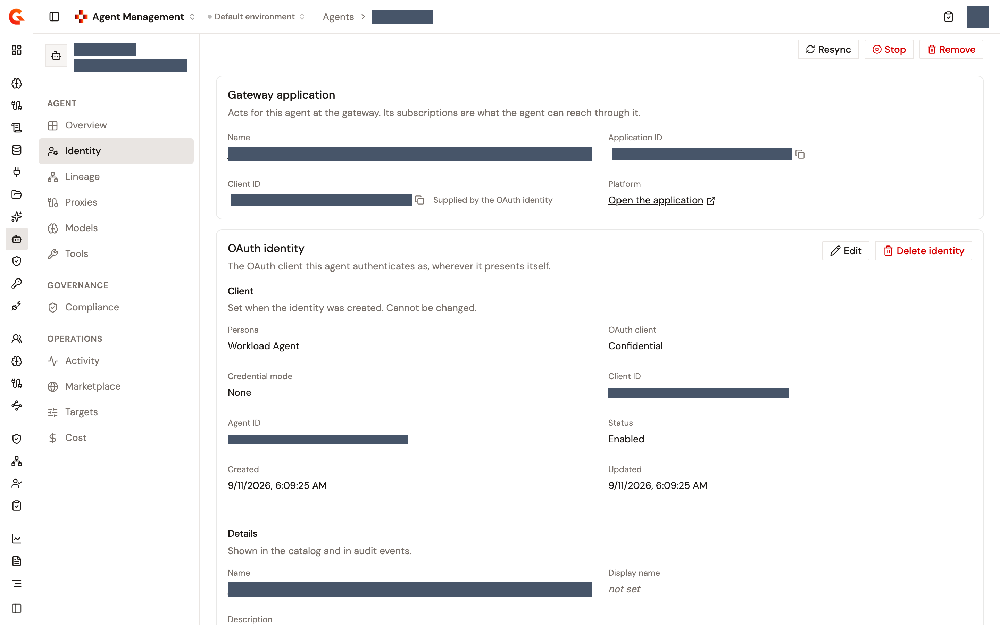

# Give an agent an identity

An agent reaches models and tools through subscriptions, and subscriptions belong to an application at the AI Gateway. The agent's **Identity** page creates that application, named after the agent, and can give it an OAuth identity issued by Gravitee Access Management, so the agent authenticates as a client of its own wherever it presents itself.

The two are separate steps. The gateway application is enough for API Key plans. A JWT or OAuth 2.0 plan needs a client ID on the application, which you either type or let an OAuth identity supply.

## Open the Identity page

1. From the Gamma console sidebar, select **Agent Management**.
2. In the **Catalog** section of the sidebar, select **Agents**.
3. Click the agent's name.
4. In the **Agent** section of the agent's sidebar, click **Identity**.

What the page offers follows your role in the environment, and a button you lack the right for is hidden rather than greyed out. **Create application** and the client ID's **Edit** need the right to update Catalog items. **Create an OAuth identity** needs the rights to create agent identities and to update Catalog items. The identity's **Edit** needs the right to update agent identities, and **Delete identity** needs the right to delete Catalog items.

## Create the gateway application

Until the agent has an application, the page shows a **Gateway application** card that explains the application is named after the agent and that the name can't be edited.

1. Optional: Enter a **Client ID**. The hint says it's required for OAuth 2.0 and JWT plan subscriptions, and that you can set it later or let an OAuth identity supply it.
2. Click **Create application**.

A **Created application** notification appears with the application's name. The card then shows the application's **Name**, its **Application ID** with a copy button, its **Client ID**, and a **Platform** row with an **Open the application** link that opens the application in Platform Management in a new tab. The card describes the application's role in one sentence: its subscriptions are what the agent can reach through it. When the application can't be created, the card reads **The application could not be created**, and when it can't be read, the page reads **The application could not be read**.

Until an OAuth identity is attached, the **Client ID** row reads **Not set. Set one or create an OAuth identity.** and carries an **Edit** button. To set or change the client ID, click **Edit**, enter the value or clear the field, and click **Save**, which stays disabled until the value changes. A **Client ID set to …** or **Client ID cleared** notification confirms it. When the save fails, **Could not set the client ID** appears and the field stays open. Once an identity is attached, the row shows the identity's client ID with a copy button, marked **Supplied by the OAuth identity**, and has no **Edit** button. Until the identity supplies one, the row reads **Not set. The OAuth identity supplies it.**.

## Create an OAuth identity

Once the application exists, an **OAuth identity** card appears below it. The card gives the application an identity of its own, whose client ID replaces the application's. The identity is created in Gravitee Access Management, so the environment's Access Management connection has to be set up first. Without it, the card reads **Identity service not connected** and links to the Access Management settings of Platform Management.

1. In the **OAuth identity** card, click **Create an OAuth identity**. When the application already carries a client ID you typed, the card warns that attaching an identity replaces it with the identity's.
2. In the **Persona** step, pick how the agent authenticates: **Desktop Productivity Agent**, a public client with PKCE enforced and no secret, **Hosted Agent**, a confidential client that acts for a signed-in user or on its own, or **Workload Agent**, a confidential client with no browser and no secret that authenticates with a JWKS key or SPIFFE. `Help me choose` asks whether a real person is signed in when the agent acts and where the agent code runs, and then offers **Use this persona**. The persona can't be changed after creation. Until you create the identity, **Change** in the persona summary bar returns to this step.
3. In the **Basics** step, review the **Name**, which is the agent's name and isn't editable here, and optionally enter a **Display name** for the catalog. Under **Client identifier**, keep **Client ID**, which is optional and unique within the domain, and which Access Management generates when you leave it blank, or choose **CIMD** and enter the metadata document URL, and then click **Validate** to read it back under **Parsed metadata**. **CIMD** is greyed out when it isn't enabled on the Access Management domain or when its support can't be checked, and the tooltip says which.
4. In the **Flow settings** step, enter what the persona asks for. A **Desktop Productivity Agent** takes the **Redirect URIs**, one per line or separated by whitespace, and the **Identity provider**. A **Hosted Agent** takes the same two, plus an **Enable JWKS** switch with `jwks_uri` and an inline `jwks`, and authenticates with a client secret when JWKS stays off. A **Workload Agent** takes **JWKS** or **SPIFFE**, which exclude each other and are both optional: JWKS asks for at least one of `jwks_uri` and `jwks`, and SPIFFE asks for the **Trust domain**, with **Register new** to create one, the **Subject match**, and the **SPIFFE ID**. With CIMD, a Desktop Productivity Agent or a Hosted Agent takes its redirect URIs from the metadata document, and an alert reads **No redirect URIs from the metadata document** when it declares none. **Next** stays disabled until the step is complete. Enter the redirect URIs with care: they can't be changed once the identity is created.
5. In the **Review** step, check each section, and then click **Create identity**. A Workload Agent with neither JWKS nor SPIFFE reads **JWKS or SPIFFE (set after creation)**. When creation fails, a **Could not create the identity** notification appears and the wizard stays on the **Review** step.

An **Identity created** notification reports the client ID the application now presents. For a Hosted Agent that authenticates with a client secret, a **Save the client secret now** dialog shows the secret once. Store it, and then click `I have stored the secret`, which is the only way to close the dialog. The secret can't be read again, and the identity would have to be recreated to get a new one.

## Manage an attached identity

Once an identity is attached, the **OAuth identity** card shows what the identity is and how it authenticates, with **Edit** and **Delete identity** in the card's header. **Edit** opens the **Name**, **Display name**, and **Description** fields in place, the **Identity provider** for a Desktop Productivity Agent or a Hosted Agent, and the credentials for a Hosted Agent, which are JWKS, or a Workload Agent, which are JWKS or SPIFFE, with **Save changes** and **Cancel**, and confirms with an **Identity updated** notification. **Owner** and **Observability** are shown and can't be edited. The persona and the redirect URIs are fixed when the identity is created.

Turning on the other credential mode's switch and saving asks you to confirm in a **Switch credentials to …?** dialog, with **Keep editing** and **Switch and save**, because whatever authenticates with the current credentials stops working when you save. Turning off the current mode's switch removes its credentials when you save, without asking. An identity created with CIMD shows a **CIMD URL** row and a **CIMD metadata document** card, and has no credentials to edit. When the identity can't be read, the card reads **Could not load the identity**.

**Delete identity** opens the **Delete this identity?** dialog. The application stays and can be given a new identity. Whatever authenticates with the deleted client ID can no longer do so, and the deletion can't be undone. Click **Delete identity** to confirm. An **Identity deleted** notification appears. When the identity could be detached from the application but not removed from Access Management, a warning reads **The identity was detached but still exists in the identity service**, followed by the service's error, and you remove the identity in Access Management yourself. When the deletion is refused, **Could not delete identity** appears inside the dialog, which stays open so you can retry.

<figure><figcaption>
The Identity page of an agent with an OAuth identity attached
</figcaption></figure>

## Next steps

* [Manage subscriptions](../publish/manage-subscriptions.md). Approve and manage the subscriptions the application holds on your proxies.
* [Manage a registered agent](manage-a-registered-agent.md). Find the **Identity** item and the rest of the agent's page.
* [Create an agent identity](../build/create-an-agent-identity.md). Create an identity from the **Agent Identity** catalog instead of from an agent's page.
