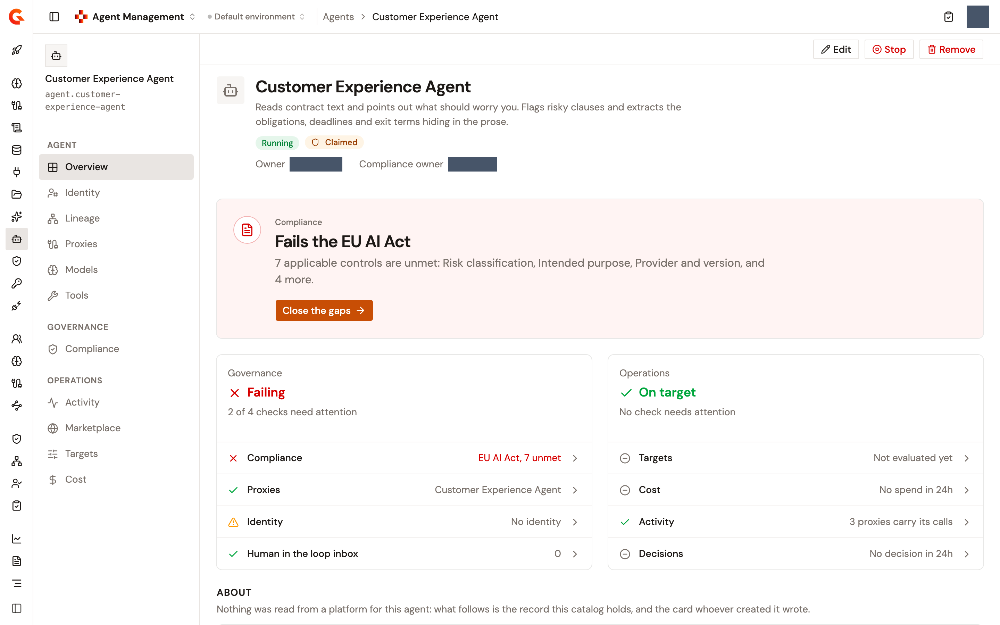

# Manage a registered agent

When you register an agent, the Gamma console opens the agent's page in the Catalog. The page is the hub for the agent: its **Overview** reports what still needs attention and what the Catalog holds, the sidebar leads to the pages that govern and operate it, and a bar at the top carries the actions that apply to the agent as a whole. Come back to it to check how the agent is governed, to route its callers through the AI Gateway, to give it access to models and tools, to stop it, or to remove it.

## Open an agent's page

Right after you click **Register agent** on the registration form, the console opens the new agent's page for you. To return to it later, follow these steps:

1. From the Gamma console sidebar, select **Agent Management**.
2. In the **Catalog** section of the sidebar, select **Agents**.
3. Click the agent's name. Optional: To find it in a long list, type part of its name or description in the search box above the list, or filter by **Classification**.

The **Agents** list shows each agent's name and description, its **Source**, its **Gateway state**, its **Governance** rung, its **Owner**, its **Publication** state on the platform it came from, its **Classification**, its **Protocols**, its **Model**, and its **Targets** verdict. The **Provider state**, **Entity ID**, **Version**, **URL**, and **Imported** columns are hidden until you turn them on. The actions menu at the end of each row offers **View details**, **Edit** for an agent registered by hand or **Resync** for an imported one, and **Remove**.

<figure><figcaption>
The Overview page of a registered agent
</figcaption></figure>

## Read the Overview

The **Overview** is the first page of the agent, and it answers "is anything wrong" before it lists facts.

### The header and the actions bar

The header carries the agent's name and description, a **Running** or **Stopped** badge, and a governance badge that sums up how far the agent is in hand:

<table>
    <thead>
        <tr>
            <th width="180">Badge</th>
            <th>What it means</th>
        </tr>
    </thead>
    <tbody>
        <tr>
            <td><strong>Governed</strong></td>
            <td>An A2A Proxy fronts the agent, and the agent has an identity of its own.</td>
        </tr>
        <tr>
            <td><strong>Claimed</strong></td>
            <td>One of the two is in place: a proxy fronts the agent but it has no identity, or it has an identity but no proxy fronts it. Hover over the badge to read which.</td>
        </tr>
        <tr>
            <td><strong>Discovered</strong></td>
            <td>The Catalog knows the agent exists. No proxy fronts it and it has no identity yet.</td>
        </tr>
    </tbody>
</table>

Under the badges, an **Owner** row names the agent's owner, or **Nobody**. A **Compliance owner** row appears when a compliance framework applied to the agent includes an accountable-human control.

A bar pinned to the top of every page of the agent carries the actions that apply to the agent as a whole: **Edit** for an agent registered by hand or **Resync** for an imported one, **Stop** or **Start**, and **Remove**. The bar appears only for users who can update or delete the Catalog, and it stays empty for an agent that Edge Management detected rather than one somebody registered.

### The task banner

When something needs attention, one banner above the cards names the most important task and offers the button that starts it. Compliance comes first, then the proxy, then the identity:

* **Fails the &lt;framework&gt;**, or **Fails &lt;n&gt; frameworks**, with the unmet controls named. The **Close the gaps** button opens the agent's **Compliance** page.
* **Route callers through an A2A proxy**, when the agent publishes an A2A address and no proxy fronts it. The **Route it** button opens the agent's **Proxies** page.
* **Give this agent an identity of its own**, when the agent has no identity. The **Create it** button opens the agent's **Identity** page.

The banner is absent when nothing needs attention.

### The Governance and Operations cards

The **Governance** card reads **Passing**, **Failing**, or **Not fully checked**, and lists four checks. Each check that links somewhere opens the page that can close it.

<table>
    <thead>
        <tr>
            <th width="230">Check</th>
            <th>What it reports</th>
        </tr>
    </thead>
    <tbody>
        <tr>
            <td><strong>Compliance</strong></td>
            <td><strong>Not configured</strong> when no framework applies, the framework met or how many frameworks are met, or the first framework with unmet controls and how many it has, with a badge counting the other failing ones.</td>
        </tr>
        <tr>
            <td><strong>Proxies</strong></td>
            <td>The name of the A2A Proxy that fronts the agent, or <strong>Callers reach it directly</strong>. An agent that publishes no A2A address reads <strong>Publishes no A2A address</strong>.</td>
        </tr>
        <tr>
            <td><strong>Identity</strong></td>
            <td>The name of the agent's gateway application when it has an identity, or <strong>No identity</strong>.</td>
        </tr>
        <tr>
            <td><strong>Human in the loop inbox</strong></td>
            <td>The row reads <strong>0</strong> in this build and links nowhere.</td>
        </tr>
    </tbody>
</table>

The **Operations** card appears only when the host API Management offers performance targets. It reads **On target**, **Off target**, or **Not fully checked**, and lists four checks. **Targets** reads **Not configured** until the agent has target rules, **Not evaluated yet** until one of them has a verdict, the rule that's breached and by how much, or how many rules are met. **Activity** reports how many proxies carry the agent's calls, or why its calls can't be read yet. **Cost** reads the last day's spend against the day before, for example **$12.40 in 24h, +12%**, badged **Off trend** when spend rose by a tenth or more and **On trend** otherwise, **No spend in 24h** when neither day spent anything, or **Nothing to read yet** when the agent's cost can't be read at all. The row is advisory, so it never changes the card's verdict, and it links to the agent's **Cost** page. **Decisions** reads **100%** in this build and links nowhere.

A check that couldn't be read shows **Could not be read**, and the card's verdict falls to **Not fully checked**.

### The About section

The **About** section holds what the Catalog records. For an imported agent it opens with a note that the data comes from the last synchronization and is rewritten by the next one, and that the proxy in front of the agent carries its own address and settings. For an agent registered by hand it says that nothing was read from a platform.

<table>
    <thead>
        <tr>
            <th width="230">Column or block</th>
            <th>What it holds</th>
        </tr>
    </thead>
    <tbody>
        <tr>
            <td><strong>Registry</strong></td>
            <td><strong>Entity ID</strong>, the stable identifier other Gamma modules use, in the form <code>agent.&lt;slug&gt;</code>, with a copy button. <strong>Source</strong>, the kind of source the agent came from. <strong>Classification</strong>, the risk rating you give the agent. <strong>Created</strong> and <strong>Updated</strong>.</td>
        </tr>
        <tr>
            <td>The platform column</td>
            <td>Only for an agent a platform describes. It's titled with the platform's name, <strong>Azure AI Foundry</strong> for a Foundry agent, and holds the platform's <strong>State</strong> and <strong>Publication</strong> for the agent, its backing <strong>Model</strong>, and the platform's own facts, such as the <strong>Foundry ID</strong> and <strong>Revision</strong>.</td>
        </tr>
        <tr>
            <td>The endpoints column</td>
            <td>Only for an agent a platform describes. <strong>Addresses</strong> lists each endpoint the platform declares with its protocol, such as <strong>A2A</strong>.</td>
        </tr>
        <tr>
            <td><strong>Agent card</strong></td>
            <td>The A2A card as a consumer reads it: <strong>URL</strong>, <strong>Version</strong>, <strong>Capabilities</strong> (<strong>Streaming</strong>, <strong>Push notifications</strong>, <strong>State transition history</strong>, or <strong>The card advertises none.</strong>), <strong>Security</strong>, and <strong>Skills</strong>, three at a time with a <strong>See &lt;n&gt; more</strong> link. The block is omitted when the platform declares that the agent doesn't speak A2A.</td>
        </tr>
    </tbody>
</table>

To rate the agent's risk, click the **Classification** badge in the **Registry** column. The **Classification** panel offers **Negligible risk**, **Limited risk**, **Moderate risk**, and **High risk**. Click **Save**. A **Classification updated** notification appears. A rating can be changed but not cleared.

Two agents can't share a slug. Registering a second agent whose name reduces to the same slug as an existing one is refused with the message **An agent with this name already exists**.

## Find your way around the sidebar

The agent's sidebar has three sections. Each entry is a page of its own.

<table>
    <thead>
        <tr>
            <th width="140">Section</th>
            <th width="160">Entry</th>
            <th>What the page does</th>
        </tr>
    </thead>
    <tbody>
        <tr>
            <td><strong>Agent</strong></td>
            <td><strong>Overview</strong></td>
            <td>This page.</td>
        </tr>
        <tr>
            <td><strong>Agent</strong></td>
            <td><strong>Identity</strong></td>
            <td>Creates the agent's <strong>Gateway application</strong>, the application that acts for the agent at the AI Gateway and holds its subscriptions, sets its <strong>Client ID</strong>, and gives it an OAuth identity.</td>
        </tr>
        <tr>
            <td><strong>Agent</strong></td>
            <td><strong>Lineage</strong></td>
            <td>What called the agent and what the agent reached, as observed in gateway traffic. It needs the gateway application to attribute traffic to the agent.</td>
        </tr>
        <tr>
            <td><strong>Agent</strong></td>
            <td><strong>Proxies</strong></td>
            <td>The A2A Proxy that fronts the agent, and the action that creates or links one. See <a href="route-an-agent-through-an-a2a-proxy.md">Route an agent through an A2A Proxy</a>.</td>
        </tr>
        <tr>
            <td><strong>Agent</strong></td>
            <td><strong>Models</strong></td>
            <td>The models the agent calls and the LLM Proxies that route them, with the subscriptions to take or close. See <a href="subscribe-an-agent-to-an-llm-proxy.md">Subscribe an agent to an LLM Proxy</a>.</td>
        </tr>
        <tr>
            <td><strong>Agent</strong></td>
            <td><strong>Tools</strong></td>
            <td>The tools the agent's platform declares and the MCP Proxies that front them, with the subscriptions to take or close. See <a href="subscribe-an-agent-to-an-mcp-proxy.md">Subscribe an agent to an MCP Proxy</a>.</td>
        </tr>
        <tr>
            <td><strong>Governance</strong></td>
            <td><strong>Compliance</strong></td>
            <td>The frameworks and custom rulesets that apply to the agent, and its verdict against each. See <a href="../govern/score-agent-compliance-with-the-eu-ai-act.md">Score agent compliance with the EU AI Act framework</a>.</td>
        </tr>
        <tr>
            <td><strong>Operations</strong></td>
            <td><strong>Activity</strong></td>
            <td>The model and tool calls made on the agent's behalf, and the requests it handled. See <a href="../observe/monitor-proxy-activity.md">Monitor proxy and agent activity</a>.</td>
        </tr>
        <tr>
            <td><strong>Operations</strong></td>
            <td><strong>Marketplace</strong></td>
            <td>The agent as a product in the Developer Portal. See <a href="../publish/publish-your-agent-to-the-developer-portal.md">Publish your agent to the Developer Portal</a>.</td>
        </tr>
        <tr>
            <td><strong>Operations</strong></td>
            <td><strong>Targets</strong></td>
            <td>The thresholds the agent is held to, and who is notified when one is missed. The entry appears only when the host API Management offers performance targets. See <a href="../observe/performance-targets.md">Performance targets</a>.</td>
        </tr>
        <tr>
            <td><strong>Operations</strong></td>
            <td><strong>Cost</strong></td>
            <td>What the agent cost to run, what changed since the period before, and where the money went.</td>
        </tr>
    </tbody>
</table>

An agent that Edge Management detected from traffic, rather than one somebody registered, has an **Overview** and nothing else. Its **About** section explains that the address is all the Catalog holds.

## Edit the name and description

Only the name and the description are editable, and only for an agent registered by hand. The endpoint URL and the version are fixed when the agent is registered. To point the Catalog at a different endpoint, register the agent again.

1. In the bar at the top of the agent's page, click **Edit**.
2. On the **Edit agent** page, change the **Name** or the **Description**.
3. Click **Save changes**.

**Save changes** stays disabled until you change something, and a blank name can't be saved. An **Agent updated** notification appears, and the console returns to the agent's page. Renaming the agent doesn't change its Entity ID.

An imported agent isn't edited here, because the next synchronization would write over the change. Its bar offers **Resync** instead, which reads the agent again from its platform and reports **Resynced &lt;agent&gt;**.

## Stop and start the agent

The **Stop** button in the bar takes the agent out of service in one move. What it reaches depends on the agent: the subscriptions its gateway application holds are paused at the gateway, and, when the platform that hosts the agent allows it, the agent itself is stopped there. **Start** puts everything back.

1. In the bar at the top of the agent's page, click **Stop**.
2. In the **Stop this agent?** dialog, read the **What this reaches** list.
3. Click **Stop this agent**.

An **Agent stopped** notification appears, and the header badge reads **Stopped** until you start the agent again. When part of the move failed, the notification reads **This agent was not fully stopped** instead. To start the agent, click **Start** in the bar, and then click **Start this agent** in the **Start this agent?** dialog, which lists what it restores under **What this restores**.

When the agent has no gateway application and its platform can't be told to stop it, the dialog reads **Nothing here can stop this agent** and offers **Go to Identity**, where the application is created.

The proxy that fronts the agent has a stop of its own on its **Settings** page. See [Agent kill switch](../build/agent-killswitch.md).

## Remove an agent

1. In the bar at the top of the agent's page, click **Remove**.
2. In the **Remove this agent?** dialog, click **Remove agent**.

Removal is immediate and can't be undone. The agent's gateway application goes with it, which closes every subscription that application held, and so does the identity the agent authenticated as. An A2A Proxy that fronts the agent is detached first and keeps running. A **Removed &lt;agent&gt;** notification appears, and the console returns to the **Agents** list. When the identity couldn't be removed from the identity service, the notification says so and asks you to remove it there.

## Next steps

* [Register an agent](import-an-agent.md). Add another agent to the Catalog from the agent card it publishes.
* [Route an agent through an A2A Proxy](route-an-agent-through-an-a2a-proxy.md). Put the agent behind the AI Gateway from its **Proxies** page.
* [Subscribe an agent to an LLM Proxy](subscribe-an-agent-to-an-llm-proxy.md). Give the agent access to models through its **Models** page.
* [Subscribe an agent to an MCP Proxy](subscribe-an-agent-to-an-mcp-proxy.md). Give the agent access to tools through its **Tools** page.
