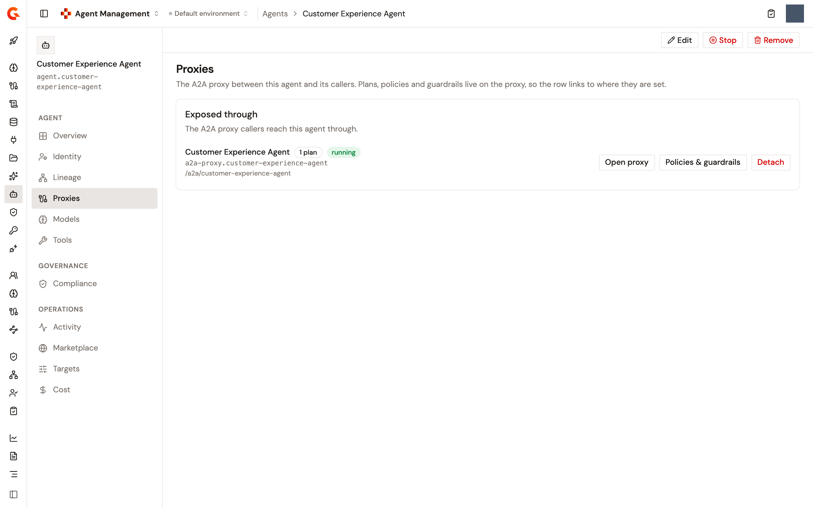

# Route an agent through an A2A Proxy

Registering an agent in the Catalog records what the agent declares. It doesn't put anything between the agent and its callers. To govern the calls that reach the agent, you route them through an A2A Proxy, and Gamma records which agent the proxy fronts. The agent's **Proxies** page shows that proxy, creates one for the agent, or links a proxy that already exists.

The link is one to one. An agent is fronted by at most one A2A Proxy, and a proxy fronts at most one agent. A linked proxy forwards to the address the agent publishes on its own agent card, and Gamma refuses a link, or a later change, that would point the pair at two different addresses.

## Before you start

* The agent must publish an A2A address: the URL on its agent card, or an A2A endpoint it declares. When it doesn't, the **Proxies** page reads **This agent does not publish an A2A address, so nothing can be put in front of it yet.** and offers no action.
* The **Route through the gateway** button appears only for users who can create or update APIs in the environment. Anyone who can read the Catalog sees the page and the linked proxy.

## Open the Proxies page

1. From the Gamma console sidebar, select **Agent Management**.
2. In the **Catalog** section of the sidebar, select **Agents**.
3. Click the agent's name.
4. In the **Agent** section of the agent's sidebar, click **Proxies**.

The page holds one card, **Exposed through**. Before any proxy is linked, it reads **No A2A proxy fronts &lt;agent&gt;. Callers reach it directly, so no plan, policy or audit trail applies on the way in.** and offers two buttons: **Route through the gateway** and **Open A2A proxies**.

<figure><figcaption>
The Proxies page of an agent with a linked A2A Proxy
</figcaption></figure>

## Route the agent through a new proxy

To create an A2A Proxy for the agent from its page, follow these steps:

1. On the **Proxies** page, click **Route through the gateway**.
2. In the **Route through the gateway** dialog, under **A2A proxy**, select **Create a new proxy**.
3. Accept or change the **Proxy name**. The dialog proposes the agent's name followed by **Runtime**.
4. Accept or change the **Context path**, the address callers use on the gateway. The dialog proposes `/a2a/` followed by the agent's slug, and checks that the path is valid and not already used by another API.
5. Click **Route through the gateway**.

The dialog creates the proxy with a plan named **Default API Key Plan** and links it to the agent in the same step, so a refused link never leaves a proxy behind. The proxy forwards to the address the agent publishes on its card, which the dialog names and which you can't change here. To choose how callers authenticate instead of taking the API key plan, create the proxy from **A2A Proxies** under **Secure** and pick the agent in the wizard, as described in [Create the proxy from the wizard](#create-the-proxy-from-the-wizard).

When the agent's address ends in `.json` or contains `/.well-known/`, the dialog warns that the address looks like the agent card itself rather than the endpoint the agent answers on. Fix the address on the agent before routing through the gateway.

## Link an existing proxy

To link an A2A Proxy that already exists, follow these steps:

1. On the **Proxies** page, click **Route through the gateway**.
2. In the **Route through the gateway** dialog, leave **Link an existing proxy** selected.
3. Under **Proxy to link**, select the proxy. The list holds the first 50 A2A Proxies of the environment. A proxy can be selected only when it fronts no agent yet and forwards to the agent's address. A proxy that fronts another agent reads **already attached**, and one that forwards somewhere else reads **forwards elsewhere**. A stopped proxy reads **stopped** and can still be selected.
4. Click **Route through the gateway**.

The dialog pre-selects a proxy when it finds one: first, a proxy whose entity ID contains the agent's slug, and otherwise a proxy whose name is the only one to contain a word of the agent's name longer than three characters.

A proxy's target URL and the agent's address count as the same when they match after trailing slashes are dropped and the scheme and host are compared without regard to case. The path is compared as written.

## What the page shows once the proxy is linked

The **Exposed through** card shows the proxy's name, which links to the proxy's **Overview**, a badge with the number of plans on the proxy, and a status badge that reads **running** or **stopped**. Below them, the card shows the proxy's entity ID and its context path. Three buttons follow: **Open proxy**, **Policies & guardrails**, which opens the proxy's Policy Studio, and **Detach**.

The link is visible from the proxy's side too:

* The **General** card on the proxy's **Overview** page gains an **Agent** row that names the agent's slug and links back to the agent's **Proxies** page.
* On the proxy's **Endpoint** page, the **Target URL** field is read-only while the link stands, with the hint **Taken from the card of the agent this proxy fronts. Detach the agent to point it somewhere else.** A change submitted another way is refused with a message that names the agent and its published address.

Plans, policies, and guardrails stay on the proxy. Stopping the agent isn't on this page either. The **Stop** button in the bar at the top of the agent's page cuts every subscription its application holds, this proxy included. See [Manage a registered agent](manage-a-registered-agent.md).

## Detach the proxy

Detaching removes the link and nothing else. The proxy keeps running with its target URL, plans, and policies, and callers keep reaching the agent through it.

1. On the **Proxies** page, click **Detach**.

The card returns to its unlinked state, and the proxy's **Target URL** becomes editable again.

Removing the agent from the Catalog detaches the proxy in the same way before the record is deleted. When a proxy's stored slug no longer matches any agent, the proxy's **General** card shows the slug with the note **no longer in the catalog** and a **Detach** button to clear it.

## Create the proxy from the wizard

The A2A Proxy wizard under **Secure** can link the proxy as it creates it, which lets you choose the plan's security instead of taking the default API key plan.

1. From the Gamma console sidebar, select **Agent Management**.
2. Under **Secure**, select **A2A Proxies**.
3. Click **Create A2A proxy**.
4. Complete the **Define** and **Secure** steps.
5. In the **Connect** step, under **Upstream agent**, select the agent under **Registered agent**. The list offers the agents that publish an A2A address and that no proxy fronts yet. When none qualifies, the field is disabled and explains why. Selecting `None, I will enter the address myself` creates an unlinked proxy.
6. Complete the rest of the step and the **Review** step, and then click **Create A2A proxy**.

Picking an agent fills the **Target URL** with the address from the agent's card and makes the field read-only, with the hint **Taken from the agent's card. Clear the agent above to type another.** When the name and description of the proxy are still empty, the wizard fills them from the agent too.

## Next steps

* [Expose your agent with the A2A Proxy](../build/expose-agent-with-a2a-proxy.md). What the proxy does, and how to give a client access to it.
* [Publish your agent to the Developer Portal](../publish/publish-your-agent-to-the-developer-portal.md). List the agent in the Developer Portal once a proxy fronts it.
* [Manage a registered agent](manage-a-registered-agent.md). Find your way around the rest of the agent's page.
