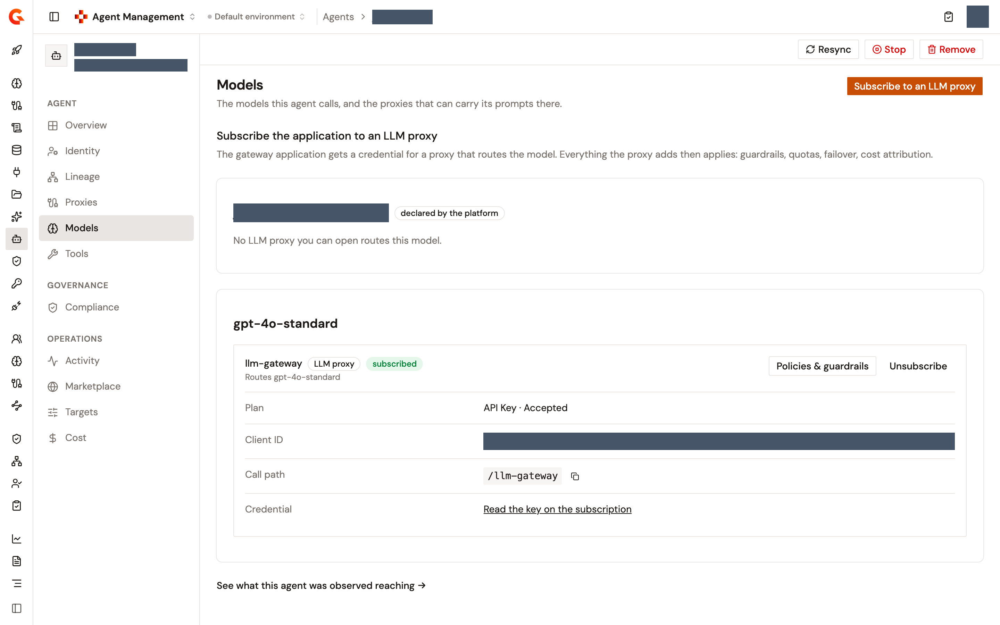

# Subscribe an agent to an LLM Proxy

An agent reaches a model through an LLM Proxy, and it reaches the proxy through a subscription that its gateway application holds on one of the proxy's plans. The agent's **Models** page brings those pieces together. It lists every model the agent calls, the LLM Proxies that route each one, and, for each proxy, either the subscription the application already holds or the plans it could take. You subscribe and unsubscribe from the same page.

The agent's gateway application is the application that acts for the agent at the AI Gateway. Subscriptions belong to it, so the page can't subscribe until the agent has one. The page tells you so and points you to the agent's **Identity** page, where the application is created.

## Open the Models page

1. From the Gamma console sidebar, select **Agent Management**.
2. In the **Catalog** section of the sidebar, select **Agents**.
3. Click the agent's name.
4. In the **Agent** section of the agent's sidebar, click **Models**.

<figure><figcaption>
The Models page of an agent: one model no proxy routes, and one with a subscribed LLM Proxy
</figcaption></figure>

## Read the page

The page shows one card per model. The first card is the model the agent's platform declares as its backing model, marked with a **declared by the platform** badge. The cards after it are the models the agent already reaches through a subscription. An agent registered from the console declares no model, so its page holds only the cards its subscriptions bring.

Under each model, the page lists every LLM Proxy that routes it. A proxy routes a model when one of the names the proxy serves the model under, aliases included, is the model's name. An LLM Proxy adopted from API Management rather than created in Gamma can't be matched to a model this way. When no proxy you can open routes the model, the card reads **No LLM proxy you can open routes this model.**

Each proxy block shows the proxy's name, which links to the proxy, an **LLM proxy** badge, a **subscribed** badge when the application holds a subscription on it, and a **Routes** line that names the models the proxy serves. The **Policies & guardrails** button opens the proxy's Policy Studio. What follows in the block depends on whether the application already holds a subscription on the proxy:

<table>
    <thead>
        <tr>
            <th width="260">State</th>
            <th>What the block shows</th>
        </tr>
    </thead>
    <tbody>
        <tr>
            <td>The application holds a subscription</td>
            <td>A <strong>Plan</strong> row with the plan's name and the subscription status, <strong>Pending</strong>, <strong>Accepted</strong>, or <strong>Paused</strong>. A <strong>Client ID</strong> row when the subscription carries one. A <strong>Call path</strong> row with the proxy's context path. A <strong>Credential</strong> row with a <strong>Read the key on the subscription</strong> link, which opens the subscription on the proxy's <strong>Consumers</strong> page. The page never shows the key itself. An <strong>Unsubscribe</strong> button.</td>
        </tr>
        <tr>
            <td>No subscription, and the proxy publishes plans</td>
            <td>One row per published plan, with the plan's name and its security badge: <strong>Keyless</strong>, <strong>API Key</strong>, <strong>JWT</strong>, <strong>OAuth2</strong>, or <strong>mTLS</strong>. A keyless plan reads <strong>Keyless: no subscription needed</strong>. Every other plan carries a <strong>Subscribe</strong> button.</td>
        </tr>
        <tr>
            <td>No subscription, and the proxy publishes no plan</td>
            <td><strong>No published plan to subscribe to yet. Publish one on &lt;proxy&gt;, then come back.</strong> The proxy's name links to its <strong>Plans</strong> page.</td>
        </tr>
    </tbody>
</table>

A JWT or OAuth2 plan needs a client ID on the application. When the application has none, the plan's row reads **needs a client id, attach an OAuth identity on Identity** and its **Subscribe** button stays disabled. An API Key or mTLS plan has no such requirement.

The page shows the models and subscriptions to anyone who can read the Catalog. The **Subscribe**, **Unsubscribe**, and **Subscribe to an LLM proxy** controls appear only for users who can update the Catalog.

The link at the bottom of the page, **See what this agent was observed reaching**, opens the agent's **Lineage** page.

## Subscribe from a model's card

To take a plan on a proxy that already routes one of the agent's models, follow these steps:

1. On the **Models** page, find the model and the proxy that routes it.
2. In the plan's row, click **Subscribe**.

A **Subscribed** notification appears, and the block switches to the subscription's rows, with the plan and the subscription's status.

## Subscribe to any LLM Proxy

When no card lists the proxy you want, subscribe through the picker instead. The picker lists every LLM Proxy you can see, whether it routes one of the agent's models.

1. On the **Models** page, click **Subscribe to an LLM proxy**. The button is disabled until the agent has a gateway application.
2. In the **Subscribe to an LLM proxy** dialog, select the proxy under **LLM proxy**. The list holds the first 100 proxies. When the environment has more, the dialog says so and asks you to subscribe from the proxy itself.
3. Select a plan under **Plan**. The list holds the proxy's published plans other than keyless plans. A JWT or OAuth2 plan reads **needs a client id, attach an OAuth identity on Identity** and can't be selected while the application has no client ID. When the proxy publishes no plan a subscription can take, the dialog reads **This proxy publishes no plan a subscription can take. Publish one on the proxy, then come back.**
4. Click **Subscribe**.

## Unsubscribe

Unsubscribing closes the subscription. It can't be reopened, so giving the agent the same proxy again means subscribing to a plan afresh.

1. On the **Models** page, in the proxy's block, click **Unsubscribe**.
2. In the **Unsubscribe from &lt;proxy&gt;?** dialog, click **Unsubscribe**.

A **Subscription closed** notification appears.

## Next steps

* [Subscribe an agent to an MCP Proxy](subscribe-an-agent-to-an-mcp-proxy.md). Give the agent's application access to the tools an MCP Proxy fronts.
* [Manage subscriptions](../publish/manage-subscriptions.md). Approve, reject, or close the subscription from the proxy's side, and read its credentials.
* [Manage a registered agent](manage-a-registered-agent.md). Find your way around the rest of the agent's page.
