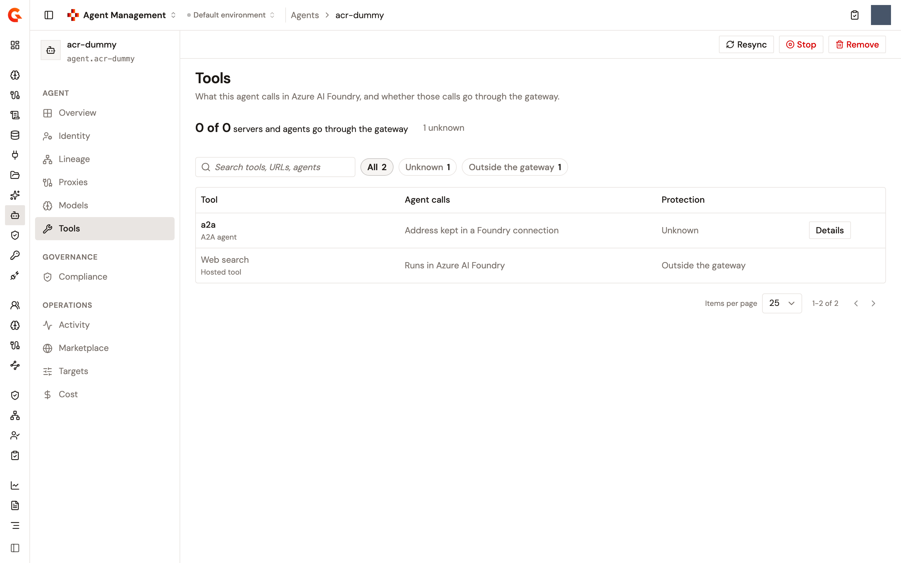

# Subscribe an agent to an MCP Proxy

An agent calls a tool on an MCP server, and the AI Gateway governs that call when the agent reaches the server through an MCP Proxy instead of directly. The agent's **Tools** page lists what the agent calls in Azure AI Foundry, and whether each of those calls goes through the gateway. From the page, you subscribe the agent's gateway application to the MCP Proxy that fronts a server. You also create that proxy when none exists, and copy what to change in Foundry so the agent calls the gateway.

The agent's gateway application is the application that acts for the agent at the AI Gateway. Subscriptions belong to it, so the page can't subscribe until the agent has one. The page tells you so and points you to the agent's **Identity** page, where the application is created.

## Open the Tools page

1. From the Gamma console sidebar, select **Agent Management**.
2. In the **Catalog** section of the sidebar, select **Agents**.
3. Click the agent's name.
4. In the **Agent** section of the agent's sidebar, click **Tools**.

<figure><figcaption>
The Tools page of an agent imported from Azure AI Foundry
</figcaption></figure>

## Where the declared tools come from

The tools on the page are the ones the agent's platform declares for it. Gamma reads them when it synchronizes an agent from Azure AI Foundry, and again on every synchronization. A tool removed on the platform disappears from the page after the next run. Gamma keeps up to 128 declared tools per agent. An agent registered by hand declares no tool, so its page reads **No tools set up**.

For each declared tool, Gamma records its type, its name, the server address it points at, and the list of tools the agent may call on that server. Headers, credentials, and connection references from the platform are never read. The server address is stored without any user information, query string, or fragment.

## Read the page

Above the table, a summary reads **&lt;n&gt; of &lt;m&gt; servers and agents go through the gateway**, with a bar in two colors. Green stands for the tools whose calls go through the gateway, red for the ones that bypass it. A count of bypasses and a count of unknowns follow the bar, and clicking one filters the table to those rows.

The table has three columns:

<table>
    <thead>
        <tr>
            <th width="180">Column</th>
            <th>What it holds</th>
        </tr>
    </thead>
    <tbody>
        <tr>
            <td><strong>Tool</strong></td>
            <td>The tool's name and its kind: <strong>MCP server</strong>, <strong>A2A agent</strong>, <strong>Hosted tool</strong>, <strong>Function</strong>, or <strong>Foundry toolbox</strong>.</td>
        </tr>
        <tr>
            <td><strong>Agent calls</strong></td>
            <td>The address the agent is configured with, which you can copy whole, and how the call travels: <strong>via the gateway</strong> followed by the plan's security, <strong>via the gateway · anonymous</strong>, or <strong>via the gateway</strong> followed by why the gateway refuses it. A tool with no address reads where it runs instead, for example <strong>Runs in Azure AI Foundry</strong>.</td>
        </tr>
        <tr>
            <td><strong>Protection</strong></td>
            <td>The tool's state, as <strong>Protected</strong> or as a three-step track, <strong>Proxy</strong>, <strong>Subscription</strong>, and <strong>Foundry</strong>, labeled with the state.</td>
        </tr>
    </tbody>
</table>

Each row ends with a button that names the next thing to do: **Details**, **Identify**, **Update Foundry**, **Subscribe**, or **Create proxy**. A tool the gateway can't front has no button. Users who can't update the Catalog get **Details** on every row. Rows are ordered by what needs attention first: bypasses, then refused calls, then unknowns, then the rest.

Above the table, a search box and filter chips narrow the rows. **All** is always offered, and **Bypasses**, **Unknown**, **Can be protected**, **Through the gateway**, and **Outside the gateway** appear when they have rows. When nothing matches, the table reads **No tools match** and offers **Show all**.

The state of a tool is decided by the first rule that matches:

<table>
    <thead>
        <tr>
            <th width="220">State</th>
            <th>What it means</th>
        </tr>
    </thead>
    <tbody>
        <tr>
            <td><strong>Outside the gateway</strong></td>
            <td>Azure AI Foundry runs the tool itself, or the application calling the agent runs it as a function, so its calls can't go through the gateway.</td>
        </tr>
        <tr>
            <td><strong>Unknown</strong></td>
            <td>The tool is a Foundry toolbox whose tools the synchronization doesn't list yet, its address sits in a Foundry connection that isn't read, no address was read for it, or its address is on the gateway but no proxy you can see serves it.</td>
        </tr>
        <tr>
            <td><strong>Protected</strong></td>
            <td>The address the agent is configured with is a running MCP Proxy's gateway address, and the agent's application holds an accepted subscription on that proxy.</td>
        </tr>
        <tr>
            <td><strong>Gateway · anonymous</strong></td>
            <td>The agent calls the gateway, no subscription is held, and the proxy publishes a keyless plan, so the calls go through but aren't tied to the agent.</td>
        </tr>
        <tr>
            <td><strong>Calls refused</strong></td>
            <td>The agent calls the gateway, but the proxy is stopped or the subscription is pending, paused, or missing, so the gateway refuses the calls.</td>
        </tr>
        <tr>
            <td><strong>Bypasses the gateway</strong></td>
            <td>An MCP Proxy fronts the server and the application holds an accepted subscription on it, but the agent is still configured with the server's own address.</td>
        </tr>
        <tr>
            <td><strong>Proxy ready</strong></td>
            <td>An MCP Proxy fronts the server, and the application holds no accepted subscription on it.</td>
        </tr>
        <tr>
            <td><strong>No proxy yet</strong></td>
            <td>No MCP Proxy you can see fronts the server.</td>
        </tr>
    </tbody>
</table>

A proxy fronts a server when its upstream address and the declared address are the same. Proxies you may not see are never named.

## Open a tool

Click a tool's name, or the button at the end of its row, to open the tool's panel. The panel carries the tool's state and a sentence on what it means. A line shows where the agent's calls go **Today** and where they go **After** the setup, or **Now** once they go through the gateway. Under it sit the three steps of the setup: the proxy, the subscription, and the change to make in Foundry. Arrows at the top of the panel step to the previous and next tool.

For a protected tool, the panel shows the **Plan** and when it was accepted, and the **Key name** and **Key value** the tool authenticates with, which you can copy. It also shows what the platform declares for the server: **Allowed tools**, and **Needs approval**. The latter reads **Yes**, **Yes (default)** when the platform recorded no rule, **No**, or **All except some** with the exempt tools named. **Open proxy** and **Manage subscription** open the proxy and the subscription, and the panel's menu offers **Policies & guardrails** and **Close subscription**.

## Subscribe to a plan

When an MCP Proxy already fronts the server, the tool reads **Proxy ready** or **Calls refused**, and the second step of its panel, **Subscribe to a plan**, offers the proxy's plans:

1. On the **Tools** page, click the tool's **Subscribe** button.
2. Under **Subscribe to a plan**, select a plan when the proxy publishes more than one keyed plan. A plan the application can't take is disabled with the reason. An OAuth 2.0 plan reads **Needs a client id.** and offers **Attach an OAuth identity**, which opens the agent's **Identity** page.
3. Click **Subscribe to &lt;plan&gt;**.

A **Subscribed** notification appears. When the agent has no gateway application, the step says that subscriptions belong to the agent's gateway application and that it has none yet. It offers **Create it on Identity**. A subscription that is waiting reads **Subscription awaiting approval** or **Subscription paused**, with a **Manage subscription** link to the subscription on the proxy's **Consumers** page.

A tool that reads **Gateway · anonymous** gets **Identify this agent** as its second step instead. It offers the same plans, so the agent's calls are metered and audited as its own.

## Create the proxy

When no MCP Proxy fronts the server, the tool reads **No proxy yet**. The first step of its panel, **Create an MCP proxy**, is filled in from the Foundry tool:

1. On the **Tools** page, click the tool's **Create proxy** button.
2. Under **Create an MCP proxy**, accept or change the **Name**, the **Upstream**, which is the server the Foundry tool calls today, and the **Context path**. The step shows the address the agent will call.
3. Click **Continue in proxy setup**. The MCP Proxy setup opens with these values and brings you back to the tool once the proxy exists.

For users who can't update the Catalog, the step says that someone who may change the agent creates the proxy from there.

## Point the tool at the gateway

Once the proxy exists and the subscription is accepted, the agent in Foundry still calls the server directly. The tool reads **Bypasses the gateway** until it's changed in Foundry, and the third step of its panel, **Update the tool in Foundry**, gives you what to paste:

1. On the **Tools** page, click the tool's **Update Foundry** button.
2. Under **Update the tool in Foundry**, copy the gateway address under **With**, and set it as the tool's server URL in Foundry in place of the address under **Replace**.
3. Copy the **Key name** and the **Key value**, and add the key to the tool in Foundry.
4. Click **Resync from Foundry**.

When the resync reads the gateway address, the panel reads **Now through the gateway** and the tool reads **Protected**. When it still reads the old address, the panel reads **Foundry still calls &lt;host&gt; directly**. It asks you to check the tool's server URL in Foundry before you resync again.

For a tool that already calls the gateway, the third step reads **Add the key to the tool in Foundry** and names the header or query parameter the plan reads the key from.

## Close the subscription

Closing the subscription takes the tool out from behind the gateway. The proxy refuses the agent's calls until it subscribes again.

1. On the **Tools** page, open a protected tool.
2. In the panel's menu, click **Close subscription**.
3. In the **Close this subscription?** dialog, click **Close subscription**.

A **Subscription closed** notification appears.

## Next steps

* [Subscribe an agent to an LLM Proxy](subscribe-an-agent-to-an-llm-proxy.md). Give the agent's application access to the models an LLM Proxy routes.
* [Manage subscriptions](../publish/manage-subscriptions.md). Approve, reject, or close the subscription from the proxy's side, and read its credentials.
* [Manage a registered agent](manage-a-registered-agent.md). Find your way around the rest of the agent's page.
