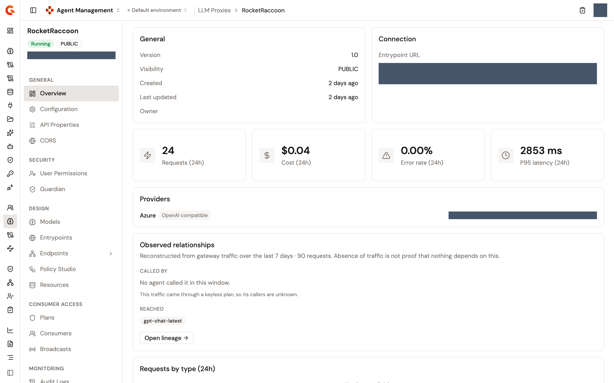
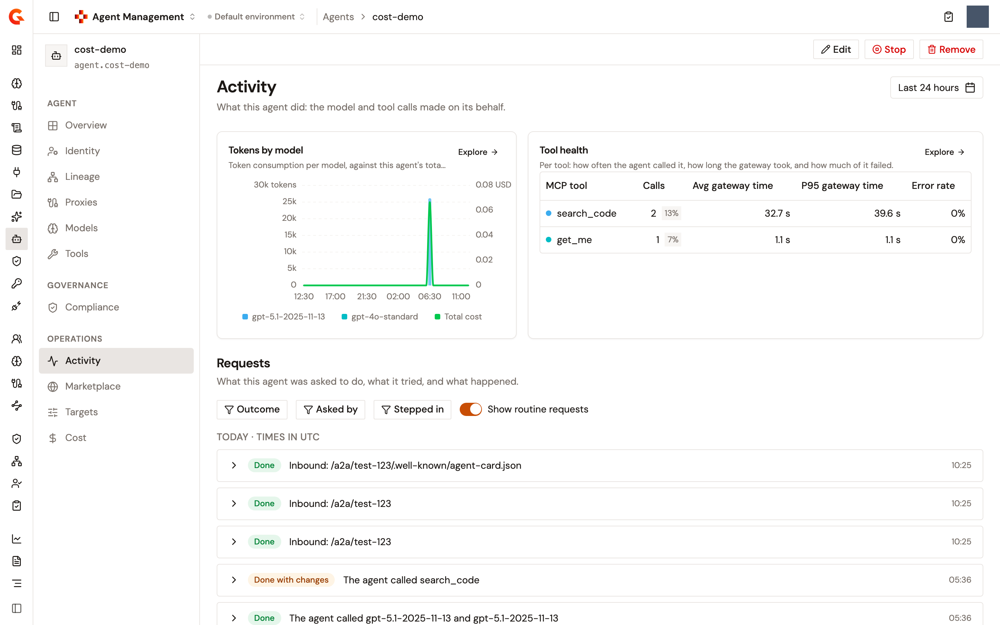

# Monitor proxy and agent activity

Every LLM Proxy and MCP Proxy carries an activity snapshot on its own **Overview** page, so you can judge whether a proxy is healthy without leaving it. The snapshot covers a rolling 24 hours, ending at the moment you load the page. A registered agent has an **Activity** page of its own, which reads the same telemetry narrowed to the calls made on that agent's behalf. The [Read an agent's activity on its page](#read-an-agents-activity-on-its-page) section covers it.

This is a different surface from the dashboards. The **LLM — Overview** dashboard reports across every LLM Proxy in the environment over a time range you choose. See [Monitor your LLM proxy](monitor-your-llm-proxy.md) for that. The **Overview** page of a proxy reports on that one proxy over a fixed 24 hours.

## What each proxy type reports

The three proxy types don't carry the same snapshot:

| Proxy type | Stat cards on the Overview page |
| --- | --- |
| **LLM Proxy** | Requests, cost, error rate, and P95 latency, plus three charts |
| **MCP Proxy** | Requests, error rate, and P95 latency. There's no cost card, because the gateway records token cost for LLM traffic only |
| **A2A Proxy** | None. The Overview page carries no activity snapshot. The activity of the agent behind the proxy is read on the agent's **Activity** page instead |

## Open the Overview page

To open the snapshot for an LLM Proxy, follow these steps:

1. Click **LLM Proxies** in the module sidebar.
2. Select your proxy.
3. Click **Overview** in the proxy sidebar.

For an MCP Proxy, click **MCP Proxies** in step 1 instead.

<figure><figcaption>
The Overview page of an LLM Proxy
</figcaption></figure>

## Read the stat cards

Each card is labeled with the window it covers, so **Requests (24h)** is the request count for the last 24 hours and not a lifetime total.

| Card | Reports |
| --- | --- |
| **Requests (24h)** | Requests the gateway served for this proxy. |
| **Cost (24h)** | Token cost the gateway computed for this proxy. LLM Proxies only. |
| **Error rate (24h)** | Share of those requests that returned an error, as a percentage to two decimal places. |
| **P95 latency (24h)** | 95th percentile gateway response time, in milliseconds. |

**Cost (24h)** is always formatted as US dollars. A model priced in another currency still reports with a dollar sign on this card, so read the figure as the number rather than the currency.

## Read the LLM Proxy charts

Below the stat cards, an LLM Proxy carries three charts and a provider list:

| Card | Reports |
| --- | --- |
| **Requests by type (24h)** | Request volume broken down by request type. |
| **Cost over time (24h)** | Token cost over the window. |
| **Cost by request type** | How the cost divides across request types. |
| **Providers** | The providers this proxy routes to, with the URL each one resolves to. |

## What a zero means

A proxy that served no traffic in the window reports zeros, not blanks. Every card fills in, so `0` requests and `0.00%` error rate are the normal reading for an idle proxy.

A zero doesn't only mean no traffic. When the analytics query behind the cards fails, the snapshot falls back to the same zeros rather than reporting the failure. A broken analytics backend and an idle proxy read identically here. Confirm against the **LLM — Overview** dashboard or the proxy's **Logs** before you conclude that a proxy is idle.

The cards show an em dash only while the figures are still loading, or when the request for them didn't complete.

## Read an agent's activity on its page

A registered agent's **Activity** page reports what the agent did: the model and tool calls made on its behalf, and the requests it handled. The page reads the same telemetry as the dashboards, narrowed to the calls the agent's own gateway application made through the proxies that carry its traffic. A model or tool proxy is shared by every agent that calls it, so the application is what tells this agent's calls apart.

### Open the Activity page

1. From the Gamma console sidebar, select **Agent Management**.
2. In the **Catalog** section of the sidebar, select **Agents**.
3. Click the agent's name.
4. In the **Operations** section of the agent's sidebar, click **Activity**.

The time range picker at the top of the page opens on the last 24 hours. Every card on the page follows the range you pick.

<figure><figcaption>
The Activity page of an agent
</figcaption></figure>

### What the page needs

The page charts nothing until two things are in place, and it says which one is missing:

* **No proxy tracks this agent yet**. Activity appears once a proxy exposes the agent or the agent uses a model or tool proxy. The **Proxies** button opens the agent's **Proxies** page.
* **Calls cannot be attributed to this agent yet**. Model and tool proxies are shared by all agents, so the agent needs an application of its own to separate its calls from other agents' calls. The **Create its application** button opens the agent's **Identity** page.

The **Requests** list below the charts also needs an A2A Proxy that fronts the agent. Without one it reads **This agent has no gateway proxy yet. Deploy an A2A proxy to see Activity here.**

### Read the charts

Two cards sit side by side at the top of the page. Each one carries an **Explore** link that opens the matching dashboard with the same agent scope and time range already applied, so the dashboard stays about this agent.

<table>
    <thead>
        <tr>
            <th width="200">Card</th>
            <th>Reports</th>
        </tr>
    </thead>
    <tbody>
        <tr>
            <td><strong>Tokens by model</strong></td>
            <td>Tokens consumed per model, stacked on the left axis, against a <strong>Total cost</strong> line on the right axis in US dollars. The cost is the agent's total across every model, not a line per model. <strong>Explore</strong> opens the <strong>LLM — Overview</strong> dashboard.</td>
        </tr>
        <tr>
            <td><strong>Tool health</strong></td>
            <td>One row per tool the agent called, sorted by calls and limited to the ten most called: <strong>Calls</strong> with each tool's share, <strong>Avg gateway time</strong>, <strong>P95 gateway time</strong>, and <strong>Error rate</strong>. The error rate turns amber from 1% and red from 5%. When the card is narrow, the two timing columns collapse first and <strong>Calls</strong> and <strong>Error rate</strong> stay. <strong>Explore</strong> opens the <strong>MCP — Overview</strong> dashboard.</td>
        </tr>
    </tbody>
</table>

The table reports the time the gateway took per tool, not the full response time.

### Read the Requests list

The **Requests** list answers what the agent was asked to do, what it tried, and what happened. It lists the requests in the time range 25 at a time, newest first, grouped by UTC day under **Today**, **Yesterday**, or the date, with times in UTC. **Load older activity** fetches the next 25.

Each row carries an outcome badge, a one-line summary that names the models and tools the agent called, and the time the request started. The outcomes are **Done**, **Done with changes**, **Stopped**, **Handed to a person**, **Waiting for sign-off**, **Expired**, and **Didn't finish**.

Above the list, the **Outcome**, **Asked by**, and **Stepped in** filters narrow the rows, and the **Show routine requests** switch controls whether requests that finished with nobody stepping in are listed. Routine requests are shown by default.

Expand a row to read the request as a sequence of steps: each model and tool the agent called, and each decision a rule, a Guardian, or a person made along the way, with its reason. A request that waits for a person offers a **Review sign-off** button, which opens the approval in the HITL inbox. **View technical details** opens a panel with the request's identifiers, its decisions, the last tool call it made, and the gateway records it crossed, one per hop with its type, status, and time. The panel's **View in Logs** button opens the Logs page on a window around the request, with the agent's scope applied.

