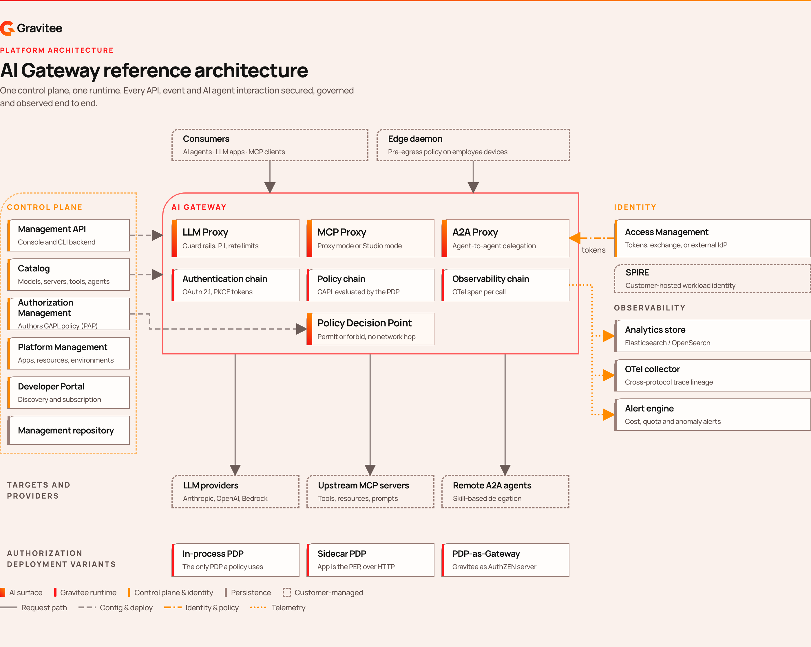

# Agent Management overview

Agent Management is Gravitee's product line for governing AI agent traffic. It provides a unified control plane and runtime for every protocol in the agentic stack: LLM calls, MCP tool invocations, and agent-to-agent (A2A) delegations. It adds end-to-end observability, fine-grained authorization, and identity for every agent that touches your enterprise infrastructure.

<figure><figcaption>
The AI Gateway reference architecture. Consumers and the Edge Daemon reach the AI Gateway, which routes LLM, MCP, and A2A traffic to upstream targets under a shared authentication, policy, and observability chain.
</figcaption></figure>

## Why Agent Management exists

Enterprise AI adoption introduces three classes of traffic that existing API gateways and identity systems weren't designed for:

* **LLM traffic.** Engineering teams use Claude Code, Cursor, and ChatGPT Enterprise with no central visibility into cost, model usage, or data exposure.
* **MCP traffic.** Agents call tools on upstream MCP servers such as HubSpot, GitHub, Salesforce, and Jira using shared API keys or unaudited credentials.
* **A2A traffic.** Multi-agent systems delegate work across trust boundaries with no authorization, lineage, or cost attribution per delegation.

Agent Management extends the gateway infrastructure that already governs API and event traffic to cover these three protocol types, using the same Catalog, the same authorization engine, and the same enforcement architecture.

## The three proxy types

The AI Gateway is the unified runtime that processes LLM, MCP, and A2A traffic. It consists of three proxies that share an authentication chain, a policy chain, an observability chain, and an Authorization Management integration point:

| Proxy | What it governs | Key capabilities |
| --- | --- | --- |
| **[LLM Proxy](../build/llm-proxies/README.md)** | Traffic to LLM providers (OpenAI, Anthropic, Gemini, Bedrock, Vertex AI) | Guardrails, PII filtering, token-based rate limiting, structured output, per-token cost attribution |
| **[MCP Proxy](../build/mcp-proxies/README.md)** | Tool invocations on upstream MCP servers | Two modes: **Proxy mode** (transparent governance) and **Studio mode** (composition of Composite MCP Servers). Protocol-native JSON-RPC 2.0, OAuth authorization discovery, credential mediation |
| **[A2A Proxy](../build/a2a-proxies/README.md)** | Agent-to-agent delegations | Skill discovery via `/.well-known/agent-card.json`, per-plan client authentication, wire-level policy enforcement |

## Use cases for Agent Management

### Give every team governed access to models

| Outcome | Feature |
| --- | --- |
| Provider credentials are held once on the AI Gateway instead of being copied into every team's application configuration. | [Create an LLM Proxy](../build/create-an-llm-proxy.md) |
| Each consumer authenticates with its own credential, so usage, rate limits, and cost can be attributed per consumer. | [Manage subscriptions](../publish/manage-subscriptions.md) |
| Existing AI tools route through governance by setting an environment variable, with no code changes. | [Create an LLM Proxy](../build/create-an-llm-proxy.md#zero-code-integration) |

### Expose existing enterprise assets as agent tools

| Outcome | Feature |
| --- | --- |
| REST APIs already governed in API Management become agent-callable tools, carrying over their security plans, policies, and backend configuration. | [Create API tools](../import/create-api-tools.md) |
| An agent gets exactly the tools it needs, composed from several upstream servers into one governed endpoint. | [Create an MCP proxy](../build/create-an-mcp-proxy.md) |
| An external agent that publishes an A2A agent card is registered in the Catalog from its endpoint. | [Register an agent](../import/import-an-agent.md) |

### Constrain what an agent can do through a tool

| Outcome | Feature |
| --- | --- |
| A caller reaches only the tools its identity permits, and a call that matches no permit is denied rather than allowed by omission. | [Layered governance for MCP tools](../build/configure-your-mcp/govern-mcp-tool-access.md) |
| A shared upstream token stops conferring its owner's full permission set on every agent that holds it. | [Connect and secure the GitHub MCP server](../build/configure-your-mcp/connect-and-secure-github-mcp-server.md) |
| Personal data in a tool response is redacted before it reaches the agent and the model behind it. | [Layered governance for MCP tools](../build/configure-your-mcp/govern-mcp-tool-access.md#redaction-decides-what-comes-back) |

### Screen prompts and responses

| Outcome | Feature |
| --- | --- |
| Prompts carrying toxicity, harmful intent, or jailbreak prompt injections are logged or blocked before they reach the provider. | [Configure text classification](../build/configure-text-classification.md) |
| The classification and embedding models run locally on the AI Gateway rather than calling a third-party screening service. | [AI resources](../build/ai-resources.md) |
| Token spend is capped per consumer over a rolling period, counting the tokens the provider bills you for rather than the number of calls. | [Add the Token Rate Limit policy](../build/add-the-token-rate-limit-policy.md) |

### Give every agent a verifiable identity

| Outcome | Feature |
| --- | --- |
| An agent is registered as an OAuth client with a persona that matches how it runs, so the gateway can authenticate, attribute, and audit it. | [Create an agent identity](../build/create-an-agent-identity.md) |
| An unattended workload authenticates with JWKS or a SPIFFE JWT-SVID instead of a shared client secret. | [Create an agent identity](../build/create-an-agent-identity.md#workload-agent) |
| Authorization policies reference the agent itself as a principal. | [Add policies to your MCP server](../build/configure-your-mcp/add-policies-to-mcp-server.md) |

### Account for what AI traffic costs

| Outcome | Feature |
| --- | --- |
| Every call records the provider, the model that answered, the tokens in and out, and the cost priced from the model's configured rate. | [Monitor your LLM proxy](../observe/monitor-your-llm-proxy.md) |
| Cost is attributed to the model that actually answered rather than the model the caller asked for. | [Monitor your LLM proxy](../observe/monitor-your-llm-proxy.md#what-the-gateway-records) |
| AI traffic on employee devices that bypasses the governance layer entirely becomes visible. | [Monitor AI Gateway usage from employee systems](../observe/monitor-ai-gateway-from-devices.md) |

<!-- TODO / GAP - input needed from field CTOs.

     Two use-case buckets were cut from this position because all ten of their link
     targets are still hidden: true / noIndex: true, which would publish ten dead
     links on an evaluator-facing page.

     1. "Prove how an agent was overseen" - EU AI Act compliance scoring, Guardian
        Agents, human approval for sensitive tool calls, agent activity logs, and the
        agent kill switch.
        Targets: ../govern/*.md and ../build/agent-killswitch.md

     2. "Set spend against what it bought" - Agent FinOps, business-value attribution
        per agent run, and performance targets.
        Targets: ../cost-and-value/*.md and ../observe/performance-targets.md

     These are the most differentiated use cases on the page for an evaluator
     audience, so this is a real gap rather than trimmed filler. All ten pages are
     written and already wired into SUMMARY.md (lines 167, 178, and 179-186) - only
     the frontmatter flags are holding them back.

     To restore: unhide govern/ and cost-and-value/, then recover the original eight
     outcome rows with
       git show 87c66dc25:docs/gamma/4.12/agent-management/overview/README.md
-->

## Providers and formats

An LLM Proxy accepts inbound requests in the **OpenAI**, **Anthropic Messages**, and **Gemini `generateContent`** formats, and translates them to the native API of the provider you configured.

| Reference | What it covers |
| --- | --- |
| [Accepted request formats](../build/accepted-request-formats.md) | The endpoints and limits for each client format you send requests in. |
| [LLM Proxy provider support](../build/llm-proxy-provider-support.md) | Which OpenAI features each provider supports, how requests map to each native API, and the limits that apply. |

The supported providers are OpenAI, Anthropic, Gemini, Bedrock, and Vertex AI. For the full feature matrix, including finish-reason mapping and embeddings support per provider, see [LLM Proxy provider support](../build/llm-proxy-provider-support.md).

## The Catalog

The Catalog is the authoritative registry of every asset an agent can use. Policy is authored against cataloged entities, which is why it's intentionally rich.

For the entity types and where each one comes from, see [Import](../import/README.md).

## Observability

| Surface | What it answers |
| --- | --- |
| [**Dashboards**](../observe/dashboards/README.md) | What your AI traffic costs, which models and tools it reaches, and how much of it runs outside the governance layer. |
| [**Logs**](../observe/logs/README.md) | What a single invocation carried and how it was handled. |
| [**Tracing**](../observe/tracing/README.md) | How one request moved through a proxy, as a span timeline or a lineage graph. |
| [**Edge Management**](../observe/monitor-ai-gateway-from-devices.md) | Per-device and per-team AI traffic, shadow AI detection, and fleet health. |

## How Agent Management connects to the platform

Agent Management shares three things with API Management and Event Stream Management:

1. **A common Catalog.** REST APIs from API Management become API Tools, so existing enterprise infrastructure becomes agent-accessible without redevelopment.
2. **A common authorization engine.** [Authorization Management](../../authorization-management/get-started/authorization-management-overview.md) defines fine-grained, catalog-aware policies that the AI Gateway, API Gateway, and Event Gateway all enforce at the wire level.
3. **Common enforcement architecture.** The same policy engine, the Policy Decision Point (PDP), runs inside every gateway. It's evaluated at microsecond latency with no network hop.

A typical enterprise AI request might traverse multiple protocols in a single logical request: an agent invocation arrives at the A2A Proxy, the LLM Proxy handles the model call, the MCP Proxy governs the tool call and reaches a Composite MCP Server, the API Gateway serves the underlying API, and the Event Gateway handles the published event.

You need one place to define policy, one place to see the trace, and one place to attribute cost.

## Next steps

### Try it

* [Create your first MCP server](../get-started/create-your-first-mcp-server.md). Put an MCP Proxy in front of an upstream MCP server, and verify tool invocations through the AI Gateway.
* [Create your first LLM Proxy](../get-started/create-your-llm-proxy.md). Connect a proxy to a model provider, and send a test prompt.
* [Expose your agent with the A2A Proxy](../build/expose-agent-with-a2a-proxy.md). Make an upstream agent's skills discoverable and callable through the gateway.

### Work a real scenario

* [Connect and secure the GitHub MCP server](../build/configure-your-mcp/connect-and-secure-github-mcp-server.md). Hold the personal access token on the gateway instead of copying it into every agent, and authorize each call under the caller's identity.
* [Connect and secure the Atlassian MCP server](../build/configure-your-mcp/connect-and-secure-atlassian-mcp-server.md). Reach Jira and Confluence through the gateway, with the API token held once and every call audited per caller.
* [Connect and secure the Stripe MCP server](../build/configure-your-mcp/connect-and-secure-stripe-mcp-server.md). Withhold the tool that performs every Stripe write, and permit refunds for one role while denying them for another.
* [Connect Claude Code through an LLM Proxy](../publish/connect-claude-code-through-an-llm-proxy.md). Govern Claude Code traffic while users keep their own OAuth login, with no shared Anthropic key stored in Gravitee.
* [Consume your LLM Proxy with LangChain](../publish/consume-your-llm-proxy-with-langchain.md). Point `ChatOpenAI` at the proxy so the chain never holds a provider credential.
* [Connect Claude Code to the Edge Daemon](../../edge-management/connect-claude-code-to-daemon.md). Route LLM traffic through the local daemon for pre-egress policy before it reaches the AI Gateway.

### Go deeper

* [Get started](../get-started/README.md). The roles reference and the MCP and LLM quickstarts.
* [Import](../import/README.md). Populate the Catalog with models, MCP servers, tools, prompts, resources, skills, and agents.
* [Build](../build/README.md). Create and configure the proxies and the agent identities.
* [Observe](../observe/README.md). Monitor AI traffic across proxy types and from employee devices.
