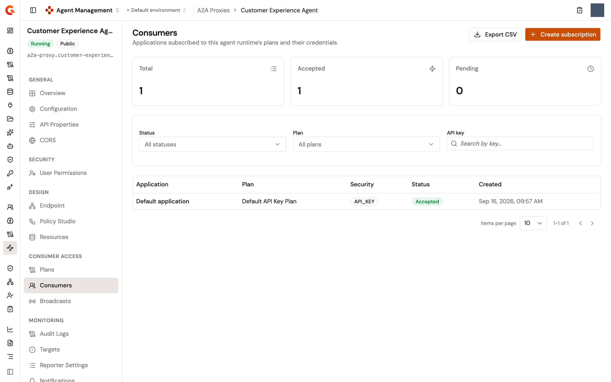
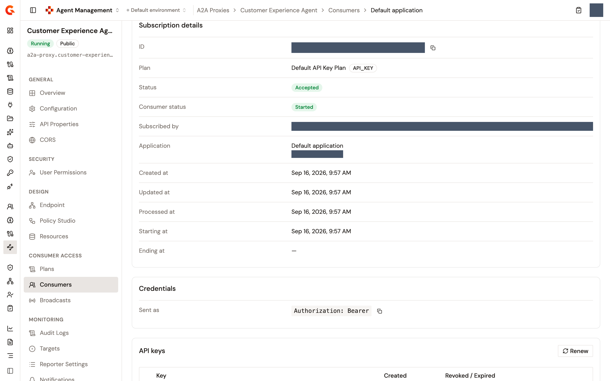

# Manage the consumers of your A2A Proxy

A subscription binds one application to one plan of the A2A Proxy. The proxy's **Consumers** page lists the applications subscribed to its plans and their credentials. From it you create subscriptions yourself and approve or reject the requests consumers send. You also read the credential each consumer presents, pause, transfer, or close a subscription, and manage the API keys it holds. LLM Proxies and MCP Proxies carry the same page at this version.

What you can do on the page follows your role in the environment. Users who can't read subscriptions see **You don't have access to consumers** in place of the list. Creating a subscription needs the right to create subscriptions. Approving, rejecting, pausing, resuming, transferring, changing the end date, and managing API keys need the right to update them. Closing one needs the right to delete them.

## Open the Consumers page

1. From the Gamma console sidebar, select **Agent Management**.
2. In the **Secure** section of the sidebar, select **A2A Proxies**.
3. Click the proxy's name.
4. Under **Consumer Access**, click **Consumers**.

The page counts the subscriptions in three tiles, **Total**, **Accepted**, and **Pending**, and lists them with their **Application**, **Plan**, **Security**, **Status**, and **Created** date. Narrow the list with the **Status**, **Plan**, and **API key** filters. When nothing matches, the list reads **No subscriptions match these filters.** **Export CSV** downloads the filtered list.

A subscription is in one of five statuses: **Pending**, **Accepted**, **Paused**, **Rejected**, or **Closed**.

<figure><figcaption>
The Consumers page of an A2A Proxy
</figcaption></figure>

## Create a subscription

You can open access to a consumer yourself, without waiting for a request from the Developer Portal.

1. On the **Consumers** page, click **Create subscription**.
2. Under **Select Application**, search for the application and select it.
3. Under **Subscription Plan**, select a plan. The list holds the proxy's published plans, except keyless ones. A keyless plan needs no subscription, so a proxy whose only published plans are keyless reads **No subscribable plans**.
4. Check the **Subscription Summary**, and then click **Create subscription**.

The subscription appears in the list with its status.

## Approve or reject a request

1. On the **Consumers** page, click the application's name on the subscription's row. The subscription's page opens, and its **Consumers** button leads back to the list.
2. Click **Approve** to grant access, or **Reject** to deny it. Both appear while the request waits for a decision.

A **Subscription approved** or **Subscription rejected** notification confirms the outcome. For an API key plan, the key is generated when the subscription is accepted.

## Read the credentials

The subscription's page carries two cards.

**Subscription details** lists the subscription's **ID**, **Plan**, **Status**, **Consumer status**, who it was **Subscribed by**, its **Application**, and its **Created at**, **Updated at**, **Processed at**, **Starting at**, and **Ending at** dates.

**Credentials** holds what the consumer presents, which depends on the plan's security type:

* For an **API key** plan, a row says how the key is sent, following the plan's delivery mode: **Sent as** with `Authorization: Bearer`, **Sent as header** with the header's name, or **Sent as query parameter** with the parameter's name. The keys themselves sit in the **API keys** card below.
* For a **JWT** or **OAuth 2.0** plan, the **Client ID** the subscription was created with.
* For an **mTLS** plan, the **Client certificate** the subscription was created with.

<figure><figcaption>
A subscription's page with its credentials
</figcaption></figure>

## Manage the API keys

For an API key plan, the **API keys** card lists each key with its **Created** date and its **Revoked / Expired** date. Until the subscription is accepted, the card reads **Generated when the subscription is accepted.**

* **Renew** generates a new key. A **API key renewed** notification confirms it.
* **Copy key** copies a key's value.
* **Set expiry** opens the **Set key expiry** dialog, where you choose when the key expires, or clear the date to remove the expiry. A **API key expiry updated** notification confirms it.
* **Revoke key** revokes a key. A **API key revoked** notification confirms it, and the key is listed as **Revoked**.

## Pause and resume a subscription

To suspend a consumer without closing its subscription, click **Pause** on an accepted subscription. The **Pause subscription?** dialog states that the consumer loses access to the proxy until you resume the subscription. Click **Pause subscription** to confirm. The subscription turns **Paused**, and a **Subscription paused** notification appears.

To restore access, click **Resume** on a paused subscription. A **Subscription resumed** notification appears.

## Transfer a subscription to another plan

1. On an accepted subscription, click **Transfer**.
2. In the **Transfer subscription** sheet, pick the **New plan** among the proxy's other plans.
3. Click **Transfer**.

A **Subscription transferred** notification appears.

## Change the end date

1. On an accepted or paused subscription, click **Change end date**.
2. In the **Change end date** sheet, set the **End date**, the date and time the subscription expires.
3. Click **Save**.

A **Subscription end date updated** notification appears, and the **Ending at** row shows the new date.

## Close a subscription

On a pending, accepted, or paused subscription, click **Close subscription**. The **Close subscription?** dialog states that the subscription ends for good and the consumer loses access to the proxy, and suggests pausing it instead to stop access for a while. Click **Close subscription** to confirm. A **Subscription closed** notification appears. A closed subscription can't be reopened from this page: create a new one instead.

## Next steps

* [Let consumers subscribe to your agent](let-consumers-subscribe-to-your-agent.md). Create and publish the plans consumers subscribe to.
* [Expose your agent with the A2A Proxy](../build/expose-agent-with-a2a-proxy.md). Create the proxy the subscriptions belong to.
* [Manage subscriptions](manage-subscriptions.md). The same lifecycle on LLM Proxies and MCP Proxies at the released version.
