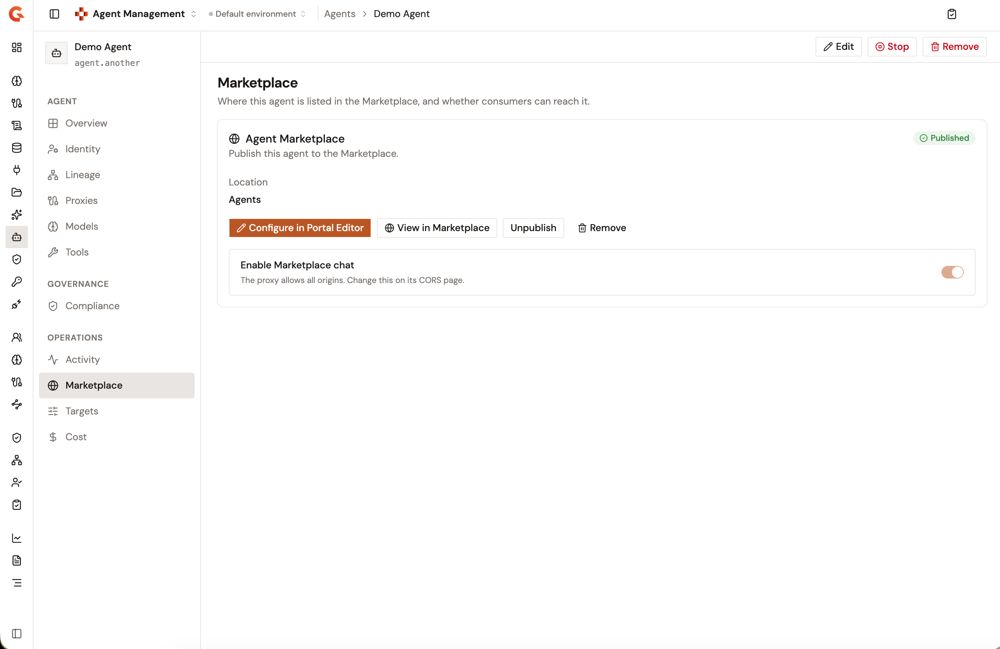
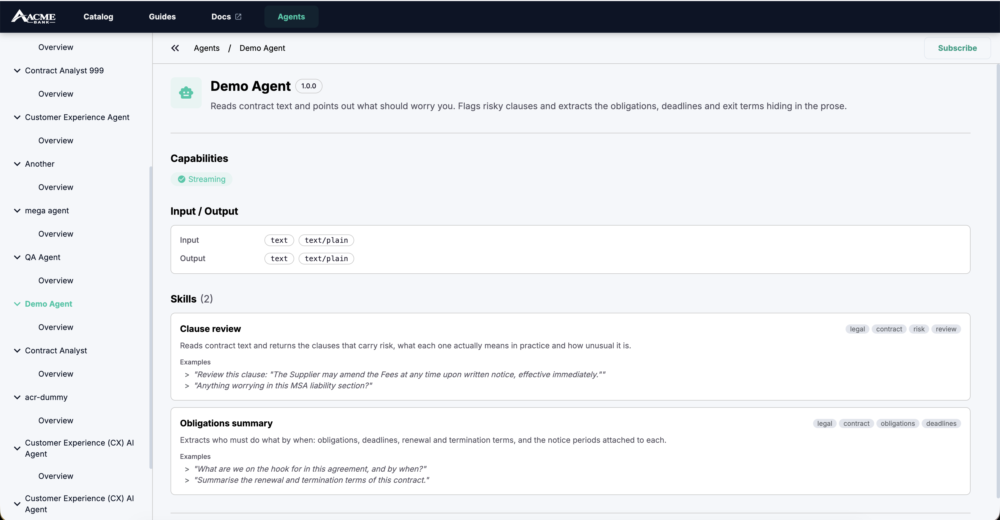

# Publish your agent to the Developer Portal

An agent that you expose through an A2A Proxy can be listed in the Developer Portal catalog. Consumers browse the catalog by category, search for an agent by name, open its listing to read its documentation, and subscribe to the A2A Proxy behind it. You list an agent from its **Marketplace** page in the Gamma console, or by adding it to the Developer Portal navigation from the APIM Console, alongside your APIs and API Products.

## Prerequisites

* An A2A Proxy that exposes the agent. See [Expose your agent with the A2A Proxy](../build/expose-agent-with-a2a-proxy.md). To publish from the agent's **Marketplace** page, the proxy must be linked to the agent. See [Route an agent through an A2A Proxy](../import/route-an-agent-through-an-a2a-proxy.md).
* The New Developer Portal enabled for the environment. The **Open Settings** link that leads to the navigation settings stays disabled until the portal is enabled.
* A folder in the Developer Portal navigation. The **Add Agent** action is available only on a folder, so an agent can't sit at the top level of the navigation or inside another agent.

## Publish from the agent's Marketplace page

A registered agent's **Marketplace** page lists the agent in the Developer Portal without leaving the Gamma console. It needs an A2A Proxy linked to the agent, because consumers reach a listed agent through the proxy and subscribe to its plans.

1. From the Gamma console sidebar, select **Agent Management**.
2. In the **Catalog** section of the sidebar, select **Agents**.
3. Click the agent's name.
4. In the **Operations** section of the agent's sidebar, click **Marketplace**.
5. In the **Agent Marketplace** card, under **Location**, select the navigation item to list the agent under, or select **+ Create new location** and type a folder name under **New location name**. A new location becomes a top-level folder in the portal navigation.
6. Click **Publish**.

The listing is titled with the agent's name, and a **&lt;agent&gt; is now in the Marketplace** notification appears. The card then carries a **Published** badge. It offers **Configure in Classic Console**, which opens the navigation editor in a new tab, **View in Marketplace**, which opens the listing in the portal, **Unpublish**, and **Remove**. When the section above the listing isn't published, the card warns that consumers can't reach the agent yet.

**Unpublish** hides the listing and keeps it in the navigation, so **Publish** brings it back in place, with an **Agent hidden from the Marketplace** or **Agent published to the Marketplace** notification. The badge reads **Unpublished** while the listing is hidden, and **Not published** before the agent is listed. **Remove** deletes the listing and the pages published under it from the navigation, after the **Remove this agent from the Marketplace?** dialog. The agent itself is left untouched, and an **Agent removed from the Marketplace** notification appears.

Before a proxy is linked, the page reads **Nothing to list yet** and offers **Create proxy for the agent**, which opens the agent's **Proxies** page. An agent that publishes no A2A address reads **Not listable yet**.

<figure><figcaption>
The Marketplace page of an agent after it was published
</figcaption></figure>

## Add the agent to the navigation from the APIM Console

1. In the APIM Console, open **Settings**.
2. Under **Portal**, click **Settings**.
3. Scroll to the **New Developer Portal** section.
4. Click **Open Settings**. The New Developer Portal settings open in a new browser tab.
5. Click **Navigation**.
6. In the **Navigation items** panel, click **More actions** on the folder that will hold the agent.
7. Click **Add Agent**.
8. In the **Add Agents** dialog, select the agents to list. The table lists the A2A Proxies of the environment with their **Agent name**, **Version**, and **Description**. Use **Search** to find one by name. An agent that's already in the navigation is marked **Already added** and can't be selected again. Each selection appears under **Agents selected**.
9. Optional: Turn on **Authentication is required to view selected Agents.** to hide the listings from consumers who aren't signed in. When the folder already requires authentication, the toggle is on and can't be turned off.
10. Click **Add**.

Each selected agent becomes an unpublished navigation item inside the folder, titled with the name of the A2A Proxy. When you select the item, the panel header shows **Linked Agent** followed by the name of the proxy. The linked proxy can't be changed after the item is created.

## Add documentation to the agent

An agent item holds the documentation that consumers read when they open the listing. Gravitee doesn't create a default page for an agent, so add at least one page before you publish it.

1. In the **Navigation items** panel, click **More actions** on the agent item.
2. Click **Add Page**, and then create the page.
3. Repeat for any other page. **Add Folder** and **Add Link** are also available to structure the documentation.

The listing opens on the first published page under the agent. The actions menu of an agent offers pages, folders, and links only, so APIs, API Products, and other agents aren't added under an agent.

## Publish the agent

Consumers see an agent only after its navigation item is published.

1. In the **Navigation items** panel, click **More actions** on the agent item.
2. Click **Publish**.
3. In the confirmation dialog, select **Also publish all nested documentation and APIs** to publish the pages under the agent in the same step.
4. Click **Publish**.

An agent can be published only when the folder that holds it is already published. When an agent is unpublished, every item nested under it is unpublished too.

To rename the item or change its authentication requirement, click **More actions** on the item, and then click **Edit**. The **Agent Display Name** field sets the title shown in the documentation tree. The catalog card keeps the name of the A2A Proxy. The **Authentication is required to view this agent.** toggle hides the listing from consumers who aren't signed in.

## Assign the agent to categories

The **Category** filter of the catalog matches an agent through the categories assigned to its navigation item. The **Catalog** page of the New Developer Portal settings assigns APIs and API Products to a category, and it has no action for agents. An agent's categories can be set only through the Management API, with the `categoryIds` property of its navigation item.

## What consumers see

In the catalog, a listed agent appears as a card marked **AGENT** that shows the name and description of the A2A Proxy. When the proxy has no description, the card reads **Description for this API is missing.** The card also carries an **MCP** badge when the proxy has an MCP server enabled. In the **List** view, the **Details** column shows the proxy's labels and the **Category** column shows the categories assigned to the navigation item.

Consumers find an agent in the following ways:

* **Browse by category**. The **Category** dropdown filters the catalog to the items assigned to that category.
* **Search**. The search bar matches the agent's name. When **Approximate spelling for API search** is turned on in the New Developer Portal settings, close misspellings match too.
* **Open the listing**. Selecting the card opens the agent's documentation on its first published page. The agent's page shows its **Capabilities**, its **Input / Output** modes, and its **Skills** with their examples. A **Subscribe** button starts a subscription to the A2A Proxy behind the agent. Consumers who aren't signed in see **Sign in to subscribe** instead.

A listing follows the visibility of its navigation item and of the folders above it. An unpublished item is hidden from everyone, and an item that requires authentication is hidden from consumers who aren't signed in.

<figure><figcaption>
An agent's listing in the Developer Portal, as a signed-in consumer sees it
</figcaption></figure>

## Next steps

* [Expose your agent with the A2A Proxy](../build/expose-agent-with-a2a-proxy.md): Create the A2A Proxy that backs a listing, and give clients access to it.
* [Configure your A2A Proxy](../build/configure-your-a2a-proxy/README.md): Configure the proxy's behavior, security, and observability.
