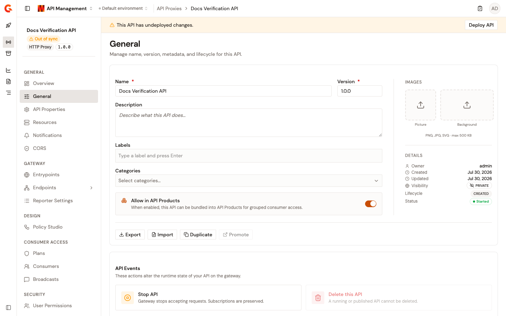

# Configure your API proxy

After creating and securing an API proxy, you refine its behavior from the API detail workspace. Every screen of the workspace is reachable from the API proxy sidebar, which groups configuration into seven sections: General, Gateway, Design, Consumer Access, Security, Monitoring, and Operations.

## Open the API detail workspace

1. Click **API Proxies** in the module sidebar.
2. Select the API proxy you want to configure. The workspace opens on the **Overview** page.

<figure><figcaption>
The API detail workspace
</figcaption></figure>

The sidebar header shows the API's picture, name, state badge (**Started**, **Stopped**, **Closed**, or **Out of sync**), type, and version.

## Deploy your changes

Saving a configuration change doesn't apply it to the gateway on its own. While changes are pending, the **This API has undeployed changes.** banner appears across the workspace. Click **Deploy API**, optionally enter a **Deployment label** of up to 32 characters in the **Deploy your API** dialog, and click **Deploy**. Each deployment appears on the [deployment history](review-deployment-history.md) page.

## Sidebar reference

The following tables list every sidebar entry and the page that documents it.

### General

| Tab                | Description                                                       | Page                                                     |
| ------------------ | ----------------------------------------------------------------- | -------------------------------------------------------- |
| **Overview**       | Setup checklist, gateway endpoints, and traffic snapshot.         | [Create an API proxy](../create-an-api-proxy.md)         |
| **General**        | Name, version, metadata, images, and lifecycle actions.           | [Manage general settings](manage-general-settings.md)    |
| **API Properties** | Static and dynamic key/value properties read by policies.         | [Configure API properties](configure-api-properties.md)  |
| **Resources**      | API-level resources, such as caches and OAuth providers, that policies use at runtime. | [Configure API resources](configure-api-resources.md) |
| **Notifications**  | Console, email, and webhook notifications for API events.         | [Configure notifications](configure-notifications.md)    |
| **CORS**           | Cross-origin access configuration.                                | [Configure CORS](configure-cors.md)                      |

### Gateway

| Tab                          | Description                                                       | Page                                                              |
| ---------------------------- | ----------------------------------------------------------------- | ----------------------------------------------------------------- |
| **Entrypoints**              | Context paths, virtual hosts, and exposed entrypoints.            | [Configure entrypoints](configure-entrypoints.md)                 |
| **Endpoints**                | Endpoint groups, individual endpoints, load balancing, health checks, and connection settings. | [Configure endpoints](configure-backend-security.md) |
| ↳ **Failover**               | Automatic retries and circuit breaker behavior.                   | [Configure failover](configure-failover.md)                       |
| ↳ **Health Check Dashboard** | Endpoint availability, response times, and failed health checks.  | [Monitor endpoint health](../../observe/monitor-endpoint-health.md) |
| **Reporter Settings**        | Logging, analytics, and OpenTelemetry tracing configuration.      | [Configure logging and tracing](configure-logging-and-tracing.md) |

### Design

| Tab               | Description                                                                | Page                                                  |
| ----------------- | -------------------------------------------------------------------------- | ----------------------------------------------------- |
| **Policy Studio** | Visual editor for the request and response policy chains of the API.       | [Apply security policies](apply-security-policies.md) |

### Consumer Access

| Tab            | Description                                                                    | Page                                                      |
| -------------- | ------------------------------------------------------------------------------ | --------------------------------------------------------- |
| **Plans**      | Security plans (API Key, JWT, OAuth2, mTLS, and Keyless) and their lifecycle.  | [Secure your API proxy](../secure-your-api-proxy.md)      |
| **Consumers**  | Subscription management, approvals, and API key management.                    | [Establish consumer access](establish-consumer-access.md) |
| **Broadcasts** | One-way announcements to API consumers.                                        | [Broadcast messages to consumers](broadcast-messages-to-consumers.md) |

### Security

| Tab                  | Description                                          | Page                                                  |
| -------------------- | ---------------------------------------------------- | ----------------------------------------------------- |
| **User Permissions** | Members, groups, roles, and ownership transfer.      | [Manage user permissions](manage-user-permissions.md) |

### Monitoring

| Tab            | Description                                      | Page                                                        |
| -------------- | ------------------------------------------------ | ----------------------------------------------------------- |
| **Alerts**     | Alerting conditions for the gateway.             | Configured on the **Alerts** tab.                           |
| **Audit Logs** | Change history and audit trail for the API.      | [Review audit logs](../../observe/review-audit-logs.md)     |

### Operations

| Tab                 | Description                                    | Page                                                          |
| ------------------- | ---------------------------------------------- | ------------------------------------------------------------- |
| **Deployment**      | Deployment targeting and history.              |                                                               |
| ↳ **Configuration** | Sharding tags that target gateway instances.   | [Configure deployment](configure-deployment.md)               |
| ↳ **History**       | Deployment versions, diffing, and rollback.    | [Review deployment history](review-deployment-history.md)     |
