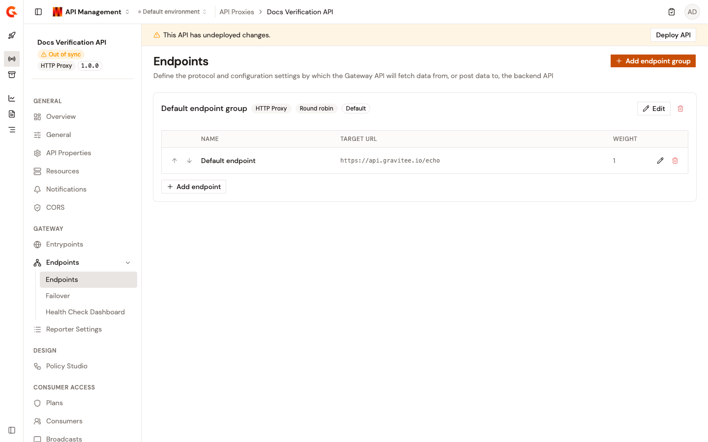

# Configure endpoints

Endpoints define where the API Gateway routes requests after authentication. Each endpoint group points to one or more backend services and controls how the Gateway connects to them: load balancing, timeouts, SSL/TLS, proxy settings, and custom headers.

## Endpoint groups

<figure><figcaption>
The Endpoints page shows all configured endpoint groups, their load-balancing type, and individual backend entries.
</figcaption></figure>

An endpoint group is a logical container for one or more backend endpoints that share common connection settings. Every API proxy has at least one default endpoint group created during the API creation wizard.

### Create an endpoint group

1. Click **API Proxies** in the module sidebar.
2. Select your API proxy.
3. Click **Endpoints** in the API proxy sidebar.
4. Click **Endpoints** in the expanded menu.
5. Click **Add endpoint group**.
6. Complete the wizard. For HTTP proxy APIs, a **Health-check** step follows the **General** and **Configuration** steps, with the same fields as the [endpoint health-check step](#step-3-health-check).

#### Step 1: General

| Field             | Description                                                             | Default     |
| ----------------- | ----------------------------------------------------------------------- | ----------- |
| **Name**          | A unique name for the endpoint group. Must not contain colons.          | (required)  |
| **Load balancer** | The algorithm used to distribute traffic across endpoints in the group. | Round robin |

**Load balancer types:**

| Type                     | Description                                                           |
| ------------------------ | --------------------------------------------------------------------- |
| **Round robin**          | Distributes requests evenly across endpoints in order.                |
| **Random**               | Selects a random endpoint for each request.                           |
| **Weighted round robin** | Distributes requests proportionally based on each endpoint's weight.  |
| **Weighted random**      | Selects endpoints at random, weighted by each endpoint's weight value. |

#### Step 2: Configuration

The configuration step provides shared settings that apply to all endpoints in the group by default. Individual endpoints can override these settings.

**HTTP settings:**

| Field                          | Description                                                                    | Default  |
| ------------------------------ | ------------------------------------------------------------------------------ | -------- |
| **Connect timeout**            | Maximum time (ms) to wait for a connection to the upstream service.            | 5000     |
| **Read timeout**               | Maximum time (ms) to wait for a response from the upstream service.            | 10000    |
| **Idle timeout**               | Time (ms) before an idle connection is closed.                                 | 60000    |
| **Keep-alive timeout**         | Time (ms) to keep a persistent connection alive.                               | 30000    |
| **Max concurrent connections** | Maximum number of concurrent connections to the upstream service.              | 100      |
| **Keep-alive**                 | Reuse TCP connections across multiple requests.                                | On       |
| `Pipelining`                   | Send multiple requests over a single connection without waiting for responses. | Off      |
| **Follow redirects**           | Automatically follow HTTP 3xx redirects from the upstream.                     | Off      |
| **Use compression**            | Enable response compression from the gateway.                                  | On       |
| **Propagate Accept-Encoding**  | Forward the client's `Accept-Encoding` header to the upstream.                 | Off      |
| **Propagate Host header**      | Forward the client's `Host` header to the upstream.                            | Off      |
| **HTTP version**               | The HTTP protocol version to use for upstream connections.                     | HTTP/1.1 |

**Proxy settings:**

Configure an HTTP or SOCKS proxy between the Gateway and the upstream service.

| Field                | Description                                 | Default |
| -------------------- | ------------------------------------------- | ------- |
| **Use system proxy** | Use the system-configured proxy settings.   | Off     |
| **Proxy type**       | `HTTP` or `SOCKS`.                          | HTTP    |
| **Host**             | Proxy hostname (for example, `proxy.example.com`). | (empty) |
| **Port**             | Proxy port (for example, `3128`).                  | (empty) |
| **Username**         | Proxy authentication username (optional).   | (empty) |
| **Password**         | Proxy authentication password (optional).   | (empty) |

**SSL / TLS settings:**

| Field                      | Description                                                                                           | Default |
| -------------------------- | ----------------------------------------------------------------------------------------------------- | ------- |
| **Hostname verifier**      | Verify that the upstream server's certificate hostname matches the request hostname.                  | On      |
| **Trust all certificates** | Accept any upstream certificate without validation. Not recommended for production.                   | Off     |
| **Client authentication**  | Whether the Gateway presents a client certificate to the upstream. `NONE`, `OPTIONAL`, or `REQUIRED`. | None    |

**HTTP headers:**

Add headers that the Gateway always sends to the upstream endpoint. Each header is a name/value pair. Use this to pass static authentication tokens, correlation headers, or service mesh metadata.

5. Select **Save endpoint group** to create the group.

## Individual endpoints

Each endpoint within a group represents a single backend service URL. Endpoints inherit the group's shared configuration by default, but can override any setting individually.

### Add an endpoint to a group

1. On the **Endpoints** page, locate the target endpoint group.
2. Select **Add endpoint**.
3. Complete the endpoint form:

#### Step 1: General

| Field          | Description                                                                                  | Default    |
| -------------- | -------------------------------------------------------------------------------------------- | ---------- |
| **Name**       | A unique name within the group. Must not contain colons.                                     | (required) |
| **Target URL** | The upstream service URL (for example, `https://backend.example.com`). Must not contain whitespace. | (required) |
| **Weight**     | Relative weight for weighted load balancers. Must be at least 1.                             | 1          |
| **Tenants**    | Restrict this endpoint to requests from specific gateway tenants.                            | None       |

#### Step 2: Configuration

By default, endpoints inherit the group's shared configuration. Toggle **Inherit configuration** off to override HTTP, proxy, SSL, or header settings for this specific endpoint.

#### Step 3: Health-check

The health-check service monitors the availability and health of your endpoints. The same step appears in the endpoint group wizard, and an individual endpoint either inherits the group configuration or overrides it.

| Field                       | Description                                                                                                          |
| --------------------------- | -------------------------------------------------------------------------------------------------------------------- |
| **Inherit configuration**   | Inherit the health check service configuration from the endpoint group. Shown when the group carries its own health-check settings. |
| **Enabled**                 | Turns the health-check service on. The service requires an API deployment, so deploy the API to start it.            |
| Schedule                    | A cron expression that sets the probe frequency.                                                                      |
| **Request**                 | The HTTP method, and the path or full URL of the probe. By default, the path is appended to the endpoint path.        |
| **Override endpoint path**  | When enabled, the path above replaces the endpoint path instead of being appended.                                    |
| **HTTP headers**            | Headers added to the health check request.                                                                            |
| **Assertion**               | An Expression Language expression evaluated on the health check response, for example `{#response.status == 200}`. Required. |
| **Success threshold**       | Consecutive successes before marking the endpoint available.                                                          |
| **Failure threshold**       | Consecutive failures before marking the endpoint unavailable.                                                         |

The results appear on the Health Check Dashboard. See [Monitor endpoint health](../../observe/monitor-endpoint-health.md).

4. Select **Add endpoint** (or **Save endpoint** when editing) to save.

## Next steps

* [Establish consumer access](establish-consumer-access.md): Configure how consumers subscribe to and authenticate with your API.
* [Apply security policies](apply-security-policies.md): Add request/response policies on top of backend security.
