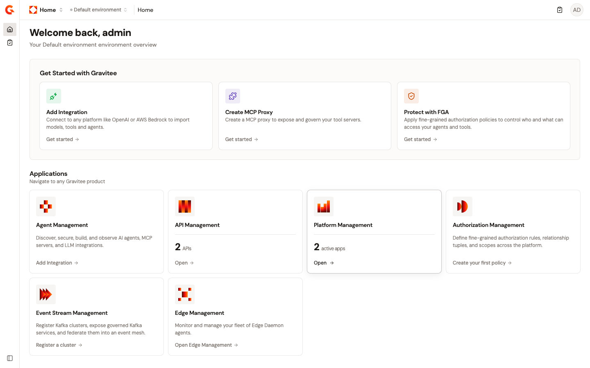

# API Management overview

API Management is Gravitee's product line for governing REST, GraphQL, gRPC, and WebSocket traffic. Within Gamma, API Management provides a dedicated console for creating, securing, and monitoring API proxies. The API proxy is the core building block that mediates between consumers and backend services.

## What API Management does

API Management sits between the consumers that call your APIs and the backend services that fulfill those requests. The **API Gateway** enforces runtime policy on every request, including authentication, rate limiting, transformation, and routing. The **Gamma console** provides the control plane where you design, secure, publish, and observe your APIs.

API Management provides the following key capabilities:

* **API proxy creation**. Define an API proxy with a context path, upstream target URL, and security plan. Choose from a step-by-step wizard or a template-based flow that preconfigures common patterns.
* **Security plans**. Attach one or more plans to control who can call your API and how they authenticate. Supported plan types include Keyless, API Key, JWT, OAuth2, and mTLS.
* **Policy enforcement**. Apply fine-grained policies at the request and response level, including rate limiting, content transformation, and authorization checks powered by Authorization Management.
* **Consumer access**. Manage applications, subscriptions, and API keys so that consumers can discover and call your APIs through controlled channels.
* **Observability**. Monitor request volume, latency, error rates, and audit history for every deployed API.

## How API Management fits into Gamma

<figure><figcaption>
The Gamma platform home page. The Get Started section offers quick-action cards for common tasks. The Applications section provides access to the six modules: Agent Management, API Management, Platform Management, Authorization Management, Event Stream Management, and Edge Management.
</figcaption></figure>

Gamma unifies four product lines under a shared platform: API Management, Event Stream Management, Agent Management, and Authorization Management. All four share the following foundations:

1. **A common Catalog** of assets, such as APIs, events, tools, agents, MCP servers, and models
2. **A common authorization engine** that defines fine-grained policies against those cataloged assets
3. **Common enforcement points** that evaluate the same policies at the wire level: the AI Gateway, API Gateway, and Event Gateway

API Management contributes REST, GraphQL, gRPC, and WebSocket APIs to the Catalog. Those APIs can be exposed as **API Tools** in [Agent Management](../../agent-management/get-started/ai-management-overview.md), which makes ten years of accumulated enterprise API catalogs accessible to AI agents without redevelopment. Similarly, Kafka APIs governed through [Event Stream Management](../../event-stream-management/get-started/event-stream-management-overview.md) can be exposed as Kafka API Tools, which bridges event streams to the AI agent layer through the same Catalog.

## Next steps

To create your first API proxy in under five minutes, see [Create your first API](create-your-first-api.md).

For a complete reference on all creation options, including scratch and template wizard modes, all security plan types, and advanced configuration, see [Create an API proxy](../build/create-an-api-proxy.md).
