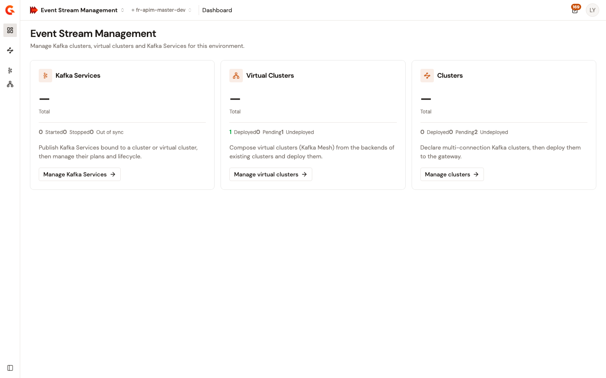

# Event Stream Management overview

Event Stream Management is Gravitee's product line for governing Kafka clusters, event-driven data flows, and streaming infrastructure. Within Gamma, Event Stream Management provides a dedicated console for registering Kafka clusters, creating governed Kafka Services, and provisioning Virtual Clusters for multi-tenant isolation.

<figure><figcaption>
The Event Stream Management dashboard. The three cards show Kafka Services (lifecycle management), Virtual Clusters (Kafka Mesh composition), and Clusters (multi-connection registrations).
</figcaption></figure>

<!-- Source: applications.ts — gravitee-gamma-control-plane-webui @ cb0911bad0 -->

## What Event Stream Management does

Event Stream Management sits between your Kafka infrastructure and the teams and agents that produce and consume event data. The **Event Gateway** enforces runtime policy on every event interaction — authentication, authorization, rate limiting, and protocol mediation — while the **Gamma console** provides the control plane where you register clusters, build services, and inspect traffic.

Key capabilities include:

* **Kafka cluster registration** — Import existing Kafka clusters into Gamma so they can be governed, monitored, and composed into higher-level services.
* **Kafka Service creation** — Define a governed Kafka Service — with security plans, policies, and access controls — backed by either a Registered Cluster directly or a Virtual Cluster for isolation. Analogous to an [API proxy](../../api-management/build/create-an-api-proxy.md) in API Management.
* **Virtual Clusters** — Provision logically isolated Kafka environments on shared infrastructure for multi-tenant workloads.
* **Protocol mediation** — Mediate between different event protocols and transports through the Event Gateway.

## How Event Stream Management fits into Gamma

Gamma unifies four product lines — API Management, Event Stream Management, Agent Management, and Authorization Management — under a shared platform. All four share:

1. **A common Catalog** of assets (APIs, events, tools, agents, MCP servers, models)
2. **A common authorization engine** that defines fine-grained policies against those cataloged assets
3. **Common enforcement points** (AI Gateway, API Gateway, Event Gateway) that evaluate the same policies at the wire level

Event Stream Management contributes Kafka APIs and event streams to the Catalog. Those Kafka APIs can be exposed as **Kafka API Tools** in Agent Management, making existing event infrastructure accessible to AI agents without redevelopment.

## Get started

* [Create your first Kafka service](create-your-first-kafka-service.md) — Register a cluster and create a governed Kafka service in under five minutes
