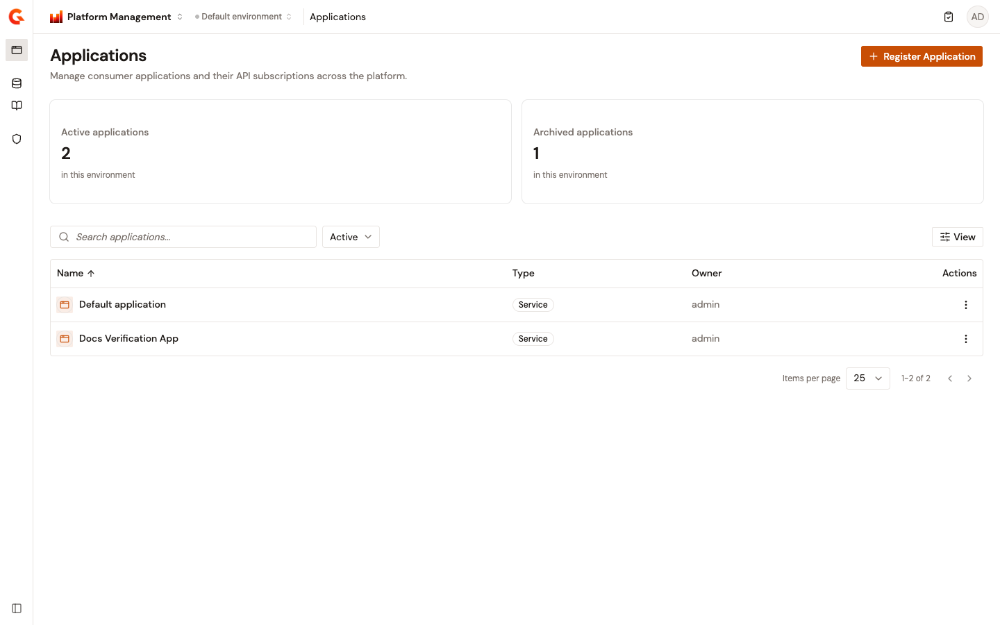

# Manage applications

Applications represent external consumers that call your APIs. The Applications page in the Gamma console lets you view, create, and manage the applications that subscribe to your API plans.

## View applications

From the Gamma console sidebar, select **Platform Management**, and then navigate to **Applications**. The page header shows KPI tiles for the **Active applications** and **Archived applications** counts.

The applications table displays the following columns:

* **Name**. The application name. You can sort the table on this column.
* **Type**. The application type, such as Backend, Service, or Web.
* **Owner**. The user who created the application.
* **Actions**. A row menu that contains the **View Details** and **Manage Subscriptions** actions.

Use the search bar to filter applications by name. The **Active**/**Archived** dropdown filter toggles between the active and archived application views. The archived view lists each application with the date it was archived, and you can restore an application directly from its row. The **View** control chooses which columns the table displays, and the list supports pagination for large application sets.

<figure><figcaption>
The Applications page lists all consumer applications with their type (Backend, Service, Web) and owner. Use the search bar and Active/Archived filter to find specific applications.
</figcaption></figure>

## Create an application

To create an application, complete the following steps:

1. From the applications list, select **Register Application**.
2. In the **General** section, enter the application details described in the following table:

    | Field           | Description                                         | Required |
    | --------------- | --------------------------------------------------- | -------- |
    | **Name**        | A human-readable name to identify the application.  | Yes      |
    | **Description** | Freeform text describing the application's purpose. | Yes      |
    | **Domain**      | The domain associated with this application.        | No       |

3. In the **Security** section, select the application type. **Simple** is a standalone client for which you manage your own client ID. Additional OAuth application types are available only when Dynamic Client Registration is enabled for the environment.
4. Complete the remaining **Security** fields described in the following table:

    | Field                              | Description                                                                                                   | Required |
    | ---------------------------------- | ------------------------------------------------------------------------------------------------------------- | -------- |
    | **Type**                           | A freeform descriptor of the application, such as mobile or web.                                              | No       |
    | **Client ID**                      | The client ID of the application. This field is required to subscribe to certain types of API plan, such as OAuth2 and JWT. | No       |
    | **Client Certificate (PEM Only)**  | The PEM-encoded client certificate of the application. This field is required to subscribe to certain mTLS plans. | No       |

5. Select **Create Application**.

## Application details

Select an application from the list to open its detail page, which contains the following sections:

* **Overview**. A setup checklist for the application and a snapshot of its subscription counts.
* **General**. The application name, description, domain, images, owner, creation date, type, API key mode, client ID, and mTLS client certificates. This section also holds the action that archives the application.
* **User Permissions**. Manage direct members, configure group access, and transfer application ownership.
* **Subscriptions**. The plans this application subscribes to. Create a subscription, filter by API and status, search by API key, and review each subscription's status and dates.
* **Notification settings**. Configure the events that trigger a notifier for this application, using either the default email notifier or the default webhook notifier. This section also holds the custom metadata available in notification templates. The metadata editor rejects a duplicate key and reports that the metadata already exists.

## Next steps

* [Manage resources](manage-resources.md). Configure shared resources used across your APIs.
* [Establish consumer access](../api-management/build/configure-your-api-proxy/establish-consumer-access.md). Configure subscriptions between applications and API plans.
