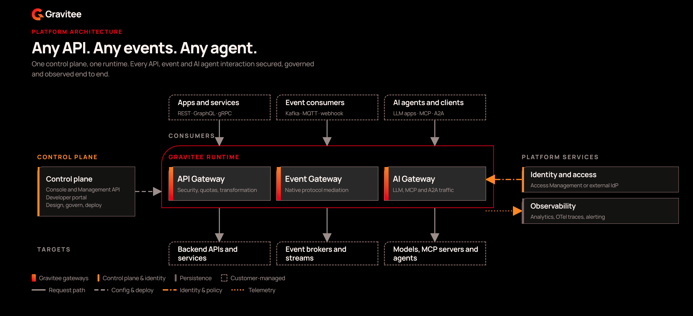

# Overview

Gravitee Gamma lets you govern, secure, and observe enterprise traffic across APIs, event streams, and AI agent interactions from a single platform. Its modules draw on one catalog of assets, one authorization engine, and one set of enforcement points, so a policy you write once applies wherever that traffic runs.

<figure><figcaption>
The Gamma platform architecture
</figcaption></figure>

## Why Gamma exists

Modern enterprises run three distinct traffic types in isolation: REST, GraphQL, and gRPC APIs, Kafka event streams, and AI agent traffic. Agent traffic covers LLM calls, MCP tool invocations, and agent-to-agent delegations. Separate management of these traffic types fragments visibility, duplicates policy configuration, and leaves AI usage unaudited across your organization.

Gamma addresses the following core challenges:

* **Unmanaged AI traffic**. Engineering teams use Claude Code, Cursor, and ChatGPT Enterprise with no central visibility into cost, model usage, or data exposure. Agents call MCP tools on upstream servers using shared API keys or unaudited credentials.
* **Fragmented authorization**. Policies written for API gateways don't extend to AI agents or event streams. Different traffic types are governed by different tools with no common enforcement point.
* **Disjointed infrastructure**. REST APIs, Kafka topics, MCP servers, AI models, and agents sit in separate registries with no shared catalog. Cross-protocol policy can't be expressed, and existing infrastructure can't reach AI agents without redevelopment.

## The modules

The Gamma console presents six application modules. The following table describes what each module governs and where to start:

| Module | What it governs | Start here |
| --- | --- | --- |
| **API Management** | REST, GraphQL, gRPC, and WebSocket traffic, through API proxies | [API Management overview](../api-management/get-started/api-management-overview.md) |
| **Event Stream Management** | Kafka clusters, Kafka Services, and Virtual Clusters | [Event Stream Management overview](../event-stream-management/get-started/event-stream-management-overview.md) |
| **Agent Management** | LLM calls, MCP tool invocations, and agent-to-agent delegations | [Agent Management overview](../agent-management/overview/README.md) |
| **Authorization Management** | Fine-grained access control over every cataloged asset, written in GAPL | [Authorization Management overview](../authorization-management/get-started/authorization-management-overview.md) |
| **Edge Management** | AI traffic that leaves your managed devices | [Edge Management overview](../edge-management/get-started/edge-management-overview.md) |
| **Platform Management** | Installation, environment settings, and the assets that APIs share | [Install](install/README.md) |

If you are evaluating Gamma, start with the module overview that matches the traffic you need to govern. Edge Management is a preview feature, and it isn't production-ready.

## Platform components

Gamma includes the following components:

* **API Gateway**. This gateway enforces runtime policy on every API request: authentication, rate limiting, content transformation, and routing between consumers and backend services.
* **AI Gateway**. This gateway is the unified runtime for LLM, MCP, and A2A traffic. It runs three proxies, the LLM Proxy, MCP Proxy, and A2A Proxy, that share an authentication chain, a policy chain, an observability chain, and an Authorization Management integration point.
* **Event Gateway**. This gateway enforces runtime policy on every Kafka interaction: authentication, authorization, rate limiting, and protocol mediation.
* **Gamma console**. This is the Control Plane where every module is configured, observed, and managed.
* **Catalog**. This is the authoritative registry of every asset an agent or consumer can use: AI models, MCP servers, prompts, MCP resources, tools, knowledge and data sources, skills, and agents. Policy is authored against cataloged entities.
* **Policy Decision Point (PDP)**. The PDP evaluates the applicable Gravitee Authorization Policy Language (GAPL) policies at microsecond latency with no network hop, and it runs inside every gateway.
* **Edge Daemon**. This lightweight process is installed on employee devices using mobile device management. It observes outgoing AI traffic, enforces local pre-egress policies, and forwards requests to the AI Gateway.

## Use cases for Gamma

### Govern every traffic type from one platform

The following table maps each outcome to the feature that delivers it:

| Outcome | Feature |
| --- | --- |
| A REST, GraphQL, gRPC, or WebSocket API reaches its consumers behind a security plan, a policy chain, and analytics. | [Create an API proxy](../api-management/build/create-an-api-proxy.md) |
| A Kafka cluster is consumed as a governed service rather than a set of bootstrap addresses handed out by hand. | [Create a Kafka service with a registered cluster](../event-stream-management/build/create-a-kafka-service-with-a-registered-cluster.md) |
| Provider credentials for LLM traffic are held once on the AI Gateway instead of being copied into every team's configuration. | [Create an LLM Proxy](../agent-management/build/create-an-llm-proxy.md) |
| A Kafka cluster is shared by several teams without exposing any of them to the topics of the others. | [Establish a Virtual Cluster](../event-stream-management/build/establish-a-virtual-cluster.md) |
| An API estate running on another gateway moves to Gravitee without a rewrite of every proxy. | [Plan a gateway migration](../api-management/migrate/plan-a-gateway-migration.md) |

### Secure and publish consumer access

The following table maps each outcome to the feature that delivers it:

| Outcome | Feature |
| --- | --- |
| Consumers authenticate against an API with a Keyless, API Key, JWT, OAuth2, or mTLS plan. | [Secure your API proxy](../api-management/build/secure-your-api-proxy.md) |
| A subscription ties one application to one plan, so access is approved, rejected, and revoked per consumer. | [Establish consumer access](../api-management/build/configure-your-api-proxy/establish-consumer-access.md) |
| A policy chain written once is reused across the flows of many APIs. | [Reuse policies with shared policy groups](../api-management/build/shared-policy-groups.md) |
| Several APIs are published together as one product, with a shared plan and a single subscription. | [Create API Products](../api-management/build/api-products.md) |

### Expose existing infrastructure to AI agents

The following table maps each outcome to the feature that delivers it:

| Outcome | Feature |
| --- | --- |
| A REST API already governed in API Management becomes an agent-callable tool, carrying over its security plans, policies, and backend configuration. | [Create API tools](../agent-management/import/create-api-tools.md) |
| An agent gets exactly the tools it needs, composed from several upstream servers into one governed endpoint. | [Create an MCP proxy](../agent-management/build/create-an-mcp-proxy.md) |
| An external agent that publishes an A2A agent card is registered in the Catalog from its endpoint. | [Register an agent](../agent-management/import/import-an-agent.md) |

### Enforce one authorization model across protocols

The following table maps each outcome to the feature that delivers it:

| Outcome | Feature |
| --- | --- |
| One policy language decides access to APIs, MCP tools, AI models, and agents. | [Create your first policy](../authorization-management/get-started/create-your-first-policy.md) |
| Principals come from your existing identity provider rather than a separate list maintained by hand. | [Sync principals from Access Management](../authorization-management/manage/principals/sync-principals-from-access-management.md) |
| A caller reaches only the tools its identity permits, and a call that matches no permit is denied rather than allowed by omission. | [Layered governance for MCP tools](../agent-management/build/configure-your-mcp/govern-mcp-tool-access.md) |
| Every gateway reaches the same decision locally, so authorization adds no network hop. | [Configure the Gravitee Gateway as a runtime](../authorization-management/evaluate/configure-gravitee-gateway-as-runtime.md) |

### Account for what AI traffic costs

The following table maps each outcome to the feature that delivers it:

| Outcome | Feature |
| --- | --- |
| Every LLM call records the provider, the model that answered, and the tokens in and out. | [Monitor your LLM proxy](../agent-management/observe/monitor-your-llm-proxy.md) |
| Token spend is capped per consumer over a rolling period, counting the tokens the provider bills you for rather than the number of calls. | [Add the Token Rate Limit policy](../agent-management/build/add-the-token-rate-limit-policy.md) |
| AI traffic on employee devices that bypasses the gateway entirely becomes visible. | [Monitor your shadow AI traffic](../edge-management/observe/monitor-shadow-ai-traffic.md) |

### Administer the platform

The following table maps each outcome to the feature that delivers it:

| Outcome | Feature |
| --- | --- |
| Consumer applications and the subscriptions they hold are managed in one place. | [Manage applications](manage-applications.md) |
| API policies read environment-scoped lookup data that you maintain by hand or refresh from an HTTP provider. | [Manage dictionaries](manage-dictionaries.md) |
| Every API in an environment inherits a set of key-value entries defined once. | [Manage environment metadata](manage-environment-metadata.md) |
| The console connects to a Gravitee Access Management instance, so agent identities and security plans can use its domains. | [Configure Access Management](configure-access-management.md) |

## Supported protocols and standards

Gamma supports the following protocols and standards:

| Protocol | Support | Notes |
| --- | --- | --- |
| REST / HTTP | Full | API proxies with context path or virtual host routing |
| GraphQL | Full | Governed through API Management |
| gRPC | Full | Governed through API Management |
| WebSocket | Full | Governed through API Management |
| Kafka | Full | Native Kafka protocol through the Event Gateway, using Kafka Services and Virtual Clusters |
| MCP | Full | JSON-RPC 2.0 through the MCP Proxy in Proxy mode or Studio mode |
| A2A | Full | Through the A2A Proxy, with `/.well-known/agent-card.json` skill discovery |
| LLM APIs | Full | Through the LLM Proxy, with provider-specific routing for OpenAI, Anthropic, Gemini, Bedrock, and Vertex AI |

An LLM Proxy accepts inbound requests in the OpenAI, Anthropic Messages, and Gemini `generateContent` formats, and translates them to the native API of the provider you configured. For the full feature matrix, see [LLM Proxy provider support](../agent-management/build/llm-proxy-provider-support.md).

## Observability

Gamma records every governed interaction. The following table describes where each kind of evidence appears:

| Surface | What it answers |
| --- | --- |
| [**API dashboard and metrics**](../api-management/observe/api-dashboard.md) | Request volume, latency, and error rates for a deployed API proxy. |
| [**Monitor API usage**](../api-management/observe/monitor-api-usage.md) | Which applications call an API, how often, and with what errors. |
| [**Monitor endpoint health**](../api-management/observe/monitor-endpoint-health.md) | Whether the backends behind an API pass their health checks. |
| [**Agent Management dashboards**](../agent-management/observe/dashboards/README.md) | What your AI traffic costs, which models and tools it reaches, and how much of it runs outside the governance layer. |
| [**Logs**](../agent-management/observe/logs/README.md) | What a single invocation carried and how it was handled. |
| [**Tracing**](../agent-management/observe/tracing/README.md) | How one request moved through a proxy, as a span timeline or a lineage graph. |
| [**Trace Explorer**](configure-opentelemetry-tracing-and-logs.md) | How one request moved through the gateway, once the OpenTelemetry pipeline is wired. |
| [**Audit logs**](../api-management/observe/review-audit-logs.md) | Who changed which API configuration, and when. |

## How the platform fits together

Every module shares the following three foundations:

1. **A common Catalog.** APIs from API Management become API Tools, and Kafka services contribute event sources, so existing enterprise infrastructure becomes agent-accessible without redevelopment.
2. **A common authorization engine.** [Authorization Management](../authorization-management/get-started/authorization-management-overview.md) defines fine-grained, catalog-aware policies that the AI Gateway, API Gateway, and Event Gateway all enforce at the wire level.
3. **Common enforcement architecture.** The same Policy Decision Point runs inside every gateway, and it returns a decision at microsecond latency with no network hop.

A single enterprise request often crosses several modules. An agent invocation arrives at the A2A Proxy, the LLM Proxy handles the model call, and the MCP Proxy governs the tool call. The API Gateway then serves the underlying API, and the Event Gateway handles the published event. You need one place to define policy, one place to see the trace, and one place to attribute cost.

## Next steps

If you are new to Gravitee Gamma, complete the following steps:

1. [**Install Gamma**](install/README.md). Deploy the platform with Docker or Kubernetes, self-hosted or hybrid.
2. [**Create your first API**](../api-management/get-started/create-your-first-api.md). Create an API proxy and enforce a security plan in under five minutes.
3. [**Create your first MCP server**](../agent-management/get-started/create-your-first-mcp-server.md). Put an MCP Proxy in front of an upstream MCP server, and verify tool invocations.
4. [**Create your first Kafka service**](../event-stream-management/get-started/create-your-first-kafka-service.md). Register a Kafka cluster and create a governed Kafka service.

For what the current release adds across every module, see [Release Notes](gamma-release-notes.md).
