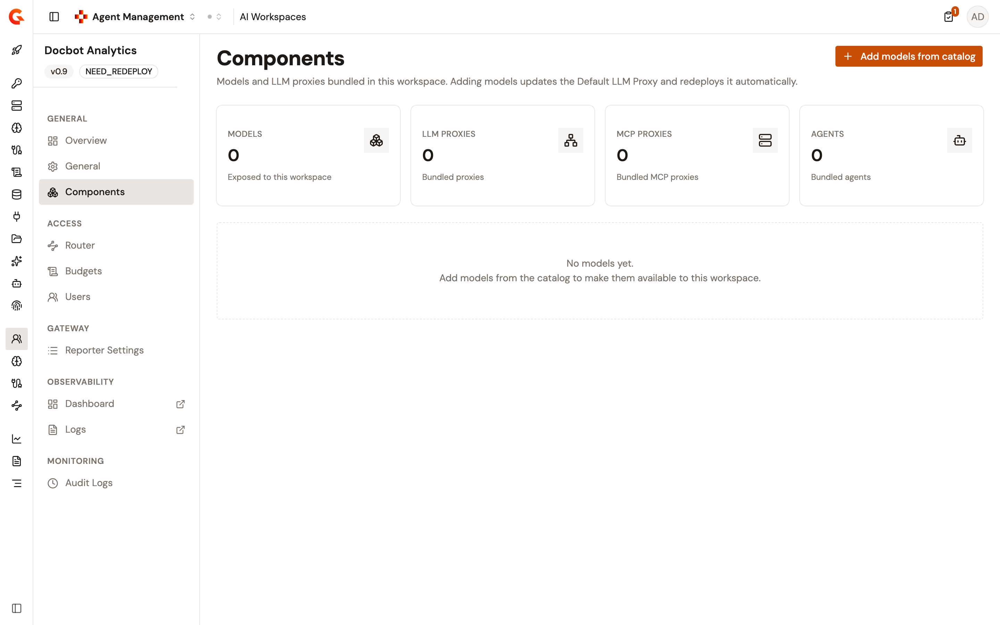
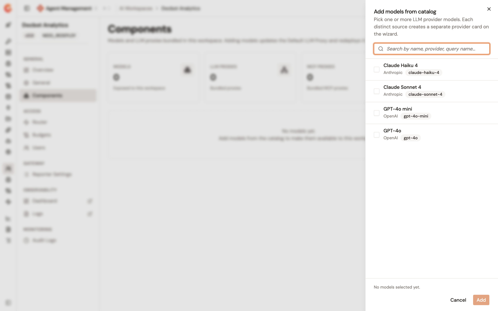
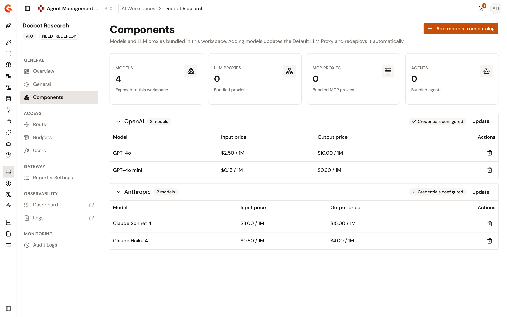

# Add models to an AI workspace

The models an AI Workspace holds are the models its members can call. You add them from the AI model catalog on the **Components** page of the workspace.

Adding the first model provisions the Default LLM Proxy of the workspace. Gravitee creates the proxy scoped to the models you selected, attaches it to the workspace, starts it, and deploys it. The proxy is created as a universal LLM Proxy. For the paths and request formats a universal proxy accepts, see [Accepted request formats](accepted-request-formats.md). Adding more models later updates that same proxy and deploys it again.


The models you add come from the AI model catalog. To register a model there first, see [Add an AI model](../import/add-an-ai-model.md).


## Add models

To add models to an AI Workspace, complete the following steps:

1. From the Gamma console sidebar, select **Agent Management**.
2. Under **Secure**, select **AI Workspaces**.
3. Select the workspace.
4. Under **General**, select **Components**.

    <figure><figcaption><p>The Components page before the first model is added</p></figcaption></figure>

5. Select **Add models from catalog**.
6. Select the models to add. Each row carries the model name, its provider, and the query name callers send. Search by any of the three to narrow the list.

    <figure><figcaption><p>The catalog model picker</p></figcaption></figure>

7. Select **Add**.
8. In the **Provider authentication** panel, enter the credentials for each provider whose models you picked, then submit.

The **Components** page then lists the models grouped by provider, with a **Credentials configured** badge on each provider, and the **Models** card counts the models exposed to the workspace. The **LLM Proxies**, **MCP Proxies**, and **Agents** cards beside it always read `0`.

## Remove a model

Removing a model from the **Components** page takes it out of the Default LLM Proxy, so members can no longer call it.

Removing the last model of a provider removes the provider with it. Removing the last model of the workspace goes further. Gravitee detaches the Default LLM Proxy from the workspace and deletes it. The workspace then has no gateway path until you add a model again.

## What members can call

The Default LLM Proxy answers on the gateway path of the workspace, which the **Connection** card of the **Overview** page shows as the entrypoint URL. Members authenticate with their own API key. See [Assign users to an AI workspace](assign-users-to-an-ai-workspace.md).

A request that names a model the workspace doesn't hold is refused on the `/chat/completions`, `/responses`, `/embeddings`, and `/count_tokens` paths. The gateway returns `400` with the following body:

```json
{
  "error": {
    "message": "The requested model does not exist.",
    "type": "invalid_request_error",
    "param": "model",
    "code": "model_not_found"
  }
}
```

Requests on other paths are passed to the upstream provider without model resolution. The `/models` path lists the models the workspace exposes.

## Verification

To verify the models are available to the workspace, follow these steps:

1. Open the workspace.
2. On the **Overview** page, copy the entrypoint URL from the **Connection** card.
3. Under **Access**, select **Users**, and copy the API key of a member.
4. Call the `/models` path of the entrypoint URL with that key, and confirm the response lists the models you added.
5. Call the `/chat/completions` path with a model the workspace doesn't hold, and confirm the gateway returns `400` with the `model_not_found` code.

    <figure><figcaption><p>Models grouped by provider on the Components page</p></figcaption></figure>
