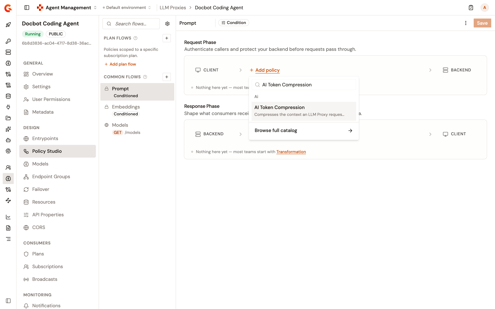
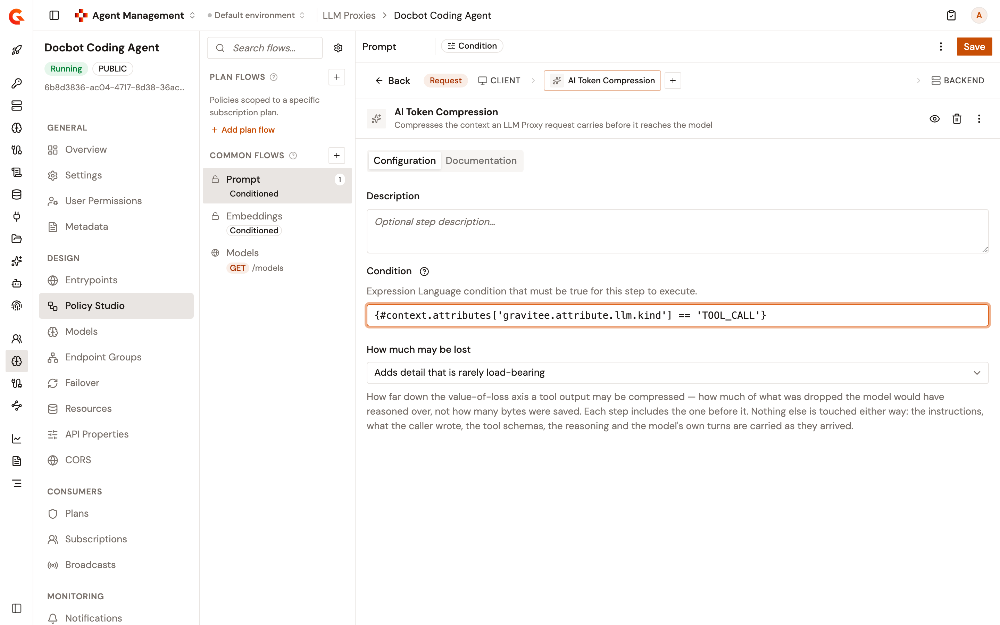

# Add the AI Token Compression policy

## Overview

An agent's requests to an LLM Proxy carry the output of each tool the model asked the agent to run, such as a test run or a build log. When an agent sends its whole conversation on every turn, that output travels with every request. The **AI Token Compression** policy shrinks it before the request reaches the model.

The policy recognizes the tool that produced each output and keeps what the run concluded, such as the totals and the failures of a test run. It doesn't ask a model what to keep. The instructions, the messages the caller wrote, the tool definitions, the reasoning, and the model's own turns are sent as they arrived.

The policy runs in the request phase of an LLM Proxy and doesn't change the model's response. When the policy can't read a request, or can't compress it, it sends the request on as it arrived.

## Prerequisites

Before you begin, confirm that you have a deployed LLM Proxy. For more information, see [Create an LLM Proxy](create-an-llm-proxy.md).

## Add the policy

1. On the LLM Proxy detail page, under **Design**, click **Policy Studio**.
2. Under **Common Flows**, select **Prompt**.
3. In the **Request Phase** section, click **Add policy**. When the phase already holds a policy, click the plus button at the end of the phase instead.
4.  In the list that opens, search for **AI Token Compression**.

    <figure><figcaption></figcaption></figure>
5. Select **AI Token Compression**.
6.  Recommended: In **Condition**, enter `{#context.attributes['gravitee.attribute.llm.kind'] == 'TOOL_CALL'}`. The policy then runs only on requests whose conversation carries tool output, which are the only requests it has anything to compress in. Without the condition, the policy reads every request on the flow.

    <figure><figcaption></figcaption></figure>
7. In **How much may be lost**, select an option. For more information, see [Settings](#settings).
8. Click **Save**.
9. When **This API is out of sync** appears, click **Deploy**.
10. In the **Deploy your API** dialog, click **Deploy**.

## Settings

**How much may be lost** is the only setting of the policy:

| Setting | Description | Default |
| --- | --- | --- |
| **How much may be lost** | How far the policy goes when it compresses a tool output | `Adds detail that is rarely load-bearing` |

### What each option compresses

Each option compresses everything the option above it compresses, and adds the following:

<table>
    <thead>
        <tr>
            <th width="220">Option</th>
            <th>What it adds</th>
        </tr>
    </thead>
    <tbody>
        <tr>
            <td><code>Noise only — what the model never reads</code></td>
            <td>
                <p>Removes the whitespace from JSON.</p>
                <p>Trims the unchanged lines around each change in a Git diff, and keeps every added and removed line.</p>
                <p>Reduces a test run to the totals and, for up to 50 failing tests, each test's name, its message, and the first line of its stack trace. This covers the output of <code>jest</code>, <code>vitest</code>, <code>pytest</code>, <code>go test</code>, and <code>cargo test</code>, the JSON output of <code>rspec</code>, and Surefire and Visual Studio test reports. For other test output, drops the lines of passing tests and keeps the failures and the summary.</p>
                <p>Drops the routine lines of <code>mvn</code>, <code>gradle</code>, <code>cargo build</code>, and <code>docker build</code> output, and keeps the errors and the result.</p>
                <p>Keeps only the last state of a progress bar.</p>
                <p>Replaces a tool output that repeats an earlier one in the same request with a reference to the first.</p>
                <p>Replaces base64 data, such as an embedded file or a certificate, with a short placeholder that names its kind and size.</p>
            </td>
        </tr>
        <tr>
            <td><code>Adds detail that is rarely load-bearing</code></td>
            <td>
                <p>Groups the problems reported by <code>eslint</code>, <code>tsc</code>, <code>ruff check</code>, <code>golangci-lint</code>, and <code>cargo clippy</code>, and the JSON output of <code>rubocop</code>, by rule, file, or linter, and caps the locations listed for each group.</p>
                <p>Caps the matches listed for each file in search results, and keeps the counts and the first matches.</p>
                <p>Drops the sizes and dates from directory listings, and keeps the tree of paths.</p>
                <p>Folds the framework lines out of a stack trace, and keeps the exception and the application's own lines.</p>
                <p>Collapses repeated log lines into the first occurrence and a count.</p>
                <p>Keeps every error line and the last 50 lines of <code>docker logs</code> output.</p>
            </td>
        </tr>
        <tr>
            <td><code>Adds content the model may have needed</code></td>
            <td>
                <p>Keeps the header and the first 25 rows of a CSV file, and the first 50 rows of a <code>psql</code> query result.</p>
                <p>Reduces an HTML page to its title, text, and links.</p>
                <p>Summarizes the headers of an HTTP response returned by <code>curl</code>.</p>
                <p>Keeps the status, the warnings, and the last lines of <code>kubectl describe</code> and <code>kubectl logs</code> output.</p>
                <p>Reduces JSON larger than 16 KiB to its field names and types, and keeps the first two entries of each list and the values of fields such as <code>error</code>, <code>status</code>, and <code>message</code>.</p>
                <p>Keeps the changed resources of <code>terraform plan</code> and <code>tofu plan</code> output and drops their unchanged attributes.</p>
                <p>Cuts any other tool output longer than 8,000 characters. This removes the end of a long log, where an error or a conclusion often appears.</p>
            </td>
        </tr>
    </tbody>
</table>

### Tool output the policy leaves uncompressed

The policy leaves the following tool output uncompressed, whichever option you select:

* **Tool output sent as a list of content blocks.** In the Anthropic Messages format, a `tool_result` whose `content` is an array of blocks isn't compressed, and one whose `content` is a single string is. In the Gemini format, a `functionResponse` is compressed only when its `response` holds a single `content` string. In the OpenAI Responses format, a `function_call_output` whose `output` is an array isn't compressed. In the OpenAI Chat Completions format, tool messages are compressed whether their content is a string or a list of text blocks.
* **Tool output larger than 1 MiB.** The policy doesn't summarize such an output. It only replaces it when it repeats an earlier tool output in the same request.
* **Binary data.**
* **Tool output the policy doesn't reach in time.** The policy stops compressing a request after 50 milliseconds of work, and the tool output it hasn't reached by then isn't compressed. The time a request takes depends on the load on the gateway, so a tool output compressed on one turn is sometimes sent in full on another, and the history the model receives isn't always identical from one turn to the next.

## Verification

To verify the AI Token Compression policy is working as expected, follow these steps:

1. Turn on **Inject token usage headers** in the **Entrypoint options** of the LLM Proxy. For more information, see [Configure LLM Proxy entrypoints](configure-llm-proxy-entrypoints.md).
2. Deploy the LLM Proxy.
3.  Before you add the policy, send a request whose conversation carries the output of a test run:

    ```bash
    curl -i -X POST \
      https://<GATEWAY_URL>/<CONTEXT_PATH>/chat/completions \
      -H "Content-Type: application/json" \
      -d '{
        "model": "<MODEL_ID>",
        "messages": [
          {"role": "user", "content": "Run the tests and summarize the result."},
          {"role": "assistant", "tool_calls": [{"id": "call_1", "type": "function", "function": {"name": "run_tests", "arguments": "{}"}}]},
          {"role": "tool", "tool_call_id": "call_1", "content": "<TOOL_OUTPUT>"}
        ]
      }'
    ```

    * Replace `<GATEWAY_URL>` with your AI Gateway URL.
    * Replace `<CONTEXT_PATH>` with the context path of your LLM Proxy.
    * Replace `<MODEL_ID>` with a model the proxy serves.
    * Replace `<TOOL_OUTPUT>` with the output of a `pytest` run in which every test passes, escaped as a JSON string.
4. Note the `X-LLM-Proxy-Tokens-Sent` response header. It reports the input tokens of the request.
5. Add the policy. For more information, see [Add the policy](#add-the-policy).
6. Send the same request again.

`X-LLM-Proxy-Tokens-Sent` reports fewer tokens than before, because the test run reaches the model as a one-line summary.

## Next steps

* [Add the Token Rate Limit policy](add-the-token-rate-limit-policy.md). Cap the tokens a consumer spends over a rolling period.
* [Monitor your LLM proxy](../observe/monitor-your-llm-proxy.md). Follow the tokens and cost of the proxy's traffic on the LLM Overview dashboard.
