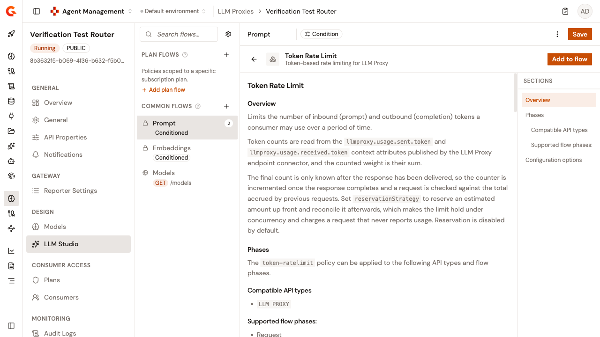

# Add the Token Rate Limit policy

<!-- TODO: add an Overview — see style-guide/06-document-types-and-templates/templates/how-to-guide-README.md -->

A request rate limit counts calls. It doesn't tell you what those calls cost, because one prompt can consume a hundred tokens and the next can consume a hundred thousand. The **Token Rate Limit** policy counts tokens instead, so the budget you set is the budget the provider bills you for.

The policy counts input and output tokens together against a single allowance over a rolling period, and returns `429` once a consumer exceeds it.

## Prerequisites

Before you begin, confirm that you have the following:

* A self-hosted or hybrid Gamma installation. For more information, see [Self-hosted installation guides](../../platform-management/install/self-hosted-installation-guides/README.md) and [Hybrid installation guides](../../platform-management/install/hybrid-installation-guides/README.md).
* A deployed LLM Proxy. For more information, see [Create an LLM Proxy](create-an-llm-proxy.md).

## Add the policy

1. On the LLM Proxy detail page, under **Design**, open **LLM Studio**.
2. Under **Common Flows**, select the flow you want to limit, usually **Prompt**.
3. In the **Request Phase** section, click the plus, and then click **Browse full catalog**.
4.  In the **Add Policy** dialog, search for **Token Rate Limit**, select it, and then click **Add to flow**.

    <figure><figcaption></figcaption></figure>
5. Configure the policy using the settings in [Settings](#settings).
6. Click **Save**.
7. When the "This deployable is out of sync" message appears, click **Deploy** to push the change to the AI Gateway.

## Settings

### Apply rate-limiting

The **Apply rate-limiting** section sets the allowance, the window it runs over, and who it belongs to:

| Setting | Description | Default |
| --- | --- | --- |
| **Max tokens (static)** | The number of tokens allowed per period. Used when the value is greater than `0` | - |
| **Max tokens (dynamic)** | An Expression Language expression that resolves to the limit. Used only when the static limit is `0` | - |
| **Time duration** | How long before the allowance resets | `1` |
| **Time unit** | `SECONDS`, `MINUTES`, `HOURS`, or `DAYS` | `SECONDS` |
| **Key** | Identifies the consumer the limit applies to. Supports Expression Language. Leave it empty to count against the plan and subscription pair | Empty |
| **Use key only** | Counts against the key alone, ignoring the subscription and plan | `false` |
| **Reset strategy** | `ROLLING` starts the window at the first request. `CALENDAR` aligns the boundary to the calendar hour, day, week, or month | `ROLLING` |
| **Timezone** | The IANA identifier used for calendar-aligned boundaries, such as `UTC` or `Europe/Paris` | `UTC` |
| **Reservation strategy** | `NONE`, `FIXED`, or `ADAPTIVE`. Decides whether the budget is checked against an estimate before the model is called | `NONE` |
| **Reservation amount (tokens)** | The number of tokens reserved per request, for example `4000`. Must be greater than `0` whenever a reservation strategy is set | - |
| **Reservation ceiling (tokens)** | Bounds an adaptive reservation. `0` disables the ceiling | `0` |

Each dropdown shows a descriptive label rather than the stored value. **Time unit** reads **Seconds** through **Days**. **Reset strategy** reads **Rolling window from first request** or **Calendar-aligned window**. **Reservation strategy** reads **No reservation**, **Reserve a fixed amount per request**, or **Reserve an amount learned from recent observed usage**.

By default the allowance belongs to a plan and subscription pair, not to a caller. When several identities share one subscription, they share one budget, and the first one to spend it exhausts it for everyone. Set **Key** to an expression that resolves the caller's identity, and enable **Use key only**, to give each identity its own allowance.

`CALENDAR` only aligns a window that matches a calendar period. Set **Time duration** and **Time unit** to exactly 1 hour, 1 day, 7 days, or 30 days. Any other period is rejected when the API is deployed, so use `ROLLING` instead.

With no reservation, the policy checks the limit against tokens already recorded. The real usage of a request is only known after its response has been delivered. One large prompt can therefore overshoot the budget, and concurrent calls can overshoot it together.

Two **Reservation strategy** values hold tokens up front. `FIXED` reserves **Reservation amount** tokens before the model is called. `ADAPTIVE` starts from that amount and learns from what the same consumer actually spends, up to **Reservation ceiling**. Either way the reservation is reconciled against real usage once the response completes, and it's refunded before the rejection when the budget overflows. A reservation never exceeds the resolved limit. Enabling a reservation also makes the counter strict, even under `ASYNC_MODE`.

When a response is served from cache the model is never called, so the request counts as zero and any reservation is released. When token usage isn't available, the request is allowed, the budget isn't incremented, and any reservation is released.

### Strategy

**Strategy** decides how the counter is kept and what happens when the rate-limit store is unreachable:

| Console label | Value | Behavior |
| --- | --- | --- |
| Count exactly - keep serving if the counter store is unreachable | `FALLBACK_PASS_THROUGH` | Every request checks the counter before it proceeds. If the policy can't reach the rate-limit store, the request is allowed. The default, and the choice when availability matters more than the ceiling |
| Count exactly - reject requests if the counter store is unreachable | `BLOCK_ON_INTERNAL_ERROR` | Every request checks the counter before it proceeds. If the policy can't reach the rate-limit store, the request is rejected. Choose this when overspending is worse than downtime |
| Count approximately - faster, but the limit can be overshot | `ASYNC_MODE` | Counts are buffered and flushed in the background. The fastest option and the lightest on the store, but concurrent requests can pass the limit before the flush catches up |

With `BLOCK_ON_INTERNAL_ERROR`, the rejection reports `Token rate limit blocked the query due to internal error`. With `FALLBACK_PASS_THROUGH` and with `ASYNC_MODE`, the request is allowed. When **Add response headers** is enabled, `X-Token-Rate-Limit-Remaining` then reports the full allowance and `X-Token-Rate-Limit-Reset` reports `-1`. If no rate-limit configuration is installed, the request fails with `No rate-limit config has been installed.`

### Response headers

Enable **Add response headers** to return the consumer's budget on every response:

| Header | Content |
| --- | --- |
| `X-Token-Rate-Limit-Limit` | The configured allowance |
| `X-Token-Rate-Limit-Remaining` | Tokens left in the current period |
| `X-Token-Rate-Limit-Reset` | When the allowance resets |

These let a well-behaved client back off before it's rejected, rather than discovering the limit through a `429`.

## Verification

Send the same request twice, with a limit low enough that one call exhausts it:

```bash
curl -X POST \
  https://<GATEWAY_URL>/<CONTEXT_PATH>/chat/completions \
  -H "Content-Type: application/json" \
  -d '{
    "model": "<MODEL_ID>",
    "messages": [
      {"role": "user", "content": "Hello"}
    ]
  }'
```

* Replace `<GATEWAY_URL>` with your AI Gateway URL.
* Replace `<CONTEXT_PATH>` with the context path of your LLM Proxy.
* Replace `<MODEL_ID>` with a model the proxy serves.

The second call is rejected:

```json
{
  "message": "Rate limit exceeded! You reached the limit of 100 tokens per 1 minutes",
  "http_status_code": 429
}
```

## Next steps

* [Add the Cost Rate Limit policy](add-the-cost-rate-limit-policy.md). Cap what a consumer spends in dollars rather than in tokens.
* [Configure an LLM Proxy](configure-an-llm-proxy.md). Add guardrails, PII filtering, and security plans.
* [Publish your LLM Proxy](../publish/publish-your-llm-proxy.md). Make the proxy available to consumers.
