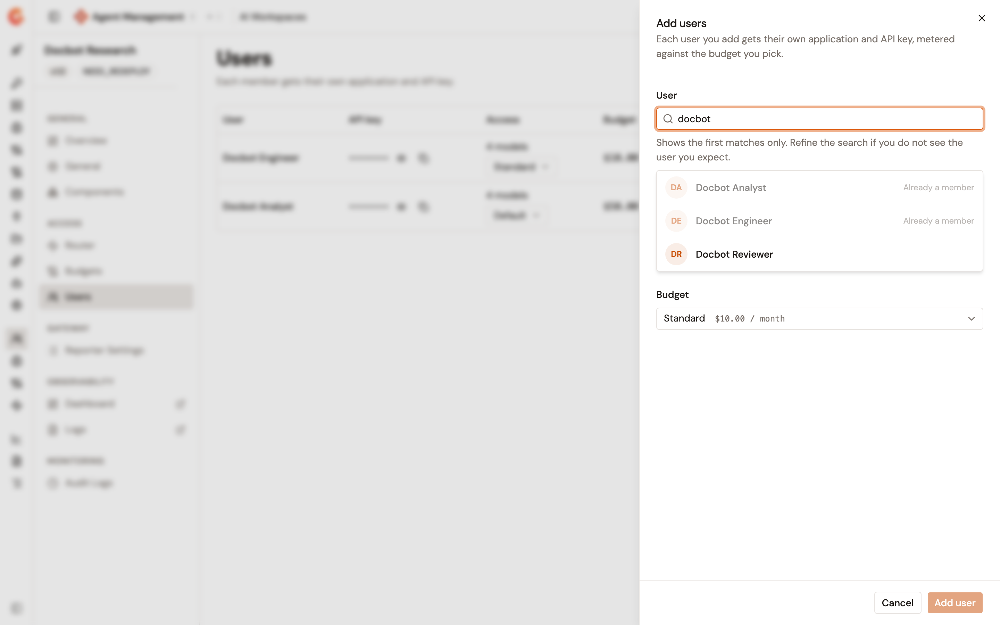
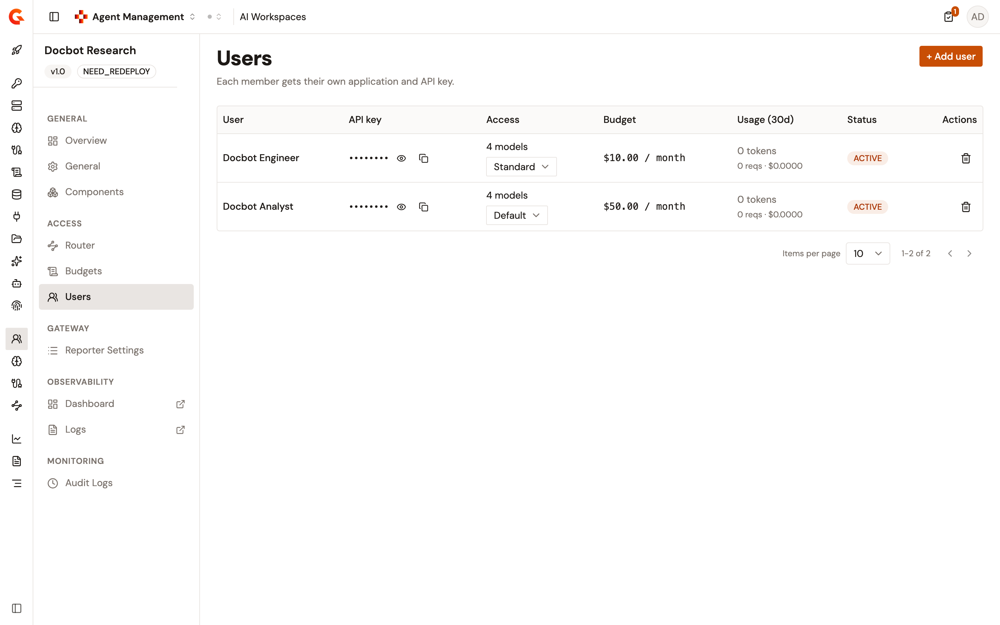
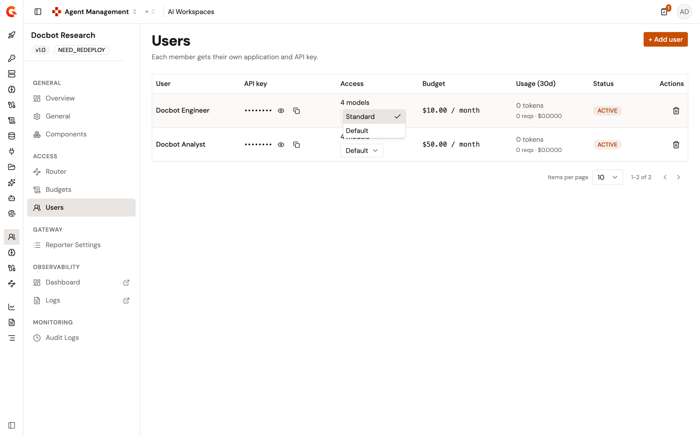

# Assign users to an AI workspace

Adding a user to an AI Workspace gives them their own way in. Gravitee creates or reuses an application for them, subscribes it to the budget you pick, and issues an API key on that subscription. The key is what the member sends to the workspace entrypoint, and it's what their spend is counted against.

Because every member holds a distinct key on a distinct application, one member exhausting their allowance doesn't affect anyone else in the workspace.


Add at least one model before adding users. Until the workspace holds a model, it has no Default LLM Proxy for a member's key to reach. See [Add models to an AI workspace](add-models-to-an-ai-workspace.md).


## Add users

To add users to an AI Workspace, complete the following steps:

1. From the Gamma console sidebar, select **Agent Management**.
2. Under **Secure**, select **AI Workspaces**.
3. Select the workspace.
4. Under **Access**, select **Users**.
5. Select **+ Add user**.

    The button stays disabled while the workspace has no budget, and the page explains that users are metered against a budget. See [Manage AI workspace budgets](manage-ai-workspace-budgets.md).

6. In the **User** field, search for a user by name or email.

    The search returns the first matches only. Refine the search when the user you expect isn't listed. A user who already belongs to the workspace is marked **Already a member** and can't be selected.

7. Select one or more users from the results.
8. In the **Budget** field, select the budget the members are metered against.

    <figure><figcaption>
The Add users panel
</figcaption></figure>

9. Select **Add user**. With several users selected, the button reads **Add** followed by the number of users.

Each selected user is added in turn. If the server refuses one of them, that user drops out of the selection and the rest stay selected so you can retry.

## Which application a member gets

Gravitee reuses an application the member already holds for workspace access before it creates a new one, so a person keeps one key across the workspaces they belong to:

* An application the member already used for this workspace is reused first, including one whose subscription was closed. Removing a member and adding them back therefore restores the same application, key, and spend counter.
* Otherwise, an application the member used for another workspace is reused.
* Otherwise, Gravitee creates a new application for them.

A personal application the member created themselves, and never used for a workspace, isn't reused.

## Read the Users list

The **Users** list holds one row per member, with the following columns:

<table>
    <thead>
        <tr>
            <th width="150">Column</th>
            <th>Description</th>
        </tr>
    </thead>
    <tbody>
        <tr>
            <td><strong>User</strong></td>
            <td>The member's display name.</td>
        </tr>
        <tr>
            <td><strong>API key</strong></td>
            <td>The member's key, masked. Reveal it and copy it from this cell.</td>
        </tr>
        <tr>
            <td><strong>Access</strong></td>
            <td>How many models the member can call, and a selector that changes the budget they're metered against.</td>
        </tr>
        <tr>
            <td><strong>Budget</strong></td>
            <td>The amount and period of the budget the member is on.</td>
        </tr>
        <tr>
            <td><strong>Usage (30d)</strong></td>
            <td>What the member spent over the last 30 days: tokens, requests, and cost.</td>
        </tr>
        <tr>
            <td><strong>Status</strong></td>
            <td>The state of the member's access: <code>ACTIVE</code>, <code>PENDING</code>, <code>PAUSED</code>, or <code>UNKNOWN</code>.</td>
        </tr>
        <tr>
            <td><strong>Actions</strong></td>
            <td>Revokes the member's access.</td>
        </tr>
    </tbody>
</table>

<figure><figcaption>
The Users list of a workspace
</figcaption></figure>

## Give a member their API key

The key is masked in the list and read one member at a time, so it's never handed out in bulk. Use the reveal control in the member's **API key** cell to show it, and the copy control beside it to copy it.

Only a usable key is returned. A key that's been revoked, paused, or has expired isn't shown, and a member whose subscription has no key yet reports that no key has been issued.

## Change a member's budget

Select a different budget in the member's **Access** cell, then confirm the change. The member's subscription moves to the new budget, and the ceiling of the new budget applies from then on.

<figure><figcaption>
The budget selector on a member row
</figcaption></figure>

Changing a member's budget doesn't reset what they've already spent in the current period, because the spend counter follows the member's application rather than the budget. See [Manage AI workspace budgets](manage-ai-workspace-budgets.md).

## Revoke a member's access

The action in the member's row closes their subscription, so their key stops working on this workspace. The member's application isn't deleted, which is what lets a later re-add restore the same key and spend counter.

## Verification

To verify a member has working access, follow these steps:

1. Open the workspace.
2. Under **Access**, select **Users**.
3. Confirm the member appears with the status `ACTIVE` and the budget you assigned.
4. Reveal and copy the member's API key.
5. On the **Overview** page, copy the entrypoint URL from the **Connection** card.
6. Call the `/models` path of that URL with the member's key, and confirm the models of the workspace are listed.
7. Return to the **Users** list, and confirm the member's **Usage (30d)** cell counts the request.
