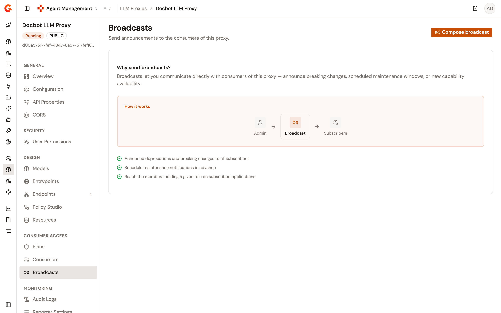
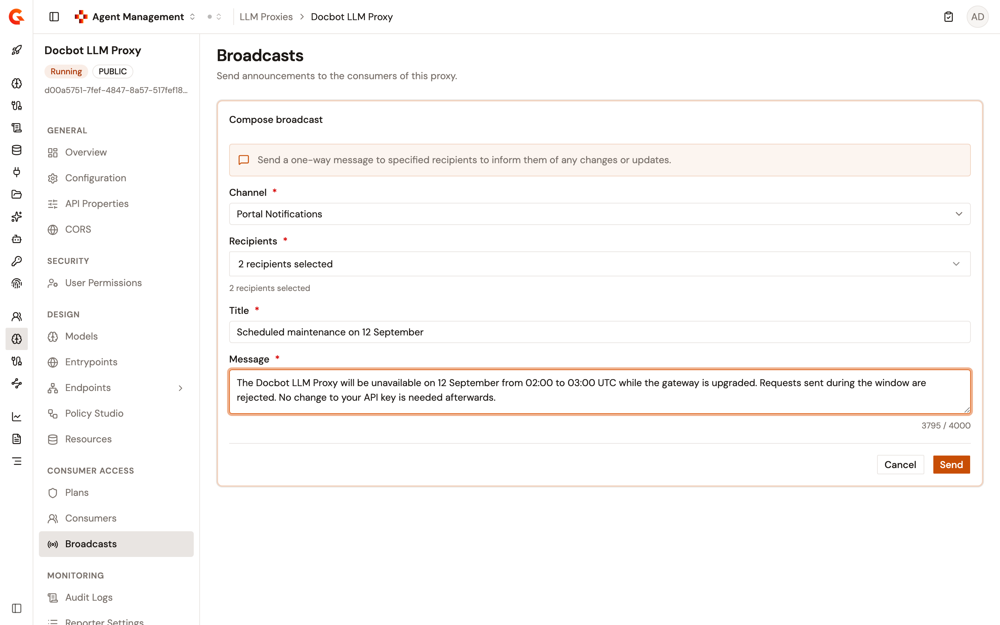

# Broadcast messages to LLM Proxy consumers

The **Broadcasts** page of an LLM Proxy sends announcements to the consumers of the proxy. A broadcast is a one-way message to the recipients you select, for example to announce a deprecation, a breaking change, or a maintenance window.

To open the page, follow these steps:

1. Click **LLM Proxies** in the module sidebar.
2. Select your LLM Proxy.
3. Under **Consumer Access**, click **Broadcasts**.

<figure><figcaption>
The Broadcasts page
</figcaption></figure>

Until you compose a broadcast, the page explains what a broadcast reaches instead of showing the form.

The **Broadcasts** item appears in the LLM Proxy sidebar only when you can read broadcasts for the proxy. The **Compose broadcast** button appears only when you can send them. Without the send permission, the page shows **You do not have permission to send broadcast messages for this API.**

## Send a broadcast

To send a broadcast, follow these steps:

1. Click **Compose broadcast**.
2. Select a **Channel**: **Portal Notifications**, **Email**, or **POST HTTP Message**. The form opens on **Portal Notifications**.
3. For **Portal Notifications** and **Email**, select one or more **Recipients**, and then enter a **Title**. The **Recipients** list offers the following entries:
   * **API subscribers**. The users who subscribed to the LLM Proxy.
   * One entry per application role defined in your organization, such as **Members with the OWNER role on applications subscribed to this API**. The entry reaches the members holding that role on the applications with an accepted subscription to the LLM Proxy. By default, an organization has the `OWNER`, `PRIMARY_OWNER`, and `USER` application roles.
4. For **POST HTTP Message**, enter the target **URL** as a full `http://` or `https://` address. To send headers with the request, click **Add header** and enter a name and a value for each one. To route the request through the system proxy, turn on **Use system proxy**.
5. Enter the **Message**, up to 4,000 characters. A counter under the field shows the remaining characters.
6. Click **Send**. The button stays disabled until every required field is filled in and valid.

<figure><figcaption>
The Compose broadcast form
</figcaption></figure>

Changing the channel clears the fields that belong to the previous channel, so a title entered for a portal notification doesn't travel with an HTTP broadcast.

After the send, the page shows **Broadcast sent** and offers **Compose another broadcast**. When the broadcast reached at least one recipient, the confirmation also reports how many. What each channel delivers, and what it counts, depends on the channel:

* **Portal Notifications**. Each matched user receives a Developer Portal notification. By default, the notification title is the LLM Proxy name in brackets followed by your title, and the notification body is your message. The count is the number of matched users.
* **Email**. The message is emailed to the matched users that have an email address. On a trial instance, users who haven't opted in to emails are skipped too. The count is the number of addresses.
* **POST HTTP Message**. The message is posted to the URL with the headers you added. The count is always 1.

If the send fails, the form shows the error above the **Cancel** and **Send** buttons and keeps what you entered.

The Management API refuses an HTTP broadcast when its webhook notifier is disabled with `notifiers.webhook.enabled: false` in `gravitee.yml`. When `notifiers.webhook.whitelist` lists one or more URLs, the Management API also refuses a broadcast to a URL outside that list.

## Verification

To verify a broadcast is working as expected, follow these steps:

1. Send a broadcast on the **Portal Notifications** channel to **API subscribers**.
2. Under **Monitoring**, click **Audit Logs**. The trail lists a `MESSAGE_SENT` event in the **Event** column, with your user in the **Actor** column.
