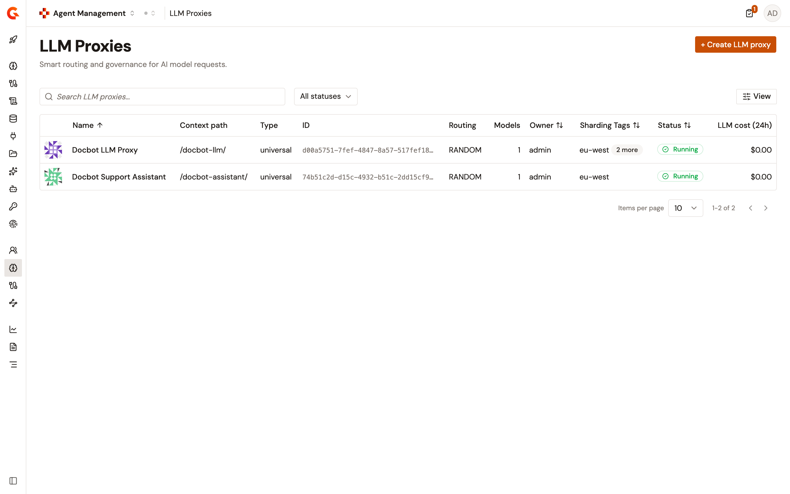

# Browse the LLM Proxies list

The **LLM Proxies** page lists every LLM Proxy of the environment. Use it to find a proxy, check who owns it and where it's deployed, and open its detail view.

To open the page, follow these steps:

1. From the Gamma console sidebar, select **Agent Management**.
2.  Under **Secure**, select **LLM Proxies**.

    <figure><figcaption>
The LLM Proxies list
</figcaption></figure>

## Columns

The list shows one row per LLM Proxy, with the following columns:

| Column            | Description                                                                                                                                                                                                                                                       |
| ----------------- | ----------------------------------------------------------------------------------------------------------------------------------------------------------------------------------------------------------------------------------------------------------------- |
| **Picture**       | The picture of the proxy, at the start of the row. This column has no visible header. The list shows the picture uploaded under **API Picture** on the proxy's **Configuration** page. When the proxy has no picture, the list shows a generated pattern based on the proxy's name instead.                                                    |
| **Name**          | The name of the proxy. Select it to open the proxy's overview.                                                                                                                                                                                                    |
| **Context path**  | The context path that the proxy is exposed on.                                                                                                                                                                                                                    |
| **Type**          | The proxy type.                                                                                                                                                                                                                                                   |
| **ID**            | The identifier of the proxy.                                                                                                                                                                                                                                      |
| **Routing**       | The routing strategy of the proxy.                                                                                                                                                                                                                                |
| **Models**        | The number of models that the proxy exposes.                                                                                                                                                                                                                      |
| **Owner**         | The primary owner of the proxy: the display name of a user, or the name of a group. A dash means the proxy has no primary owner.                                                                                                                                  |
| **Sharding Tags** | The sharding tags assigned to the proxy on its **Deployment Configuration** page. The column shows the first tag alphabetically. When the proxy has more tags, a **more** badge shows how many, for example **2 more**. Hover over the badge, or focus it with the keyboard, to list every tag. A dash means the proxy has no sharding tag. |
| **Status**        | **Running**, **Stopped**, or **Degraded**.                                                                                                                                                                                                                        |
| **LLM cost (24h)**| The cost of the model calls that went through the proxy over the last 24 hours.                                                                                                                                                                                   |

To assign sharding tags to a proxy, see [Configure LLM Proxy deployment](configure-llm-proxy-deployment.md). To add a picture to a proxy, see [Configure an LLM Proxy](configure-an-llm-proxy.md#picture).

## Sort the list

By default, the list is sorted by **Name** in ascending order. The **Name**, **Owner**, **Sharding Tags**, and **Status** columns are sortable. The other columns aren't.

To sort the list, select a sortable column header. The first selection sorts in ascending order, the next selection in descending order, and an arrow in the header shows the current direction.

* **Owner** sorts by the owner's display name.
* **Sharding Tags** sorts by the proxy's tags in alphabetical order. In ascending order, proxies are compared on their first tag. In descending order, they're compared on their last tag.
* Proxies without a value in the sorted column, such as proxies without a sharding tag or without an owner, are listed after the others.

The sort is part of the page URL, as the `sortBy` query parameter, so a sorted view can be bookmarked or shared. Changing the sort returns you to the first page.

## Filter and search

To show only the running or only the stopped proxies, select **Running** or **Stopped** in the status list above the table. Select **All statuses** to remove the filter. When no proxy matches, the table reads **No LLM proxies match the selected filters.**

To search, enter text in the **Search LLM proxies…** field. When no proxy matches, the table reads **No LLM proxies match your search.**

The status filter and the search text are part of the page URL too, as the `status` and `q` query parameters.

## Show or hide columns

To choose the visible columns, select **View** above the table, and then select or clear a column under **Toggle columns**. The picture column is always shown and isn't listed there.

## Change the page size

The list is paginated. Select **10**, **25**, **50**, or **100** rows per page from the pagination control below the table.
